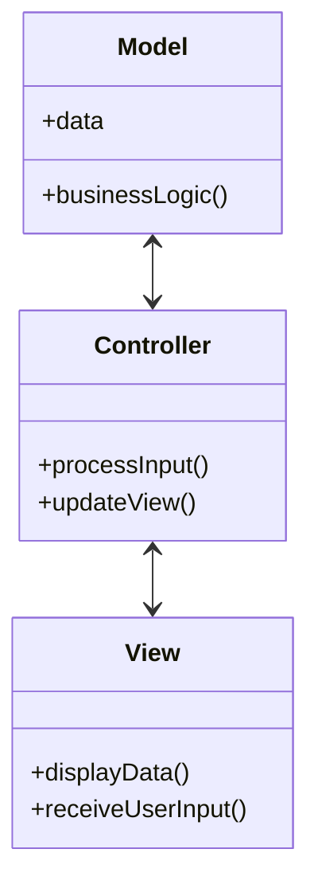
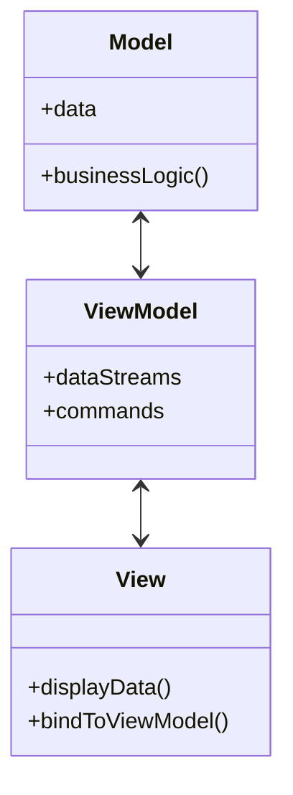
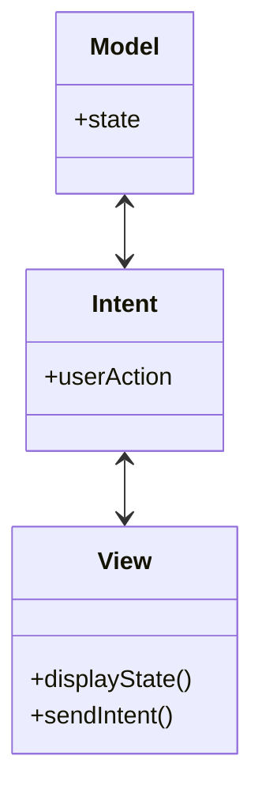
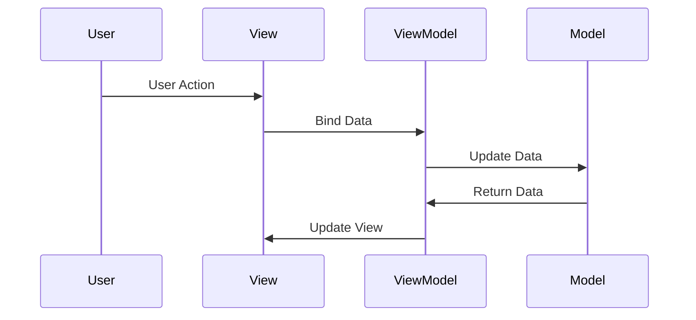
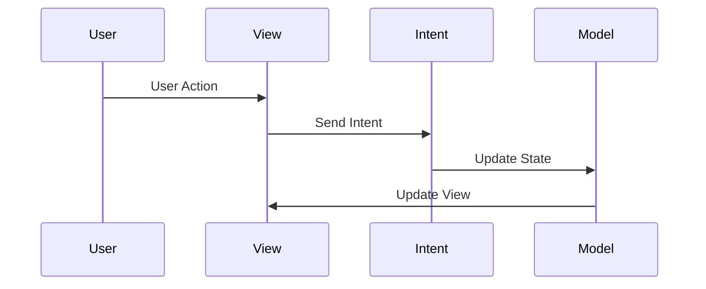

## 9.12 Architecture Comparison: MVC, MVVM, MVI

In the realm of software development, particularly in Flutter, choosing the right architectural pattern is crucial for building scalable, maintainable, and efficient applications. In this section, we will delve into three popular architectural patterns: MVC (Model-View-Controller), MVVM (Model-View-ViewModel), and MVI (Model-View-Intent). We will explore their concepts, implementation in Flutter, and provide guidance on selecting the appropriate pattern for your project needs.

### Understanding Different Patterns

#### MVC (Model-View-Controller)

**Concept**: MVC is one of the oldest and most widely used architectural patterns. It divides an application into three interconnected components:

- **Model**: Manages the data and business logic of the application. It responds to requests for information and updates from the controller.
- **View**: Represents the UI components and displays data to the user. It sends user actions to the controller.
- **Controller**: Acts as an intermediary between the model and the view. It processes user input, interacts with the model, and updates the view.

**Diagram**:



**Implementation in Flutter**: In Flutter, the MVC pattern can be adapted by using StatefulWidgets for the View, a separate class for the Model, and a Controller class to handle the logic.

**Code Example**:

```dart
// Model
class CounterModel {
  int _counter = 0;

  int get counter => _counter;

  void increment() {
    _counter++;
  }
}

// View
class CounterView extends StatefulWidget {
  final CounterController controller;

  CounterView({required this.controller});

  @override
  _CounterViewState createState() => _CounterViewState();
}

class _CounterViewState extends State<CounterView> {
  @override
  Widget build(BuildContext context) {
    return Scaffold(
      appBar: AppBar(title: Text('MVC Counter')),
      body: Center(
        child: Text(
          'Counter: ${widget.controller.model.counter}',
          style: TextStyle(fontSize: 24),
        ),
      ),
      floatingActionButton: FloatingActionButton(
        onPressed: () {
          setState(() {
            widget.controller.incrementCounter();
          });
        },
        child: Icon(Icons.add),
      ),
    );
  }
}

// Controller
class CounterController {
  final CounterModel model;

  CounterController(this.model);

  void incrementCounter() {
    model.increment();
  }
}
```

**Design Considerations**: MVC is straightforward and easy to understand. However, it can lead to tight coupling between the view and controller, making it less flexible for complex applications.

#### MVVM (Model-View-ViewModel)

**Concept**: MVVM is an architectural pattern that facilitates a separation of development of the graphical user interface from the business logic or back-end logic (the data model). It uses:

- **Model**: Similar to MVC, it represents the data and business logic.
- **View**: The UI layer that displays data and sends user actions to the ViewModel.
- **ViewModel**: An abstraction of the view that exposes data streams and commands to the view. It handles the presentation logic and data binding.

**Diagram**:



**Implementation in Flutter**: MVVM can be implemented using Flutter's `ChangeNotifier` for state management and `Provider` for dependency injection.

**Code Example**:

```dart
import 'package:flutter/material.dart';
import 'package:provider/provider.dart';

// Model
class CounterModel {
  int _counter = 0;

  int get counter => _counter;

  void increment() {
    _counter++;
  }
}

// ViewModel
class CounterViewModel extends ChangeNotifier {
  final CounterModel _model;

  CounterViewModel(this._model);

  int get counter => _model.counter;

  void incrementCounter() {
    _model.increment();
    notifyListeners();
  }
}

// View
class CounterView extends StatelessWidget {
  @override
  Widget build(BuildContext context) {
    final viewModel = Provider.of<CounterViewModel>(context);

    return Scaffold(
      appBar: AppBar(title: Text('MVVM Counter')),
      body: Center(
        child: Text(
          'Counter: ${viewModel.counter}',
          style: TextStyle(fontSize: 24),
        ),
      ),
      floatingActionButton: FloatingActionButton(
        onPressed: viewModel.incrementCounter,
        child: Icon(Icons.add),
      ),
    );
  }
}

void main() {
  runApp(
    ChangeNotifierProvider(
      create: (_) => CounterViewModel(CounterModel()),
      child: MaterialApp(home: CounterView()),
    ),
  );
}
```

**Design Considerations**: MVVM promotes a clear separation of concerns and is well-suited for applications with complex UI logic. However, it can introduce complexity with data binding and state management.

#### MVI (Model-View-Intent)

**Concept**: MVI is an architecture pattern that emphasizes unidirectional data flow. It consists of:

- **Model**: Represents the state of the application.
- **View**: Displays the state and sends user intents to the ViewModel.
- **Intent**: Represents user actions or events that trigger state changes.

**Diagram**:



**Implementation in Flutter**: MVI can be implemented using streams and reactive programming to manage state and intents.

**Code Example**:

```dart
import 'package:flutter/material.dart';
import 'package:rxdart/rxdart.dart';

// Model
class CounterModel {
  int counter = 0;
}

// Intent
enum CounterIntent { increment }

// ViewModel
class CounterViewModel {
  final _model = CounterModel();
  final _counterSubject = BehaviorSubject<int>();

  Stream<int> get counterStream => _counterSubject.stream;

  void handleIntent(CounterIntent intent) {
    if (intent == CounterIntent.increment) {
      _model.counter++;
      _counterSubject.add(_model.counter);
    }
  }

  void dispose() {
    _counterSubject.close();
  }
}

// View
class CounterView extends StatelessWidget {
  final CounterViewModel viewModel = CounterViewModel();

  @override
  Widget build(BuildContext context) {
    return Scaffold(
      appBar: AppBar(title: Text('MVI Counter')),
      body: Center(
        child: StreamBuilder<int>(
          stream: viewModel.counterStream,
          initialData: 0,
          builder: (context, snapshot) {
            return Text(
              'Counter: ${snapshot.data}',
              style: TextStyle(fontSize: 24),
            );
          },
        ),
      ),
      floatingActionButton: FloatingActionButton(
        onPressed: () => viewModel.handleIntent(CounterIntent.increment),
        child: Icon(Icons.add),
      ),
    );
  }
}

void main() {
  runApp(MaterialApp(home: CounterView()));
}
```

**Design Considerations**: MVI is ideal for applications that require a predictable state management system. It can be more complex to implement due to the need for reactive programming and managing streams.

### Implementing Architectures in Flutter

#### Adapting Patterns to Fit Flutter's Widget-Based Structure

Flutter's widget-based architecture provides a unique challenge and opportunity when implementing these patterns. Each pattern can be adapted to leverage Flutter's strengths, such as its reactive UI and powerful state management capabilities.

- **MVC**: Use StatefulWidgets for the View and separate classes for the Model and Controller. This pattern is suitable for simple applications where the separation of concerns is minimal.
- **MVVM**: Utilize `ChangeNotifier` and `Provider` to manage state and dependencies. This pattern is well-suited for applications with complex UI logic and data binding requirements.
- **MVI**: Implement streams and reactive programming to handle state and intents. This pattern is ideal for applications that require a predictable and testable state management system.

### Use Cases and Examples

#### Choosing the Right Pattern Based on Project Requirements

When selecting an architectural pattern for your Flutter application, consider the following factors:

- **Complexity**: For simple applications, MVC may be sufficient. For more complex applications, consider MVVM or MVI.
- **State Management**: If your application requires complex state management, MVI may be the best choice.
- **UI Logic**: For applications with complex UI logic, MVVM provides a clear separation of concerns.
- **Predictability**: If you need a predictable and testable state management system, MVI is a strong candidate.

**Example Use Case**:

- **E-commerce Application**: An e-commerce application with complex UI logic and state management requirements may benefit from the MVVM pattern. The ViewModel can handle data binding and state management, while the Model manages the business logic and data.

- **Real-Time Chat Application**: A real-time chat application that requires predictable state management and unidirectional data flow may benefit from the MVI pattern. The Intent can handle user actions, while the Model manages the state of the application.

### Try It Yourself

Experiment with the code examples provided in this section. Try modifying the code to add new features or change the behavior of the application. For example, you can:

- Add a decrement button to the counter application.
- Implement a reset button to reset the counter to zero.
- Modify the MVC example to use a different state management solution, such as `Provider` or `Riverpod`.

### Visualizing the Differences

To further understand the differences between these architectural patterns, let's visualize their data flow and interactions.

**MVC Data Flow**:


**MVVM Data Flow**:



**MVI Data Flow**:



### References and Links

For further reading on these architectural patterns, consider the following resources:

- [Flutter Documentation](https://flutter.dev/docs)
- [Provider Package](https://pub.dev/packages/provider)
- [RxDart Package](https://pub.dev/packages/rxdart)

### Knowledge Check

To reinforce your understanding of these architectural patterns, consider the following questions:

- What are the key differences between MVC, MVVM, and MVI?
- How can you implement data binding in Flutter using MVVM?
- What are the benefits of using unidirectional data flow in MVI?

### Embrace the Journey

Remember, choosing the right architectural pattern is just the beginning. As you progress in your Flutter development journey, you'll build more complex and interactive applications. Keep experimenting, stay curious, and enjoy the journey!

## Quiz Time!



### What is the primary role of the Controller in the MVC pattern?

- [x] To act as an intermediary between the Model and the View
- [ ] To manage the application's data
- [ ] To display data to the user
- [ ] To handle user input directly

> **Explanation:** The Controller acts as an intermediary between the Model and the View, processing user input and updating the Model and View accordingly.

### In MVVM, what is the primary function of the ViewModel?

- [x] To expose data streams and commands to the View
- [ ] To manage the application's data
- [ ] To handle user input directly
- [ ] To display data to the user

> **Explanation:** The ViewModel exposes data streams and commands to the View, handling the presentation logic and data binding.

### Which pattern emphasizes unidirectional data flow?

- [x] MVI
- [ ] MVC
- [ ] MVVM
- [ ] All of the above

> **Explanation:** MVI (Model-View-Intent) emphasizes unidirectional data flow, ensuring a predictable state management system.

### What is a key benefit of using MVVM in Flutter applications?

- [x] Clear separation of concerns
- [ ] Simplified data flow
- [ ] Direct manipulation of the UI
- [ ] Reduced code complexity

> **Explanation:** MVVM promotes a clear separation of concerns, making it well-suited for applications with complex UI logic.

### How does the MVI pattern handle user actions?

- [x] Through Intents
- [ ] Directly in the View
- [ ] Through the Model
- [ ] Through the Controller

> **Explanation:** In MVI, user actions are handled through Intents, which trigger state changes in the Model.

### Which pattern is most suitable for applications with complex UI logic?

- [x] MVVM
- [ ] MVC
- [ ] MVI
- [ ] None of the above

> **Explanation:** MVVM is well-suited for applications with complex UI logic due to its clear separation of concerns and data binding capabilities.

### In MVC, what is the role of the View?

- [x] To display data to the user and send user actions to the Controller
- [ ] To manage the application's data
- [ ] To handle business logic
- [ ] To process user input directly

> **Explanation:** The View in MVC displays data to the user and sends user actions to the Controller for processing.

### What is a potential drawback of using MVC in complex applications?

- [x] Tight coupling between the View and Controller
- [ ] Lack of data binding
- [ ] Unidirectional data flow
- [ ] Complexity in state management

> **Explanation:** MVC can lead to tight coupling between the View and Controller, making it less flexible for complex applications.

### Which pattern is ideal for applications requiring predictable state management?

- [x] MVI
- [ ] MVC
- [ ] MVVM
- [ ] All of the above

> **Explanation:** MVI is ideal for applications requiring predictable state management due to its unidirectional data flow.

### True or False: MVVM uses a Controller to handle user input.

- [ ] True
- [x] False

> **Explanation:** In MVVM, the ViewModel handles user input and presentation logic, not a Controller.


