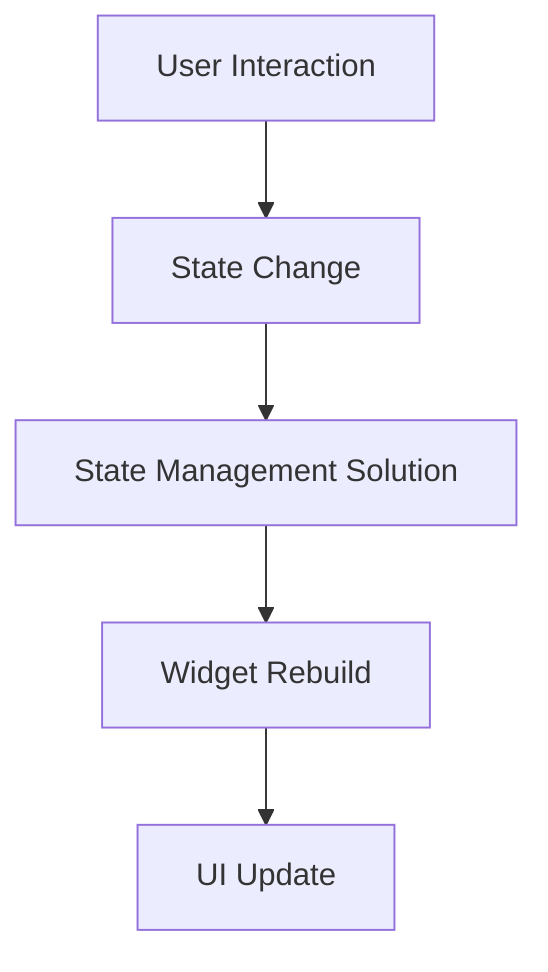

## 9.13 State Management Best Practices

State management is a critical aspect of Flutter development, influencing the performance, maintainability, and scalability of your applications. In this section, we will delve into best practices for managing state in Flutter, focusing on optimizing state handling, avoiding excessive rebuilds, and testing state logic for performance optimization.

### Optimizing State Handling

#### Keeping Widgets Stateless When Possible

One of the foundational principles in Flutter development is to keep widgets stateless whenever possible. Stateless widgets are more predictable and easier to test because they do not change over time. They are also more efficient because they do not require the framework to manage their state.

**Example: Stateless Widget**

```dart
import 'package:flutter/material.dart';

class GreetingWidget extends StatelessWidget {
  final String name;

  GreetingWidget({required this.name});

  @override
  Widget build(BuildContext context) {
    return Text('Hello, $name!');
  }
}
```

In this example, `GreetingWidget` is a stateless widget that takes a `name` as a parameter and displays a greeting. Since the widget does not need to change its state, it remains simple and efficient.

#### Avoiding Excessive Rebuilds

Excessive rebuilds can degrade the performance of your Flutter application. To avoid this, carefully structure your widget trees and use state management solutions that minimize unnecessary rebuilds.

**Strategies to Avoid Excessive Rebuilds:**

1. **Use `const` Constructors**: Whenever possible, use `const` constructors to create immutable widgets. This allows Flutter to optimize widget creation and reduce rebuilds.

2. **Leverage `shouldRebuild` Methods**: For custom widgets, implement `shouldRebuild` methods to control when a widget should be rebuilt.

3. **Use `Provider` or `InheritedWidget`**: These patterns help manage state efficiently by rebuilding only the parts of the widget tree that depend on the state.

**Example: Using Provider to Avoid Rebuilds**

```dart
import 'package:flutter/material.dart';
import 'package:provider/provider.dart';

class Counter with ChangeNotifier {
  int _count = 0;

  int get count => _count;

  void increment() {
    _count++;
    notifyListeners();
  }
}

void main() {
  runApp(
    ChangeNotifierProvider(
      create: (context) => Counter(),
      child: MyApp(),
    ),
  );
}

class MyApp extends StatelessWidget {
  @override
  Widget build(BuildContext context) {
    return MaterialApp(
      home: Scaffold(
        appBar: AppBar(title: Text('Counter App')),
        body: Center(
          child: CounterDisplay(),
        ),
        floatingActionButton: FloatingActionButton(
          onPressed: () => context.read<Counter>().increment(),
          child: Icon(Icons.add),
        ),
      ),
    );
  }
}

class CounterDisplay extends StatelessWidget {
  @override
  Widget build(BuildContext context) {
    return Text(
      'Count: ${context.watch<Counter>().count}',
      style: TextStyle(fontSize: 24),
    );
  }
}
```

In this example, the `Counter` class is a `ChangeNotifier` that manages the state of the counter. The `CounterDisplay` widget listens to changes in the `Counter` and rebuilds only when the count changes, avoiding unnecessary rebuilds of the entire widget tree.

### Strategies for Effective State Management

#### Breaking Down State: Localized vs. Global

State in a Flutter application can be categorized into localized and global state. Localized state is specific to a particular widget or part of the application, while global state is shared across multiple widgets or the entire application.

**Localized State Example:**

Localized state can be managed using `StatefulWidget` for small, isolated parts of the application.

```dart
class LocalizedCounter extends StatefulWidget {
  @override
  _LocalizedCounterState createState() => _LocalizedCounterState();
}

class _LocalizedCounterState extends State<LocalizedCounter> {
  int _count = 0;

  void _increment() {
    setState(() {
      _count++;
    });
  }

  @override
  Widget build(BuildContext context) {
    return Column(
      children: [
        Text('Localized Count: $_count'),
        ElevatedButton(
          onPressed: _increment,
          child: Text('Increment'),
        ),
      ],
    );
  }
}
```

**Global State Example:**

For global state, use patterns like `Provider`, `BLoC`, or `Redux` to manage state across the application.

```dart
// Using Provider for global state
class GlobalCounter with ChangeNotifier {
  int _count = 0;

  int get count => _count;

  void increment() {
    _count++;
    notifyListeners();
  }
}
```

#### Testing State Logic

Testing state logic is crucial to ensure the reliability and correctness of your application. Unit tests can be used to verify the behavior of state management logic.

**Example: Testing State Logic**

```dart
import 'package:flutter_test/flutter_test.dart';
import 'package:my_app/counter.dart';

void main() {
  test('Counter value should be incremented', () {
    final counter = Counter();

    counter.increment();

    expect(counter.count, 1);
  });
}
```

In this test, we create an instance of the `Counter` class, call the `increment` method, and verify that the count is incremented correctly.

### Use Cases and Examples

#### Performance Optimization in Resource-Intensive Apps

In resource-intensive applications, such as those with complex animations or large data sets, optimizing state management is essential for maintaining performance.

**Example: Optimizing Performance with BLoC**

The BLoC (Business Logic Component) pattern is a powerful way to manage state in Flutter applications, especially for complex scenarios.

```dart
import 'package:flutter_bloc/flutter_bloc.dart';

// Event
abstract class CounterEvent {}

class Increment extends CounterEvent {}

// State
class CounterState {
  final int count;
  CounterState(this.count);
}

// Bloc
class CounterBloc extends Bloc<CounterEvent, CounterState> {
  CounterBloc() : super(CounterState(0));

  @override
  Stream<CounterState> mapEventToState(CounterEvent event) async* {
    if (event is Increment) {
      yield CounterState(state.count + 1);
    }
  }
}
```

In this example, the `CounterBloc` manages the state of a counter using events and states. This pattern helps separate business logic from UI code, making the application more scalable and maintainable.

### Visualizing State Management

To better understand state management in Flutter, let's visualize the flow of state changes using a Mermaid.js diagram.



**Diagram Description:** This diagram illustrates the flow of state management in a Flutter application. User interactions trigger state changes, which are handled by a state management solution. This leads to widget rebuilds and UI updates.

### References and Links

- [Flutter State Management Documentation](https://flutter.dev/docs/development/data-and-backend/state-mgmt)
- [Provider Package](https://pub.dev/packages/provider)
- [BLoC Pattern](https://bloclibrary.dev/#/)

### Knowledge Check

- What are the benefits of keeping widgets stateless?
- How can you avoid excessive rebuilds in a Flutter application?
- What is the difference between localized and global state?
- How can you test state logic in Flutter?
- What are some strategies for optimizing performance in resource-intensive apps?

### Embrace the Journey

Remember, mastering state management in Flutter is a journey. As you continue to build more complex applications, you'll gain a deeper understanding of how to manage state effectively. Keep experimenting, stay curious, and enjoy the process!

### Quiz Time!



### What is a key benefit of keeping widgets stateless in Flutter?

- [x] Predictability and efficiency
- [ ] Easier to write
- [ ] More colorful UI
- [ ] Faster animations

> **Explanation:** Stateless widgets are more predictable and efficient because they do not change over time, making them easier to test and manage.

### How can you avoid excessive rebuilds in a Flutter application?

- [x] Use `const` constructors and efficient state management solutions
- [ ] Use more `StatefulWidgets`
- [ ] Increase the number of widgets
- [ ] Avoid using `Provider`

> **Explanation:** Using `const` constructors and efficient state management solutions like `Provider` helps minimize unnecessary rebuilds.

### What is the difference between localized and global state?

- [x] Localized state is specific to a widget, while global state is shared across the app
- [ ] Localized state is faster
- [ ] Global state is only for animations
- [ ] Localized state is for network calls

> **Explanation:** Localized state is specific to a particular widget or part of the application, while global state is shared across multiple widgets or the entire application.

### How can you test state logic in Flutter?

- [x] Use unit tests to verify state behavior
- [ ] Use print statements
- [ ] Manually check the UI
- [ ] Use integration tests only

> **Explanation:** Unit tests are used to verify the behavior of state management logic, ensuring reliability and correctness.

### What pattern is useful for managing complex state scenarios in Flutter?

- [x] BLoC (Business Logic Component)
- [ ] Singleton
- [ ] Factory
- [ ] Adapter

> **Explanation:** The BLoC pattern is powerful for managing complex state scenarios, separating business logic from UI code.

### Which of the following is a strategy to optimize performance in resource-intensive apps?

- [x] Use efficient state management patterns like BLoC
- [ ] Use more `StatefulWidgets`
- [ ] Avoid using streams
- [ ] Increase the number of animations

> **Explanation:** Efficient state management patterns like BLoC help optimize performance in resource-intensive applications.

### What is the role of `ChangeNotifier` in Flutter?

- [x] It notifies listeners of state changes
- [ ] It changes the UI theme
- [ ] It manages network requests
- [ ] It handles animations

> **Explanation:** `ChangeNotifier` is used to notify listeners of state changes, allowing widgets to rebuild when necessary.

### What is the purpose of the `Provider` package in Flutter?

- [x] To manage state efficiently
- [ ] To create animations
- [ ] To handle HTTP requests
- [ ] To manage database connections

> **Explanation:** The `Provider` package is used to manage state efficiently, rebuilding only the parts of the widget tree that depend on the state.

### How does the BLoC pattern help in Flutter development?

- [x] It separates business logic from UI code
- [ ] It creates more colorful UIs
- [ ] It speeds up network requests
- [ ] It simplifies animations

> **Explanation:** The BLoC pattern helps separate business logic from UI code, making applications more scalable and maintainable.

### True or False: Global state should be used for all state management in Flutter.

- [ ] True
- [x] False

> **Explanation:** Global state should be used when state needs to be shared across multiple widgets or the entire application, but not for all state management scenarios.



By following these best practices, you can effectively manage state in your Flutter applications, leading to better performance, maintainability, and scalability. Keep exploring and refining your state management strategies to build robust and efficient apps.
