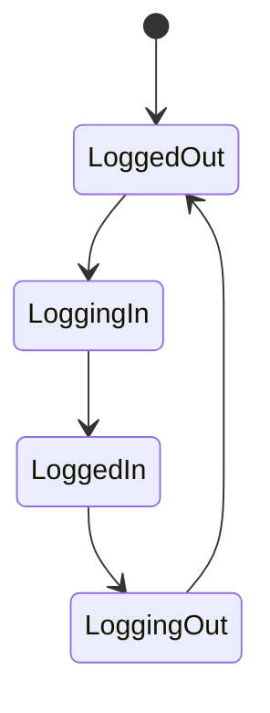

## 9.14 Handling State in Complex Applications

In the world of Flutter development, managing state effectively is crucial, especially as applications grow in complexity. Handling state in complex applications involves not only choosing the right state management solution but also scaling it to accommodate the needs of large, enterprise-level applications. In this section, we will explore strategies for scaling state management solutions, best practices for maintaining state in complex applications, and real-world use cases and examples.

### Scaling State Management Solutions

As applications grow, so does the complexity of managing state. Scaling state management solutions involves modularizing state and using advanced patterns to ensure that the application remains maintainable and scalable.

#### Modularizing State

Modularizing state refers to dividing the application into manageable sections, each with its own state management logic. This approach helps in isolating concerns and making the application easier to maintain and scale.

- **Divide and Conquer**: Break down the application into smaller, independent modules. Each module should manage its own state and expose only the necessary interfaces to interact with other modules.
  
- **Feature-Based Modules**: Organize the application into feature-based modules. Each feature can have its own state management solution, which can be a combination of different state management techniques.

- **Shared State**: For state that needs to be shared across modules, use a centralized state management solution. This can be achieved using patterns like Redux, BLoC, or Provider.

- **Example**: Consider an e-commerce application with modules for user authentication, product catalog, shopping cart, and order management. Each module can manage its own state independently, while shared state like user information can be managed centrally.

```dart
// Example of a feature-based module with its own state management
class ProductCatalogState {
  List<Product> products = [];
  // Methods to manage product catalog state
}

class ShoppingCartState {
  List<CartItem> cartItems = [];
  // Methods to manage shopping cart state
}
```

#### Using Advanced Patterns

Combining multiple state management techniques can provide a more robust solution for complex applications. Advanced patterns like BLoC, Redux, and Provider can be used together to manage different aspects of the application's state.

- **BLoC Pattern**: Use the BLoC pattern for managing complex business logic and state transitions. BLoC helps in separating business logic from UI, making the application more testable and maintainable.

- **Redux Pattern**: Use Redux for managing global state that needs to be accessed across different parts of the application. Redux provides a predictable state container that helps in managing shared state.

- **Provider Pattern**: Use the Provider pattern for managing local state within a specific widget tree. Provider is lightweight and easy to use, making it ideal for managing state in smaller components.

- **Combining Patterns**: Combine these patterns to leverage their strengths. For example, use BLoC for business logic, Redux for global state, and Provider for local state.

```dart
// Example of combining BLoC and Provider
class AuthenticationBloc {
  // Business logic for authentication
}

class AuthenticationProvider extends InheritedWidget {
  final AuthenticationBloc bloc;

  AuthenticationProvider({Key? key, required Widget child})
      : bloc = AuthenticationBloc(),
        super(key: key, child: child);

  static AuthenticationBloc of(BuildContext context) {
    return (context.dependOnInheritedWidgetOfExactType<AuthenticationProvider>())!.bloc;
  }

  @override
  bool updateShouldNotify(InheritedWidget oldWidget) => true;
}
```

### Best Practices

Implementing best practices in state management ensures that the application remains maintainable, scalable, and easy to understand.

#### Documentation

Keeping track of state flows is essential in complex applications. Documentation helps in understanding how state is managed and how different parts of the application interact with each other.

- **State Diagrams**: Use state diagrams to visualize state transitions and interactions. This helps in understanding the flow of state and identifying potential issues.

- **Code Comments**: Use comments to explain the purpose and functionality of state management logic. This helps in maintaining the code and making it easier for new developers to understand.

- **Documentation Tools**: Use tools like DartDoc to generate documentation for your code. This provides a comprehensive view of the application's state management logic.



#### Team Collaboration

Establishing conventions and practices for state management is crucial when working in teams. Consistency in state management practices ensures that the application remains maintainable and scalable.

- **Coding Standards**: Establish coding standards for state management. This includes naming conventions, file organization, and code structure.

- **Code Reviews**: Conduct regular code reviews to ensure that state management logic is implemented correctly and consistently.

- **Collaboration Tools**: Use collaboration tools like Git and GitHub to manage code changes and collaborate with team members.

### Use Cases and Examples

Handling state in complex applications is crucial for enterprise-level apps with multiple teams and features. Let's explore some real-world use cases and examples.

#### Enterprise-Level Apps

Enterprise-level applications often have multiple teams working on different features. Managing state in such applications requires a scalable and maintainable solution.

- **Example**: Consider a banking application with modules for account management, transactions, and customer support. Each module can have its own state management solution, while shared state like user authentication can be managed centrally.

- **Team Collaboration**: Establish conventions and practices for state management to ensure consistency across teams. Use tools like Git and GitHub for collaboration and code management.

- **Scalability**: Use advanced patterns like BLoC, Redux, and Provider to manage different aspects of the application's state. This ensures that the application remains scalable and maintainable.

```dart
// Example of a scalable state management solution for an enterprise-level app
class AccountManagementState {
  // State management logic for account management
}

class TransactionsState {
  // State management logic for transactions
}

class CustomerSupportState {
  // State management logic for customer support
}
```

### Conclusion

Handling state in complex applications requires a combination of modularization, advanced patterns, and best practices. By dividing the application into manageable sections, using advanced patterns, and implementing best practices, you can ensure that your application remains scalable and maintainable. Remember, this is just the beginning. As you progress, you'll build more complex and interactive applications. Keep experimenting, stay curious, and enjoy the journey!

## Quiz Time!



### What is the primary benefit of modularizing state in a complex application?

- [x] It isolates concerns and makes the application easier to maintain.
- [ ] It increases the complexity of the application.
- [ ] It reduces the performance of the application.
- [ ] It makes the application harder to test.

> **Explanation:** Modularizing state isolates concerns and makes the application easier to maintain by dividing it into manageable sections.

### Which pattern is best suited for managing complex business logic and state transitions?

- [x] BLoC Pattern
- [ ] Provider Pattern
- [ ] Singleton Pattern
- [ ] Observer Pattern

> **Explanation:** The BLoC pattern is best suited for managing complex business logic and state transitions, as it separates business logic from UI.

### What is the purpose of using state diagrams in complex applications?

- [x] To visualize state transitions and interactions.
- [ ] To increase the complexity of the application.
- [ ] To reduce the performance of the application.
- [ ] To make the application harder to test.

> **Explanation:** State diagrams help visualize state transitions and interactions, aiding in understanding the flow of state.

### Which tool can be used to generate documentation for Dart code?

- [x] DartDoc
- [ ] GitHub
- [ ] Flutter
- [ ] Visual Studio Code

> **Explanation:** DartDoc is a tool used to generate documentation for Dart code, providing a comprehensive view of the application's state management logic.

### What is a key consideration when combining multiple state management patterns?

- [x] Leveraging the strengths of each pattern.
- [ ] Increasing the complexity of the application.
- [ ] Reducing the performance of the application.
- [ ] Making the application harder to test.

> **Explanation:** Combining multiple state management patterns allows you to leverage the strengths of each pattern for a more robust solution.

### Why is team collaboration important in state management for complex applications?

- [x] It ensures consistency and maintainability.
- [ ] It increases the complexity of the application.
- [ ] It reduces the performance of the application.
- [ ] It makes the application harder to test.

> **Explanation:** Team collaboration ensures consistency and maintainability in state management practices across different teams.

### What is the role of code reviews in state management?

- [x] To ensure state management logic is implemented correctly and consistently.
- [ ] To increase the complexity of the application.
- [ ] To reduce the performance of the application.
- [ ] To make the application harder to test.

> **Explanation:** Code reviews ensure that state management logic is implemented correctly and consistently, maintaining code quality.

### Which pattern is ideal for managing local state within a specific widget tree?

- [x] Provider Pattern
- [ ] BLoC Pattern
- [ ] Singleton Pattern
- [ ] Observer Pattern

> **Explanation:** The Provider pattern is ideal for managing local state within a specific widget tree due to its lightweight nature.

### What is a common use case for enterprise-level applications in state management?

- [x] Managing state across multiple teams and features.
- [ ] Increasing the complexity of the application.
- [ ] Reducing the performance of the application.
- [ ] Making the application harder to test.

> **Explanation:** Enterprise-level applications often require managing state across multiple teams and features, necessitating scalable solutions.

### True or False: Combining multiple state management patterns always increases the complexity of the application.

- [ ] True
- [x] False

> **Explanation:** Combining multiple state management patterns does not always increase complexity; it can provide a more robust solution by leveraging the strengths of each pattern.


