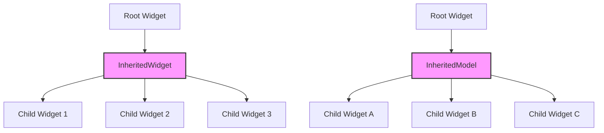

## 9.3 InheritedWidget and InheritedModel

In the realm of Flutter development, efficient state management is crucial for building responsive and scalable applications. One of the foundational tools provided by Flutter for managing state is the `InheritedWidget`. This widget allows you to share data down the widget tree without the need for explicit property passing. Alongside `InheritedWidget`, the `InheritedModel` offers a more granular approach to rebuilding widgets based on specific dependencies. In this section, we will delve into the intricacies of these powerful tools, exploring their implementation, use cases, and best practices.

### Sharing Data Down the Widget Tree

In Flutter, widgets are organized in a tree structure, where each widget is a node in the tree. Passing data from a parent widget to its descendants can become cumbersome, especially when the data needs to be accessed by widgets deep in the tree. This is where `InheritedWidget` and `InheritedModel` come into play, providing a mechanism to share data efficiently across the widget tree.

#### Implementing InheritedWidgets

The `InheritedWidget` is a special type of widget that holds data and notifies its descendants when the data changes. It is designed to be subclassed, allowing you to create custom `InheritedWidgets` tailored to your application's needs.

##### Creating Custom InheritedWidgets

To create a custom `InheritedWidget`, you need to extend the `InheritedWidget` class and override the `updateShouldNotify` method. This method determines whether the widget's dependents should be rebuilt when the widget's data changes.

```dart
import 'package:flutter/material.dart';

// Define a custom InheritedWidget
class MyInheritedWidget extends InheritedWidget {
  final int data;

  MyInheritedWidget({
    Key? key,
    required this.data,
    required Widget child,
  }) : super(key: key, child: child);

  // Determines whether the widget should notify its dependents
  @override
  bool updateShouldNotify(MyInheritedWidget oldWidget) {
    return oldWidget.data != data;
  }

  // Static method to access the widget's data
  static MyInheritedWidget? of(BuildContext context) {
    return context.dependOnInheritedWidgetOfExactType<MyInheritedWidget>();
  }
}
```

In this example, `MyInheritedWidget` holds an integer `data`. The `updateShouldNotify` method checks if the new data is different from the old data, and if so, notifies the dependents to rebuild.

##### Rebuilding Efficiency

One of the key advantages of using `InheritedWidget` is its rebuilding efficiency. Only the descendants that depend on the data will rebuild when the data changes. This is achieved through the `context.dependOnInheritedWidgetOfExactType` method, which registers the widget as a dependent of the `InheritedWidget`.

```dart
class MyWidget extends StatelessWidget {
  @override
  Widget build(BuildContext context) {
    // Access the data from MyInheritedWidget
    final inheritedWidget = MyInheritedWidget.of(context);
    final data = inheritedWidget?.data ?? 0;

    return Text('Data: $data');
  }
}
```

In this example, `MyWidget` accesses the data from `MyInheritedWidget` using the `of` method. If the data changes, only `MyWidget` and its descendants will rebuild, ensuring efficient updates.

#### Use Cases and Examples

`InheritedWidget` and `InheritedModel` are versatile tools that can be used in various scenarios. Let's explore some common use cases and examples.

##### Theme and Localization Data

One of the most common use cases for `InheritedWidget` is providing app-wide settings such as theme and localization data. By using an `InheritedWidget`, you can ensure that all widgets in the app have access to these settings without needing to pass them explicitly.

```dart
class ThemeProvider extends InheritedWidget {
  final ThemeData themeData;

  ThemeProvider({
    Key? key,
    required this.themeData,
    required Widget child,
  }) : super(key: key, child: child);

  @override
  bool updateShouldNotify(ThemeProvider oldWidget) {
    return oldWidget.themeData != themeData;
  }

  static ThemeProvider? of(BuildContext context) {
    return context.dependOnInheritedWidgetOfExactType<ThemeProvider>();
  }
}
```

In this example, `ThemeProvider` is an `InheritedWidget` that holds a `ThemeData` object. Widgets can access the theme data using the `of` method, ensuring consistent theming across the app.

##### Accessing Shared Data

Another common use case is accessing shared data such as user authentication status. By using an `InheritedWidget`, you can provide access to this data throughout the app, allowing widgets to react to changes in authentication status.

```dart
class AuthProvider extends InheritedWidget {
  final bool isAuthenticated;

  AuthProvider({
    Key? key,
    required this.isAuthenticated,
    required Widget child,
  }) : super(key: key, child: child);

  @override
  bool updateShouldNotify(AuthProvider oldWidget) {
    return oldWidget.isAuthenticated != isAuthenticated;
  }

  static AuthProvider? of(BuildContext context) {
    return context.dependOnInheritedWidgetOfExactType<AuthProvider>();
  }
}
```

In this example, `AuthProvider` is an `InheritedWidget` that holds a boolean indicating whether the user is authenticated. Widgets can access this data to conditionally display content based on the user's authentication status.

### InheritedModel: A Granular Approach

While `InheritedWidget` is efficient for sharing data across the widget tree, it can lead to unnecessary rebuilds if multiple pieces of data are stored in a single widget. This is where `InheritedModel` comes in, providing a more granular approach to rebuilding widgets based on specific dependencies.

#### Implementing InheritedModel

`InheritedModel` is a subclass of `InheritedWidget` that allows you to specify which aspects of the data a widget depends on. This enables more fine-grained control over when widgets should rebuild.

```dart
import 'package:flutter/material.dart';

// Define a custom InheritedModel
class MyInheritedModel extends InheritedModel<String> {
  final int data1;
  final int data2;

  MyInheritedModel({
    Key? key,
    required this.data1,
    required this.data2,
    required Widget child,
  }) : super(key: key, child: child);

  @override
  bool updateShouldNotify(MyInheritedModel oldWidget) {
    return oldWidget.data1 != data1 || oldWidget.data2 != data2;
  }

  @override
  bool updateShouldNotifyDependent(
      MyInheritedModel oldWidget, Set<String> dependencies) {
    if (dependencies.contains('data1') && oldWidget.data1 != data1) {
      return true;
    }
    if (dependencies.contains('data2') && oldWidget.data2 != data2) {
      return true;
    }
    return false;
  }

  static MyInheritedModel? of(BuildContext context, {String aspect = ''}) {
    return InheritedModel.inheritFrom<MyInheritedModel>(context, aspect: aspect);
  }
}
```

In this example, `MyInheritedModel` holds two pieces of data: `data1` and `data2`. The `updateShouldNotifyDependent` method checks which aspects of the data have changed and notifies only the dependents that rely on those aspects.

#### Use Cases for InheritedModel

`InheritedModel` is particularly useful when you have multiple pieces of data that change independently. By using `InheritedModel`, you can ensure that only the widgets that depend on the changed data are rebuilt.

##### Example: Multi-Aspect Data

Consider a scenario where you have a widget that displays both user profile information and app settings. By using `InheritedModel`, you can separate these concerns and rebuild only the widgets that depend on the changed data.

```dart
class UserProfileWidget extends StatelessWidget {
  @override
  Widget build(BuildContext context) {
    final model = MyInheritedModel.of(context, aspect: 'data1');
    final data1 = model?.data1 ?? 0;

    return Text('User Profile Data: $data1');
  }
}

class AppSettingsWidget extends StatelessWidget {
  @override
  Widget build(BuildContext context) {
    final model = MyInheritedModel.of(context, aspect: 'data2');
    final data2 = model?.data2 ?? 0;

    return Text('App Settings Data: $data2');
  }
}
```

In this example, `UserProfileWidget` depends on `data1`, while `AppSettingsWidget` depends on `data2`. If `data1` changes, only `UserProfileWidget` will rebuild, and vice versa.

### Visualizing InheritedWidget and InheritedModel

To better understand how `InheritedWidget` and `InheritedModel` work, let's visualize their interactions within the widget tree.



In this diagram, the `InheritedWidget` and `InheritedModel` are positioned above their respective child widgets. When the data in the `InheritedWidget` or `InheritedModel` changes, only the relevant child widgets are rebuilt.

### Design Considerations

When using `InheritedWidget` and `InheritedModel`, there are several design considerations to keep in mind:

- **Granularity**: Use `InheritedModel` when you have multiple pieces of data that change independently. This ensures that only the necessary widgets are rebuilt.
- **Performance**: Avoid storing large amounts of data in `InheritedWidget` or `InheritedModel`. Instead, store references to data that can be accessed elsewhere.
- **Readability**: Keep your widget tree organized and easy to understand. Use descriptive names for your custom `InheritedWidgets` and `InheritedModels`.

### Differences and Similarities

While `InheritedWidget` and `InheritedModel` serve similar purposes, they have distinct differences:

- **Rebuilding**: `InheritedWidget` rebuilds all dependents when the data changes, while `InheritedModel` rebuilds only the dependents that rely on the changed aspects.
- **Complexity**: `InheritedModel` is more complex to implement but provides greater control over rebuilding.

### Try It Yourself

To solidify your understanding of `InheritedWidget` and `InheritedModel`, try modifying the code examples provided. Experiment with adding new data to the `InheritedModel` and observe how the widgets rebuild based on their dependencies. This hands-on approach will help you grasp the nuances of these powerful tools.

### Knowledge Check

Before moving on, let's review some key concepts:

- **What is the primary purpose of `InheritedWidget`?**
- **How does `InheritedModel` differ from `InheritedWidget`?**
- **What are some common use cases for `InheritedWidget` and `InheritedModel`?**

### Embrace the Journey

Remember, mastering state management in Flutter is an ongoing journey. As you continue to explore and experiment with `InheritedWidget` and `InheritedModel`, you'll gain a deeper understanding of their capabilities and how they can enhance your Flutter applications. Keep experimenting, stay curious, and enjoy the journey!

## Quiz Time!



### What is the primary purpose of an InheritedWidget in Flutter?

- [x] To share data down the widget tree without explicit property passing.
- [ ] To manage animations in Flutter.
- [ ] To handle HTTP requests.
- [ ] To create custom widgets.

> **Explanation:** The primary purpose of an `InheritedWidget` is to share data down the widget tree without the need for explicit property passing.

### How does InheritedModel differ from InheritedWidget?

- [x] InheritedModel allows for more granular control over widget rebuilding.
- [ ] InheritedModel is used for animations.
- [ ] InheritedModel is a subclass of StatefulWidget.
- [ ] InheritedModel is used for network requests.

> **Explanation:** `InheritedModel` provides more granular control over widget rebuilding by allowing widgets to specify which aspects of the data they depend on.

### Which method in InheritedWidget determines if dependents should be rebuilt?

- [x] updateShouldNotify
- [ ] build
- [ ] initState
- [ ] dispose

> **Explanation:** The `updateShouldNotify` method in `InheritedWidget` determines if the widget's dependents should be rebuilt when the data changes.

### What is a common use case for InheritedWidget?

- [x] Providing app-wide settings like theme and localization data.
- [ ] Handling user input.
- [ ] Managing network requests.
- [ ] Creating animations.

> **Explanation:** A common use case for `InheritedWidget` is providing app-wide settings such as theme and localization data.

### InheritedModel is particularly useful when:

- [x] You have multiple pieces of data that change independently.
- [ ] You need to manage animations.
- [ ] You are handling HTTP requests.
- [ ] You are creating custom widgets.

> **Explanation:** `InheritedModel` is useful when you have multiple pieces of data that change independently, allowing for more efficient widget rebuilding.

### Which method in InheritedModel checks which aspects of the data have changed?

- [x] updateShouldNotifyDependent
- [ ] build
- [ ] initState
- [ ] dispose

> **Explanation:** The `updateShouldNotifyDependent` method in `InheritedModel` checks which aspects of the data have changed and notifies only the dependents that rely on those aspects.

### What is a key advantage of using InheritedWidget?

- [x] Rebuilding efficiency, as only the descendants that depend on the data will rebuild.
- [ ] It simplifies network requests.
- [ ] It enhances animations.
- [ ] It manages user input.

> **Explanation:** A key advantage of using `InheritedWidget` is its rebuilding efficiency, as only the descendants that depend on the data will rebuild when the data changes.

### InheritedModel is a subclass of which class?

- [x] InheritedWidget
- [ ] StatefulWidget
- [ ] StatelessWidget
- [ ] MaterialApp

> **Explanation:** `InheritedModel` is a subclass of `InheritedWidget`, providing more granular control over widget rebuilding.

### What should you avoid storing in InheritedWidget or InheritedModel?

- [x] Large amounts of data
- [ ] Theme data
- [ ] Localization data
- [ ] User authentication status

> **Explanation:** Avoid storing large amounts of data in `InheritedWidget` or `InheritedModel`. Instead, store references to data that can be accessed elsewhere.

### True or False: InheritedWidget rebuilds all dependents when the data changes.

- [x] True
- [ ] False

> **Explanation:** True. `InheritedWidget` rebuilds all dependents when the data changes, unlike `InheritedModel`, which rebuilds only the dependents that rely on the changed aspects.


