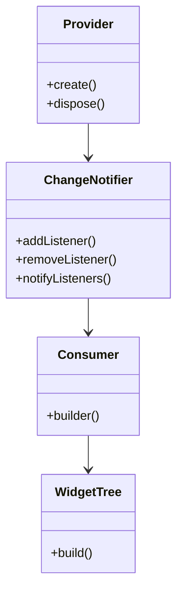

## 9.4 Provider Pattern

State management is a crucial aspect of Flutter development, and the Provider Pattern has emerged as one of the most recommended approaches for managing state effectively. This pattern simplifies the use of InheritedWidgets, making it easier to supply and consume data throughout the widget tree. In this comprehensive guide, we will delve into the intricacies of the Provider Pattern, explore its implementation, and examine its use cases with practical examples.

### Understanding the Provider Pattern

The Provider Pattern is a wrapper around InheritedWidgets, which are a part of Flutter's core framework. InheritedWidgets allow data to be passed down the widget tree without the need for explicitly passing it through constructors. However, using InheritedWidgets directly can be cumbersome and error-prone. The Provider Pattern abstracts this complexity, providing a more intuitive and flexible way to manage state.

#### Key Concepts

- **Provider**: The core component that supplies data to the widget tree.
- **Consumer**: A widget that listens to changes in the provided data and rebuilds when necessary.
- **ChangeNotifier**: A class that notifies listeners about changes in the state.

### Implementing the Provider Pattern

Implementing the Provider Pattern involves wrapping your application with providers and consuming data within your widgets. Let's explore these steps in detail.

#### Wrapping the App with Providers

To supply data to the widget tree, you need to wrap your application with a `Provider` or `MultiProvider`. This is typically done at the root of your app, ensuring that the data is accessible to all widgets.

```dart
import 'package:flutter/material.dart';
import 'package:provider/provider.dart';

void main() {
  runApp(
    MultiProvider(
      providers: [
        ChangeNotifierProvider(create: (_) => Counter()),
      ],
      child: MyApp(),
    ),
  );
}

class Counter with ChangeNotifier {
  int _count = 0;

  int get count => _count;

  void increment() {
    _count++;
    notifyListeners();
  }
}

class MyApp extends StatelessWidget {
  @override
  Widget build(BuildContext context) {
    return MaterialApp(
      home: CounterScreen(),
    );
  }
}
```

In this example, we use `MultiProvider` to wrap the `MyApp` widget. The `Counter` class, which extends `ChangeNotifier`, is provided to the widget tree. This allows any widget in the tree to access and modify the counter state.

#### Consuming Data

Once the data is provided, you can consume it using the `Consumer` widget or the `Provider.of` method. The `Consumer` widget is preferred as it rebuilds only the part of the widget tree that depends on the data, optimizing performance.

```dart
class CounterScreen extends StatelessWidget {
  @override
  Widget build(BuildContext context) {
    return Scaffold(
      appBar: AppBar(
        title: Text('Provider Pattern Example'),
      ),
      body: Center(
        child: Consumer<Counter>(
          builder: (context, counter, child) {
            return Text(
              'Count: ${counter.count}',
              style: TextStyle(fontSize: 24),
            );
          },
        ),
      ),
      floatingActionButton: FloatingActionButton(
        onPressed: () => context.read<Counter>().increment(),
        child: Icon(Icons.add),
      ),
    );
  }
}
```

In this example, the `Consumer` widget listens to changes in the `Counter` object and rebuilds the `Text` widget whenever the count changes. The `FloatingActionButton` uses `context.read<Counter>()` to access the `Counter` instance and call the `increment` method.

### Use Cases and Examples

The Provider Pattern is versatile and can be used in various scenarios. Let's explore some common use cases.

#### Global State Management

Managing global state, such as user sessions or application settings, is a common requirement in Flutter applications. The Provider Pattern makes it easy to manage and access global state across the app.

```dart
class UserSession with ChangeNotifier {
  String _username;

  String get username => _username;

  void login(String username) {
    _username = username;
    notifyListeners();
  }

  void logout() {
    _username = null;
    notifyListeners();
  }
}

void main() {
  runApp(
    ChangeNotifierProvider(
      create: (_) => UserSession(),
      child: MyApp(),
    ),
  );
}
```

In this example, the `UserSession` class manages the user's login state. By wrapping the app with `ChangeNotifierProvider`, the user session state is accessible throughout the app.

#### Dependency Injection

The Provider Pattern can also be used for dependency injection, providing services or data to widgets without tightly coupling them.

```dart
class ApiService {
  Future<String> fetchData() async {
    // Simulate network request
    await Future.delayed(Duration(seconds: 2));
    return 'Data from API';
  }
}

void main() {
  runApp(
    Provider(
      create: (_) => ApiService(),
      child: MyApp(),
    ),
  );
}

class DataScreen extends StatelessWidget {
  @override
  Widget build(BuildContext context) {
    final apiService = Provider.of<ApiService>(context, listen: false);

    return FutureBuilder<String>(
      future: apiService.fetchData(),
      builder: (context, snapshot) {
        if (snapshot.connectionState == ConnectionState.waiting) {
          return CircularProgressIndicator();
        } else if (snapshot.hasError) {
          return Text('Error: ${snapshot.error}');
        } else {
          return Text('Data: ${snapshot.data}');
        }
      },
    );
  }
}
```

In this example, the `ApiService` is provided to the widget tree, allowing the `DataScreen` widget to access it and fetch data asynchronously.

### Visualizing the Provider Pattern

To better understand the flow of data in the Provider Pattern, let's visualize it using a class diagram.



**Diagram Description**: This class diagram illustrates the relationship between the `Provider`, `ChangeNotifier`, `Consumer`, and the widget tree. The `Provider` supplies data, the `ChangeNotifier` notifies listeners of changes, and the `Consumer` rebuilds the widget tree based on the data.

### Design Considerations

When using the Provider Pattern, consider the following:

- **Performance**: Use `Consumer` widgets to minimize unnecessary rebuilds. Avoid using `Provider.of` with `listen: true` in build methods, as it can lead to performance issues.
- **Scalability**: Organize providers logically to manage complex state efficiently. Use `MultiProvider` for multiple providers.
- **Testing**: The Provider Pattern facilitates testing by allowing you to inject mock data or services easily.

### Differences and Similarities

The Provider Pattern is often compared to other state management solutions like BLoC and Redux. Here's how it differs:

- **Simplicity**: The Provider Pattern is simpler and more intuitive, making it suitable for small to medium-sized applications.
- **Flexibility**: Unlike Redux, which enforces a strict unidirectional data flow, the Provider Pattern offers more flexibility in managing state.
- **Integration**: The Provider Pattern integrates seamlessly with Flutter's widget tree, unlike BLoC, which requires additional setup.

### Try It Yourself

To get hands-on experience with the Provider Pattern, try modifying the examples above. For instance, add a new feature to the `Counter` app that decrements the count. Experiment with different ways to consume data, such as using `Selector` to optimize performance further.

### Knowledge Check

Before we wrap up, let's reinforce what we've learned with a few questions:

- What is the primary purpose of the Provider Pattern in Flutter?
- How does the `Consumer` widget optimize performance?
- What are some common use cases for the Provider Pattern?

### Embrace the Journey

Remember, mastering the Provider Pattern is just the beginning. As you continue your Flutter development journey, you'll encounter more complex state management challenges. Keep experimenting, stay curious, and enjoy the process of building scalable and maintainable applications.

## Quiz Time!



### What is the primary purpose of the Provider Pattern in Flutter?

- [x] To simplify state management by wrapping InheritedWidgets
- [ ] To enforce a strict unidirectional data flow
- [ ] To replace the need for ChangeNotifier
- [ ] To manage animations in Flutter

> **Explanation:** The Provider Pattern simplifies state management by wrapping InheritedWidgets, making it easier to supply and consume data throughout the widget tree.

### How does the `Consumer` widget optimize performance?

- [x] By rebuilding only the part of the widget tree that depends on the data
- [ ] By caching data for offline use
- [ ] By reducing the number of API calls
- [ ] By managing animations efficiently

> **Explanation:** The `Consumer` widget listens to changes in the provided data and rebuilds only the part of the widget tree that depends on it, optimizing performance.

### What is a common use case for the Provider Pattern?

- [x] Managing global state such as user sessions
- [ ] Handling animations in Flutter
- [ ] Creating custom widgets
- [ ] Managing network requests

> **Explanation:** The Provider Pattern is commonly used for managing global state, such as user sessions or application settings, across the app.

### Which class is used to notify listeners about changes in the state?

- [x] ChangeNotifier
- [ ] Provider
- [ ] Consumer
- [ ] MultiProvider

> **Explanation:** `ChangeNotifier` is used to notify listeners about changes in the state, allowing widgets to rebuild when necessary.

### What is the role of the `Provider` in the Provider Pattern?

- [x] To supply data to the widget tree
- [ ] To manage animations in Flutter
- [ ] To replace the need for ChangeNotifier
- [ ] To enforce a strict unidirectional data flow

> **Explanation:** The `Provider` supplies data to the widget tree, making it accessible to all widgets within the tree.

### How can you access a provided service in a widget?

- [x] Using `Provider.of` or `context.read`
- [ ] Using `setState`
- [ ] Using `Navigator.push`
- [ ] Using `FutureBuilder`

> **Explanation:** You can access a provided service in a widget using `Provider.of` or `context.read`, allowing you to interact with the provided data or services.

### What is the advantage of using `MultiProvider`?

- [x] It allows you to provide multiple services or data to the widget tree
- [ ] It optimizes animations in Flutter
- [ ] It reduces the number of API calls
- [ ] It manages network requests efficiently

> **Explanation:** `MultiProvider` allows you to provide multiple services or data to the widget tree, organizing providers logically for complex state management.

### Which widget should you use to minimize unnecessary rebuilds?

- [x] Consumer
- [ ] Provider
- [ ] ChangeNotifier
- [ ] MultiProvider

> **Explanation:** The `Consumer` widget minimizes unnecessary rebuilds by listening to changes in the provided data and rebuilding only the part of the widget tree that depends on it.

### What is a key difference between the Provider Pattern and Redux?

- [x] The Provider Pattern offers more flexibility in managing state
- [ ] Redux is simpler and more intuitive
- [ ] The Provider Pattern enforces a strict unidirectional data flow
- [ ] Redux integrates seamlessly with Flutter's widget tree

> **Explanation:** The Provider Pattern offers more flexibility in managing state, unlike Redux, which enforces a strict unidirectional data flow.

### True or False: The Provider Pattern is suitable for small to medium-sized applications.

- [x] True
- [ ] False

> **Explanation:** The Provider Pattern is suitable for small to medium-sized applications due to its simplicity and flexibility.



By mastering the Provider Pattern, you're well on your way to building robust and scalable Flutter applications. Keep exploring, experimenting, and refining your skills as you continue your journey in Flutter development.
