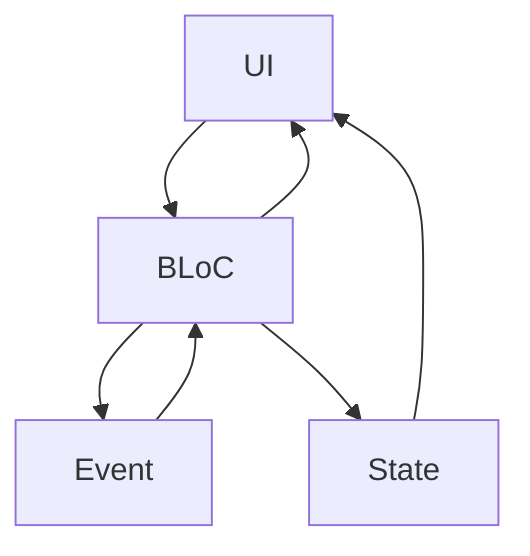

## 9.5 BLoC Pattern (Business Logic Component)

In the realm of Flutter development, managing state efficiently is crucial for building responsive and maintainable applications. The BLoC (Business Logic Component) pattern is a powerful state management solution that separates business logic from the UI, promoting reusability and testability. In this section, we'll delve into the intricacies of the BLoC pattern, exploring its implementation, use cases, and benefits.

### Separating Business Logic from UI

The primary goal of the BLoC pattern is to decouple business logic from the UI layer. This separation allows developers to focus on writing clean, testable, and reusable code. By managing state and business logic in separate components, we can achieve a more structured and maintainable codebase.

#### Key Benefits of BLoC Pattern

- **Reusability**: Business logic can be reused across different parts of the application or even in different projects.
- **Testability**: With business logic isolated from the UI, unit testing becomes straightforward.
- **Maintainability**: A clear separation of concerns leads to a more organized and manageable codebase.

### Implementing BLoC in Flutter

Implementing the BLoC pattern in Flutter involves creating BLoC classes that manage streams of events and states. These classes are then connected to the UI using StreamBuilders, which listen to state changes and rebuild the UI accordingly.

#### Creating BLoC Classes

A BLoC class typically consists of:

- **Input Streams (Sinks)**: For receiving events or actions from the UI.
- **Output Streams**: For emitting states back to the UI.
- **Business Logic**: The core logic that processes events and produces states.

Let's explore a simple example of a counter application using the BLoC pattern.

```dart
import 'dart:async';

// Define the events
abstract class CounterEvent {}

class IncrementEvent extends CounterEvent {}

class DecrementEvent extends CounterEvent {}

// Define the BLoC class
class CounterBloc {
  int _counter = 0;

  // StreamController for input events
  final _eventController = StreamController<CounterEvent>();

  // StreamController for output states
  final _stateController = StreamController<int>();

  // Sink for adding events
  Sink<CounterEvent> get eventSink => _eventController.sink;

  // Stream for listening to state changes
  Stream<int> get counterStream => _stateController.stream;

  CounterBloc() {
    // Listen to events and process them
    _eventController.stream.listen(_mapEventToState);
  }

  void _mapEventToState(CounterEvent event) {
    if (event is IncrementEvent) {
      _counter++;
    } else if (event is DecrementEvent) {
      _counter--;
    }
    // Emit the new state
    _stateController.sink.add(_counter);
  }

  // Dispose method to close the streams
  void dispose() {
    _eventController.close();
    _stateController.close();
  }
}
```

In this example, the `CounterBloc` class manages the state of a counter. It listens for `IncrementEvent` and `DecrementEvent` and updates the counter accordingly. The updated counter value is then emitted through the `counterStream`.

#### StreamBuilders: Connecting BLoCs to the UI

StreamBuilders in Flutter are widgets that listen to streams and rebuild the UI when new data is emitted. They are essential for connecting BLoC classes to the UI.

Here's how we can use a `StreamBuilder` to connect the `CounterBloc` to a Flutter widget:

```dart
import 'package:flutter/material.dart';

void main() => runApp(MyApp());

class MyApp extends StatelessWidget {
  @override
  Widget build(BuildContext context) {
    return MaterialApp(
      home: CounterScreen(),
    );
  }
}

class CounterScreen extends StatelessWidget {
  final CounterBloc _bloc = CounterBloc();

  @override
  Widget build(BuildContext context) {
    return Scaffold(
      appBar: AppBar(
        title: Text('Counter BLoC Example'),
      ),
      body: Center(
        child: StreamBuilder<int>(
          stream: _bloc.counterStream,
          initialData: 0,
          builder: (context, snapshot) {
            return Text(
              'Counter: ${snapshot.data}',
              style: TextStyle(fontSize: 24),
            );
          },
        ),
      ),
      floatingActionButton: Column(
        mainAxisAlignment: MainAxisAlignment.end,
        children: [
          FloatingActionButton(
            onPressed: () => _bloc.eventSink.add(IncrementEvent()),
            child: Icon(Icons.add),
          ),
          SizedBox(height: 10),
          FloatingActionButton(
            onPressed: () => _bloc.eventSink.add(DecrementEvent()),
            child: Icon(Icons.remove),
          ),
        ],
      ),
    );
  }
}
```

In this code, the `StreamBuilder` listens to the `counterStream` from the `CounterBloc`. Whenever the stream emits a new value, the `StreamBuilder` rebuilds the `Text` widget to display the updated counter value.

### Use Cases and Examples

The BLoC pattern is particularly useful in scenarios involving complex state management and asynchronous operations. Let's explore some use cases and examples.

#### Complex State Management

In applications with multiple asynchronous events, managing state can become challenging. The BLoC pattern provides a structured way to handle such complexity by isolating business logic and state management.

Consider an application that fetches data from an API and displays it in a list. Using the BLoC pattern, we can manage the loading, success, and error states efficiently.

```dart
import 'dart:async';

// Define the events
abstract class DataEvent {}

class FetchDataEvent extends DataEvent {}

// Define the states
abstract class DataState {}

class DataLoading extends DataState {}

class DataLoaded extends DataState {
  final List<String> data;
  DataLoaded(this.data);
}

class DataError extends DataState {
  final String message;
  DataError(this.message);
}

// Define the BLoC class
class DataBloc {
  final _eventController = StreamController<DataEvent>();
  final _stateController = StreamController<DataState>();

  Sink<DataEvent> get eventSink => _eventController.sink;
  Stream<DataState> get stateStream => _stateController.stream;

  DataBloc() {
    _eventController.stream.listen(_mapEventToState);
  }

  void _mapEventToState(DataEvent event) async {
    if (event is FetchDataEvent) {
      _stateController.sink.add(DataLoading());
      try {
        // Simulate a network call
        await Future.delayed(Duration(seconds: 2));
        final data = ['Item 1', 'Item 2', 'Item 3'];
        _stateController.sink.add(DataLoaded(data));
      } catch (e) {
        _stateController.sink.add(DataError('Failed to fetch data'));
      }
    }
  }

  void dispose() {
    _eventController.close();
    _stateController.close();
  }
}
```

In this example, the `DataBloc` class manages the state of data fetching. It emits `DataLoading`, `DataLoaded`, and `DataError` states based on the outcome of the data fetching operation.

#### Structured Codebase

The BLoC pattern encourages a structured codebase, making it easier for teams to collaborate. By separating business logic from the UI, developers can work on different parts of the application independently.

Consider a team working on a large e-commerce application. The BLoC pattern allows one developer to focus on implementing the business logic for product listings, while another developer works on the UI for displaying the products. This separation of concerns facilitates parallel development and reduces merge conflicts.

### Design Considerations

When implementing the BLoC pattern, consider the following design considerations:

- **State Management**: Ensure that the BLoC class manages state transitions efficiently. Use streams to emit states and handle asynchronous operations.
- **Error Handling**: Implement robust error handling to manage exceptions and provide meaningful feedback to the UI.
- **Performance**: Optimize the performance of BLoC classes by minimizing unnecessary state emissions and stream operations.

### Differences and Similarities

The BLoC pattern is often compared to other state management solutions in Flutter, such as Provider and Redux. While all these patterns aim to manage state efficiently, they differ in their approach and complexity.

- **Provider**: A simpler state management solution that uses ChangeNotifier to manage state. It is suitable for smaller applications with less complex state management needs.
- **Redux**: A more complex state management solution inspired by the Redux pattern in JavaScript. It is suitable for large applications with complex state management requirements.

The BLoC pattern strikes a balance between simplicity and complexity, making it a popular choice for many Flutter developers.

### Try It Yourself

To gain a deeper understanding of the BLoC pattern, try modifying the code examples provided in this section. Experiment with adding new events and states, and observe how the BLoC pattern manages state transitions.

For instance, try adding a `ResetEvent` to the counter example and implement the logic to reset the counter to zero. This exercise will help reinforce your understanding of the BLoC pattern and its benefits.

### Visualizing BLoC Architecture

To better understand the architecture of the BLoC pattern, let's visualize the flow of events and states using a Mermaid.js diagram.



**Diagram Description**: This diagram illustrates the flow of events and states in the BLoC pattern. The UI sends events to the BLoC, which processes them and emits states back to the UI.

### References and Links

For further reading on the BLoC pattern and state management in Flutter, consider the following resources:

- [Flutter BLoC Package Documentation](https://pub.dev/packages/flutter_bloc)
- [Flutter Official Documentation](https://flutter.dev/docs)
- [Dart Language Tour](https://dart.dev/guides/language/language-tour)

### Knowledge Check

To reinforce your understanding of the BLoC pattern, consider the following questions:

- What are the key benefits of using the BLoC pattern in Flutter?
- How does the BLoC pattern promote testability and reusability?
- What are the differences between the BLoC pattern and other state management solutions like Provider and Redux?

### Embrace the Journey

Remember, mastering the BLoC pattern is just the beginning of your journey in Flutter development. As you continue to explore state management solutions, you'll gain a deeper understanding of how to build responsive and maintainable applications. Keep experimenting, stay curious, and enjoy the journey!

## Quiz Time!



### What is the primary goal of the BLoC pattern in Flutter?

- [x] To separate business logic from the UI
- [ ] To enhance the visual appearance of the app
- [ ] To reduce the app's memory usage
- [ ] To simplify the app's navigation structure

> **Explanation:** The primary goal of the BLoC pattern is to separate business logic from the UI, promoting reusability and testability.

### Which component in the BLoC pattern is responsible for emitting states to the UI?

- [ ] Event
- [x] Stream
- [ ] Sink
- [ ] Controller

> **Explanation:** In the BLoC pattern, streams are used to emit states to the UI.

### What is the role of a StreamBuilder in the BLoC pattern?

- [x] To listen to streams and rebuild the UI when new data is emitted
- [ ] To manage the app's navigation
- [ ] To handle user input
- [ ] To optimize the app's performance

> **Explanation:** StreamBuilders listen to streams and rebuild the UI when new data is emitted, connecting BLoCs to the UI.

### In the BLoC pattern, what is the purpose of a Sink?

- [x] To add events to the stream
- [ ] To emit states to the UI
- [ ] To manage the app's lifecycle
- [ ] To handle network requests

> **Explanation:** A Sink is used to add events to the stream in the BLoC pattern.

### How does the BLoC pattern enhance testability?

- [x] By isolating business logic from the UI
- [ ] By reducing the app's code size
- [ ] By simplifying the app's navigation
- [ ] By improving the app's visual design

> **Explanation:** The BLoC pattern enhances testability by isolating business logic from the UI, making it easier to write unit tests.

### What is a common use case for the BLoC pattern?

- [x] Managing complex state with multiple asynchronous events
- [ ] Enhancing the app's visual design
- [ ] Simplifying the app's navigation
- [ ] Reducing the app's memory usage

> **Explanation:** The BLoC pattern is commonly used for managing complex state with multiple asynchronous events.

### Which state management solution is simpler than BLoC and suitable for smaller applications?

- [x] Provider
- [ ] Redux
- [ ] MobX
- [ ] Riverpod

> **Explanation:** Provider is a simpler state management solution than BLoC and is suitable for smaller applications.

### What is the main advantage of using the BLoC pattern in team collaboration?

- [x] It allows developers to work on different parts of the application independently
- [ ] It reduces the app's memory usage
- [ ] It enhances the app's visual design
- [ ] It simplifies the app's navigation

> **Explanation:** The BLoC pattern allows developers to work on different parts of the application independently, facilitating team collaboration.

### What is the role of the _mapEventToState method in a BLoC class?

- [x] To process events and produce states
- [ ] To manage the app's navigation
- [ ] To handle user input
- [ ] To optimize the app's performance

> **Explanation:** The _mapEventToState method processes events and produces states in a BLoC class.

### True or False: The BLoC pattern is only suitable for large applications with complex state management needs.

- [ ] True
- [x] False

> **Explanation:** False. The BLoC pattern is suitable for both small and large applications, depending on the complexity of state management needs.




