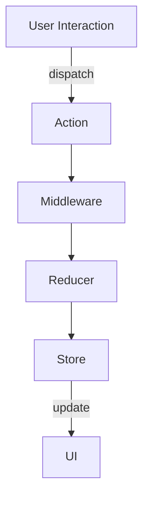

## 9.6 Redux Pattern

In the realm of Flutter development, managing state efficiently and predictably is crucial, especially as applications grow in complexity. The Redux pattern offers a robust solution by enforcing a unidirectional data flow, which simplifies state management and enhances predictability. This comprehensive guide will delve into the intricacies of implementing Redux in Flutter, exploring its components, use cases, and providing practical examples to solidify your understanding.

### Understanding Redux: A Predictable State Container

Redux is a predictable state container for JavaScript apps, but its principles can be effectively applied in Flutter applications using Dart. At its core, Redux is built on three fundamental principles:

1. **Single Source of Truth**: The state of your entire application is stored in a single object tree within a single store. This centralization simplifies state management and debugging.

2. **State is Read-Only**: The only way to change the state is to emit an action, an object describing what happened. This ensures that state transitions are explicit and traceable.

3. **Changes are Made with Pure Functions**: To specify how the state tree is transformed by actions, you write pure reducers. Reducers are functions that take the current state and an action, and return a new state.

### Implementing Redux in Flutter

To implement Redux in Flutter, we need to define actions, reducers, and connect them to the UI using `StoreProvider` and `StoreConnector`. Let's break down each component:

#### Defining Actions and Reducers

**Actions** are payloads of information that send data from your application to your Redux store. They are the only source of information for the store. You send them to the store using `store.dispatch()`.

```dart
// Define an action
class IncrementAction {}

// Define another action
class DecrementAction {}
```

**Reducers** specify how the application's state changes in response to actions sent to the store. Remember that actions only describe what happened, but don't describe how the application's state changes.

```dart
// Define a reducer
int counterReducer(int state, dynamic action) {
  if (action is IncrementAction) {
    return state + 1;
  } else if (action is DecrementAction) {
    return state - 1;
  }
  return state;
}
```

#### Connecting to the UI

To connect Redux to your Flutter UI, you use `StoreProvider` and `StoreConnector`.

- **StoreProvider**: This widget makes the Redux store available to all descendant widgets.

- **StoreConnector**: This widget connects a part of the Redux state to the UI.

```dart
import 'package:flutter/material.dart';
import 'package:flutter_redux/flutter_redux.dart';
import 'package:redux/redux.dart';

// Define the app state
class AppState {
  final int counter;
  AppState(this.counter);
}

// Create the store
final store = Store<int>(counterReducer, initialState: 0);

void main() {
  runApp(MyApp());
}

class MyApp extends StatelessWidget {
  @override
  Widget build(BuildContext context) {
    return StoreProvider<int>(
      store: store,
      child: MaterialApp(
        home: CounterScreen(),
      ),
    );
  }
}

class CounterScreen extends StatelessWidget {
  @override
  Widget build(BuildContext context) {
    return Scaffold(
      appBar: AppBar(title: Text('Redux Counter')),
      body: StoreConnector<int, int>(
        converter: (store) => store.state,
        builder: (context, counter) {
          return Center(
            child: Text(
              '$counter',
              style: TextStyle(fontSize: 48.0),
            ),
          );
        },
      ),
      floatingActionButton: Column(
        mainAxisAlignment: MainAxisAlignment.end,
        children: <Widget>[
          FloatingActionButton(
            onPressed: () => store.dispatch(IncrementAction()),
            child: Icon(Icons.add),
          ),
          SizedBox(height: 8.0),
          FloatingActionButton(
            onPressed: () => store.dispatch(DecrementAction()),
            child: Icon(Icons.remove),
          ),
        ],
      ),
    );
  }
}
```

### Use Cases and Examples

#### Large Applications

Redux shines in large applications where state predictability is crucial. By centralizing state management, Redux makes it easier to track changes and debug issues. This is particularly beneficial in applications with complex state interactions and multiple developers.

#### Debugging Tools

Redux's middleware capabilities allow for powerful debugging tools. Middleware can intercept actions and perform tasks such as logging, error reporting, and asynchronous operations. For example, the `redux_logging` package can be used to log actions and state changes:

```dart
import 'package:redux_logging/redux_logging.dart';

final store = Store<int>(
  counterReducer,
  initialState: 0,
  middleware: [LoggingMiddleware.printer()],
);
```

### Visualizing Redux in Flutter

To better understand the flow of data in a Redux-based Flutter application, let's visualize the architecture using a Mermaid.js diagram:



**Diagram Description**: This diagram illustrates the unidirectional data flow in a Redux application. User interactions dispatch actions, which pass through middleware before reaching the reducer. The reducer updates the store, which in turn updates the UI.

### Design Considerations

When implementing Redux in Flutter, consider the following:

- **Boilerplate Code**: Redux can introduce a significant amount of boilerplate code. Consider using helper libraries like `redux_thunk` or `redux_saga` to manage asynchronous actions more efficiently.

- **Performance**: While Redux provides predictability, it may not be the most performant solution for all applications. Evaluate your application's needs and consider alternatives like BLoC or Provider for simpler state management.

- **Learning Curve**: Redux has a steeper learning curve compared to other state management solutions. Ensure your team is comfortable with its concepts before adopting it for large projects.

### Differences and Similarities

Redux is often compared to other state management patterns like BLoC and Provider. Here's how they differ:

- **Redux vs. BLoC**: BLoC (Business Logic Component) separates business logic from UI, similar to Redux. However, BLoC uses streams for state management, which can be more performant in certain scenarios.

- **Redux vs. Provider**: Provider is a simpler state management solution that leverages Flutter's InheritedWidget. It's easier to set up and use, but may not offer the same level of predictability and debugging tools as Redux.

### Try It Yourself

To deepen your understanding of Redux in Flutter, try modifying the code examples provided. Experiment with adding new actions, reducers, and UI components. Consider integrating middleware for logging or asynchronous operations. By actively engaging with the code, you'll gain a more intuitive grasp of Redux's principles and capabilities.

### Knowledge Check

Before moving on, let's reinforce what we've learned:

- **What are the three core principles of Redux?**
- **How do actions and reducers work together to manage state?**
- **What are the benefits of using Redux in large applications?**
- **How can middleware enhance Redux's capabilities?**

### Embrace the Journey

Remember, mastering Redux is a journey. As you continue to explore its potential, you'll discover new ways to optimize state management in your Flutter applications. Stay curious, keep experimenting, and enjoy the process of learning and growth.

## Quiz Time!



### What is the primary purpose of Redux in Flutter applications?

- [x] To manage state in a predictable way
- [ ] To enhance UI rendering speed
- [ ] To simplify widget creation
- [ ] To manage network requests

> **Explanation:** Redux is primarily used to manage state in a predictable and centralized manner, ensuring a single source of truth for the application's state.

### Which component in Redux is responsible for describing what happened in the application?

- [ ] Reducer
- [x] Action
- [ ] Store
- [ ] Middleware

> **Explanation:** Actions are payloads of information that describe what happened in the application. They are the only source of information for the store.

### How does Redux ensure that state changes are explicit and traceable?

- [ ] By using asynchronous functions
- [x] By requiring actions to change state
- [ ] By storing state in multiple locations
- [ ] By using complex algorithms

> **Explanation:** Redux requires that state changes occur through actions, making state transitions explicit and traceable.

### What is the role of a reducer in Redux?

- [ ] To dispatch actions
- [x] To specify how the state changes in response to actions
- [ ] To connect the UI to the store
- [ ] To log state changes

> **Explanation:** Reducers are pure functions that specify how the application's state changes in response to actions sent to the store.

### Which widget is used to make the Redux store available to all descendant widgets in Flutter?

- [ ] StoreConnector
- [x] StoreProvider
- [ ] InheritedWidget
- [ ] StatefulWidget

> **Explanation:** StoreProvider is used to make the Redux store available to all descendant widgets in a Flutter application.

### What is a common use case for Redux in Flutter applications?

- [x] Large applications with complex state interactions
- [ ] Small applications with minimal state
- [ ] Applications with no state management
- [ ] Applications focused on UI animations

> **Explanation:** Redux is particularly beneficial in large applications where state predictability and traceability are crucial.

### How can middleware enhance Redux's capabilities?

- [ ] By simplifying the UI
- [x] By intercepting actions for logging and error reporting
- [ ] By reducing boilerplate code
- [ ] By increasing rendering speed

> **Explanation:** Middleware can intercept actions and perform tasks such as logging, error reporting, and managing asynchronous operations.

### What is a potential downside of using Redux in Flutter applications?

- [ ] Lack of debugging tools
- [ ] Poor performance in large applications
- [x] Introduction of boilerplate code
- [ ] Difficulty in connecting to the UI

> **Explanation:** Redux can introduce a significant amount of boilerplate code, which can be a downside in some applications.

### How does Redux differ from the Provider pattern in Flutter?

- [ ] Redux is simpler to set up
- [x] Redux offers more predictability and debugging tools
- [ ] Provider is more suitable for large applications
- [ ] Provider uses streams for state management

> **Explanation:** Redux offers more predictability and debugging tools compared to the Provider pattern, which is simpler to set up and use.

### True or False: Redux uses a bidirectional data flow to manage state.

- [ ] True
- [x] False

> **Explanation:** Redux uses a unidirectional data flow to manage state, ensuring a single source of truth and predictable state transitions.



By mastering the Redux pattern in Flutter, you equip yourself with the tools to manage state predictably and efficiently, paving the way for scalable and maintainable applications. Keep exploring, experimenting, and refining your skills to unlock the full potential of Redux in your development journey.
