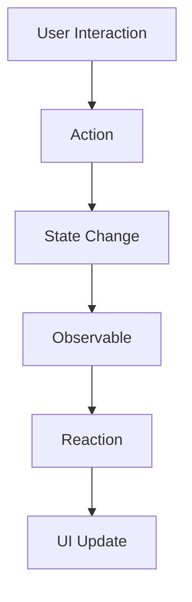

## 9.7 MobX Pattern

### Introduction to MobX

MobX is a popular state management library that brings reactive programming to Flutter applications. It emphasizes simplicity and scalability, making it an excellent choice for developers looking to manage state in a clean and efficient manner. MobX allows you to create applications where the UI automatically updates in response to state changes, reducing the need for manual UI refreshes and complex state management logic.

### Key Concepts of MobX

Before diving into implementation, let's explore the core concepts of MobX:

- **Observables**: These are the reactive data sources in MobX. When an observable changes, any observers that depend on it are automatically updated.
- **Actions**: These are the functions that modify the state. By wrapping state changes in actions, MobX ensures that all state modifications are tracked and can trigger reactions.
- **Reactions**: These are the mechanisms that respond to changes in observables. They ensure that the UI or any other dependent logic is updated when the state changes.
- **Derivations**: These are values that are derived from observables. They are automatically recalculated when the observables they depend on change.

### Implementing MobX in Flutter

#### Setting Up MobX

To get started with MobX in Flutter, you need to add the necessary dependencies to your `pubspec.yaml` file:

```yaml
dependencies:
  flutter:
    sdk: flutter
  mobx: ^2.0.0
  flutter_mobx: ^2.0.0

dev_dependencies:
  build_runner: ^2.0.0
  mobx_codegen: ^2.0.0
```

After adding these dependencies, run `flutter pub get` to install them.

#### Creating Observables

Observables are the backbone of MobX. They hold the state of your application. To create an observable, you define a class with fields annotated with `@observable`.

```dart
import 'package:mobx/mobx.dart';

part 'counter.g.dart';

class Counter = _Counter with _$Counter;

abstract class _Counter with Store {
  @observable
  int value = 0;

  @action
  void increment() {
    value++;
  }
}
```

In this example, `value` is an observable, and `increment` is an action that modifies the state.

#### Using Code Generators

MobX uses code generation to reduce boilerplate. The `build_runner` and `mobx_codegen` packages are used to generate the necessary code. Run the following command to generate the code:

```bash
flutter pub run build_runner build
```

This command generates a `counter.g.dart` file that contains the necessary code to make the `Counter` class reactive.

#### Observing State Changes

To observe state changes and update the UI, use the `Observer` widget from the `flutter_mobx` package. The `Observer` widget automatically rebuilds when the observables it depends on change.

```dart
import 'package:flutter/material.dart';
import 'package:flutter_mobx/flutter_mobx.dart';

class CounterWidget extends StatelessWidget {
  final Counter counter = Counter();

  @override
  Widget build(BuildContext context) {
    return Scaffold(
      appBar: AppBar(
        title: Text('MobX Counter'),
      ),
      body: Center(
        child: Observer(
          builder: (_) => Text(
            '${counter.value}',
            style: TextStyle(fontSize: 40),
          ),
        ),
      ),
      floatingActionButton: FloatingActionButton(
        onPressed: counter.increment,
        child: Icon(Icons.add),
      ),
    );
  }
}
```

In this example, the `Observer` widget listens to changes in the `counter.value` observable and rebuilds the `Text` widget when the value changes.

### Use Cases and Examples

#### High-Reactivity Apps

MobX is particularly useful in applications where the state changes frequently and needs to be reflected in the UI immediately. For example, in a real-time chat application, MobX can be used to update the chat interface as new messages arrive.

```dart
@observable
ObservableList<String> messages = ObservableList<String>();

@action
void addMessage(String message) {
  messages.add(message);
}
```

In this example, `messages` is an observable list, and `addMessage` is an action that adds a new message to the list. The UI can use an `Observer` widget to display the list of messages and automatically update when a new message is added.

#### Minimal Boilerplate

MobX's use of code generation significantly reduces the amount of boilerplate code required to manage state. This allows developers to focus on building features rather than writing repetitive state management logic.

### Visualizing MobX

To better understand how MobX works, let's visualize the flow of data and state changes in a Flutter application using MobX.



**Diagram Description**: This diagram illustrates the flow of data in a MobX-powered Flutter application. User interactions trigger actions, which change the state. The state change updates observables, which in turn trigger reactions that update the UI.

### Design Considerations

When using MobX, consider the following:

- **Simplicity**: MobX is designed to be simple and intuitive. It allows you to manage state without complex boilerplate code.
- **Scalability**: MobX scales well with the size of your application. As your app grows, MobX can handle more complex state management scenarios.
- **Performance**: MobX is optimized for performance. It only updates the parts of the UI that depend on the changed state, minimizing unnecessary rebuilds.

### Differences and Similarities

MobX is often compared to other state management solutions like Provider, Redux, and BLoC. Here's how MobX differs:

- **MobX vs. Provider**: MobX provides a more reactive approach to state management, while Provider is more declarative.
- **MobX vs. Redux**: MobX is simpler and requires less boilerplate than Redux. Redux is more suited for applications that need a strict unidirectional data flow.
- **MobX vs. BLoC**: MobX is more flexible and easier to use than BLoC, which requires more setup and boilerplate.

### Try It Yourself

To get hands-on experience with MobX, try modifying the `Counter` example to include a decrement action. Add a button to the UI that decreases the counter value when pressed. Experiment with adding more observables and actions to see how MobX handles more complex state management scenarios.

### Knowledge Check

- What are the core concepts of MobX?
- How does MobX handle state changes and UI updates?
- What are the benefits of using MobX in a Flutter application?

### Embrace the Journey

Remember, mastering state management is a journey. MobX offers a powerful and flexible way to manage state in Flutter applications. As you continue to explore MobX, you'll discover new ways to build responsive and scalable apps. Keep experimenting, stay curious, and enjoy the journey!

## Quiz Time!



### What is the primary purpose of MobX in Flutter?

- [x] To provide a reactive state management solution
- [ ] To handle HTTP requests
- [ ] To manage animations
- [ ] To perform data serialization

> **Explanation:** MobX is primarily used for reactive state management in Flutter applications.

### Which MobX concept is responsible for holding the state of the application?

- [x] Observables
- [ ] Actions
- [ ] Reactions
- [ ] Derivations

> **Explanation:** Observables are the reactive data sources in MobX that hold the state of the application.

### What is the role of actions in MobX?

- [x] To modify the state
- [ ] To observe state changes
- [ ] To update the UI
- [ ] To generate code

> **Explanation:** Actions are functions that modify the state in MobX.

### How does MobX ensure the UI updates when the state changes?

- [x] Through reactions
- [ ] Through manual refreshes
- [ ] Through HTTP requests
- [ ] Through animations

> **Explanation:** Reactions in MobX respond to changes in observables and ensure the UI is updated.

### What is the benefit of using code generators in MobX?

- [x] To reduce boilerplate code
- [ ] To increase application size
- [ ] To slow down development
- [ ] To complicate the codebase

> **Explanation:** Code generators in MobX help reduce boilerplate code, making development faster and cleaner.

### Which widget is used in Flutter to observe state changes in MobX?

- [x] Observer
- [ ] StreamBuilder
- [ ] FutureBuilder
- [ ] ListView

> **Explanation:** The `Observer` widget in Flutter is used to observe state changes in MobX.

### How does MobX compare to Redux in terms of complexity?

- [x] MobX is simpler and requires less boilerplate
- [ ] MobX is more complex and requires more boilerplate
- [ ] MobX and Redux have the same complexity
- [ ] MobX is not used for state management

> **Explanation:** MobX is simpler and requires less boilerplate compared to Redux.

### What is a common use case for MobX in Flutter applications?

- [x] High-reactivity apps where state changes frequently
- [ ] Low-reactivity apps with static content
- [ ] Apps that do not require state management
- [ ] Apps that only use local storage

> **Explanation:** MobX is ideal for high-reactivity apps where state changes frequently and needs to be reflected in the UI.

### Which of the following is NOT a core concept of MobX?

- [ ] Observables
- [ ] Actions
- [ ] Reactions
- [x] Streams

> **Explanation:** Streams are not a core concept of MobX. MobX uses observables, actions, and reactions.

### True or False: MobX can only be used in Flutter applications.

- [ ] True
- [x] False

> **Explanation:** False. MobX can be used in various applications, not just Flutter, as it is a general-purpose state management library.


