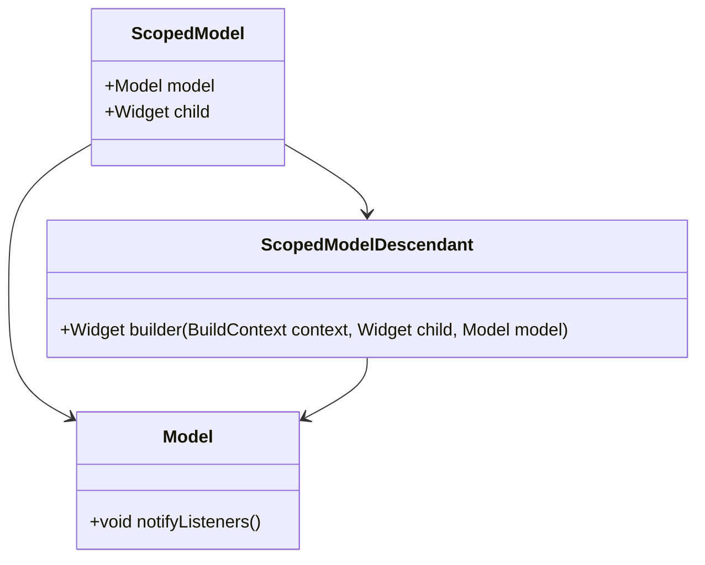

## 9.8 Scoped Model Pattern

State management is a crucial aspect of Flutter development, and the Scoped Model Pattern is one of the earlier solutions that developers used to manage state in Flutter applications. Although newer patterns like Provider, BLoC, and Riverpod have gained popularity, understanding Scoped Model provides valuable insights into the evolution of state management in Flutter. In this section, we will delve into the Scoped Model Pattern, its implementation, use cases, and examples.

### An Older State Management Solution

The Scoped Model Pattern is built on top of Flutter's `InheritedWidget`, which allows widgets to access shared data efficiently. It was one of the first attempts to simplify state management in Flutter and is suitable for small to medium-sized applications with simple state management needs. While it may not be the best choice for large-scale applications today, it remains a useful tool for quick prototyping and educational purposes.

### Implementing ScopedModel

To implement the Scoped Model Pattern, you need to define models by extending the `Model` class and access them using `ScopedModelDescendant`. Let's explore these steps in detail.

#### Defining Models

The first step in using Scoped Model is to define your models. A model in Scoped Model is a class that extends the `Model` class provided by the `scoped_model` package. This class holds the state and business logic of your application.

```dart
import 'package:scoped_model/scoped_model.dart';

// Define a CounterModel that extends Model
class CounterModel extends Model {
  int _counter = 0;

  int get counter => _counter;

  void increment() {
    _counter++;
    notifyListeners(); // Notify listeners when the state changes
  }
}
```

In this example, we define a `CounterModel` that holds a simple counter state. The `increment` method updates the counter and calls `notifyListeners()` to inform any listeners that the state has changed.

#### Accessing Models

Once you have defined your models, you need to provide them to your widget tree and access them using `ScopedModelDescendant`. The `ScopedModel` widget is used to provide the model to the widget tree.

```dart
import 'package:flutter/material.dart';
import 'package:scoped_model/scoped_model.dart';

void main() {
  runApp(MyApp());
}

class MyApp extends StatelessWidget {
  @override
  Widget build(BuildContext context) {
    return ScopedModel<CounterModel>(
      model: CounterModel(),
      child: MaterialApp(
        home: CounterScreen(),
      ),
    );
  }
}

class CounterScreen extends StatelessWidget {
  @override
  Widget build(BuildContext context) {
    return Scaffold(
      appBar: AppBar(
        title: Text('Scoped Model Example'),
      ),
      body: Center(
        child: ScopedModelDescendant<CounterModel>(
          builder: (context, child, model) {
            return Text(
              'Counter: ${model.counter}',
              style: TextStyle(fontSize: 24.0),
            );
          },
        ),
      ),
      floatingActionButton: FloatingActionButton(
        onPressed: () => ScopedModel.of<CounterModel>(context).increment(),
        child: Icon(Icons.add),
      ),
    );
  }
}
```

In this example, we use `ScopedModel` to provide the `CounterModel` to the widget tree. The `CounterScreen` widget accesses the model using `ScopedModelDescendant`, which rebuilds the widget whenever the model's state changes. The floating action button increments the counter by calling the `increment` method on the model.

### Use Cases and Examples

The Scoped Model Pattern is suitable for small to medium-sized applications with simple state management needs. It is also a great choice for quick prototyping before scaling to more robust patterns like Provider or BLoC.

#### Small to Medium Apps

For applications that do not require complex state management, Scoped Model provides a straightforward solution. It allows you to manage state without the overhead of more complex patterns, making it ideal for smaller projects.

#### Quick Prototyping

When you need to quickly prototype an application, Scoped Model offers a simple and effective way to manage state. Its ease of use and minimal setup make it a great choice for getting up and running quickly.

### Visualizing Scoped Model Pattern

To better understand how the Scoped Model Pattern works, let's visualize the relationship between the different components using a class diagram.



In this diagram, we see that `ScopedModel` provides a `Model` to the widget tree, and `ScopedModelDescendant` accesses the `Model` to build widgets based on its state.

### Design Considerations

When using the Scoped Model Pattern, consider the following:

- **Simplicity**: Scoped Model is simple to implement and understand, making it ideal for beginners and small projects.
- **Performance**: While suitable for small applications, Scoped Model may not scale well for larger applications due to its reliance on `InheritedWidget`.
- **Deprecation**: With the advent of newer state management solutions like Provider and Riverpod, Scoped Model is considered outdated for new projects.

### Differences and Similarities

Scoped Model is often compared to Provider, as both are built on top of `InheritedWidget`. However, Provider offers more flexibility and better performance for larger applications. Scoped Model is simpler and more straightforward, making it a good choice for smaller projects or quick prototypes.

### Try It Yourself

To get hands-on experience with the Scoped Model Pattern, try modifying the code examples provided. Here are some suggestions:

- **Add a Decrement Button**: Extend the `CounterModel` to include a `decrement` method and add a button to decrement the counter.
- **Multiple Models**: Define additional models for different pieces of state and provide them to the widget tree.
- **Nested Scoped Models**: Experiment with nesting `ScopedModel` widgets to manage different pieces of state independently.

### Knowledge Check

Before moving on, let's summarize the key takeaways:

- The Scoped Model Pattern is an older state management solution built on top of `InheritedWidget`.
- It is suitable for small to medium-sized applications with simple state management needs.
- Scoped Model is easy to implement and ideal for quick prototyping.
- While useful for educational purposes, it is considered outdated for new projects.

### Embrace the Journey

Remember, mastering state management in Flutter is a journey. As you explore different patterns, you'll gain a deeper understanding of how to manage state effectively in your applications. Keep experimenting, stay curious, and enjoy the journey!

## Quiz Time!



### What is the primary purpose of the Scoped Model Pattern in Flutter?

- [x] To manage state in small to medium-sized applications
- [ ] To handle complex animations
- [ ] To optimize network requests
- [ ] To manage database connections

> **Explanation:** The Scoped Model Pattern is primarily used for managing state in small to medium-sized applications.

### Which class must a model extend in the Scoped Model Pattern?

- [ ] StatefulWidget
- [ ] StatelessWidget
- [x] Model
- [ ] ChangeNotifier

> **Explanation:** In the Scoped Model Pattern, a model must extend the `Model` class provided by the `scoped_model` package.

### How do you notify listeners of state changes in a Scoped Model?

- [ ] Call `setState()`
- [x] Call `notifyListeners()`
- [ ] Use `StreamController`
- [ ] Use `Future`

> **Explanation:** In Scoped Model, you call `notifyListeners()` to notify listeners of state changes.

### What widget is used to provide a model to the widget tree in Scoped Model?

- [ ] Provider
- [ ] InheritedWidget
- [x] ScopedModel
- [ ] StreamBuilder

> **Explanation:** The `ScopedModel` widget is used to provide a model to the widget tree in Scoped Model.

### Which widget is used to access a model in the Scoped Model Pattern?

- [ ] FutureBuilder
- [x] ScopedModelDescendant
- [ ] StreamBuilder
- [ ] InheritedWidget

> **Explanation:** The `ScopedModelDescendant` widget is used to access a model in the Scoped Model Pattern.

### What is a key advantage of using Scoped Model for quick prototyping?

- [x] Simplicity and minimal setup
- [ ] Advanced performance optimization
- [ ] Built-in database support
- [ ] Automatic code generation

> **Explanation:** Scoped Model offers simplicity and minimal setup, making it ideal for quick prototyping.

### What is a limitation of the Scoped Model Pattern for large applications?

- [ ] Too complex to implement
- [x] May not scale well
- [ ] Requires extensive configuration
- [ ] Lacks documentation

> **Explanation:** The Scoped Model Pattern may not scale well for large applications due to its reliance on `InheritedWidget`.

### Which newer state management solution is often compared to Scoped Model?

- [ ] Redux
- [x] Provider
- [ ] MobX
- [ ] GetX

> **Explanation:** Provider is often compared to Scoped Model as both are built on top of `InheritedWidget`.

### True or False: Scoped Model is considered outdated for new projects.

- [x] True
- [ ] False

> **Explanation:** With the advent of newer state management solutions, Scoped Model is considered outdated for new projects.

### What method is used to increment a counter in the provided `CounterModel` example?

- [ ] decrement()
- [ ] reset()
- [x] increment()
- [ ] add()

> **Explanation:** The `increment()` method is used to increment the counter in the `CounterModel` example.


