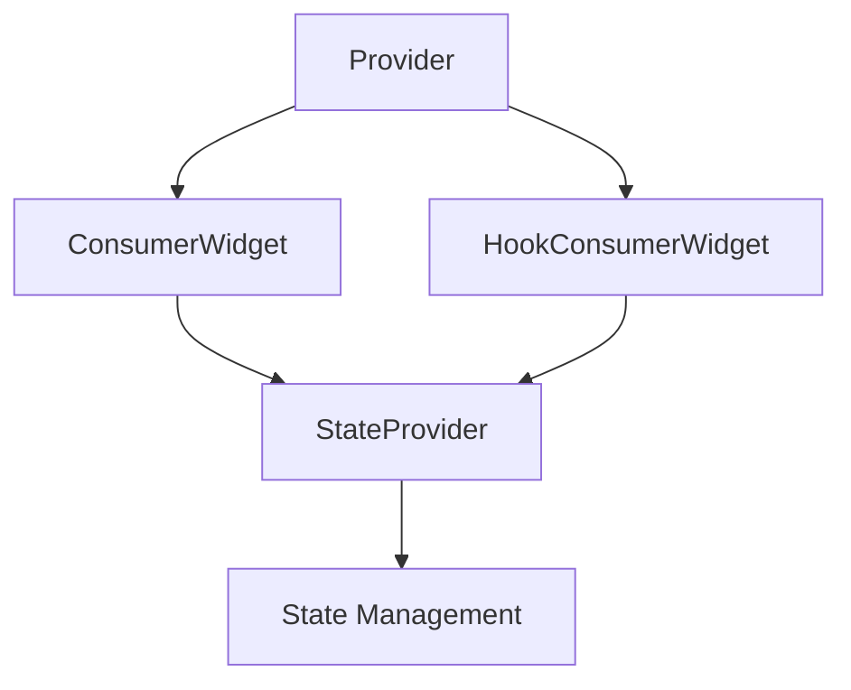

## 9.9 Riverpod State Management

State management is a crucial aspect of Flutter development, and choosing the right solution can significantly impact the scalability and maintainability of your application. In this section, we delve into Riverpod, a modern state management library that offers a robust alternative to the traditional Provider package. Riverpod enhances safety and flexibility, making it an excellent choice for complex Flutter applications.

### A Modern Provider Alternative

Riverpod is designed to address some of the limitations of the Provider package. It introduces a more flexible and safer approach to state management, leveraging Dart's powerful language features. Riverpod is built with the following goals in mind:

- **Improved Safety**: Riverpod eliminates common pitfalls associated with Provider, such as context misuse and dependency injection issues.
- **Flexibility**: It supports a wide range of use cases, from simple state management to complex dependency graphs.
- **Testability**: Riverpod's architecture makes it easier to test individual components in isolation.

Let's explore how to implement Riverpod in your Flutter applications.

### Implementing Riverpod

#### Defining Providers

In Riverpod, a provider is a unit of state or logic that can be consumed by widgets. Providers are defined using the `Provider` class and its variants, such as `StateProvider`, `FutureProvider`, and `StreamProvider`. Each provider type serves a specific purpose:

- **Provider**: Used for immutable state or logic.
- **StateProvider**: Manages mutable state.
- **FutureProvider**: Handles asynchronous operations that return a `Future`.
- **StreamProvider**: Manages streams of data.

Here's an example of defining a simple `StateProvider`:

```dart
import 'package:flutter_riverpod/flutter_riverpod.dart';

// Define a StateProvider for managing an integer counter
final counterProvider = StateProvider<int>((ref) => 0);
```

In this example, `counterProvider` is a `StateProvider` that initializes the counter to zero. The `ref` parameter provides access to other providers and allows for dependency injection.

#### Consuming Providers

To consume a provider in Riverpod, you can use `ConsumerWidget` or hooks. `ConsumerWidget` is a widget that rebuilds when the provider's state changes, while hooks provide a more functional approach to state management.

Here's how to use `ConsumerWidget` to consume the `counterProvider`:

```dart
import 'package:flutter/material.dart';
import 'package:flutter_riverpod/flutter_riverpod.dart';

class CounterWidget extends ConsumerWidget {
  @override
  Widget build(BuildContext context, WidgetRef ref) {
    // Watch the counterProvider to get the current counter value
    final counter = ref.watch(counterProvider);

    return Scaffold(
      appBar: AppBar(title: Text('Counter')),
      body: Center(
        child: Text('Counter: $counter', style: TextStyle(fontSize: 24)),
      ),
      floatingActionButton: FloatingActionButton(
        onPressed: () {
          // Increment the counter using the provider's state
          ref.read(counterProvider.notifier).state++;
        },
        child: Icon(Icons.add),
      ),
    );
  }
}
```

In this example, `ref.watch(counterProvider)` listens for changes to the `counterProvider` and rebuilds the widget when the counter value changes. The `FloatingActionButton` increments the counter by accessing the provider's state through `ref.read(counterProvider.notifier).state`.

#### Using Hooks

Riverpod also supports hooks, which provide a more functional approach to consuming providers. Hooks are particularly useful for managing complex state logic.

Here's an example of using hooks with Riverpod:

```dart
import 'package:flutter/material.dart';
import 'package:flutter_hooks/flutter_hooks.dart';
import 'package:flutter_riverpod/flutter_riverpod.dart';

class CounterHookWidget extends HookConsumerWidget {
  @override
  Widget build(BuildContext context, WidgetRef ref) {
    // Use useProvider hook to watch the counterProvider
    final counter = useProvider(counterProvider);

    return Scaffold(
      appBar: AppBar(title: Text('Counter with Hooks')),
      body: Center(
        child: Text('Counter: $counter', style: TextStyle(fontSize: 24)),
      ),
      floatingActionButton: FloatingActionButton(
        onPressed: () {
          // Increment the counter using the provider's state
          ref.read(counterProvider.notifier).state++;
        },
        child: Icon(Icons.add),
      ),
    );
  }
}
```

In this example, `useProvider(counterProvider)` is used to watch the `counterProvider` and rebuild the widget when the counter value changes.

### Use Cases and Examples

Riverpod is well-suited for a variety of use cases, from simple applications to large, complex systems. Let's explore some scenarios where Riverpod shines.

#### Large Applications with Complex Dependency Graphs

In large applications, managing dependencies between different parts of the application can become challenging. Riverpod's architecture simplifies this process by allowing you to define and manage dependencies explicitly.

Consider an application with multiple features, each with its own state and logic. Riverpod allows you to define providers for each feature and compose them as needed. This modular approach makes it easier to manage dependencies and scale the application.

Here's an example of defining providers for different features:

```dart
// Define a provider for user authentication
final authProvider = Provider<AuthService>((ref) {
  return AuthService();
});

// Define a provider for fetching user data
final userDataProvider = FutureProvider<User>((ref) async {
  final authService = ref.read(authProvider);
  return await authService.fetchUserData();
});
```

In this example, `authProvider` provides an instance of `AuthService`, and `userDataProvider` fetches user data using the authentication service. This setup allows you to manage dependencies between providers explicitly.

#### Testing and Modularity

Riverpod's architecture makes it easier to test individual components in isolation. By defining providers as pure functions, you can test them without relying on the Flutter framework.

Here's an example of testing a provider:

```dart
import 'package:flutter_riverpod/flutter_riverpod.dart';
import 'package:flutter_test/flutter_test.dart';

// Define a provider for a simple counter
final counterProvider = StateProvider<int>((ref) => 0);

void main() {
  test('CounterProvider should start with 0', () {
    final container = ProviderContainer();
    final counter = container.read(counterProvider);

    expect(counter, 0);
  });

  test('CounterProvider should increment', () {
    final container = ProviderContainer();
    final counterNotifier = container.read(counterProvider.notifier);

    counterNotifier.state++;
    expect(counterNotifier.state, 1);
  });
}
```

In this example, we use `ProviderContainer` to create an isolated environment for testing the `counterProvider`. This approach allows you to test providers without relying on the Flutter framework, improving testability and modularity.

### Visualizing Riverpod's Architecture

To better understand Riverpod's architecture, let's visualize the flow of data and dependencies using a Mermaid.js diagram.



**Diagram Description**: This diagram illustrates the flow of data and dependencies in Riverpod. Providers supply data to `ConsumerWidget` and `HookConsumerWidget`, which manage state using `StateProvider`.

### Design Considerations

When using Riverpod, consider the following design considerations:

- **Provider Types**: Choose the appropriate provider type based on your use case. Use `StateProvider` for mutable state, `FutureProvider` for asynchronous operations, and `StreamProvider` for streams of data.
- **Dependency Management**: Define dependencies explicitly to improve modularity and testability. Use `ref.read` and `ref.watch` to manage dependencies between providers.
- **Performance**: Riverpod is designed to be efficient, but be mindful of performance when managing large dependency graphs. Use `ProviderContainer` to isolate providers and improve performance.

### Differences and Similarities

Riverpod and Provider share some similarities, but they also have key differences:

- **Similarities**: Both Riverpod and Provider are used for state management in Flutter applications. They allow you to define and consume providers to manage state and logic.
- **Differences**: Riverpod offers improved safety and flexibility over Provider. It eliminates common pitfalls, such as context misuse, and provides a more modular architecture for managing dependencies.

### Try It Yourself

To get hands-on experience with Riverpod, try modifying the code examples provided in this section. Experiment with different provider types, such as `FutureProvider` and `StreamProvider`, and explore how they can be used to manage state in your Flutter applications.

### Knowledge Check

Before we conclude, let's summarize the key takeaways from this section:

- Riverpod is a modern state management library for Flutter that offers improved safety and flexibility over Provider.
- Providers are defined using classes like `Provider`, `StateProvider`, `FutureProvider`, and `StreamProvider`.
- Riverpod supports both `ConsumerWidget` and hooks for consuming providers.
- Riverpod is well-suited for large applications with complex dependency graphs and improves testability and modularity.

### Embrace the Journey

Remember, mastering state management is a journey. As you continue to explore Riverpod and other state management solutions, you'll gain a deeper understanding of how to build scalable and maintainable Flutter applications. Keep experimenting, stay curious, and enjoy the journey!

## Quiz Time!



### What is the primary advantage of using Riverpod over Provider?

- [x] Improved safety and flexibility
- [ ] Better performance
- [ ] Easier to learn
- [ ] More popular

> **Explanation:** Riverpod offers improved safety and flexibility over Provider, addressing common pitfalls and providing a more modular architecture.

### Which provider type is used for managing mutable state in Riverpod?

- [ ] Provider
- [x] StateProvider
- [ ] FutureProvider
- [ ] StreamProvider

> **Explanation:** `StateProvider` is used for managing mutable state in Riverpod.

### How can you consume a provider in Riverpod?

- [x] Using ConsumerWidget or hooks
- [ ] Using setState()
- [ ] Using InheritedWidget
- [ ] Using Bloc

> **Explanation:** In Riverpod, you can consume a provider using `ConsumerWidget` or hooks.

### What is the purpose of the `ref` parameter in a provider definition?

- [ ] To access the widget tree
- [x] To provide access to other providers and manage dependencies
- [ ] To manage state directly
- [ ] To handle asynchronous operations

> **Explanation:** The `ref` parameter provides access to other providers and allows for dependency management.

### Which of the following is NOT a type of provider in Riverpod?

- [ ] Provider
- [ ] StateProvider
- [x] BlocProvider
- [ ] FutureProvider

> **Explanation:** `BlocProvider` is not a type of provider in Riverpod. It is used in the Bloc library.

### What is the benefit of using `ProviderContainer` in testing?

- [x] It creates an isolated environment for testing providers
- [ ] It improves performance
- [ ] It simplifies code
- [ ] It automatically generates test cases

> **Explanation:** `ProviderContainer` creates an isolated environment for testing providers, improving testability.

### How does Riverpod improve testability?

- [ ] By providing built-in test cases
- [x] By allowing providers to be tested in isolation
- [ ] By simplifying the widget tree
- [ ] By reducing code complexity

> **Explanation:** Riverpod improves testability by allowing providers to be tested in isolation, without relying on the Flutter framework.

### What is a common use case for `FutureProvider`?

- [ ] Managing mutable state
- [x] Handling asynchronous operations that return a Future
- [ ] Managing streams of data
- [ ] Providing immutable state

> **Explanation:** `FutureProvider` is used for handling asynchronous operations that return a `Future`.

### What does the `useProvider` hook do in Riverpod?

- [ ] It creates a new provider
- [x] It watches a provider and rebuilds the widget when the provider's state changes
- [ ] It manages state directly
- [ ] It handles asynchronous operations

> **Explanation:** The `useProvider` hook watches a provider and rebuilds the widget when the provider's state changes.

### True or False: Riverpod supports both `ConsumerWidget` and hooks for consuming providers.

- [x] True
- [ ] False

> **Explanation:** Riverpod supports both `ConsumerWidget` and hooks for consuming providers, offering flexibility in state management.




