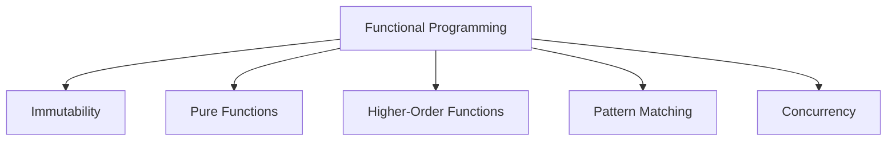
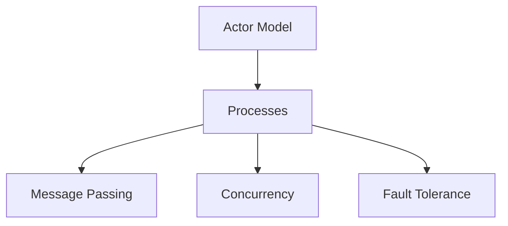

## 1.1. What Are Design Patterns in Elixir?

### Defining Design Patterns in the Elixir Context

Design patterns are a crucial aspect of software engineering, providing reusable solutions to common problems encountered in software design. In the context of Elixir, a functional programming language, design patterns take on a unique form, adapting to the paradigms and idioms of functional programming. Let's delve into what design patterns mean in Elixir and how they manifest in this powerful language.

#### Understanding Design Patterns as Reusable Solutions

Design patterns are essentially templates or blueprints for solving recurring design problems. They encapsulate best practices and provide a proven approach to tackling specific challenges in software development. In Elixir, design patterns help developers create robust, scalable, and maintainable applications by offering a structured approach to problem-solving.

##### Key Characteristics of Design Patterns

- **Reusability**: Design patterns are designed to be reused across different projects and contexts, saving time and effort in the development process.
- **Abstraction**: They provide an abstract solution that can be adapted to specific needs, allowing for flexibility and customization.
- **Documentation**: Design patterns serve as a form of documentation, offering a clear and concise explanation of how to solve a particular problem.

#### How Design Patterns Manifest in Functional Programming Languages Like Elixir

In functional programming languages like Elixir, design patterns often differ from those found in object-oriented languages. This is due to the fundamental differences in how these paradigms approach software design. Let's explore how design patterns are adapted to fit the functional programming model.

##### Immutability and Pure Functions

One of the core principles of functional programming is immutability, which means that data cannot be changed once it's created. This leads to the use of pure functions, which always produce the same output for the same input and have no side effects. Design patterns in Elixir often leverage these concepts to ensure predictable and reliable code.

##### Higher-Order Functions and Function Composition

Elixir's support for higher-order functions and function composition allows developers to create modular and reusable code. Design patterns in Elixir frequently utilize these features to build complex functionality from simple, composable functions.

##### Pattern Matching and Guards

Pattern matching and guards are powerful features in Elixir that enable concise and expressive code. Design patterns in Elixir often incorporate these features to handle different cases and conditions elegantly.

##### Concurrency and the Actor Model

Elixir's concurrency model, based on the actor model, provides a unique approach to handling concurrent processes. Design patterns in Elixir often focus on leveraging this model to build scalable and fault-tolerant systems.

### The Role of Design Patterns in Software Development

Design patterns play a vital role in software development, offering numerous benefits that enhance the overall quality and effectiveness of the codebase.

#### Enhancing Code Readability, Maintainability, and Scalability

Design patterns contribute to code readability by providing a clear and consistent structure that developers can easily understand. They also improve maintainability by promoting best practices and reducing the likelihood of errors. Additionally, design patterns facilitate scalability by offering solutions that can handle increased complexity and workload.

##### Code Readability

- **Consistency**: Design patterns provide a consistent approach to solving problems, making the code easier to read and understand.
- **Clarity**: By using well-known patterns, developers can quickly grasp the intent and functionality of the code.

##### Code Maintainability

- **Best Practices**: Design patterns encapsulate best practices, reducing the likelihood of errors and making the code easier to maintain.
- **Modularity**: Patterns promote modular design, allowing for easier updates and modifications.

##### Code Scalability

- **Efficiency**: Design patterns offer efficient solutions that can handle increased complexity and workload.
- **Flexibility**: Patterns provide flexible solutions that can be adapted to changing requirements.

#### Facilitating Communication Among Developers Through a Shared Vocabulary

Design patterns serve as a shared vocabulary among developers, facilitating communication and collaboration. By using well-known patterns, developers can quickly convey complex ideas and solutions without the need for lengthy explanations.

##### Shared Vocabulary

- **Common Language**: Design patterns provide a common language that developers can use to communicate effectively.
- **Collaboration**: By using patterns, developers can collaborate more efficiently, reducing misunderstandings and improving productivity.

### Code Examples

To illustrate the concepts discussed, let's explore some code examples that demonstrate how design patterns manifest in Elixir.

#### Example 1: Using Higher-Order Functions

```elixir
# Define a higher-order function that takes a function as an argument
defmodule Math do
  def apply_operation(a, b, operation) do
    operation.(a, b)
  end
end

# Define some basic operations
add = fn a, b -> a + b end
subtract = fn a, b -> a - b end

# Use the higher-order function
IO.puts Math.apply_operation(5, 3, add)       # Output: 8
IO.puts Math.apply_operation(5, 3, subtract)  # Output: 2
```

In this example, we define a higher-order function `apply_operation` that takes a function as an argument. We then define some basic operations (`add` and `subtract`) and use the higher-order function to apply these operations to the given arguments.

#### Example 2: Leveraging Pattern Matching

```elixir
defmodule Shape do
  def area({:circle, radius}) do
    :math.pi() * radius * radius
  end

  def area({:rectangle, width, height}) do
    width * height
  end
end

# Calculate the area of different shapes
IO.puts Shape.area({:circle, 5})          # Output: 78.53981633974483
IO.puts Shape.area({:rectangle, 4, 6})    # Output: 24
```

In this example, we use pattern matching to define different implementations of the `area` function for different shapes. This allows us to handle different cases elegantly and concisely.

### Visualizing Design Patterns in Elixir

To further enhance our understanding, let's visualize some of the key concepts and patterns in Elixir using diagrams.

#### Diagram 1: Functional Programming Paradigm



This diagram illustrates the core concepts of the functional programming paradigm, which are integral to understanding design patterns in Elixir.

#### Diagram 2: Actor Model in Elixir



This diagram highlights the actor model, a key aspect of Elixir's concurrency model, which is often leveraged in design patterns to build scalable and fault-tolerant systems.

### References and Links

For further reading on design patterns and functional programming in Elixir, consider exploring the following resources:

- [Elixir School](https://elixirschool.com/en/): A comprehensive resource for learning Elixir and its ecosystem.
- [Functional Programming in Elixir](https://pragprog.com/titles/cdc-elixir/functional-programming-in-elixir/): A book that delves into functional programming concepts in Elixir.
- [Design Patterns in Elixir](https://www.packtpub.com/product/design-patterns-in-elixir/9781788472678): A book that explores various design patterns in Elixir.

### Knowledge Check

Let's test our understanding of design patterns in Elixir with some questions and exercises.

#### Questions

1. What are design patterns, and why are they important in software development?
2. How do design patterns manifest in functional programming languages like Elixir?
3. What are some key characteristics of design patterns?
4. How do design patterns enhance code readability, maintainability, and scalability?
5. How do design patterns facilitate communication among developers?

#### Exercises

1. Implement a higher-order function in Elixir that takes a list and a function as arguments and applies the function to each element of the list.
2. Use pattern matching to implement a function that calculates the perimeter of different shapes (e.g., circle, rectangle, triangle).

### Embrace the Journey

Remember, this is just the beginning of your journey into design patterns in Elixir. As you progress, you'll discover more complex and powerful patterns that will enhance your ability to build scalable and maintainable applications. Keep experimenting, stay curious, and enjoy the journey!

### Quiz: What Are Design Patterns in Elixir?



### What is a design pattern in the context of Elixir?

- [x] A reusable solution to a common problem in software design
- [ ] A specific algorithm for solving a problem
- [ ] A library for building Elixir applications
- [ ] A tool for debugging Elixir code

> **Explanation:** Design patterns are reusable solutions to common problems encountered in software design, providing a structured approach to problem-solving.

### How do design patterns enhance code readability?

- [x] By providing a consistent and clear structure
- [ ] By making the code more complex
- [ ] By adding more lines of code
- [ ] By using obscure syntax

> **Explanation:** Design patterns enhance code readability by providing a consistent and clear structure that developers can easily understand.

### What is a key characteristic of design patterns?

- [x] Reusability
- [ ] Complexity
- [ ] Obscurity
- [ ] Inflexibility

> **Explanation:** Reusability is a key characteristic of design patterns, allowing them to be used across different projects and contexts.

### How do design patterns facilitate communication among developers?

- [x] By providing a shared vocabulary
- [ ] By making the code more complex
- [ ] By adding more lines of code
- [ ] By using obscure syntax

> **Explanation:** Design patterns facilitate communication among developers by providing a shared vocabulary, allowing for efficient collaboration and understanding.

### What is a core principle of functional programming that influences design patterns in Elixir?

- [x] Immutability
- [ ] Mutability
- [ ] Inheritance
- [ ] Polymorphism

> **Explanation:** Immutability is a core principle of functional programming that influences design patterns in Elixir, ensuring predictable and reliable code.

### Which feature of Elixir allows for modular and reusable code?

- [x] Higher-order functions
- [ ] Global variables
- [ ] Inheritance
- [ ] Polymorphism

> **Explanation:** Higher-order functions in Elixir allow for modular and reusable code, enabling developers to build complex functionality from simple, composable functions.

### What is the concurrency model in Elixir based on?

- [x] The actor model
- [ ] The thread model
- [ ] The process model
- [ ] The coroutine model

> **Explanation:** Elixir's concurrency model is based on the actor model, providing a unique approach to handling concurrent processes.

### How do design patterns improve code maintainability?

- [x] By promoting best practices
- [ ] By making the code more complex
- [ ] By adding more lines of code
- [ ] By using obscure syntax

> **Explanation:** Design patterns improve code maintainability by promoting best practices and reducing the likelihood of errors.

### What is a benefit of using design patterns in Elixir?

- [x] Scalability
- [ ] Complexity
- [ ] Obscurity
- [ ] Inflexibility

> **Explanation:** Scalability is a benefit of using design patterns in Elixir, offering solutions that can handle increased complexity and workload.

### True or False: Design patterns are only applicable to object-oriented programming languages.

- [ ] True
- [x] False

> **Explanation:** False. Design patterns are applicable to various programming paradigms, including functional programming languages like Elixir.



By understanding and implementing design patterns in Elixir, you can enhance your ability to build robust, scalable, and maintainable applications. Embrace the journey, and continue exploring the powerful world of Elixir design patterns!

---
