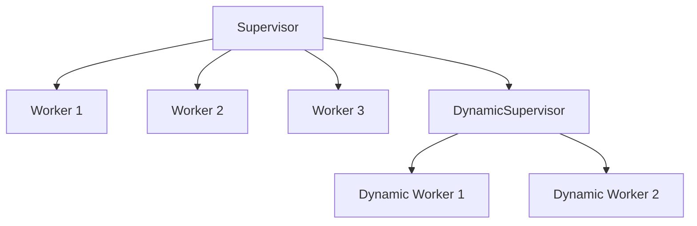

## 1.1. What Are Design Patterns in Elixir?

### Defining Design Patterns in the Elixir Context

Design patterns are a crucial aspect of software architecture, providing reusable solutions to common problems encountered during software development. In the context of Elixir, a functional programming language known for its concurrency and fault-tolerance capabilities, design patterns take on a unique form. They are not merely templates to be applied verbatim, but rather conceptual frameworks that guide developers in crafting efficient, maintainable, and scalable code.

#### Understanding Design Patterns as Reusable Solutions

Design patterns in Elixir, much like in other programming paradigms, serve as a toolkit of best practices. They encapsulate solutions to recurring design challenges, allowing developers to leverage proven strategies rather than reinventing the wheel. This approach not only accelerates the development process but also enhances the quality of the software by promoting consistency and reducing the likelihood of errors.

In functional programming languages like Elixir, design patterns emphasize immutability, statelessness, and the use of higher-order functions. These patterns often revolve around transforming data through pure functions, managing state through processes, and leveraging Elixir's powerful concurrency model to build robust applications.

#### How Design Patterns Manifest in Functional Programming Languages Like Elixir

In Elixir, design patterns manifest through idiomatic constructs that align with the language's functional nature. For instance, instead of traditional object-oriented patterns like Singleton or Factory, Elixir developers might use processes and modules to achieve similar goals.

Consider the Singleton pattern, which ensures a class has only one instance and provides a global point of access to it. In Elixir, this can be achieved using a GenServer, a generic server process that maintains state and handles requests. By starting a single GenServer instance and registering it under a unique name, developers can mimic the Singleton pattern's behavior.

Here's a simple example of a Singleton-like pattern using GenServer in Elixir:

```elixir
defmodule SingletonServer do
  use GenServer

  # Client API

  def start_link(initial_value) do
    GenServer.start_link(__MODULE__, initial_value, name: __MODULE__)
  end

  def get_value do
    GenServer.call(__MODULE__, :get_value)
  end

  def set_value(new_value) do
    GenServer.cast(__MODULE__, {:set_value, new_value})
  end

  # Server Callbacks

  def init(initial_value) do
    {:ok, initial_value}
  end

  def handle_call(:get_value, _from, state) do
    {:reply, state, state}
  end

  def handle_cast({:set_value, new_value}, _state) do
    {:noreply, new_value}
  end
end
```

In this example, `SingletonServer` acts as a Singleton by maintaining a single state that can be accessed and modified through `get_value/0` and `set_value/1` functions. The use of GenServer ensures that the state is managed in a concurrent-safe manner, leveraging Elixir's strengths.

### The Role of Design Patterns in Software Development

Design patterns play a pivotal role in software development by enhancing code readability, maintainability, and scalability. They provide a shared vocabulary for developers, facilitating communication and collaboration within teams.

#### Enhancing Code Readability, Maintainability, and Scalability

One of the primary benefits of using design patterns is the improvement of code readability. By adhering to well-known patterns, developers can quickly understand the structure and intent of the code, even if they are not familiar with the specific implementation. This readability extends to maintainability, as patterns often promote modularity and separation of concerns, making it easier to modify or extend the codebase without introducing bugs.

Scalability is another critical aspect addressed by design patterns. In Elixir, patterns such as the Supervisor tree enable developers to build systems that can gracefully handle increasing loads and recover from failures automatically. By organizing processes into hierarchical trees, Elixir applications can scale horizontally across multiple nodes, taking full advantage of the BEAM virtual machine's capabilities.

#### Facilitating Communication Among Developers Through a Shared Vocabulary

Design patterns also serve as a lingua franca among developers, providing a common set of terms and concepts that transcend individual projects or organizations. This shared vocabulary simplifies discussions about architecture and design, allowing developers to convey complex ideas succinctly.

For example, when a developer mentions using a "PubSub pattern" in an Elixir application, others familiar with design patterns will immediately understand that the application likely involves a publish-subscribe mechanism, possibly implemented using Phoenix.PubSub or similar libraries. This understanding reduces the cognitive load required to grasp the application's architecture and fosters more effective collaboration.

### Visualizing Design Patterns in Elixir

To further illustrate the role of design patterns in Elixir, let's visualize a common pattern: the Supervisor tree. This pattern is fundamental to building fault-tolerant systems in Elixir and is a cornerstone of the OTP framework.


```mermaid
graph TD;
    A[Supervisor] --> B[Worker 1];
    A --> C[Worker 2];
    A --> D[Worker 3];
    A --> E[DynamicSupervisor];
    E --> F[Dynamic Worker 1];
    E --> G[Dynamic Worker 2];
```

In this diagram, we see a Supervisor managing multiple worker processes. The Supervisor is responsible for starting, stopping, and monitoring its child processes, ensuring that the system can recover from failures. The DynamicSupervisor allows for dynamic addition and removal of workers, providing flexibility and scalability.

### Elixir's Unique Features in Design Patterns

Elixir's unique features, such as its lightweight process model and robust concurrency support, make it an ideal language for implementing certain design patterns. The language's emphasis on immutability and pure functions aligns well with functional design principles, encouraging developers to think in terms of data transformation and process orchestration.

#### Differences and Similarities with Other Languages

While many design patterns are universal, their implementation can vary significantly between object-oriented and functional languages. In Elixir, patterns often leverage processes and message passing, contrasting with the class-based structures found in languages like Java or C#. Understanding these differences is crucial for developers transitioning from one paradigm to another, as it allows them to adapt familiar concepts to new contexts.

### Code Examples and Exercises

To solidify your understanding of design patterns in Elixir, let's explore a practical example. We'll implement a simple PubSub system using Elixir processes.

```elixir
defmodule Publisher do
  def start_link do
    spawn_link(__MODULE__, :loop, [Map.new()])
  end

  def loop(subscribers) do
    receive do
      {:subscribe, pid} ->
        loop(Map.put(subscribers, pid, true))
      {:unsubscribe, pid} ->
        loop(Map.delete(subscribers, pid))
      {:publish, message} ->
        Enum.each(Map.keys(subscribers), fn pid ->
          send(pid, {:message, message})
        end)
        loop(subscribers)
    end
  end
end

defmodule Subscriber do
  def start_link do
    spawn_link(__MODULE__, :loop, [])
  end

  def loop do
    receive do
      {:message, message} ->
        IO.puts("Received message: #{message}")
        loop()
    end
  end
end
```

In this example, the `Publisher` module manages a list of subscribers and broadcasts messages to them. Each `Subscriber` process receives and prints messages. This simple implementation demonstrates the core concepts of the PubSub pattern in Elixir.

#### Try It Yourself

Experiment with the code by adding more subscribers, publishing different types of messages, or implementing additional features like message filtering. This hands-on approach will deepen your understanding of how design patterns can be applied in Elixir.

### References and Further Reading

- [Elixir Lang](https://elixir-lang.org/) - Official Elixir website for documentation and resources.
- [Programming Elixir](https://pragprog.com/titles/elixir16/programming-elixir-1-6/) - A comprehensive book on Elixir programming.
- [Design Patterns in Elixir](https://elixirforum.com/t/design-patterns-in-elixir/1234) - Community discussions on Elixir design patterns.

### Knowledge Check

To reinforce your understanding, consider the following questions:

1. What are the key characteristics of design patterns in Elixir?
2. How do Elixir's concurrency features influence the implementation of design patterns?
3. What are the benefits of using design patterns in software development?
4. How does the Supervisor tree pattern contribute to fault tolerance in Elixir applications?
5. In what ways do design patterns facilitate communication among developers?

### Embrace the Journey

As you continue to explore design patterns in Elixir, remember that this is just the beginning. The concepts and techniques you learn here will serve as a foundation for building more complex and resilient applications. Stay curious, keep experimenting, and enjoy the journey of mastering Elixir design patterns!

## Quiz Time!



### What is a design pattern in the context of Elixir?

- [x] A reusable solution to a common problem in software design.
- [ ] A specific syntax rule in Elixir.
- [ ] A type of data structure used in Elixir.
- [ ] A compilation error in Elixir.

> **Explanation:** Design patterns are reusable solutions to common problems in software design, applicable across various programming paradigms, including Elixir.

### How do design patterns enhance software development?

- [x] By improving code readability, maintainability, and scalability.
- [ ] By increasing the complexity of the code.
- [ ] By making the code less secure.
- [ ] By reducing the number of lines of code.

> **Explanation:** Design patterns enhance software development by promoting best practices that improve code readability, maintainability, and scalability.

### What is a common pattern used in Elixir for managing state?

- [x] GenServer
- [ ] Singleton
- [ ] Factory
- [ ] Observer

> **Explanation:** GenServer is a common pattern in Elixir used for managing state and handling requests in a concurrent-safe manner.

### How does the Supervisor tree pattern contribute to Elixir applications?

- [x] By providing fault tolerance and process management.
- [ ] By reducing memory usage.
- [ ] By increasing the execution speed.
- [ ] By simplifying the syntax.

> **Explanation:** The Supervisor tree pattern provides fault tolerance and process management, ensuring that Elixir applications can recover from failures.

### What is the primary benefit of using a shared vocabulary in design patterns?

- [x] Facilitating communication among developers.
- [ ] Increasing the number of design patterns.
- [ ] Reducing the need for documentation.
- [ ] Making the code more complex.

> **Explanation:** A shared vocabulary in design patterns facilitates communication among developers by providing a common set of terms and concepts.

### How do Elixir's unique features influence design patterns?

- [x] By leveraging concurrency and immutability.
- [ ] By making patterns less applicable.
- [ ] By complicating the design process.
- [ ] By reducing the number of available patterns.

> **Explanation:** Elixir's unique features, such as concurrency and immutability, influence the implementation and applicability of design patterns.

### What is the role of processes in Elixir design patterns?

- [x] Managing state and concurrency.
- [ ] Compiling the code.
- [ ] Reducing syntax errors.
- [ ] Increasing execution speed.

> **Explanation:** Processes in Elixir are used to manage state and concurrency, playing a crucial role in design patterns.

### Which of the following is a benefit of using design patterns?

- [x] Promoting code consistency.
- [ ] Increasing code complexity.
- [ ] Reducing the number of developers needed.
- [ ] Making the code less secure.

> **Explanation:** Design patterns promote code consistency by providing standardized solutions to common problems.

### What is the PubSub pattern used for in Elixir?

- [x] Implementing a publish-subscribe mechanism.
- [ ] Managing database connections.
- [ ] Compiling Elixir code.
- [ ] Reducing memory usage.

> **Explanation:** The PubSub pattern in Elixir is used for implementing a publish-subscribe mechanism, allowing for message broadcasting.

### True or False: Design patterns in Elixir are identical to those in object-oriented languages.

- [ ] True
- [x] False

> **Explanation:** Design patterns in Elixir are adapted to the functional programming paradigm and may differ in implementation compared to object-oriented languages.




