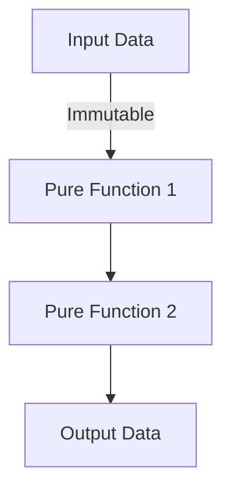

## 1.2. The Functional Programming Paradigm

Functional programming (FP) is a paradigm that treats computation as the evaluation of mathematical functions and avoids changing state or mutable data. In this section, we will delve into the core principles of functional programming, its benefits, and how Elixir, a language built on the Erlang VM (BEAM), embodies these principles.

### Core Principles of Functional Programming

#### Immutability

Immutability is a cornerstone of functional programming. It refers to the concept that data, once created, cannot be changed. Instead of modifying existing data, new data structures are created. This approach leads to several advantages:

- **Predictability**: Since data cannot change, functions that operate on this data are predictable and easier to understand.
- **Concurrency**: Immutability eliminates the need for locks or other synchronization mechanisms, making it easier to write concurrent programs.

**Example:**

```elixir
# Immutable data structure
list = [1, 2, 3]

# Attempting to modify the list
new_list = [0 | list]

IO.inspect(list)      # Output: [1, 2, 3]
IO.inspect(new_list)  # Output: [0, 1, 2, 3]
```

In this example, `list` remains unchanged, and `new_list` is a new list with the added element.

#### Pure Functions

Pure functions are functions where the output value is determined only by its input values, without observable side effects. This means that calling a pure function with the same arguments will always produce the same result.

- **Testability**: Pure functions are easier to test because they do not depend on external state.
- **Composability**: They can be easily composed to build more complex functions.

**Example:**

```elixir
# Pure function
defmodule Math do
  def add(a, b), do: a + b
end

IO.inspect(Math.add(1, 2))  # Output: 3
```

The `add` function is pure because it always returns the same result for the same inputs.

#### First-Class Functions

In functional programming, functions are first-class citizens. This means they can be passed as arguments to other functions, returned as values from other functions, and assigned to variables.

- **Higher-Order Functions**: Functions that take other functions as arguments or return them as results.
- **Function Composition**: Building complex functions by combining simpler ones.

**Example:**

```elixir
# Higher-order function
defmodule ListUtils do
  def apply_to_list(list, func) do
    Enum.map(list, func)
  end
end

# Using a lambda function
IO.inspect(ListUtils.apply_to_list([1, 2, 3], fn x -> x * 2 end))  # Output: [2, 4, 6]
```

Here, `apply_to_list` is a higher-order function that applies a given function to each element in a list.

### Emphasis on Declarative Programming

Functional programming emphasizes declarative programming, where the focus is on what to solve rather than how to solve it. This contrasts with imperative programming, which focuses on explicit sequences of commands.

- **Readability**: Declarative code is often more readable and closer to human reasoning.
- **Maintainability**: Easier to maintain and modify due to its high-level nature.

**Example:**

```elixir
# Declarative approach using Enum
sum = Enum.reduce([1, 2, 3, 4], 0, &(&1 + &2))
IO.inspect(sum)  # Output: 10
```

In this example, we declare what we want to achieve (summing a list) without specifying the step-by-step process.

### Benefits of Functional Programming

#### Easier Reasoning About Code

Functional programming's emphasis on immutability and pure functions makes it easier to reason about code. Since functions do not have side effects, understanding a function's behavior is straightforward.

- **Debugging**: Easier to debug because functions are isolated and predictable.
- **Refactoring**: Safe to refactor since functions do not depend on external state.

#### Improved Concurrency Support

Immutability and the absence of side effects make functional programming languages like Elixir particularly well-suited for concurrent programming.

- **No Race Conditions**: Since data cannot be changed, there are no race conditions.
- **Simplified Concurrency Models**: Easier to implement concurrent processes without worrying about shared state.

### Functional Programming in Elixir

Elixir is a functional programming language that runs on the BEAM VM, known for its concurrency and fault-tolerance capabilities. Elixir embraces functional programming principles, making it a powerful tool for building scalable and maintainable systems.

#### How Elixir Embodies Functional Principles

- **Immutability**: Elixir enforces immutability, ensuring that data structures cannot be changed once created.
- **Pattern Matching**: A powerful feature that allows for concise and expressive code, often used in function definitions and control structures.
- **Concurrency**: Built-in support for lightweight processes and message passing, leveraging the BEAM VM's strengths.

#### Influence of Erlang and the BEAM VM

Elixir inherits many of its features from Erlang, a language designed for building robust, concurrent systems. The BEAM VM provides:

- **Lightweight Processes**: Thousands of processes can run concurrently with minimal overhead.
- **Fault Tolerance**: Built-in mechanisms for handling errors and recovering from failures.

### Code Examples and Exercises

Let's explore some code examples that illustrate these concepts in Elixir.

**Example: Immutability and Pure Functions**

```elixir
defmodule Example do
  # Pure function
  def square(x), do: x * x

  # Using immutability
  def process_list(list) do
    Enum.map(list, &square/1)
  end
end

IO.inspect(Example.process_list([1, 2, 3]))  # Output: [1, 4, 9]
```

**Try It Yourself:**

- Modify the `square` function to cube the numbers instead.
- Create a new function that filters out even numbers from a list using `Enum.filter`.

### Visualizing Functional Programming Concepts

Below is a diagram illustrating the flow of data in a functional program, emphasizing immutability and pure functions.



**Diagram Description:** This flowchart represents how data flows through a series of pure functions, each producing new immutable data.

### References and Further Reading

- [Elixir Official Documentation](https://elixir-lang.org/docs.html)
- [Functional Programming Concepts](https://www.geeksforgeeks.org/functional-programming-paradigm/)
- [Erlang and the BEAM VM](https://www.erlang.org/doc/reference_manual/introduction.html)

### Knowledge Check

- What are the advantages of immutability in functional programming?
- How does Elixir's concurrency model benefit from functional programming principles?

### Embrace the Journey

Remember, functional programming is a journey. As you explore Elixir, you'll discover the power of immutability, pure functions, and concurrency. Keep experimenting, stay curious, and enjoy the journey!

### Quiz: The Functional Programming Paradigm



### What is a pure function?

- [x] A function that returns the same result for the same inputs without side effects.
- [ ] A function that modifies global state.
- [ ] A function that depends on external variables.
- [ ] A function that uses mutable data structures.

> **Explanation:** A pure function's output is determined solely by its input values, with no side effects.

### What is immutability?

- [x] The concept that data cannot be changed once created.
- [ ] The ability to change data at runtime.
- [ ] A feature that allows functions to modify their inputs.
- [ ] A mechanism for handling errors in Elixir.

> **Explanation:** Immutability ensures that data structures cannot be altered after they are created.

### How does Elixir handle concurrency?

- [x] By using lightweight processes and message passing.
- [ ] By using global locks and shared state.
- [ ] By relying on mutable data structures.
- [ ] By using threads and semaphores.

> **Explanation:** Elixir uses lightweight processes and message passing, leveraging the BEAM VM's strengths.

### What is the benefit of using pure functions?

- [x] Easier to test and reason about.
- [ ] They can modify global state.
- [ ] They depend on external variables.
- [ ] They require complex synchronization mechanisms.

> **Explanation:** Pure functions are predictable and isolated, making them easier to test and reason about.

### What is the BEAM VM?

- [x] The virtual machine that runs Erlang and Elixir.
- [ ] A tool for compiling Elixir code.
- [ ] A library for handling concurrency in Elixir.
- [ ] A framework for building web applications.

> **Explanation:** The BEAM VM is the virtual machine that powers Erlang and Elixir, known for its concurrency and fault-tolerance capabilities.

### What is a higher-order function?

- [x] A function that takes other functions as arguments or returns them as results.
- [ ] A function that modifies its input data.
- [ ] A function that depends on global state.
- [ ] A function that uses mutable data structures.

> **Explanation:** Higher-order functions can take other functions as arguments or return them as results.

### What is pattern matching in Elixir?

- [x] A feature that allows for concise and expressive code.
- [ ] A mechanism for modifying data structures.
- [ ] A tool for handling concurrency.
- [ ] A way to manage global state.

> **Explanation:** Pattern matching is a powerful feature in Elixir that allows for concise and expressive code.

### What is the main advantage of immutability in concurrent programs?

- [x] No need for locks or synchronization mechanisms.
- [ ] Easier to modify data structures.
- [ ] Ability to change global state.
- [ ] Simplified error handling.

> **Explanation:** Immutability eliminates the need for locks or synchronization mechanisms, making concurrent programming easier.

### What is the focus of declarative programming?

- [x] Describing what to solve rather than how to solve it.
- [ ] Specifying step-by-step instructions.
- [ ] Modifying global state.
- [ ] Using mutable data structures.

> **Explanation:** Declarative programming focuses on describing what to solve, rather than how to solve it.

### True or False: Elixir allows mutable data structures.

- [ ] True
- [x] False

> **Explanation:** Elixir enforces immutability, meaning data structures cannot be changed once created.


