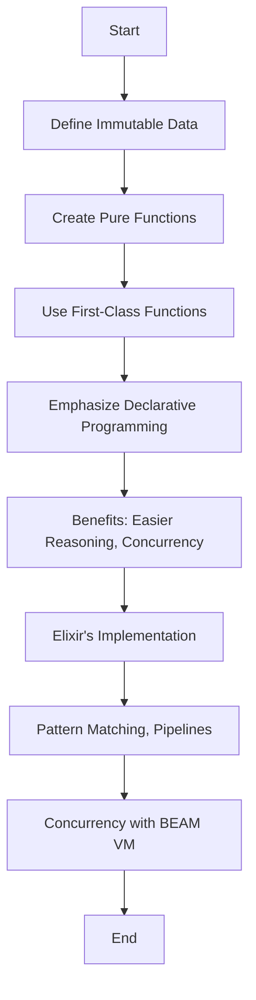

## 1.2. The Functional Programming Paradigm

Functional programming is a programming paradigm that treats computation as the evaluation of mathematical functions and avoids changing state or mutable data. In this section, we will delve into the core principles of functional programming, explore its benefits, and discuss how Elixir, a functional programming language, embodies these principles to provide a robust environment for building scalable and maintainable software systems.

### Core Principles of Functional Programming

Functional programming is built on several key principles that differentiate it from other programming paradigms, such as object-oriented programming. Let's explore these core principles:

#### Immutability

Immutability refers to the concept that once a data structure is created, it cannot be changed. Instead of modifying existing data, new data structures are created with the necessary changes. This principle helps eliminate side effects, making it easier to reason about code behavior.

**Example: Immutable Data Structures**

```elixir
# Define an immutable list
list = [1, 2, 3]

# Attempt to modify the list
new_list = [0 | list]  # Prepend 0 to the list

IO.inspect(list)       # Output: [1, 2, 3]
IO.inspect(new_list)   # Output: [0, 1, 2, 3]
```

In the example above, the original `list` remains unchanged, and a new list `new_list` is created with the additional element.

#### Pure Functions

A pure function is a function where the output value is determined only by its input values, without observable side effects. This means that a pure function will always return the same result given the same input.

**Example: Pure Function**

```elixir
defmodule Math do
  def add(a, b) do
    a + b
  end
end

IO.inspect(Math.add(2, 3))  # Output: 5
IO.inspect(Math.add(2, 3))  # Output: 5
```

The `add` function is pure because it consistently returns the same result for the same inputs.

#### First-Class Functions

First-class functions mean that functions are treated as first-class citizens. They can be passed as arguments to other functions, returned as values from other functions, and assigned to variables.

**Example: First-Class Functions**

```elixir
# Define a function that takes another function as an argument
defmodule Functional do
  def apply_function(func, value) do
    func.(value)
  end
end

# Define a simple function
square = fn x -> x * x end

# Pass the function as an argument
IO.inspect(Functional.apply_function(square, 4))  # Output: 16
```

In this example, the `square` function is passed as an argument to `apply_function`, demonstrating the first-class nature of functions in Elixir.

#### Emphasis on Declarative Programming

Functional programming emphasizes declarative programming, where the focus is on what to do rather than how to do it. This is in contrast to imperative programming, which focuses on describing the steps to achieve a result.

**Example: Declarative vs. Imperative**

```elixir
# Imperative style
sum = 0
for n <- [1, 2, 3, 4, 5] do
  sum = sum + n
end
IO.inspect(sum)  # Output: 15

# Declarative style
sum = Enum.sum([1, 2, 3, 4, 5])
IO.inspect(sum)  # Output: 15
```

The declarative style using `Enum.sum` is more concise and focuses on the result rather than the steps to achieve it.

### Benefits of Functional Programming

Functional programming offers several benefits that make it an attractive choice for modern software development:

#### Easier Reasoning About Code

The absence of side effects and the use of pure functions make it easier to understand and reason about code. Developers can confidently predict the behavior of functions without worrying about external state changes.

#### Improved Concurrency Support

Immutability is a key enabler of concurrency. Since data structures cannot be modified, there is no risk of race conditions or data corruption when multiple processes access the same data. This makes functional programming languages like Elixir well-suited for concurrent and parallel programming.

#### Enhanced Code Reusability

First-class functions and higher-order functions promote code reuse by allowing developers to create generic, reusable components that can be composed in different ways to achieve desired functionality.

#### Simplified Testing and Debugging

Pure functions are deterministic, meaning they always produce the same output for the same input. This makes them easier to test and debug, as there are no hidden dependencies or side effects to consider.

### Functional Programming in Elixir

Elixir is a functional programming language that runs on the Erlang virtual machine (BEAM VM). It embodies the principles of functional programming and offers a powerful platform for building scalable and fault-tolerant systems.

#### How Elixir Embodies Functional Principles

Elixir's syntax and language features are designed to support functional programming concepts:

- **Pattern Matching**: Elixir uses pattern matching extensively, allowing developers to destructure data and match specific patterns in a concise and expressive manner.
- **Pipelines**: The pipe operator (`|>`) allows for chaining function calls in a clean and readable way, promoting a declarative style of programming.
- **Immutable Data Structures**: Elixir's data structures, such as lists, tuples, and maps, are immutable by default, aligning with the principle of immutability.

#### The Influence of Erlang and the BEAM VM

Elixir is built on top of Erlang, a language known for its concurrency and fault tolerance. The BEAM VM provides a robust runtime environment that supports lightweight processes, message passing, and fault-tolerant design patterns.

**Example: Concurrency with Elixir**

```elixir
defmodule ConcurrencyExample do
  def start do
    parent = self()

    spawn(fn -> send(parent, {:hello, self()}) end)

    receive do
      {:hello, sender} ->
        IO.puts("Received message from #{inspect(sender)}")
    end
  end
end

ConcurrencyExample.start()
```

In this example, a new process is spawned, and a message is sent back to the parent process. Elixir's concurrency model, inherited from Erlang, makes it easy to create concurrent applications.

### Visualizing Functional Programming in Elixir

To better understand how functional programming principles are applied in Elixir, let's visualize the flow of data and functions using a Mermaid.js diagram.


```mermaid
flowchart TD
    A[Start] --> B[Define Immutable Data]
    B --> C[Create Pure Functions]
    C --> D[Use First-Class Functions]
    D --> E[Emphasize Declarative Programming]
    E --> F[Benefits: Easier Reasoning, Concurrency]
    F --> G[Elixir's Implementation]
    G --> H[Pattern Matching, Pipelines]
    H --> I[Concurrency with BEAM VM]
    I --> J[End]
```

**Diagram Description:** This flowchart illustrates the process of applying functional programming principles in Elixir, highlighting the benefits and Elixir's implementation.

### Try It Yourself

Experiment with the code examples provided in this section. Try modifying the functions to see how immutability and pure functions impact the behavior of your code. Consider creating your own functions that utilize pattern matching and the pipe operator to explore Elixir's functional capabilities.

### Knowledge Check

- What are the core principles of functional programming?
- How does immutability contribute to concurrency?
- Why are pure functions easier to test and debug?
- How does Elixir's pipe operator promote a declarative style of programming?

### Embrace the Journey

Remember, mastering functional programming is a journey. As you continue to explore Elixir, you'll discover new ways to leverage its functional features to build robust and maintainable software. Keep experimenting, stay curious, and enjoy the journey!

### References and Links

- [Elixir Official Website](https://elixir-lang.org/)
- [Functional Programming in Elixir](https://elixir-lang.org/getting-started/introduction.html)
- [Erlang and the BEAM VM](https://www.erlang.org/doc/efficiency_guide/introduction.html)

## Quiz Time!



### What is immutability in functional programming?

- [x] Data structures cannot be changed once created.
- [ ] Data structures can be changed freely.
- [ ] Functions can modify global state.
- [ ] Variables can be reassigned.

> **Explanation:** Immutability means that once a data structure is created, it cannot be changed, which helps eliminate side effects.

### What is a pure function?

- [x] A function that returns the same result for the same input without side effects.
- [ ] A function that can modify external state.
- [ ] A function that always returns a different result.
- [ ] A function that depends on global variables.

> **Explanation:** A pure function's output is determined only by its input values, without observable side effects.

### How does Elixir support first-class functions?

- [x] Functions can be passed as arguments, returned as values, and assigned to variables.
- [ ] Functions cannot be passed as arguments.
- [ ] Functions can only be used within modules.
- [ ] Functions cannot be assigned to variables.

> **Explanation:** Elixir treats functions as first-class citizens, allowing them to be passed, returned, and assigned like any other value.

### What is the benefit of using pure functions?

- [x] Easier to test and debug due to lack of side effects.
- [ ] They can modify global state.
- [ ] They always return a different result.
- [ ] They depend on external variables.

> **Explanation:** Pure functions are easier to test and debug because they consistently produce the same output for the same input.

### How does immutability improve concurrency?

- [x] It prevents race conditions and data corruption.
- [ ] It allows data structures to be changed freely.
- [ ] It enables functions to modify external state.
- [ ] It requires global variables.

> **Explanation:** Immutability prevents race conditions and data corruption by ensuring that data structures cannot be modified.

### What is the pipe operator in Elixir?

- [x] It allows chaining function calls in a clean and readable way.
- [ ] It modifies data structures directly.
- [ ] It is used for conditional logic.
- [ ] It is used for loop iterations.

> **Explanation:** The pipe operator (`|>`) is used to chain function calls, promoting a declarative style of programming.

### How does Elixir embody functional programming principles?

- [x] Through pattern matching, pipelines, and immutable data structures.
- [ ] By allowing mutable data structures.
- [ ] By focusing on imperative programming.
- [ ] By using global variables extensively.

> **Explanation:** Elixir embodies functional programming principles with features like pattern matching, pipelines, and immutable data structures.

### What is the BEAM VM?

- [x] The virtual machine that runs Erlang and Elixir, known for concurrency and fault tolerance.
- [ ] A compiler for Elixir code.
- [ ] A library for functional programming.
- [ ] A tool for managing dependencies.

> **Explanation:** The BEAM VM is the virtual machine that runs Erlang and Elixir, providing support for concurrency and fault tolerance.

### Why is declarative programming emphasized in functional programming?

- [x] It focuses on what to do rather than how to do it.
- [ ] It describes the steps to achieve a result.
- [ ] It allows for mutable data structures.
- [ ] It requires extensive use of loops.

> **Explanation:** Declarative programming emphasizes describing what to do, making code more concise and focused on results.

### True or False: Elixir's concurrency model is inherited from Erlang.

- [x] True
- [ ] False

> **Explanation:** Elixir's concurrency model, including lightweight processes and message passing, is inherited from Erlang.


