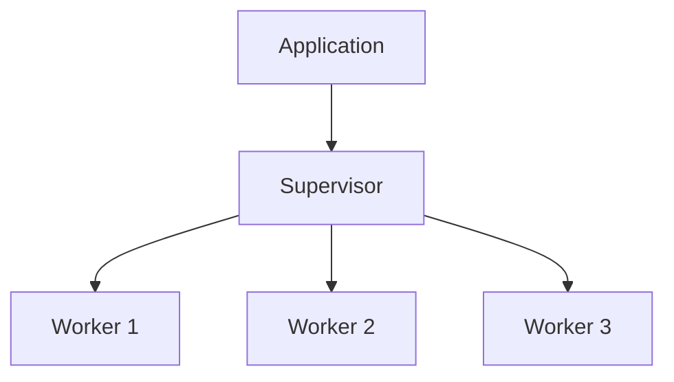

## 1.3. Why Design Patterns Matter in Elixir

Design patterns are a crucial aspect of software development, providing time-tested solutions to common problems. In Elixir, a language known for its functional programming paradigm and robust concurrency model, design patterns play an even more significant role. They not only help in addressing common challenges but also improve code quality and consistency while leveraging Elixir's unique strengths.

### Addressing Common Challenges

#### Providing Proven Solutions to Recurring Problems

Design patterns offer a blueprint for solving recurring problems in software development. They encapsulate best practices and provide a shared language for developers to communicate complex ideas succinctly. In Elixir, design patterns help address challenges such as managing state, handling concurrency, and ensuring fault tolerance.

For example, the **Supervisor Pattern** in Elixir is a powerful tool for managing process lifecycles and ensuring system reliability. By using supervisors, developers can automatically restart failed processes, maintaining system stability without manual intervention.

```elixir
defmodule MyApp.Supervisor do
  use Supervisor

  def start_link(init_arg) do
    Supervisor.start_link(__MODULE__, init_arg, name: __MODULE__)
  end

  def init(_init_arg) do
    children = [
      {MyApp.Worker, []}
    ]

    Supervisor.init(children, strategy: :one_for_one)
  end
end
```

In this example, the supervisor is configured to restart any worker process that crashes, ensuring continuous operation.

#### Adapting Patterns to Fit the Functional Paradigm

Elixir's functional nature requires a different approach to design patterns compared to object-oriented languages. Patterns must be adapted to work with immutable data and stateless functions. This adaptation often leads to more concise and expressive code.

Consider the **Strategy Pattern**, which in Elixir can be implemented using higher-order functions. This pattern allows you to define a family of algorithms, encapsulate each one, and make them interchangeable.

```elixir
defmodule PaymentProcessor do
  def process(payment, strategy) do
    strategy.(payment)
  end
end

credit_card_strategy = fn payment -> IO.puts("Processing credit card payment: #{payment}") end
paypal_strategy = fn payment -> IO.puts("Processing PayPal payment: #{payment}") end

PaymentProcessor.process(100, credit_card_strategy)
PaymentProcessor.process(200, paypal_strategy)
```

Here, the strategy is passed as a function, showcasing Elixir's ability to treat functions as first-class citizens.

### Improving Code Quality and Consistency

#### Encouraging Best Practices and Standardization

Design patterns promote best practices by providing a structured approach to problem-solving. They encourage developers to follow standardized methods, reducing the likelihood of errors and inconsistencies.

In Elixir, patterns like the **GenServer** pattern provide a standardized way to implement server processes. This pattern abstracts common behaviors, allowing developers to focus on the specific logic of their application.

```elixir
defmodule MyApp.Server do
  use GenServer

  def start_link(initial_state) do
    GenServer.start_link(__MODULE__, initial_state, name: __MODULE__)
  end

  def init(initial_state) do
    {:ok, initial_state}
  end

  def handle_call(:get_state, _from, state) do
    {:reply, state, state}
  end

  def handle_cast({:set_state, new_state}, _state) do
    {:noreply, new_state}
  end
end
```

By using GenServer, developers can ensure that their server processes adhere to a consistent structure, making the code easier to understand and maintain.

#### Facilitating Code Reviews and Team Collaboration

Design patterns provide a common vocabulary that simplifies communication among team members. When developers use well-known patterns, it becomes easier for others to understand the code, facilitating code reviews and collaboration.

For instance, when a team member sees a **Pipeline Pattern** in Elixir, they immediately understand that the code is processing data through a series of transformations. This clarity reduces the cognitive load during code reviews and helps new team members onboard more quickly.

```elixir
defmodule DataPipeline do
  def process(data) do
    data
    |> transform_step1()
    |> transform_step2()
    |> transform_step3()
  end

  defp transform_step1(data), do: # transformation logic
  defp transform_step2(data), do: # transformation logic
  defp transform_step3(data), do: # transformation logic
end
```

### Leveraging Elixir's Strengths

#### Utilizing Patterns that Take Advantage of Concurrency and Fault Tolerance

Elixir's concurrency model, built on the BEAM virtual machine, is one of its most powerful features. Design patterns in Elixir often leverage this strength to build highly concurrent and fault-tolerant systems.

The **Actor Model**, implemented through processes, is a fundamental pattern in Elixir. It allows developers to design systems where each component operates independently, communicating through message passing. This model is ideal for building scalable and resilient applications.

```elixir
defmodule MyApp.Actor do
  def start do
    spawn(fn -> loop() end)
  end

  defp loop do
    receive do
      {:message, msg} -> IO.puts("Received message: #{msg}")
    end
    loop()
  end
end

actor = MyApp.Actor.start()
send(actor, {:message, "Hello, Actor!"})
```

In this example, the actor continuously listens for messages, demonstrating Elixir's ability to handle concurrent operations efficiently.

#### Designing Systems that are Scalable and Maintainable

Design patterns help architects design systems that are not only scalable but also maintainable. By using patterns like the **Supervisor Tree**, developers can organize their applications into a hierarchy of processes, each responsible for a specific task. This organization simplifies maintenance and enhances scalability.

```elixir
defmodule MyApp.Application do
  use Application

  def start(_type, _args) do
    children = [
      MyApp.Supervisor
    ]

    opts = [strategy: :one_for_one, name: MyApp.Supervisor]
    Supervisor.start_link(children, opts)
  end
end
```

The supervisor tree structure ensures that each component of the application can be managed independently, allowing for seamless scaling and maintenance.

### Visualizing Design Patterns in Elixir

To better understand how design patterns fit into Elixir's ecosystem, let's visualize the relationship between processes, supervisors, and the overall application structure.



In this diagram, the application starts a supervisor, which in turn manages multiple worker processes. This structure exemplifies the modularity and fault tolerance inherent in Elixir applications.

### References and Links

- [Elixir Official Documentation](https://elixir-lang.org/docs.html)
- [The Little Elixir & OTP Guidebook](https://www.manning.com/books/the-little-elixir-and-otp-guidebook)
- [Design Patterns in Elixir](https://elixirforum.com/t/design-patterns-in-elixir/)

### Knowledge Check

- How do design patterns help in addressing common challenges in Elixir?
- What are the benefits of using the Supervisor Pattern in Elixir?
- How does the Strategy Pattern differ in Elixir compared to object-oriented languages?
- Why is the GenServer pattern important for code consistency?
- How do design patterns facilitate team collaboration in Elixir projects?

### Embrace the Journey

Remember, mastering design patterns in Elixir is a journey. As you explore these patterns, you'll gain a deeper understanding of functional programming and concurrency. Keep experimenting, stay curious, and enjoy the process of building robust and scalable applications with Elixir!

## Quiz: Why Design Patterns Matter in Elixir



### How do design patterns help in addressing common challenges in Elixir?

- [x] They provide proven solutions to recurring problems.
- [ ] They make code more complex and harder to understand.
- [ ] They eliminate the need for testing.
- [ ] They are only useful in object-oriented programming.

> **Explanation:** Design patterns offer proven solutions to recurring problems, making it easier to address common challenges in Elixir.

### What is the primary benefit of using the Supervisor Pattern in Elixir?

- [x] Ensuring system reliability by automatically restarting failed processes.
- [ ] Making code execution slower.
- [ ] Reducing the need for documentation.
- [ ] Eliminating the need for error handling.

> **Explanation:** The Supervisor Pattern ensures system reliability by automatically restarting failed processes, maintaining system stability.

### How does the Strategy Pattern differ in Elixir compared to object-oriented languages?

- [x] It uses higher-order functions instead of classes and interfaces.
- [ ] It requires more boilerplate code.
- [ ] It cannot be implemented in Elixir.
- [ ] It is less flexible in Elixir.

> **Explanation:** In Elixir, the Strategy Pattern uses higher-order functions, allowing for more concise and flexible implementations.

### Why is the GenServer pattern important for code consistency?

- [x] It provides a standardized way to implement server processes.
- [ ] It makes code harder to maintain.
- [ ] It is only useful for small projects.
- [ ] It eliminates the need for testing.

> **Explanation:** The GenServer pattern provides a standardized way to implement server processes, ensuring code consistency and maintainability.

### How do design patterns facilitate team collaboration in Elixir projects?

- [x] By providing a common vocabulary and structure for code.
- [ ] By making code more complex.
- [ ] By reducing the need for communication.
- [ ] By eliminating the need for documentation.

> **Explanation:** Design patterns provide a common vocabulary and structure, making it easier for team members to understand and collaborate on code.

### What is a key advantage of using the Actor Model in Elixir?

- [x] It allows for building scalable and resilient applications.
- [ ] It makes code execution slower.
- [ ] It reduces the need for documentation.
- [ ] It eliminates the need for error handling.

> **Explanation:** The Actor Model allows for building scalable and resilient applications by enabling independent operation and message passing.

### How do design patterns improve code quality in Elixir?

- [x] By promoting best practices and standardization.
- [ ] By making code more complex.
- [ ] By reducing the need for testing.
- [ ] By eliminating the need for documentation.

> **Explanation:** Design patterns improve code quality by promoting best practices and standardization, making code more reliable and maintainable.

### What is the role of the Pipeline Pattern in Elixir?

- [x] It processes data through a series of transformations.
- [ ] It makes code execution slower.
- [ ] It reduces the need for documentation.
- [ ] It eliminates the need for error handling.

> **Explanation:** The Pipeline Pattern processes data through a series of transformations, making code more readable and maintainable.

### How do design patterns leverage Elixir's concurrency model?

- [x] By utilizing patterns that take advantage of concurrency and fault tolerance.
- [ ] By making code execution slower.
- [ ] By reducing the need for documentation.
- [ ] By eliminating the need for error handling.

> **Explanation:** Design patterns leverage Elixir's concurrency model by utilizing patterns that take advantage of concurrency and fault tolerance, enhancing scalability and reliability.

### True or False: Design patterns are only useful in object-oriented programming.

- [ ] True
- [x] False

> **Explanation:** False. Design patterns are useful in both object-oriented and functional programming, including Elixir, where they help address common challenges and improve code quality.


