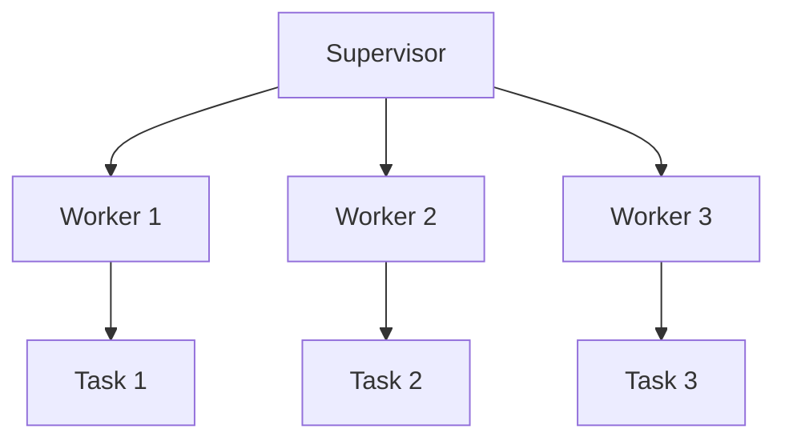

## 1.3. Why Design Patterns Matter in Elixir

Design patterns are a crucial aspect of software engineering, providing a structured approach to solving common problems. In Elixir, a functional programming language known for its concurrency and fault tolerance, design patterns play a pivotal role in creating scalable and maintainable systems. This section explores the importance of design patterns in Elixir, addressing common challenges, improving code quality, and leveraging Elixir's unique strengths.

### Addressing Common Challenges

#### Providing Proven Solutions to Recurring Problems

Design patterns offer tried-and-tested solutions to recurring problems in software development. They serve as a blueprint for solving specific issues, allowing developers to avoid reinventing the wheel. In Elixir, design patterns help address challenges such as managing state, handling concurrency, and ensuring fault tolerance.

For example, the **Supervisor** pattern is essential in Elixir for managing process lifecycles and ensuring system reliability. By using this pattern, developers can automatically restart failed processes, maintaining system stability without manual intervention.

#### Adapting Patterns to Fit the Functional Paradigm

While many design patterns originate from object-oriented programming (OOP), they can be adapted to fit Elixir's functional paradigm. This adaptation involves rethinking patterns to leverage immutability, first-class functions, and pattern matching.

Consider the **Strategy** pattern, which in OOP involves defining a family of algorithms and making them interchangeable. In Elixir, this can be achieved using higher-order functions, allowing developers to pass different functions as arguments to achieve the same flexibility.

```elixir
defmodule PaymentProcessor do
  def process_payment(amount, strategy) do
    strategy.(amount)
  end
end

# Usage
credit_card_strategy = fn amount -> IO.puts("Processing credit card payment of #{amount}") end
paypal_strategy = fn amount -> IO.puts("Processing PayPal payment of #{amount}") end

PaymentProcessor.process_payment(100, credit_card_strategy)
PaymentProcessor.process_payment(200, paypal_strategy)
```

### Improving Code Quality and Consistency

#### Encouraging Best Practices and Standardization

Design patterns promote best practices and standardization across codebases. By adhering to established patterns, developers can ensure that their code is consistent, readable, and maintainable. This is particularly important in team environments, where multiple developers work on the same codebase.

In Elixir, the use of **GenServer** as a pattern for implementing server processes encourages a standardized approach to handling state and message passing. This consistency makes it easier for developers to understand and modify code, reducing the likelihood of errors.

#### Facilitating Code Reviews and Team Collaboration

When code follows well-known design patterns, it becomes easier to review and collaborate on. Team members can quickly grasp the structure and intent of the code, facilitating effective code reviews and collaborative development.

For instance, using the **Observer** pattern with `Phoenix.PubSub` in Elixir allows developers to implement event-driven architectures that are easy to understand and extend. This pattern enables decoupled communication between components, enhancing team collaboration and system flexibility.

### Leveraging Elixir's Strengths

#### Utilizing Patterns That Take Advantage of Concurrency and Fault Tolerance

Elixir's strengths lie in its ability to handle concurrency and ensure fault tolerance. Design patterns that leverage these strengths can significantly enhance system performance and reliability.

The **Actor Model**, implemented through Elixir's lightweight processes, is a prime example. By using processes to encapsulate state and behavior, developers can build concurrent systems that are resilient to failures. The **Supervisor** pattern further enhances this by providing a mechanism to monitor and restart failed processes, ensuring continuous system operation.

```elixir
defmodule Worker do
  use GenServer

  def start_link(initial_state) do
    GenServer.start_link(__MODULE__, initial_state, name: __MODULE__)
  end

  def handle_call(:get_state, _from, state) do
    {:reply, state, state}
  end

  def handle_cast({:set_state, new_state}, _state) do
    {:noreply, new_state}
  end
end

defmodule WorkerSupervisor do
  use Supervisor

  def start_link(_) do
    Supervisor.start_link(__MODULE__, :ok, name: __MODULE__)
  end

  def init(:ok) do
    children = [
      {Worker, :initial_state}
    ]

    Supervisor.init(children, strategy: :one_for_one)
  end
end
```

#### Designing Systems That Are Scalable and Maintainable

Scalability and maintainability are critical for modern software systems. Design patterns in Elixir enable developers to build systems that can grow and adapt to changing requirements.

The **Pipeline** pattern, facilitated by Elixir's pipe operator (`|>`), allows developers to compose functions in a clear and concise manner. This promotes modularity and reusability, making it easier to scale and maintain codebases.

```elixir
defmodule DataPipeline do
  def process(data) do
    data
    |> step_one()
    |> step_two()
    |> step_three()
  end

  defp step_one(data), do: # process data
  defp step_two(data), do: # process data
  defp step_three(data), do: # process data
end
```

### Visualizing Design Patterns in Elixir

To better understand how design patterns integrate with Elixir's features, let's visualize some key concepts using Mermaid.js diagrams.

#### Supervisor Pattern


```mermaid
graph TD;
    A[Supervisor] --> B[Worker 1];
    A --> C[Worker 2];
    A --> D[Worker 3];
    B --> E[Task 1];
    C --> F[Task 2];
    D --> G[Task 3];
```

*The Supervisor pattern ensures system reliability by monitoring and restarting worker processes.*

#### Pipeline Pattern


```mermaid
graph LR;
    A[Input Data] --> B[Step One];
    B --> C[Step Two];
    C --> D[Step Three];
    D --> E[Output Data];
```

*The Pipeline pattern promotes modularity and reusability by composing functions in a sequence.*

### References and Links

- [Elixir's Official Documentation](https://elixir-lang.org/docs.html)
- [Design Patterns in Functional Programming](https://www.oreilly.com/library/view/functional-programming-patterns/9781449365516/)
- [Concurrency and Fault Tolerance in Elixir](https://pragprog.com/titles/elixir16/programming-elixir-16/)

### Knowledge Check

To reinforce your understanding of why design patterns matter in Elixir, consider the following questions:

1. How does the Supervisor pattern contribute to system reliability in Elixir?
2. What are some benefits of using the Pipeline pattern in Elixir?
3. How can the Strategy pattern be adapted to fit Elixir's functional paradigm?
4. Why is standardization important in team environments?
5. How do design patterns leverage Elixir's concurrency and fault tolerance features?

### Embrace the Journey

Remember, mastering design patterns in Elixir is a journey. As you explore these patterns, you'll gain a deeper understanding of how to build robust, scalable, and maintainable systems. Keep experimenting, stay curious, and enjoy the journey!

## Quiz Time!



### What is a key benefit of using design patterns in Elixir?

- [x] They provide proven solutions to recurring problems.
- [ ] They eliminate the need for documentation.
- [ ] They make code harder to read.
- [ ] They are only useful in object-oriented programming.

> **Explanation:** Design patterns offer proven solutions to common problems, making them valuable in any programming paradigm, including functional programming like Elixir.

### How does the Supervisor pattern enhance system reliability?

- [x] By monitoring and restarting failed processes.
- [ ] By eliminating the need for error handling.
- [ ] By reducing code complexity.
- [ ] By increasing code execution speed.

> **Explanation:** The Supervisor pattern in Elixir monitors processes and automatically restarts them if they fail, ensuring system reliability.

### What is the primary advantage of the Pipeline pattern in Elixir?

- [x] It promotes modularity and reusability.
- [ ] It increases code execution speed.
- [ ] It eliminates the need for functions.
- [ ] It makes code harder to read.

> **Explanation:** The Pipeline pattern allows developers to compose functions in a clear and concise manner, promoting modularity and reusability.

### How can the Strategy pattern be adapted for Elixir?

- [x] By using higher-order functions to pass different strategies.
- [ ] By using classes and inheritance.
- [ ] By eliminating the use of functions.
- [ ] By using global variables.

> **Explanation:** In Elixir, the Strategy pattern can be adapted by using higher-order functions, allowing different strategies to be passed as arguments.

### Why is standardization important in team environments?

- [x] It ensures code consistency and readability.
- [ ] It allows each developer to use their own coding style.
- [ ] It eliminates the need for code reviews.
- [ ] It reduces the need for documentation.

> **Explanation:** Standardization ensures that code is consistent and readable, facilitating collaboration and making it easier for team members to understand and modify the code.

### How do design patterns leverage Elixir's concurrency features?

- [x] By using lightweight processes to encapsulate state and behavior.
- [ ] By eliminating the need for processes.
- [ ] By using global variables for state management.
- [ ] By increasing code complexity.

> **Explanation:** Design patterns in Elixir leverage concurrency by using lightweight processes to encapsulate state and behavior, enabling concurrent system operations.

### What role does the Supervisor pattern play in fault tolerance?

- [x] It automatically restarts failed processes.
- [ ] It prevents processes from failing.
- [ ] It eliminates the need for error handling.
- [ ] It increases code execution speed.

> **Explanation:** The Supervisor pattern enhances fault tolerance by automatically restarting failed processes, ensuring continuous system operation.

### How does the Pipeline pattern improve code maintainability?

- [x] By allowing functions to be composed in a clear sequence.
- [ ] By eliminating the need for functions.
- [ ] By using global variables for state management.
- [ ] By increasing code complexity.

> **Explanation:** The Pipeline pattern improves maintainability by allowing functions to be composed in a clear and concise sequence, making the code easier to understand and modify.

### What is a key feature of Elixir that design patterns leverage?

- [x] Concurrency and fault tolerance.
- [ ] Object-oriented features.
- [ ] Global state management.
- [ ] Lack of error handling.

> **Explanation:** Elixir's key features include concurrency and fault tolerance, which design patterns leverage to build robust and scalable systems.

### True or False: Design patterns are only useful in object-oriented programming.

- [ ] True
- [x] False

> **Explanation:** Design patterns are valuable in any programming paradigm, including functional programming like Elixir, as they provide structured solutions to common problems.


