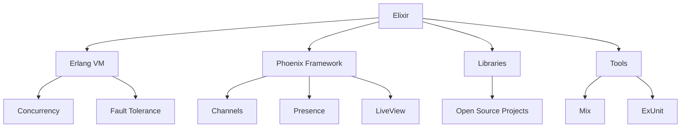

## 1.4. History of Elixir and Its Ecosystem

Elixir, a dynamic, functional language designed for building scalable and maintainable applications, has a rich history and a vibrant ecosystem. In this section, we will delve into the origins of Elixir, its evolution, and its impact on various industries. We will also explore the growth of its ecosystem, including libraries, frameworks, and community contributions.

### Origins of Elixir

Elixir was created by José Valim, a Brazilian software engineer, in 2011. Valim, who was a core contributor to the Ruby on Rails framework, sought to address some of the limitations he encountered in Ruby, particularly around concurrency and scalability. He envisioned a language that could leverage the robustness and concurrency capabilities of the Erlang VM (BEAM) while providing a more modern and developer-friendly syntax.

#### The Motivation Behind Elixir

Valim's motivation for creating Elixir was rooted in the need for a language that could handle the demands of modern software development, particularly in terms of:

- **Concurrency**: With the rise of multi-core processors, there was a growing need for languages that could efficiently manage concurrent processes. Erlang, with its lightweight process model, was already well-suited for this task, and Elixir sought to build upon this strength.
- **Fault Tolerance**: Erlang's "let it crash" philosophy and its robust error-handling mechanisms made it an ideal platform for building fault-tolerant systems. Elixir aimed to bring these capabilities to a wider audience.
- **Productivity**: While Erlang was powerful, its syntax and tooling were often seen as barriers to entry for developers accustomed to more modern languages. Elixir introduced a more approachable syntax and a rich set of tools to enhance developer productivity.

#### Building on the Erlang VM

Elixir is built on top of the Erlang VM, which has been in development since the late 1980s. The Erlang VM, also known as BEAM, is renowned for its ability to handle massive concurrency, its fault-tolerant design, and its distributed computing capabilities. By leveraging the Erlang VM, Elixir inherits these strengths while introducing new features and improvements.

### Evolution of the Ecosystem

Since its inception, Elixir has seen significant growth in its ecosystem. This growth has been driven by the development of libraries, frameworks, and tools that enhance the language's capabilities and make it more accessible to developers.

#### Key Milestones in Elixir's Evolution

- **2012**: The first public release of Elixir, version 0.5, was announced. This release marked the beginning of Elixir's journey as a language designed to improve developer productivity while maintaining the robustness of the Erlang VM.
- **2014**: Elixir 1.0 was released, signifying a stable and mature language ready for production use. This release included features such as macros, protocols, and the Mix build tool.
- **2015**: The Phoenix Framework, a web development framework for Elixir, was introduced. Phoenix brought a new level of productivity and performance to web development, leveraging Elixir's concurrency model to handle real-time communication with ease.
- **2016**: Elixir's popularity continued to grow, with an increasing number of companies adopting it for production use. The language's community also expanded, contributing to a rich ecosystem of libraries and tools.
- **2018**: The release of Elixir 1.7 introduced significant improvements to the language's tooling and documentation capabilities, further enhancing developer productivity.
- **2020**: Elixir 1.11 was released, bringing new features such as improved compiler diagnostics and support for Erlang's new JIT compiler.

#### The Rise of the Phoenix Framework

The Phoenix Framework has played a crucial role in the growth of Elixir's ecosystem. Designed for building scalable and maintainable web applications, Phoenix leverages Elixir's strengths to provide a high-performance platform for real-time communication and fault-tolerant systems.

Phoenix introduced several innovative features, including:

- **Channels**: A powerful abstraction for handling real-time communication, allowing developers to build interactive applications with ease.
- **Presence**: A feature for tracking user presence in real-time, enabling applications to provide rich, interactive experiences.
- **LiveView**: A revolutionary approach to building interactive web applications without the need for client-side JavaScript frameworks.

### Elixir in the Industry

Elixir's unique combination of features has led to its adoption in a wide range of industries, from web development to IoT and real-time systems. Its ability to handle massive concurrency and provide fault tolerance makes it an ideal choice for applications that require high availability and performance.

#### Case Studies of Successful Elixir Applications

- **Discord**: The popular communication platform uses Elixir to handle millions of concurrent users, leveraging the language's concurrency model to provide a seamless user experience.
- **Bleacher Report**: This sports news website uses Elixir to power its real-time notification system, ensuring that users receive updates as soon as they happen.
- **PepsiCo**: The global beverage company uses Elixir to manage its supply chain operations, taking advantage of the language's fault-tolerant design to ensure reliability.

### Conclusion

The history of Elixir is a testament to the power of combining the strengths of the Erlang VM with modern language features and tooling. Its evolution has been driven by a passionate community and a growing ecosystem of libraries and frameworks. As Elixir continues to gain traction in various industries, its impact on software development is likely to grow, offering developers a powerful tool for building scalable, maintainable, and fault-tolerant applications.

### Try It Yourself

To get a feel for Elixir's capabilities, try building a simple real-time chat application using the Phoenix Framework. Experiment with features like Channels and Presence to see how Elixir handles concurrency and real-time communication.

### Visualizing Elixir's Ecosystem

Below is a diagram illustrating the key components of Elixir's ecosystem, including the Erlang VM, the Phoenix Framework, and various libraries and tools.

### References and Links

- [Elixir Official Website](https://elixir-lang.org/)
- [Phoenix Framework](https://www.phoenixframework.org/)
- [Erlang VM](https://www.erlang.org/)

## Quiz: History of Elixir and Its Ecosystem



### Who created Elixir?

- [x] José Valim
- [ ] Matz Matsumoto
- [ ] Yukihiro Matsumoto
- [ ] Guido van Rossum

> **Explanation:** José Valim, a Brazilian software engineer, created Elixir to improve productivity and maintainability while leveraging the robustness of the Erlang VM.

### What is the Erlang VM also known as?

- [x] BEAM
- [ ] JVM
- [ ] CLR
- [ ] V8

> **Explanation:** The Erlang VM is also known as BEAM, which stands for Bogdan/Björn's Erlang Abstract Machine.

### Which framework is closely associated with Elixir for web development?

- [x] Phoenix
- [ ] Rails
- [ ] Django
- [ ] Laravel

> **Explanation:** The Phoenix Framework is closely associated with Elixir for building scalable and maintainable web applications.

### What year was Elixir first publicly released?

- [x] 2012
- [ ] 2010
- [ ] 2014
- [ ] 2016

> **Explanation:** Elixir was first publicly released in 2012, marking the beginning of its journey as a language designed to improve developer productivity.

### What feature of Phoenix allows for real-time communication?

- [x] Channels
- [ ] Routes
- [ ] Controllers
- [ ] Views

> **Explanation:** Channels in the Phoenix Framework provide a powerful abstraction for handling real-time communication.

### Which company uses Elixir to handle millions of concurrent users?

- [x] Discord
- [ ] Twitter
- [ ] Facebook
- [ ] Google

> **Explanation:** Discord uses Elixir to handle millions of concurrent users, leveraging the language's concurrency model.

### What is the "let it crash" philosophy associated with?

- [x] Fault tolerance
- [ ] Performance optimization
- [ ] Code readability
- [ ] Security

> **Explanation:** The "let it crash" philosophy is associated with fault tolerance, allowing systems to recover gracefully from errors.

### Which Elixir feature allows for building interactive web applications without client-side JavaScript?

- [x] LiveView
- [ ] Channels
- [ ] Presence
- [ ] Controllers

> **Explanation:** LiveView allows for building interactive web applications without the need for client-side JavaScript frameworks.

### What tool is used for building and managing Elixir projects?

- [x] Mix
- [ ] Maven
- [ ] Gradle
- [ ] NPM

> **Explanation:** Mix is the build tool used for managing Elixir projects, providing tasks for compiling code, running tests, and more.

### True or False: Elixir is built on top of the Java Virtual Machine (JVM).

- [ ] True
- [x] False

> **Explanation:** False. Elixir is built on top of the Erlang VM, not the Java Virtual Machine (JVM).


