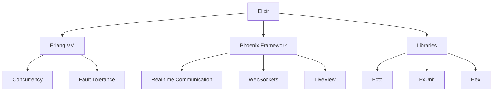

## 1.4. History of Elixir and Its Ecosystem

Elixir, a dynamic, functional language designed for building scalable and maintainable applications, has rapidly gained popularity among developers and organizations worldwide. Its history is a testament to the power of community-driven innovation and the strategic enhancement of existing technologies. In this section, we will delve into the origins of Elixir, its evolution, and the vibrant ecosystem that surrounds it.

### Origins of Elixir

The story of Elixir begins with José Valim, a Brazilian software engineer and a prominent member of the Ruby on Rails core team. In the early 2010s, Valim sought to address some limitations he encountered in Ruby, particularly around concurrency and performance. He envisioned a language that could offer the productivity and joy of Ruby while leveraging the robustness and scalability of the Erlang Virtual Machine (BEAM).

#### José Valim's Vision

Valim's vision was to create a language that could handle modern software demands, such as distributed systems and real-time applications, without sacrificing developer productivity. He wanted a language that was not only easy to read and write but also capable of running on the highly concurrent and fault-tolerant Erlang VM.

- **Key Objectives:**
  - Enhance productivity and maintainability.
  - Leverage Erlang's strengths in concurrency and fault tolerance.
  - Provide a modern syntax and tooling.

#### Building on Erlang's Foundation

Erlang, developed by Ericsson in the late 1980s, was designed for telecommunication systems that required high availability and fault tolerance. Its actor model for concurrency and lightweight process model made it ideal for building resilient systems. By choosing to build Elixir on the Erlang VM, Valim ensured that Elixir would inherit these robust characteristics.

- **Advantages of Erlang VM:**
  - Proven track record in high-availability systems.
  - Efficient handling of thousands of concurrent processes.
  - Strong support for distributed computing.

### Evolution of the Ecosystem

Since its inception, Elixir has evolved significantly, driven by a passionate community and the emergence of powerful tools and frameworks. The ecosystem surrounding Elixir has grown to include a wide range of libraries, frameworks, and tools that enhance its capabilities and broaden its applicability.

#### Growth of Libraries and Tools

The Elixir community has been instrumental in developing a rich set of libraries and tools that extend the language's functionality. These contributions have made it easier for developers to build complex applications with Elixir.

- **Notable Libraries:**
  - **Ecto:** A robust database wrapper and query generator.
  - **ExUnit:** The built-in testing framework for Elixir.
  - **Hex:** A package manager for the Erlang ecosystem.

#### Phoenix Framework

One of the most significant developments in the Elixir ecosystem is the Phoenix Framework. Phoenix is a web development framework that provides real-time capabilities and high performance, making it a popular choice for building modern web applications.

- **Key Features of Phoenix:**
  - Real-time communication with channels.
  - Built-in support for WebSockets.
  - A productive development environment with tools like LiveView.

```elixir
# Example of a simple Phoenix controller
defmodule MyAppWeb.PageController do
  use MyAppWeb, :controller

  def index(conn, _params) do
    render(conn, "index.html")
  end
end
```

#### Active Community Contributions

The Elixir community is known for its active involvement and contribution to open-source projects. This collaborative spirit has led to the rapid growth and diversification of the Elixir ecosystem.

- **Community Initiatives:**
  - Regular conferences and meetups such as ElixirConf.
  - Online forums and discussion groups like the Elixir Forum.
  - Open-source contributions to core libraries and tools.

### Elixir in the Industry

Elixir's unique combination of productivity, scalability, and fault tolerance has led to its adoption across various industries. From web development to the Internet of Things (IoT), Elixir has proven to be a versatile and reliable choice for building modern applications.

#### Adoption in Various Domains

Elixir's capabilities make it suitable for a wide range of applications, from real-time systems to distributed architectures. Its use in industry continues to grow as more organizations recognize its benefits.

- **Domains of Application:**
  - **Web Development:** Leveraging Phoenix for high-performance web applications.
  - **IoT:** Building scalable and fault-tolerant IoT platforms.
  - **Real-Time Systems:** Implementing real-time features with ease.

#### Case Studies of Successful Elixir Applications

Numerous companies have successfully implemented Elixir in their technology stacks, showcasing its effectiveness in solving complex problems and improving system performance.

- **Notable Case Studies:**
  - **Discord:** Utilizes Elixir to handle millions of concurrent users in real-time.
  - **Bleacher Report:** Employs Elixir for real-time notifications and updates.
  - **PepsiCo:** Uses Elixir for data processing and analytics.

#### Visualizing Elixir's Ecosystem

To better understand Elixir's ecosystem, let's visualize its components and their interactions using a Mermaid.js diagram.


```mermaid
graph TD;
    A[Elixir] --> B[Erlang VM];
    A --> C[Phoenix Framework];
    A --> D[Libraries];
    D --> E[Ecto];
    D --> F[ExUnit];
    D --> G[Hex];
    C --> H[Real-time Communication];
    C --> I[WebSockets];
    C --> J[LiveView];
    B --> K[Concurrency];
    B --> L[Fault Tolerance];
```

**Diagram Explanation:** This diagram illustrates the core components of the Elixir ecosystem, highlighting its foundation on the Erlang VM and the key libraries and frameworks that enhance its capabilities.

### Conclusion

The history of Elixir is a compelling narrative of innovation, collaboration, and strategic enhancement of existing technologies. José Valim's vision, combined with the strengths of the Erlang VM, has resulted in a language that excels in modern software development challenges. The vibrant ecosystem and active community continue to drive Elixir's evolution, making it a powerful tool for building scalable, maintainable, and fault-tolerant applications.

As we continue our journey through the Elixir Design Patterns guide, remember that understanding the history and ecosystem of Elixir provides valuable context for mastering its advanced design patterns. Keep exploring, stay curious, and embrace the power of Elixir in your software development endeavors.

---

## Quiz Time!



### Who created Elixir and why?

- [x] José Valim, to improve productivity and maintainability.
- [ ] Joe Armstrong, to enhance Erlang's capabilities.
- [ ] Matz, to replace Ruby.
- [ ] Guido van Rossum, for Python's concurrency.

> **Explanation:** José Valim created Elixir to improve productivity and maintainability while leveraging the Erlang VM's strengths.

### What is the Erlang VM known for?

- [x] Concurrency and fault tolerance.
- [ ] High-level syntax and readability.
- [ ] Object-oriented programming.
- [ ] Machine learning capabilities.

> **Explanation:** The Erlang VM is renowned for its concurrency and fault tolerance, making it ideal for robust systems.

### Which framework is significant in the Elixir ecosystem?

- [x] Phoenix Framework.
- [ ] Django.
- [ ] Rails.
- [ ] Spring.

> **Explanation:** The Phoenix Framework is a key part of the Elixir ecosystem, providing powerful web development capabilities.

### What does the Phoenix Framework offer?

- [x] Real-time communication with channels.
- [ ] Machine learning libraries.
- [ ] Object-oriented paradigms.
- [ ] Static typing.

> **Explanation:** Phoenix offers real-time communication capabilities, including channels and WebSocket support.

### How does the Elixir community contribute to its ecosystem?

- [x] Through open-source projects and community events.
- [ ] By developing proprietary software.
- [ ] By limiting access to core libraries.
- [ ] By discouraging new developers.

> **Explanation:** The Elixir community actively contributes to open-source projects and organizes community events, fostering growth.

### In which domains is Elixir commonly adopted?

- [x] Web development, IoT, real-time systems.
- [ ] Mobile app development, gaming, VR.
- [ ] Desktop applications, operating systems.
- [ ] Video editing, graphic design.

> **Explanation:** Elixir is commonly used in web development, IoT, and real-time systems due to its scalability and fault tolerance.

### What is Ecto in Elixir?

- [x] A database wrapper and query generator.
- [ ] A web framework.
- [ ] A testing library.
- [ ] A package manager.

> **Explanation:** Ecto is a robust database wrapper and query generator in the Elixir ecosystem.

### How does Elixir handle concurrency?

- [x] Through the actor model and lightweight processes.
- [ ] By using threads and locks.
- [ ] By relying on external libraries.
- [ ] Through synchronous operations.

> **Explanation:** Elixir uses the actor model and lightweight processes for efficient concurrency management.

### Which company uses Elixir for real-time notifications?

- [x] Bleacher Report.
- [ ] Google.
- [ ] Microsoft.
- [ ] Amazon.

> **Explanation:** Bleacher Report uses Elixir to manage real-time notifications and updates.

### True or False: Elixir was built to replace Ruby.

- [ ] True
- [x] False

> **Explanation:** Elixir was not built to replace Ruby but to address some of its limitations while leveraging Erlang's strengths.


