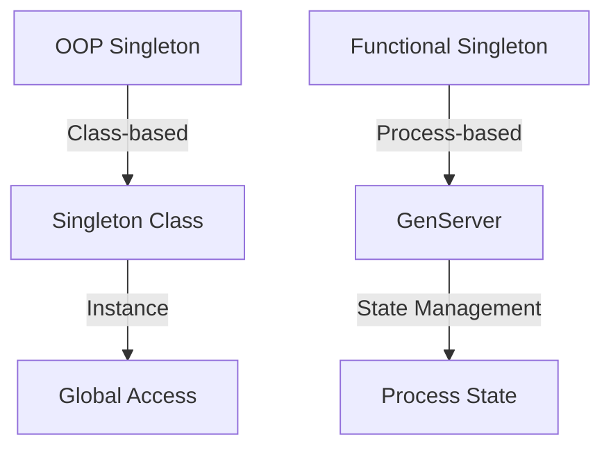

## 1.5. Comparing Object-Oriented and Functional Design Patterns

In the world of software development, design patterns serve as time-tested solutions to common problems. They provide a shared language for developers to communicate complex ideas succinctly. While design patterns are often associated with Object-Oriented Programming (OOP), they are equally relevant in Functional Programming (FP), albeit with some differences in implementation and application. This section explores how classical OOP patterns translate to Elixir, a functional language, and highlights unique patterns that emerge from functional concepts. We will also discuss how to balance OOP and functional approaches to leverage the strengths of both paradigms.

### Translating OOP Patterns to Functional Languages

#### Understanding How Classical Design Patterns Adapt to Elixir

Object-Oriented Programming is characterized by concepts such as encapsulation, inheritance, and polymorphism. These concepts give rise to a variety of design patterns, such as Singleton, Factory, and Observer. In functional languages like Elixir, the absence of mutable state and class-based inheritance necessitates a different approach to implementing these patterns.

**Singleton Pattern**

In OOP, the Singleton pattern ensures a class has only one instance and provides a global point of access to it. In Elixir, this pattern can be implemented using processes. The `GenServer` module can be used to create a process that maintains state and handles requests, effectively acting as a singleton.

```elixir
defmodule SingletonServer do
  use GenServer

  # Client API
  def start_link(initial_value) do
    GenServer.start_link(__MODULE__, initial_value, name: __MODULE__)
  end

  def get_value do
    GenServer.call(__MODULE__, :get_value)
  end

  # Server Callbacks
  def init(initial_value) do
    {:ok, initial_value}
  end

  def handle_call(:get_value, _from, state) do
    {:reply, state, state}
  end
end

# Start the SingletonServer
{:ok, _pid} = SingletonServer.start_link(42)

# Retrieve the value
SingletonServer.get_value() # => 42
```

**Factory Pattern**

The Factory pattern in OOP is used to create objects without specifying the exact class of object that will be created. In Elixir, this can be achieved using functions and modules. Instead of creating objects, we return data structures that represent the desired state.

```elixir
defmodule ShapeFactory do
  def create_shape(:circle, radius) do
    %{type: :circle, radius: radius}
  end

  def create_shape(:square, side) do
    %{type: :square, side: side}
  end
end

# Usage
circle = ShapeFactory.create_shape(:circle, 5)
square = ShapeFactory.create_shape(:square, 4)
```

**Observer Pattern**

The Observer pattern defines a one-to-many dependency between objects so that when one object changes state, all its dependents are notified. In Elixir, this can be implemented using the `Phoenix.PubSub` library, which provides a publish-subscribe mechanism.

```elixir
defmodule Publisher do
  def notify_subscribers(message) do
    Phoenix.PubSub.broadcast(MyApp.PubSub, "topic", message)
  end
end

defmodule Subscriber do
  def start_link do
    Phoenix.PubSub.subscribe(MyApp.PubSub, "topic")
    loop()
  end

  defp loop do
    receive do
      message -> IO.puts("Received message: #{message}")
    end
    loop()
  end
end

# Start the subscriber
spawn(Subscriber, :start_link, [])

# Notify subscribers
Publisher.notify_subscribers("Hello, World!")
```

#### Identifying Patterns That Are Rendered Unnecessary by Functional Features

Functional programming languages like Elixir inherently support certain patterns through their core features, making some classical patterns redundant. For example:

- **Iterator Pattern**: In OOP, the Iterator pattern provides a way to access elements of a collection sequentially without exposing its underlying representation. In Elixir, the `Enum` and `Stream` modules provide built-in functions for iterating over collections, eliminating the need for an explicit iterator pattern.

- **Command Pattern**: This pattern encapsulates a request as an object, allowing for parameterization of clients with queues, requests, and operations. In Elixir, functions are first-class citizens and can be passed around as arguments, effectively serving the same purpose as the Command pattern.

### Unique Patterns in Functional Programming

#### Exploring Patterns That Emerge from Functional Concepts

Functional programming introduces its own set of patterns that leverage immutability, higher-order functions, and other functional concepts. Some of these patterns include:

**Functor**

A Functor is a type that implements a map function, which applies a function to each element within the functor. In Elixir, lists and other collections can be treated as functors.

```elixir
# Functor example with a list
list = [1, 2, 3, 4]
mapped_list = Enum.map(list, fn x -> x * 2 end) # => [2, 4, 6, 8]
```

**Monad**

Monads are a type of functor that allow for function chaining while handling side effects. The `with` construct in Elixir can be used to chain operations that may fail, similar to monadic operations.

```elixir
defmodule MonadExample do
  def divide(a, b) when b != 0 do
    {:ok, a / b}
  end

  def divide(_, 0) do
    {:error, "Division by zero"}
  end

  def calculate do
    with {:ok, result1} <- divide(10, 2),
         {:ok, result2} <- divide(result1, 2) do
      {:ok, result2}
    else
      {:error, reason} -> {:error, reason}
    end
  end
end

# Usage
MonadExample.calculate() # => {:ok, 2.5}
```

**Pipeline Pattern**

The pipeline pattern is a hallmark of functional programming, allowing for the chaining of function calls in a readable manner. Elixir's pipe operator (`|>`) facilitates this pattern.

```elixir
result = [1, 2, 3, 4]
|> Enum.map(&(&1 * 2))
|> Enum.filter(&(&1 > 4))
|> Enum.sum() # => 14
```

#### Examples Like Functor, Monad, and Others Relevant to Elixir

Elixir's functional nature encourages the use of these patterns to create clean, maintainable code. By leveraging higher-order functions, immutability, and pattern matching, developers can implement complex logic in a concise and expressive manner.

### Balancing OOP and Functional Approaches

#### Combining the Strengths of Both Paradigms Where Appropriate

While functional programming offers many advantages, there are scenarios where traditional OOP patterns can still be beneficial. For instance, when dealing with complex stateful systems, the encapsulation and modularity provided by OOP can be advantageous. Elixir's support for processes and OTP (Open Telecom Platform) allows developers to blend these paradigms effectively.

**Stateful Systems with GenServer**

In Elixir, the `GenServer` module provides a way to manage state and handle asynchronous requests, similar to objects in OOP. This allows for the encapsulation of state and behavior within a process.

```elixir
defmodule Counter do
  use GenServer

  # Client API
  def start_link(initial_value) do
    GenServer.start_link(__MODULE__, initial_value, name: __MODULE__)
  end

  def increment do
    GenServer.cast(__MODULE__, :increment)
  end

  def get_value do
    GenServer.call(__MODULE__, :get_value)
  end

  # Server Callbacks
  def init(initial_value) do
    {:ok, initial_value}
  end

  def handle_cast(:increment, state) do
    {:noreply, state + 1}
  end

  def handle_call(:get_value, _from, state) do
    {:reply, state, state}
  end
end

# Start the Counter
{:ok, _pid} = Counter.start_link(0)

# Increment and retrieve the value
Counter.increment()
Counter.get_value() # => 1
```

#### Recognizing When Traditional OOP Patterns Still Apply

There are cases where traditional OOP patterns are still applicable in a functional context. For example, the Strategy pattern, which defines a family of algorithms and makes them interchangeable, can be implemented using higher-order functions in Elixir.

```elixir
defmodule PaymentProcessor do
  def process(payment, strategy) do
    strategy.(payment)
  end
end

# Define strategies
credit_card_strategy = fn payment -> IO.puts("Processing credit card payment: #{payment}") end
paypal_strategy = fn payment -> IO.puts("Processing PayPal payment: #{payment}") end

# Usage
PaymentProcessor.process(100, credit_card_strategy)
PaymentProcessor.process(200, paypal_strategy)
```

### Visualizing the Differences

To better understand the differences between OOP and functional patterns, let's visualize the transformation of a simple design pattern from OOP to functional programming.



**Caption:** Visualizing the transformation of the Singleton pattern from OOP to functional programming in Elixir.

### References and Links

For further reading on design patterns and functional programming, consider the following resources:

- [Design Patterns: Elements of Reusable Object-Oriented Software](https://en.wikipedia.org/wiki/Design_Patterns) by Erich Gamma et al.
- [Functional Programming in Elixir](https://elixir-lang.org/getting-started/introduction.html) - Elixir's official documentation.
- [Elixir School](https://elixirschool.com/) - A comprehensive resource for learning Elixir.

### Knowledge Check

Before moving on, let's reinforce what we've learned with a few questions:

- How does the Singleton pattern differ in OOP and functional programming?
- What are some functional patterns unique to Elixir?
- When might it be beneficial to use OOP patterns in a functional language like Elixir?

### Embrace the Journey

Remember, mastering design patterns in Elixir is a journey. As you continue to explore and experiment with these patterns, you'll gain a deeper understanding of how to apply them effectively in your projects. Keep experimenting, stay curious, and enjoy the journey!

## Quiz: Comparing Object-Oriented and Functional Design Patterns



### How does the Singleton pattern differ in OOP and functional programming?

- [x] In OOP, it's class-based; in functional programming, it's process-based.
- [ ] In OOP, it's process-based; in functional programming, it's class-based.
- [ ] In OOP, it's function-based; in functional programming, it's class-based.
- [ ] In OOP, it's object-based; in functional programming, it's function-based.

> **Explanation:** In OOP, the Singleton pattern is typically implemented using a class to ensure only one instance exists. In functional programming, particularly in Elixir, it's implemented using a process to manage state.

### What is a Functor in functional programming?

- [x] A type that implements a map function to apply a function to each element.
- [ ] A type that encapsulates state and behavior.
- [ ] A type that allows for function chaining.
- [ ] A type that provides a global point of access.

> **Explanation:** A Functor is a type that implements a map function, allowing a function to be applied to each element within the functor.

### Which Elixir construct is similar to monadic operations?

- [x] The `with` construct.
- [ ] The `case` construct.
- [ ] The `if` construct.
- [ ] The `for` construct.

> **Explanation:** The `with` construct in Elixir allows for chaining operations that may fail, similar to monadic operations.

### What is the primary advantage of using the pipeline pattern in Elixir?

- [x] It allows for chaining function calls in a readable manner.
- [ ] It provides a global point of access.
- [ ] It encapsulates state and behavior.
- [ ] It ensures only one instance exists.

> **Explanation:** The pipeline pattern, facilitated by the pipe operator (`|>`), allows for chaining function calls in a readable and concise manner.

### When might it be beneficial to use OOP patterns in a functional language like Elixir?

- [x] When dealing with complex stateful systems.
- [ ] When needing to encapsulate functions.
- [x] When requiring modularity and encapsulation.
- [ ] When needing to apply functions to each element in a collection.

> **Explanation:** OOP patterns can be beneficial in functional languages like Elixir when dealing with complex stateful systems, as they provide modularity and encapsulation.

### Which of the following is a unique pattern to functional programming?

- [x] Functor
- [ ] Singleton
- [ ] Factory
- [ ] Observer

> **Explanation:** Functor is a unique pattern to functional programming, involving types that implement a map function.

### How can the Strategy pattern be implemented in Elixir?

- [x] Using higher-order functions.
- [ ] Using classes and inheritance.
- [x] Using modules and functions.
- [ ] Using global variables.

> **Explanation:** In Elixir, the Strategy pattern can be implemented using higher-order functions and modules.

### What is the primary purpose of the Observer pattern?

- [x] To define a one-to-many dependency between objects.
- [ ] To encapsulate a request as an object.
- [ ] To provide a global point of access.
- [ ] To ensure only one instance exists.

> **Explanation:** The Observer pattern defines a one-to-many dependency between objects, allowing dependents to be notified of state changes.

### Which Elixir module is commonly used to implement the Singleton pattern?

- [x] GenServer
- [ ] Enum
- [ ] Stream
- [ ] Phoenix.PubSub

> **Explanation:** The `GenServer` module in Elixir is commonly used to implement the Singleton pattern by managing state within a process.

### True or False: The Iterator pattern is necessary in Elixir.

- [ ] True
- [x] False

> **Explanation:** False. The Iterator pattern is not necessary in Elixir due to the built-in functions provided by the `Enum` and `Stream` modules for iterating over collections.


