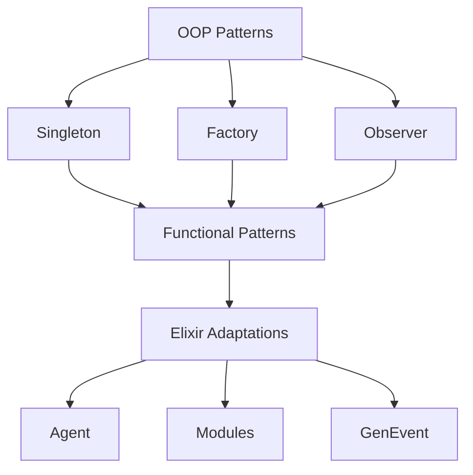

## 1.5. Comparing Object-Oriented and Functional Design Patterns

In the realm of software engineering, design patterns serve as reusable solutions to common problems. They provide a shared language for developers to communicate complex ideas succinctly. As we delve into the world of Elixir, a functional programming language, it is essential to understand how traditional Object-Oriented Programming (OOP) patterns translate into functional paradigms and how unique patterns emerge from functional concepts.

### Translating OOP Patterns to Functional Languages

Object-Oriented Programming and Functional Programming differ fundamentally in their approach to solving problems. OOP is centered around objects and encapsulation, while Functional Programming focuses on immutability and pure functions. Let's explore how some classical OOP patterns adapt to Elixir.

#### Understanding How Classical Design Patterns Adapt to Elixir

1. **Singleton Pattern**

   In OOP, the Singleton Pattern ensures a class has only one instance and provides a global point of access to it. In Elixir, this pattern is often unnecessary due to the language's inherent features, such as modules and processes, which can maintain state across calls.

   ```elixir
   defmodule SingletonExample do
     use Agent

     def start_link(initial_value) do
       Agent.start_link(fn -> initial_value end, name: __MODULE__)
     end

     def get_value do
       Agent.get(__MODULE__, & &1)
     end

     def update_value(new_value) do
       Agent.update(__MODULE__, fn _ -> new_value end)
     end
   end
   ```

   In this example, we use an `Agent` to maintain state, effectively achieving the Singleton behavior without the need for a class-based approach.

2. **Factory Pattern**

   The Factory Pattern in OOP is used to create objects without specifying the exact class of object that will be created. In Elixir, we can use modules and functions to achieve similar behavior.

   ```elixir
   defmodule ShapeFactory do
     def create(:circle, radius), do: %Circle{radius: radius}
     def create(:square, side), do: %Square{side: side}
   end
   ```

   Here, the `ShapeFactory` module provides a `create` function that returns different shapes based on the input parameters.

3. **Observer Pattern**

   The Observer Pattern defines a one-to-many dependency between objects so that when one object changes state, all its dependents are notified. In Elixir, this can be achieved using `GenEvent` or `Phoenix.PubSub`.

   ```elixir
   defmodule ObserverExample do
     use GenEvent

     def handle_event({:notify, message}, state) do
       IO.puts("Received notification: #{message}")
       {:ok, state}
     end
   end
   ```

   This example demonstrates how to use `GenEvent` to implement the Observer Pattern, where events can be broadcasted to all registered handlers.

#### Identifying Patterns Rendered Unnecessary by Functional Features

Functional programming languages like Elixir eliminate the need for certain OOP patterns due to their inherent features:

- **Strategy Pattern**: In functional programming, higher-order functions and first-class functions naturally replace the need for the Strategy Pattern.
- **Iterator Pattern**: Elixir's `Enum` and `Stream` modules provide powerful abstractions for iteration, making the Iterator Pattern redundant.

### Unique Patterns in Functional Programming

Functional programming introduces its own set of patterns that leverage immutability, higher-order functions, and other functional concepts. Let's explore some of these unique patterns.

#### Exploring Patterns That Emerge from Functional Concepts

1. **Functor**

   A Functor is a design pattern that allows you to apply a function over a wrapped value, like a list or a map. In Elixir, this is typically achieved using the `Enum` module.

   ```elixir
   list = [1, 2, 3, 4]
   Enum.map(list, fn x -> x * 2 end)
   ```

   This example demonstrates how to use `Enum.map` to apply a function over each element in a list, effectively using the Functor pattern.

2. **Monad**

   Monads are a powerful functional programming concept used to handle side effects and manage computations. In Elixir, the `with` construct can be used to chain operations in a monadic style.

   ```elixir
   with {:ok, user} <- fetch_user(user_id),
        {:ok, account} <- fetch_account(user),
        {:ok, balance} <- fetch_balance(account) do
     {:ok, balance}
   else
     error -> {:error, error}
   end
   ```

   This code snippet demonstrates how to use the `with` construct to chain operations, handling errors gracefully.

3. **Pipe and Filter**

   The Pipe and Filter pattern is a functional approach to processing data through a series of transformations. Elixir's pipe operator (`|>`) facilitates this pattern.

   ```elixir
   "hello world"
   |> String.upcase()
   |> String.split()
   |> Enum.reverse()
   ```

   This example shows how to use the pipe operator to transform a string through a series of functions.

### Balancing OOP and Functional Approaches

While functional programming offers numerous benefits, there are scenarios where traditional OOP patterns still apply. Understanding when to use each paradigm is crucial for building robust systems.

#### Combining the Strengths of Both Paradigms

1. **Using Structs and Protocols**

   Elixir's structs and protocols provide a way to encapsulate data and define polymorphic behavior, similar to OOP.

   ```elixir
   defprotocol Shape do
     def area(shape)
   end

   defimpl Shape, for: Circle do
     def area(%Circle{radius: radius}), do: 3.14 * radius * radius
   end

   defimpl Shape, for: Square do
     def area(%Square{side: side}), do: side * side
   end
   ```

   This example shows how to use protocols to define polymorphic behavior for different shapes, akin to interfaces in OOP.

2. **Recognizing When Traditional OOP Patterns Still Apply**

   In some cases, such as managing complex state or implementing certain design patterns like the State Pattern, OOP concepts can still be beneficial in a functional language like Elixir.

   ```elixir
   defmodule StateMachine do
     defstruct state: :initial

     def transition(%StateMachine{state: :initial} = sm, :start) do
       %{sm | state: :running}
     end

     def transition(%StateMachine{state: :running} = sm, :stop) do
       %{sm | state: :stopped}
     end
   end
   ```

   Here, we use a struct to manage state transitions, demonstrating how OOP concepts can be adapted to functional programming.

### Visualizing the Translation of Patterns

To better understand how these patterns translate, let's visualize the process using a diagram.


```mermaid
graph TD;
  A[OOP Patterns] --> B[Singleton];
  A --> C[Factory];
  A --> D[Observer];
  B --> E[Functional Patterns];
  C --> E;
  D --> E;
  E --> F[Elixir Adaptations];
  F --> G[Agent];
  F --> H[Modules];
  F --> I[GenEvent];
```

This diagram illustrates the flow from traditional OOP patterns to their functional adaptations in Elixir, highlighting the use of agents, modules, and event handling.

### References and Links

For further reading on design patterns and their application in functional programming, consider these resources:

- [Design Patterns: Elements of Reusable Object-Oriented Software](https://www.amazon.com/Design-Patterns-Elements-Reusable-Object-Oriented/dp/0201633612)
- [Functional Programming Patterns in Scala and Clojure](https://www.amazon.com/Functional-Programming-Patterns-Scala-Clojure/dp/1937785475)
- [Elixir School: Design Patterns](https://elixirschool.com/en/lessons/advanced/design_patterns/)

### Knowledge Check

Before we conclude, let's reinforce our understanding with a few questions:

1. How can the Singleton pattern be implemented in Elixir using functional constructs?
2. What are some functional patterns unique to Elixir?
3. How does the `with` construct in Elixir facilitate monadic operations?
4. When might traditional OOP patterns still be applicable in Elixir?

### Embrace the Journey

Remember, this is just the beginning. As you progress, you'll discover more ways to leverage both OOP and functional paradigms to build robust, scalable systems in Elixir. Keep experimenting, stay curious, and enjoy the journey!

## Quiz Time!



### Which pattern is naturally replaced by higher-order functions in functional programming?

- [x] Strategy Pattern
- [ ] Singleton Pattern
- [ ] Observer Pattern
- [ ] Factory Pattern

> **Explanation:** Higher-order functions allow for dynamic behavior changes, replacing the need for the Strategy Pattern.


### What functional concept is used to handle side effects and manage computations in Elixir?

- [ ] Functor
- [x] Monad
- [ ] Singleton
- [ ] Factory

> **Explanation:** Monads are used to handle side effects and manage computations in a functional style.


### How does Elixir's `with` construct help in chaining operations?

- [x] It allows for sequential execution with error handling.
- [ ] It provides a loop construct.
- [ ] It defines a global state.
- [ ] It creates a new process.

> **Explanation:** The `with` construct allows for sequential execution with error handling, similar to monadic operations.


### Which Elixir feature makes the Singleton pattern often unnecessary?

- [x] Processes and Agents
- [ ] Macros
- [ ] Structs
- [ ] Protocols

> **Explanation:** Processes and Agents in Elixir can maintain state across calls, making the Singleton pattern often unnecessary.


### What is a Functor in functional programming?

- [x] A pattern that allows applying a function over a wrapped value.
- [ ] A pattern for creating objects.
- [ ] A pattern for managing state transitions.
- [ ] A pattern for defining interfaces.

> **Explanation:** A Functor allows applying a function over a wrapped value, such as a list or map.


### Which pattern involves processing data through a series of transformations?

- [x] Pipe and Filter
- [ ] Singleton
- [ ] Observer
- [ ] Factory

> **Explanation:** The Pipe and Filter pattern involves processing data through a series of transformations.


### What is the role of protocols in Elixir?

- [x] They define polymorphic behavior for different data types.
- [ ] They manage global state.
- [ ] They handle concurrency.
- [ ] They create new processes.

> **Explanation:** Protocols define polymorphic behavior for different data types, similar to interfaces in OOP.


### Which Elixir module provides powerful abstractions for iteration, making the Iterator Pattern redundant?

- [x] Enum
- [ ] Agent
- [ ] GenServer
- [ ] Protocol

> **Explanation:** The `Enum` module provides powerful abstractions for iteration, making the Iterator Pattern redundant.


### How can you achieve polymorphic behavior in Elixir?

- [x] Using protocols and implementations.
- [ ] Using macros.
- [ ] Using processes.
- [ ] Using agents.

> **Explanation:** Polymorphic behavior in Elixir is achieved using protocols and implementations.


### True or False: The Factory Pattern in Elixir is implemented using classes.

- [ ] True
- [x] False

> **Explanation:** The Factory Pattern in Elixir is implemented using modules and functions, not classes.




