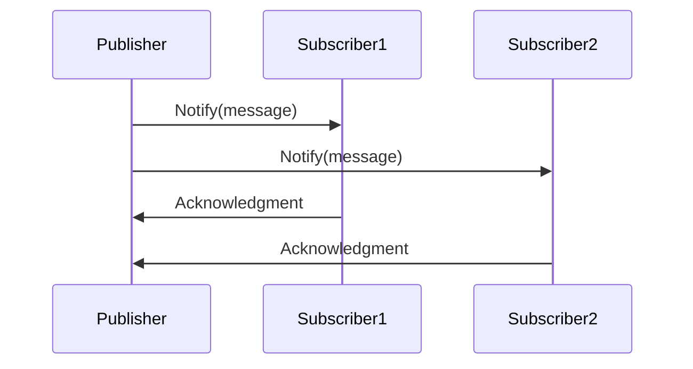
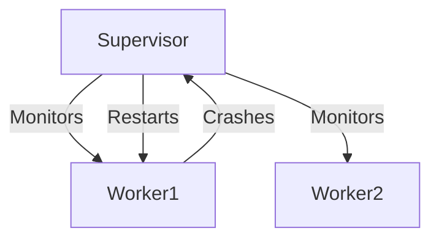

## 1.6. Benefits of Using Design Patterns in Elixir

Design patterns are a crucial aspect of software engineering, providing a structured approach to solving common problems. In Elixir, a functional programming language known for its concurrency and fault-tolerance capabilities, design patterns play a significant role in enhancing code quality and maintainability. This section explores the benefits of using design patterns in Elixir, focusing on enhanced code reusability, improved communication, and optimization for performance.

### Enhanced Code Reusability

One of the primary benefits of using design patterns in Elixir is the enhancement of code reusability. By creating modular and composable components, developers can significantly reduce code duplication and simplify maintenance. Let's delve into how design patterns facilitate these advantages.

#### Creating Modular and Composable Components

Design patterns encourage the development of modular components that can be easily reused across different parts of an application. In Elixir, this modularity is achieved through the use of functions and modules, which are the building blocks of the language.

**Example: Using the Factory Pattern for Modularity**

The Factory Pattern is a creational design pattern that provides an interface for creating objects in a superclass but allows subclasses to alter the type of objects that will be created. In Elixir, this can be implemented using functions and modules to create different types of data structures or processes.

```elixir
defmodule ShapeFactory do
  def create_shape(:circle, radius) do
    %Circle{radius: radius}
  end

  def create_shape(:square, side) do
    %Square{side: side}
  end
end

defmodule Circle do
  defstruct radius: 0
end

defmodule Square do
  defstruct side: 0
end

# Usage
circle = ShapeFactory.create_shape(:circle, 5)
square = ShapeFactory.create_shape(:square, 10)
```

In this example, the `ShapeFactory` module provides a unified interface for creating different shapes, promoting code reuse and modularity.

#### Reducing Duplication and Simplifying Maintenance

By adhering to design patterns, developers can avoid code duplication, which is a common source of bugs and maintenance challenges. Patterns provide a template for solving problems, allowing developers to focus on the unique aspects of their application rather than reinventing the wheel.

**Example: Using the Singleton Pattern for Shared State**

The Singleton Pattern ensures a class has only one instance and provides a global point of access to it. In Elixir, this can be achieved using a GenServer to manage shared state.

```elixir
defmodule ConfigServer do
  use GenServer

  # Client API
  def start_link(initial_config) do
    GenServer.start_link(__MODULE__, initial_config, name: __MODULE__)
  end

  def get_config do
    GenServer.call(__MODULE__, :get_config)
  end

  # Server Callbacks
  def init(initial_config) do
    {:ok, initial_config}
  end

  def handle_call(:get_config, _from, state) do
    {:reply, state, state}
  end
end

# Usage
{:ok, _pid} = ConfigServer.start_link(%{app_name: "MyApp", version: "1.0"})
config = ConfigServer.get_config()
```

This example demonstrates how the Singleton Pattern can be used to manage application configuration, reducing duplication and simplifying maintenance by centralizing configuration management.

### Improved Communication

Design patterns also improve communication among developers by providing a shared vocabulary to describe complex ideas succinctly. This shared understanding facilitates collaboration and onboarding of new team members.

#### Using a Shared Vocabulary

When developers use design patterns, they can communicate complex architectural concepts using well-known terms. This shared vocabulary reduces misunderstandings and accelerates the development process.

**Example: Communicating with the Observer Pattern**

The Observer Pattern is a behavioral design pattern that defines a one-to-many dependency between objects so that when one object changes state, all its dependents are notified and updated automatically. In Elixir, this can be implemented using PubSub mechanisms.

```elixir
defmodule Publisher do
  use GenServer

  def start_link(_) do
    GenServer.start_link(__MODULE__, [], name: __MODULE__)
  end

  def notify_subscribers(message) do
    GenServer.cast(__MODULE__, {:notify, message})
  end

  def handle_cast({:notify, message}, state) do
    Enum.each(state, fn subscriber ->
      send(subscriber, {:new_message, message})
    end)
    {:noreply, state}
  end
end

defmodule Subscriber do
  def start_link do
    spawn(fn -> listen() end)
  end

  defp listen do
    receive do
      {:new_message, message} ->
        IO.puts("Received message: #{message}")
        listen()
    end
  end
end

# Usage
{:ok, _} = Publisher.start_link([])
Subscriber.start_link()
Publisher.notify_subscribers("Hello, World!")
```

In this example, the Observer Pattern is used to notify subscribers of new messages. The pattern's terminology (e.g., "publisher," "subscriber") provides a clear framework for discussing the system's behavior.

#### Facilitating Onboarding of New Team Members

Design patterns serve as a guide for new developers, helping them understand the architecture and design decisions of an application. By following established patterns, new team members can quickly become productive.

**Example: Onboarding with the Strategy Pattern**

The Strategy Pattern defines a family of algorithms, encapsulates each one, and makes them interchangeable. In Elixir, this can be implemented using higher-order functions.

```elixir
defmodule Sorter do
  def sort(list, strategy) do
    strategy.(list)
  end
end

# Strategies
ascending = fn list -> Enum.sort(list) end
descending = fn list -> Enum.sort(list, &>=/2) end

# Usage
list = [5, 3, 8, 1]
Sorter.sort(list, ascending)   # [1, 3, 5, 8]
Sorter.sort(list, descending)  # [8, 5, 3, 1]
```

By using the Strategy Pattern, new developers can easily understand how different sorting strategies are applied, facilitating their integration into the team.

### Optimization and Performance

Design patterns in Elixir are tailored to leverage the language's capabilities, particularly its concurrency model, to implement efficient solutions that optimize performance.

#### Implementing Efficient Solutions

Elixir's design patterns often focus on concurrency and fault tolerance, allowing developers to build scalable applications that can handle high loads and recover from failures gracefully.

**Example: Using the Supervisor Pattern for Fault Tolerance**

The Supervisor Pattern is a core concept in Elixir's OTP framework, used to monitor and restart processes in case of failure.

```elixir
defmodule MyApp.Supervisor do
  use Supervisor

  def start_link(_) do
    Supervisor.start_link(__MODULE__, :ok, name: __MODULE__)
  end

  def init(:ok) do
    children = [
      {Worker, []}
    ]

    Supervisor.init(children, strategy: :one_for_one)
  end
end

defmodule Worker do
  use GenServer

  def start_link(_) do
    GenServer.start_link(__MODULE__, :ok, name: __MODULE__)
  end

  def init(:ok) do
    {:ok, %{}}
  end
end

# Usage
{:ok, _} = MyApp.Supervisor.start_link([])
```

In this example, the Supervisor Pattern is used to ensure that the `Worker` process is restarted if it crashes, enhancing the application's fault tolerance.

#### Leveraging Concurrency Patterns for Scalable Applications

Elixir's concurrency model, based on the Actor Model, allows developers to build highly concurrent and scalable applications. Design patterns that leverage this model can significantly improve application performance.

**Example: Using the GenStage Pattern for Backpressure Handling**

GenStage is a framework for building concurrent data pipelines in Elixir, providing a mechanism for handling backpressure.

```elixir
defmodule Producer do
  use GenStage

  def start_link(_) do
    GenStage.start_link(__MODULE__, 0, name: __MODULE__)
  end

  def init(counter) do
    {:producer, counter}
  end

  def handle_demand(demand, counter) do
    events = Enum.to_list(counter..(counter + demand - 1))
    {:noreply, events, counter + demand}
  end
end

defmodule Consumer do
  use GenStage

  def start_link(_) do
    GenStage.start_link(__MODULE__, :ok, name: __MODULE__)
  end

  def init(:ok) do
    {:consumer, :ok}
  end

  def handle_events(events, _from, state) do
    Enum.each(events, fn event ->
      IO.inspect(event)
    end)
    {:noreply, [], state}
  end
end

# Usage
{:ok, producer} = Producer.start_link([])
{:ok, consumer} = Consumer.start_link([])
GenStage.sync_subscribe(consumer, to: producer)
```

In this example, the GenStage Pattern is used to create a producer-consumer pipeline, efficiently handling data flow and backpressure.

### Visualizing Design Patterns in Elixir

To better understand the relationships and workflows involved in Elixir's design patterns, let's visualize a few key concepts using Mermaid.js diagrams.

#### Visualizing the Observer Pattern



**Caption:** This sequence diagram illustrates the Observer Pattern, where the `Publisher` notifies multiple `Subscribers` of a message.

#### Visualizing the Supervisor Pattern



**Caption:** This flowchart depicts the Supervisor Pattern, showing how the `Supervisor` monitors and restarts `Worker` processes.

### References and Further Reading

- [Elixir Official Documentation](https://elixir-lang.org/docs.html)
- [Design Patterns in Elixir](https://elixirschool.com/en/lessons/advanced/otp_concurrency)
- [Functional Programming Design Patterns](https://www.oreilly.com/library/view/functional-programming-patterns/9781449365509/)

### Knowledge Check

To reinforce your understanding of the benefits of using design patterns in Elixir, consider the following questions and exercises.

1. **Question:** How does the Factory Pattern enhance code reusability in Elixir?
2. **Exercise:** Implement a simple Observer Pattern using Elixir's GenServer.
3. **Question:** What are the advantages of using the Supervisor Pattern for fault tolerance?
4. **Exercise:** Modify the GenStage example to include multiple consumers.

### Embrace the Journey

Remember, mastering design patterns in Elixir is a journey. As you continue to explore and apply these patterns, you'll gain deeper insights into building robust, scalable, and maintainable applications. Keep experimenting, stay curious, and enjoy the process of learning and growing as a developer!

## Quiz: Benefits of Using Design Patterns in Elixir



### How do design patterns enhance code reusability in Elixir?

- [x] By creating modular and composable components
- [ ] By increasing code complexity
- [ ] By reducing the need for documentation
- [ ] By eliminating the need for testing

> **Explanation:** Design patterns enhance code reusability by promoting modular and composable components, which can be reused across different parts of an application.

### What is a key benefit of using a shared vocabulary in design patterns?

- [x] Improved communication among developers
- [ ] Increased code duplication
- [ ] Reduced application performance
- [ ] Decreased onboarding efficiency

> **Explanation:** A shared vocabulary improves communication among developers by providing a common language to describe complex ideas succinctly.

### How does the Singleton Pattern simplify maintenance in Elixir?

- [x] By centralizing configuration management
- [ ] By increasing the number of processes
- [ ] By duplicating configuration data
- [ ] By eliminating the need for supervision

> **Explanation:** The Singleton Pattern simplifies maintenance by centralizing configuration management, reducing duplication and potential errors.

### What is the primary focus of design patterns in Elixir regarding performance?

- [x] Leveraging concurrency patterns for scalability
- [ ] Increasing code complexity
- [ ] Reducing code readability
- [ ] Eliminating the need for optimization

> **Explanation:** Design patterns in Elixir focus on leveraging concurrency patterns to build scalable applications that can handle high loads efficiently.

### How does the Supervisor Pattern enhance fault tolerance?

- [x] By monitoring and restarting processes
- [ ] By increasing process complexity
- [x] By reducing the need for error handling
- [ ] By eliminating process failures

> **Explanation:** The Supervisor Pattern enhances fault tolerance by monitoring processes and restarting them in case of failure, ensuring system stability.

### What role does the Strategy Pattern play in onboarding new team members?

- [x] It provides a clear framework for understanding different strategies
- [ ] It increases the complexity of algorithms
- [ ] It reduces code readability
- [ ] It eliminates the need for documentation

> **Explanation:** The Strategy Pattern provides a clear framework for understanding different strategies, facilitating the onboarding of new team members.

### How does the Observer Pattern improve communication in Elixir applications?

- [x] By providing a clear framework for notifying subscribers
- [ ] By increasing the number of messages
- [x] By reducing the need for acknowledgments
- [ ] By eliminating message passing

> **Explanation:** The Observer Pattern improves communication by providing a clear framework for notifying subscribers of changes, ensuring consistent updates.

### What is a key advantage of using GenStage for data pipelines?

- [x] Efficient handling of data flow and backpressure
- [ ] Increased data duplication
- [ ] Reduced data processing speed
- [ ] Elimination of data transformation

> **Explanation:** GenStage provides efficient handling of data flow and backpressure, making it ideal for building concurrent data pipelines.

### How do design patterns facilitate code maintenance?

- [x] By providing templates for solving common problems
- [ ] By increasing code complexity
- [ ] By reducing code readability
- [ ] By eliminating the need for testing

> **Explanation:** Design patterns facilitate code maintenance by providing templates for solving common problems, allowing developers to focus on unique aspects of their application.

### True or False: Design patterns in Elixir are only beneficial for large applications.

- [ ] True
- [x] False

> **Explanation:** Design patterns in Elixir are beneficial for applications of all sizes, as they promote code reusability, improved communication, and optimized performance.


