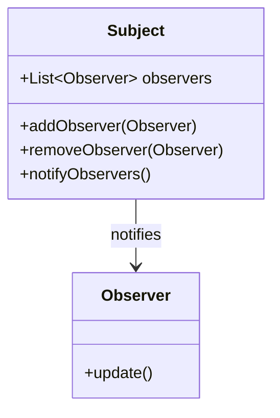
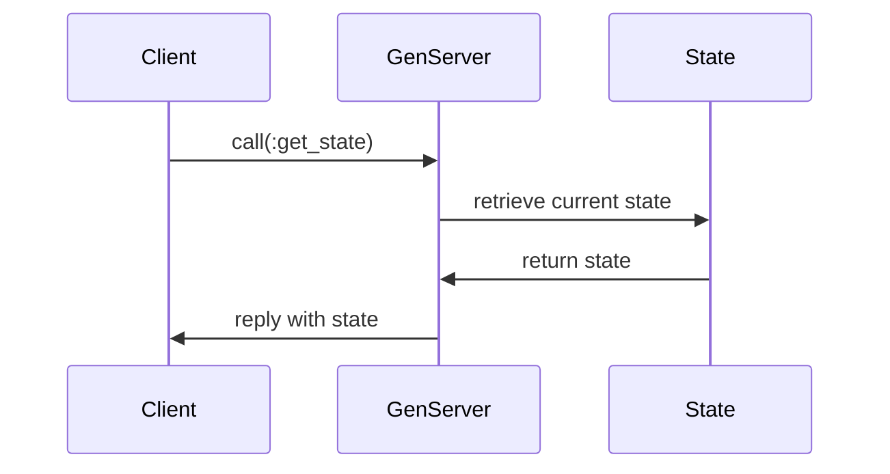

## 1.6. Benefits of Using Design Patterns in Elixir

Design patterns are essential tools in the arsenal of expert software engineers and architects, especially when working with a language as powerful and concurrent as Elixir. This section will delve into the various benefits of using design patterns in Elixir, focusing on enhanced code reusability, improved communication, and optimization and performance. By understanding and applying these patterns, you can create robust, scalable, and maintainable applications.

### Enhanced Code Reusability

One of the primary benefits of using design patterns in Elixir is the enhancement of code reusability. Let's explore how design patterns facilitate this:

#### Creating Modular and Composable Components

Design patterns encourage the creation of modular and composable components, which can be reused across different parts of an application or even in different projects. By adhering to well-defined patterns, developers can build components that are:

- **Independent:** Each component can be developed, tested, and maintained separately.
- **Interchangeable:** Components can be swapped out or upgraded without affecting the rest of the system.
- **Composable:** Smaller components can be combined to create more complex functionalities.

**Example Code:**

```elixir
defmodule MathOperations do
  def add(a, b), do: a + b
  def subtract(a, b), do: a - b
end

defmodule Calculator do
  alias MathOperations, as: Ops

  def calculate(:add, a, b), do: Ops.add(a, b)
  def calculate(:subtract, a, b), do: Ops.subtract(a, b)
end

# Usage
IO.puts Calculator.calculate(:add, 5, 3)  # Output: 8
```

*Explanation:* In this example, `MathOperations` is a modular component that can be reused in different contexts. The `Calculator` module composes these operations, demonstrating how modular components can be leveraged.

#### Reducing Duplication and Simplifying Maintenance

Design patterns help in reducing code duplication by providing a standard way to solve common problems. This not only simplifies maintenance but also ensures that the codebase is consistent and easier to understand.

**Example Code:**

```elixir
defmodule Logger do
  def log(message), do: IO.puts("[LOG]: #{message}")
end

defmodule UserService do
  alias Logger

  def create_user(user) do
    Logger.log("Creating user: #{user}")
    # User creation logic
  end
end

defmodule OrderService do
  alias Logger

  def create_order(order) do
    Logger.log("Creating order: #{order}")
    # Order creation logic
  end
end
```

*Explanation:* The `Logger` module is a reusable component that reduces duplication. Both `UserService` and `OrderService` use it to log messages, demonstrating how design patterns can simplify maintenance.

### Improved Communication

Design patterns provide a shared vocabulary that enhances communication among team members, making it easier to describe complex ideas succinctly.

#### Using a Shared Vocabulary

When developers use design patterns, they can refer to these patterns by name, which conveys a wealth of information without needing to delve into implementation details. This shared vocabulary is crucial for:

- **Documentation:** Patterns make documentation more concise and understandable.
- **Code Reviews:** Reviewers can quickly grasp the intent behind code structures.
- **Collaboration:** Team members can discuss solutions more effectively.

**Example Code:**

```elixir
defmodule ObserverPattern do
  defstruct observers: []

  def add_observer(observer, %ObserverPattern{observers: observers} = state) do
    %{state | observers: [observer | observers]}
  end

  def notify_observers(message, %ObserverPattern{observers: observers}) do
    Enum.each(observers, fn observer -> observer.notify(message) end)
  end
end
```

*Explanation:* By naming the module `ObserverPattern`, it immediately communicates its purpose and the design pattern it implements, facilitating better understanding and communication.

#### Facilitating Onboarding of New Team Members

Design patterns also play a critical role in onboarding new team members. When a codebase follows well-known patterns, new developers can more quickly understand the architecture and contribute effectively.

- **Familiarity:** New team members familiar with common design patterns can quickly acclimate to the codebase.
- **Guidance:** Patterns provide a roadmap for how to structure new features or refactor existing code.

### Optimization and Performance

Design patterns are instrumental in optimizing applications and leveraging Elixir's unique capabilities, particularly its concurrency model.

#### Implementing Efficient Solutions Tailored to Elixir’s Capabilities

Elixir's design patterns often leverage its strengths, such as immutability and the actor model, to create efficient solutions.

**Example Code:**

```elixir
defmodule Worker do
  use GenServer

  def start_link(initial_state) do
    GenServer.start_link(__MODULE__, initial_state, name: __MODULE__)
  end

  def init(state), do: {:ok, state}

  def handle_call(:get_state, _from, state), do: {:reply, state, state}

  def handle_cast({:set_state, new_state}, _state), do: {:noreply, new_state}
end

# Usage
{:ok, pid} = Worker.start_link(%{})
GenServer.call(pid, :get_state)
GenServer.cast(pid, {:set_state, %{key: "value"}})
```

*Explanation:* This code uses the GenServer pattern, which is optimized for Elixir's concurrency model, allowing for efficient state management and communication between processes.

#### Leveraging Concurrency Patterns for Scalable Applications

Elixir's concurrency patterns, such as those provided by OTP, are crucial for building scalable applications. These patterns ensure that applications can handle high loads and remain responsive.

**Example Code:**

```elixir
defmodule TaskManager do
  def run_tasks(tasks) do
    tasks
    |> Enum.map(&Task.async(fn -> perform_task(&1) end))
    |> Enum.map(&Task.await(&1))
  end

  defp perform_task(task), do: # Task execution logic
end

# Usage
tasks = [task1, task2, task3]
TaskManager.run_tasks(tasks)
```

*Explanation:* The `TaskManager` module demonstrates how to use Elixir's `Task` module to run tasks concurrently, leveraging Elixir's ability to handle concurrent processes efficiently.

### Visualizing Design Patterns in Elixir

To better understand how design patterns function within Elixir, let's visualize a few key concepts using diagrams.

#### Diagram: Observer Pattern in Elixir


```mermaid
classDiagram
    class Subject {
      +List~Observer~ observers
      +addObserver(Observer)
      +removeObserver(Observer)
      +notifyObservers()
    }

    class Observer {
      +update()
    }

    Subject --> Observer : notifies
```

*Caption:* This diagram illustrates the Observer pattern, where the `Subject` maintains a list of `Observer` instances and notifies them of any changes.

#### Diagram: GenServer Process Flow


```mermaid
sequenceDiagram
    participant Client
    participant GenServer
    participant State

    Client->>GenServer: call(:get_state)
    GenServer->>State: retrieve current state
    State->>GenServer: return state
    GenServer->>Client: reply with state
```

*Caption:* This sequence diagram shows the flow of a GenServer call, highlighting the interaction between the client, the GenServer process, and the state.

### References and Links

- [Elixir School - Design Patterns](https://elixirschool.com/en/lessons/advanced/design_patterns/)
- [Learn You Some Erlang for Great Good!](http://learnyousomeerlang.com/)
- [Elixir Lang - Getting Started](https://elixir-lang.org/getting-started/introduction.html)

### Knowledge Check

To reinforce your understanding of the benefits of using design patterns in Elixir, consider the following questions:

- How do design patterns enhance code reusability in Elixir?
- What role do design patterns play in improving communication among developers?
- How can design patterns optimize performance in Elixir applications?

### Embrace the Journey

Remember, mastering design patterns in Elixir is a journey. As you continue to explore and apply these patterns, you'll discover new ways to enhance your applications' robustness and scalability. Keep experimenting, stay curious, and enjoy the process of building with Elixir!

## Quiz Time!



### What is one primary benefit of using design patterns in Elixir?

- [x] Enhanced code reusability
- [ ] Increased code verbosity
- [ ] Reduced application performance
- [ ] Decreased modularity

> **Explanation:** Design patterns enhance code reusability by promoting modular and composable components.

### How do design patterns improve communication among developers?

- [x] By providing a shared vocabulary
- [ ] By increasing code complexity
- [ ] By reducing documentation needs
- [ ] By eliminating code reviews

> **Explanation:** Design patterns offer a shared vocabulary that helps developers communicate complex ideas succinctly.

### What is a key advantage of using concurrency patterns in Elixir?

- [x] Scalability
- [ ] Increased memory usage
- [ ] Reduced fault tolerance
- [ ] Slower execution times

> **Explanation:** Concurrency patterns in Elixir enhance scalability by efficiently managing concurrent processes.

### How do design patterns facilitate onboarding of new team members?

- [x] By providing familiar structures
- [ ] By increasing codebase size
- [ ] By reducing documentation
- [ ] By complicating code logic

> **Explanation:** Design patterns provide familiar structures that help new team members understand the codebase more quickly.

### What is a benefit of using the GenServer pattern in Elixir?

- [x] Efficient state management
- [ ] Increased code duplication
- [ ] Reduced process communication
- [ ] Slower response times

> **Explanation:** The GenServer pattern is optimized for efficient state management and process communication in Elixir.

### How do design patterns simplify maintenance?

- [x] By reducing code duplication
- [ ] By increasing code complexity
- [ ] By eliminating comments
- [ ] By complicating function signatures

> **Explanation:** Design patterns reduce code duplication, making maintenance simpler and more consistent.

### What is a benefit of modular components in design patterns?

- [x] Independence and interchangeability
- [ ] Increased coupling
- [ ] Reduced reusability
- [ ] Decreased flexibility

> **Explanation:** Modular components are independent and interchangeable, enhancing reusability and flexibility.

### How do design patterns impact performance optimization?

- [x] By leveraging Elixir's capabilities
- [ ] By increasing execution time
- [ ] By reducing concurrency
- [ ] By complicating algorithms

> **Explanation:** Design patterns optimize performance by leveraging Elixir's unique capabilities, such as concurrency.

### What is a key feature of the Observer pattern?

- [x] Notification of observers
- [ ] Direct state modification
- [ ] Increased coupling
- [ ] Reduced communication

> **Explanation:** The Observer pattern involves notifying observers of changes, maintaining decoupling.

### True or False: Design patterns in Elixir are only beneficial for large applications.

- [ ] True
- [x] False

> **Explanation:** Design patterns are beneficial for applications of all sizes, as they enhance reusability, communication, and performance.


