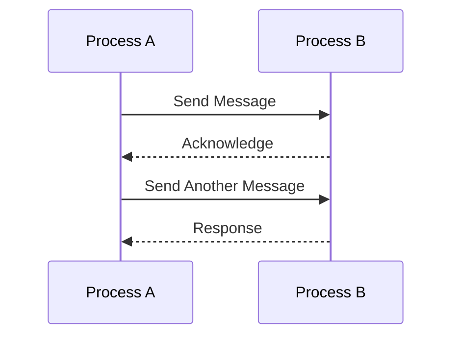

## 1.7. Overview of Elixir's Features Relevant to Design Patterns

Elixir, a dynamic, functional language built on the Erlang VM, offers a unique set of features that make it particularly well-suited for implementing design patterns. This section provides an in-depth exploration of Elixir's features that are most relevant to design patterns, including concurrent and distributed computing, pattern matching and immutability, metaprogramming and macros, and functional programming constructs. By understanding these features, expert software engineers and architects can leverage Elixir to build scalable, maintainable, and efficient systems.

### Concurrent and Distributed Computing

Elixir's concurrency model is one of its most powerful features, enabling developers to build highly concurrent and distributed systems with ease. Let's delve into the key aspects of this model:

#### Lightweight Processes and Message Passing

Elixir processes are lightweight and run on the BEAM VM, allowing for millions of concurrent processes. These processes communicate via message passing, which is a core concept in Elixir's concurrency model.

```elixir
defmodule Counter do
  def start(initial_value) do
    spawn(fn -> loop(initial_value) end)
  end

  defp loop(value) do
    receive do
      {:increment, caller} ->
        send(caller, {:ok, value + 1})
        loop(value + 1)

      {:get_value, caller} ->
        send(caller, {:ok, value})
        loop(value)
    end
  end
end

# Usage
counter = Counter.start(0)
send(counter, {:increment, self()})
receive do
  {:ok, new_value} -> IO.puts("New value: #{new_value}")
end
```

In this example, we define a simple counter process that can increment its value and return the current value. The `receive` block handles messages sent to the process, demonstrating Elixir's message-passing capabilities.

#### Fault Tolerance with Supervisors and the OTP Framework

Elixir's fault tolerance is largely attributed to the OTP (Open Telecom Platform) framework, which provides tools for building robust applications. Supervisors are a key component, managing processes and ensuring system reliability.

```elixir
defmodule CounterSupervisor do
  use Supervisor

  def start_link(initial_value) do
    Supervisor.start_link(__MODULE__, initial_value, name: __MODULE__)
  end

  def init(initial_value) do
    children = [
      {Counter, initial_value}
    ]

    Supervisor.init(children, strategy: :one_for_one)
  end
end
```

In this example, a supervisor is set up to monitor a `Counter` process. If the process crashes, the supervisor will restart it, ensuring continuous operation.

### Pattern Matching and Immutability

Pattern matching and immutability are foundational to Elixir's expressive and reliable code.

#### Expressive Code Through Pattern Matching

Pattern matching allows for concise and readable code, making it easier to implement complex logic.

```elixir
defmodule Math do
  def add({a, b}), do: a + b
end

IO.puts(Math.add({1, 2})) # Output: 3
```

In this example, pattern matching is used to destructure a tuple, providing a clear and concise way to access its elements.

#### Benefits of Immutable Data Structures

Immutability ensures that data cannot be changed once created, leading to safer and more predictable code.

```elixir
list = [1, 2, 3]
new_list = [0 | list]

IO.inspect(new_list) # Output: [0, 1, 2, 3]
IO.inspect(list)     # Output: [1, 2, 3]
```

Here, `new_list` is created by prepending `0` to `list`, demonstrating how immutability allows for safe data manipulation without altering the original data.

### Metaprogramming and Macros

Elixir's metaprogramming capabilities allow developers to extend the language and create domain-specific languages (DSLs).

#### Extending the Language with Custom Constructs

Macros enable the creation of custom constructs, providing flexibility and power.

```elixir
defmodule MyMacro do
  defmacro say_hello(name) do
    quote do
      IO.puts("Hello, #{unquote(name)}!")
    end
  end
end

defmodule Greeter do
  require MyMacro
  MyMacro.say_hello("World")
end
```

In this example, a macro `say_hello` is defined to print a greeting, showcasing how macros can be used to generate code at compile time.

#### Generating Code at Compile Time for Flexibility

Macros allow for code generation at compile time, enabling optimizations and customizations that are not possible with runtime code.

### Functional Programming Constructs

Elixir embraces functional programming, providing constructs that facilitate functional design patterns.

#### Higher-Order Functions and Function Composition

Higher-order functions and function composition are central to Elixir's functional programming paradigm.

```elixir
add = fn a, b -> a + b end
multiply = fn a, b -> a * b end

compose = fn f, g ->
  fn x, y -> f.(g.(x, y), y) end
end

add_then_multiply = compose.(multiply, add)
IO.puts(add_then_multiply.(2, 3)) # Output: 15
```

In this example, `compose` is a higher-order function that combines `add` and `multiply`, demonstrating function composition.

#### Use of Pipelines and Enumerables

Pipelines and enumerables simplify data processing and transformation.

```elixir
result = [1, 2, 3, 4]
|> Enum.map(&(&1 * 2))
|> Enum.filter(&(&1 > 4))

IO.inspect(result) # Output: [6, 8]
```

The pipeline operator (`|>`) is used to chain transformations, making the code more readable and expressive.

### Visualizing Elixir's Features

To better understand how these features interact, let's visualize the process flow in Elixir's concurrency model using a Mermaid.js diagram.



This diagram illustrates the message-passing mechanism between two processes, highlighting Elixir's concurrent nature.

### References and Links

For further reading on Elixir's features and design patterns, consider exploring the following resources:

- [Elixir Official Documentation](https://elixir-lang.org/docs.html)
- [Learn You Some Erlang for Great Good!](https://learnyousomeerlang.com/)
- [Programming Elixir ≥ 1.6](https://pragprog.com/titles/elixir16/programming-elixir-1-6/)

### Knowledge Check

To reinforce your understanding of Elixir's features, consider the following questions:

- How does Elixir's concurrency model differ from traditional threading models?
- What are the benefits of using pattern matching in Elixir?
- How can macros be used to extend Elixir's language capabilities?
- What role do higher-order functions play in functional programming?

### Embrace the Journey

Remember, mastering Elixir's features is a journey. As you explore these concepts, experiment with code examples, and apply them to real-world scenarios, you'll gain a deeper understanding of how to leverage Elixir for building robust and scalable systems. Keep experimenting, stay curious, and enjoy the journey!

### Quiz: Overview of Elixir's Features Relevant to Design Patterns



### What is a key feature of Elixir's concurrency model?

- [x] Lightweight processes and message passing
- [ ] Heavyweight threads and shared memory
- [ ] Global locks and semaphores
- [ ] Synchronous communication

> **Explanation:** Elixir uses lightweight processes and message passing, allowing for high concurrency without shared memory.

### How does pattern matching enhance code expressiveness in Elixir?

- [x] By allowing concise and readable code
- [ ] By enforcing strict type checking
- [ ] By enabling dynamic typing
- [ ] By reducing code execution speed

> **Explanation:** Pattern matching allows for concise and readable code, making complex logic easier to implement.

### What is the primary benefit of immutability in Elixir?

- [x] Safer and more predictable code
- [ ] Faster execution times
- [ ] Easier debugging
- [ ] Increased memory usage

> **Explanation:** Immutability ensures that data cannot be changed once created, leading to safer and more predictable code.

### How do macros extend Elixir's language capabilities?

- [x] By generating code at compile time
- [ ] By modifying runtime behavior
- [ ] By enforcing strict typing
- [ ] By optimizing memory usage

> **Explanation:** Macros allow for code generation at compile time, enabling custom constructs and optimizations.

### What is a key advantage of using higher-order functions in Elixir?

- [x] They facilitate function composition
- [ ] They enforce strict typing
- [ ] They increase execution speed
- [ ] They simplify error handling

> **Explanation:** Higher-order functions facilitate function composition, allowing for more flexible and reusable code.

### What does the pipeline operator (`|>`) do in Elixir?

- [x] Chains transformations in a readable manner
- [ ] Executes functions in parallel
- [ ] Enforces strict typing
- [ ] Optimizes memory usage

> **Explanation:** The pipeline operator chains transformations, making the code more readable and expressive.

### How does Elixir achieve fault tolerance?

- [x] Through Supervisors and the OTP framework
- [ ] By using global locks
- [ ] By enforcing strict typing
- [ ] By optimizing memory usage

> **Explanation:** Elixir uses Supervisors and the OTP framework to manage processes and ensure system reliability.

### What is a benefit of using enumerables in Elixir?

- [x] Simplified data processing and transformation
- [ ] Increased execution speed
- [ ] Enforced strict typing
- [ ] Reduced memory usage

> **Explanation:** Enumerables simplify data processing and transformation, making code more readable and expressive.

### What is the role of the BEAM VM in Elixir's concurrency model?

- [x] It allows for millions of concurrent processes
- [ ] It enforces strict typing
- [ ] It optimizes memory usage
- [ ] It simplifies error handling

> **Explanation:** The BEAM VM allows for millions of concurrent processes, enabling high concurrency in Elixir.

### True or False: Elixir's concurrency model relies on shared memory.

- [ ] True
- [x] False

> **Explanation:** Elixir's concurrency model relies on message passing, not shared memory, to achieve high concurrency.


