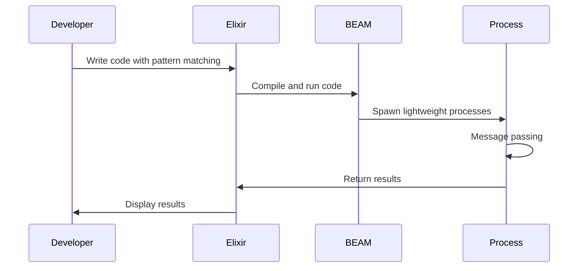

## 1.7. Overview of Elixir's Features Relevant to Design Patterns

Elixir is a dynamic, functional language designed for building scalable and maintainable applications. Its features, such as concurrency, pattern matching, metaprogramming, and functional programming constructs, make it particularly suited for implementing design patterns efficiently. Let's delve into these features and understand how they contribute to crafting robust software architectures.

### Concurrent and Distributed Computing

Elixir's concurrency model is one of its standout features, built on the Erlang VM (BEAM), which is renowned for its ability to handle thousands of concurrent processes. This capability is crucial for implementing design patterns that require concurrent execution and distributed systems.

#### Lightweight Processes and Message Passing

Elixir processes are lightweight and isolated, allowing developers to create thousands of processes without significant overhead. These processes communicate through message passing, which is a key concept in many design patterns, such as the Actor Model.

```elixir
defmodule Greeter do
  def greet do
    receive do
      {:hello, name} -> IO.puts("Hello, #{name}!")
    end
  end
end

# Start a process
pid = spawn(Greeter, :greet, [])

# Send a message
send(pid, {:hello, "Alice"})
```

In this example, a simple process is spawned to greet a user. The process waits for a message and responds by printing a greeting. This demonstrates the ease of creating concurrent processes in Elixir.

#### Fault Tolerance with Supervisors and the OTP Framework

Elixir's OTP (Open Telecom Platform) framework provides tools for building fault-tolerant applications. Supervisors are a core component, responsible for monitoring processes and restarting them if they fail.

```elixir
defmodule MyApp.Supervisor do
  use Supervisor

  def start_link do
    Supervisor.start_link(__MODULE__, :ok, name: __MODULE__)
  end

  def init(:ok) do
    children = [
      {Greeter, []}
    ]

    Supervisor.init(children, strategy: :one_for_one)
  end
end
```

Here, a supervisor is defined to manage the `Greeter` process. If the process crashes, the supervisor will restart it, ensuring the system remains resilient.

### Pattern Matching and Immutability

Pattern matching and immutability are foundational features in Elixir, enabling expressive and declarative code. They are essential for implementing design patterns that rely on clear and concise code structures.

#### Expressive Code Through Pattern Matching

Pattern matching allows developers to destructure data and match specific patterns, making code more readable and maintainable.

```elixir
defmodule Calculator do
  def calculate({:add, a, b}), do: a + b
  def calculate({:subtract, a, b}), do: a - b
end

IO.puts Calculator.calculate({:add, 5, 3}) # Outputs 8
IO.puts Calculator.calculate({:subtract, 5, 3}) # Outputs 2
```

In this example, pattern matching is used to define operations in a calculator, making the code intuitive and easy to extend.

#### Benefits of Immutable Data Structures

Immutability ensures that data cannot be changed once created, leading to safer and more predictable code.

```elixir
list = [1, 2, 3]
new_list = [0 | list]

IO.inspect(new_list) # Outputs [0, 1, 2, 3]
IO.inspect(list) # Outputs [1, 2, 3]
```

Here, a new list is created by prepending an element, demonstrating how immutability preserves the original data structure.

### Metaprogramming and Macros

Elixir's metaprogramming capabilities allow developers to extend the language with custom constructs and generate code at compile time, offering flexibility and power in implementing design patterns.

#### Extending the Language with Custom Constructs

Macros in Elixir enable developers to write code that writes code, allowing for the creation of domain-specific languages (DSLs) and abstractions.

```elixir
defmodule MyMacro do
  defmacro say_hello(name) do
    quote do
      IO.puts("Hello, " <> unquote(name))
    end
  end
end

require MyMacro
MyMacro.say_hello("World") # Outputs "Hello, World"
```

This macro defines a simple construct to print a greeting, showcasing the power of metaprogramming in Elixir.

#### Generating Code at Compile Time for Flexibility

Compile-time code generation can optimize performance and reduce runtime errors by ensuring code correctness before execution.

```elixir
defmodule CompileTimeExample do
  defmacro compile_time_assert(condition) do
    unless condition do
      raise "Compile-time assertion failed"
    end
  end
end

require CompileTimeExample
CompileTimeExample.compile_time_assert(1 + 1 == 2) # Passes
```

This macro performs a compile-time assertion, demonstrating how Elixir can enforce constraints during compilation.

### Functional Programming Constructs

Elixir embraces functional programming, offering constructs like higher-order functions, pipelines, and enumerables, which are instrumental in implementing functional design patterns.

#### Higher-Order Functions and Function Composition

Higher-order functions take other functions as arguments or return them as results, enabling powerful abstractions.

```elixir
defmodule Math do
  def apply(fn, value), do: fn.(value)
end

double = fn x -> x * 2 end
IO.puts Math.apply(double, 5) # Outputs 10
```

This example shows how a function can be passed and applied, illustrating the concept of higher-order functions.

#### Use of Pipelines and Enumerables

Pipelines and enumerables facilitate data transformation and manipulation in a functional style.

```elixir
result = [1, 2, 3, 4]
|> Enum.map(&(&1 * 2))
|> Enum.filter(&(&1 > 4))

IO.inspect(result) # Outputs [6, 8]
```

Here, a list is transformed using a pipeline, demonstrating how data flows through a series of transformations in a concise manner.

### Visualizing Elixir's Features

To better understand how these features interconnect, let's visualize Elixir's architecture and its impact on design patterns using a sequence diagram.


```mermaid
sequenceDiagram
    participant Developer
    participant Elixir
    participant BEAM
    participant Process
    Developer->>Elixir: Write code with pattern matching
    Elixir->>BEAM: Compile and run code
    BEAM->>Process: Spawn lightweight processes
    Process->>Process: Message passing
    Process->>Elixir: Return results
    Elixir->>Developer: Display results
```

This diagram illustrates the flow from writing Elixir code to executing it on the BEAM, highlighting key features like process spawning and message passing.

### References and Further Reading

- [Elixir Official Documentation](https://elixir-lang.org/docs.html)
- [Learn You Some Erlang for Great Good!](http://learnyousomeerlang.com/)
- [Programming Elixir ≥ 1.6](https://pragprog.com/titles/elixir16/programming-elixir-1-6/)

### Knowledge Check

- **Question:** How does Elixir's concurrency model differ from traditional threading models?
- **Challenge:** Modify the `Greeter` example to handle multiple greetings concurrently.
- **Exercise:** Implement a simple calculator using pattern matching for operations.

### Embrace the Journey

Remember, this is just the beginning. As you progress, you'll uncover more of Elixir's powerful features and how they can be harnessed to implement sophisticated design patterns. Keep experimenting, stay curious, and enjoy the journey!

## Quiz Time!



### What is a key feature of Elixir's concurrency model?

- [x] Lightweight processes
- [ ] Heavyweight threads
- [ ] Shared memory
- [ ] Synchronous execution

> **Explanation:** Elixir uses lightweight processes for concurrency, allowing thousands of processes to run concurrently without significant overhead.

### How do Elixir processes communicate?

- [x] Message passing
- [ ] Shared memory
- [ ] Direct function calls
- [ ] Global variables

> **Explanation:** Elixir processes communicate through message passing, which ensures isolation and fault tolerance.

### What is the purpose of a Supervisor in Elixir?

- [x] To monitor and restart processes
- [ ] To execute tasks concurrently
- [ ] To manage memory allocation
- [ ] To compile code

> **Explanation:** Supervisors in Elixir are responsible for monitoring processes and restarting them if they fail, contributing to the system's fault tolerance.

### What does pattern matching in Elixir allow you to do?

- [x] Destructure data and match specific patterns
- [ ] Allocate memory dynamically
- [ ] Execute code concurrently
- [ ] Compile code at runtime

> **Explanation:** Pattern matching in Elixir allows developers to destructure data and match specific patterns, making code more readable and maintainable.

### Why is immutability important in Elixir?

- [x] It ensures data safety and predictability
- [ ] It allows dynamic memory allocation
- [ ] It speeds up code execution
- [ ] It enables direct hardware access

> **Explanation:** Immutability ensures that data cannot be changed once created, leading to safer and more predictable code.

### What can macros in Elixir be used for?

- [x] Writing code that writes code
- [ ] Directly accessing hardware
- [ ] Managing memory
- [ ] Running code in parallel

> **Explanation:** Macros in Elixir enable developers to write code that writes code, allowing for the creation of domain-specific languages and abstractions.

### How do pipelines in Elixir enhance code readability?

- [x] By allowing data to flow through transformations concisely
- [ ] By increasing execution speed
- [ ] By reducing memory usage
- [ ] By enabling direct hardware access

> **Explanation:** Pipelines in Elixir facilitate data transformation and manipulation in a functional style, enhancing code readability.

### What is a higher-order function in Elixir?

- [x] A function that takes other functions as arguments or returns them
- [ ] A function that executes code in parallel
- [ ] A function that manages memory allocation
- [ ] A function that compiles code at runtime

> **Explanation:** Higher-order functions take other functions as arguments or return them as results, enabling powerful abstractions.

### What does the OTP framework provide in Elixir?

- [x] Tools for building fault-tolerant applications
- [ ] Direct access to hardware
- [ ] Memory management utilities
- [ ] Real-time execution capabilities

> **Explanation:** The OTP framework provides tools for building fault-tolerant applications, including supervisors and process management.

### True or False: Elixir's pattern matching can be used to allocate memory dynamically.

- [ ] True
- [x] False

> **Explanation:** Pattern matching in Elixir is used for destructuring data and matching specific patterns, not for memory allocation.




