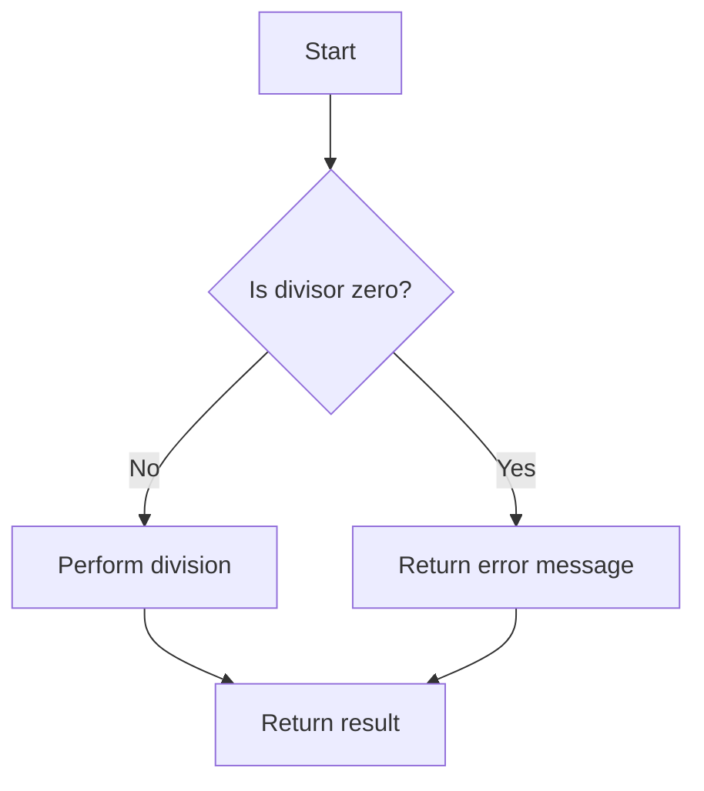

## 1.8. How to Use This Guide

Welcome to the **Elixir Design Patterns: Advanced Guide for Expert Software Engineers and Architects**. This guide is meticulously crafted to elevate your understanding and application of design patterns within the Elixir ecosystem. As an expert software engineer or architect, you are already familiar with the basics of Elixir and functional programming. This guide aims to deepen your expertise, providing you with the tools to build scalable, fault-tolerant systems using Elixir.

### Intended Audience

This guide is specifically designed for:

- **Experienced Software Engineers**: Those who have a solid understanding of Elixir and are looking to apply advanced design patterns to enhance their projects.
- **Software Architects**: Professionals responsible for designing robust, scalable systems and seeking to leverage Elixir's unique features.
- **Functional Programming Enthusiasts**: Individuals interested in exploring the functional paradigm through practical design patterns.

### Structure of the Guide

The guide is organized into several comprehensive sections, each focusing on different aspects of Elixir design patterns. Here's how you can navigate through it:

#### 1. **Introduction to Design Patterns in Elixir**

This section sets the stage by explaining what design patterns are in the context of Elixir and why they matter. It compares object-oriented and functional design patterns, highlighting the benefits of using design patterns in Elixir.

#### 2. **Principles of Functional Programming in Elixir**

Understand the core principles of functional programming, such as immutability, pure functions, and pattern matching. These principles are foundational to effectively applying design patterns in Elixir.

#### 3. **Elixir Language Features and Best Practices**

Explore Elixir's language features, including data types, modules, and the pipe operator. This section also covers best practices for writing clean, efficient Elixir code.

#### 4. **Idiomatic Elixir Patterns**

Learn about idiomatic patterns that are unique to Elixir, such as using the pipe operator effectively and leveraging pattern matching in function definitions.

#### 5-7. **Creational, Structural, and Behavioral Design Patterns**

These sections delve into traditional design pattern categories, adapted for Elixir's functional paradigm. Each pattern is explained with examples and use cases.

#### 8. **Functional Design Patterns**

Focus on patterns that emphasize functional programming concepts, such as currying, higher-order functions, and lazy evaluation.

#### 9-12. **Advanced Topics**

Explore reactive programming, OTP design principles, concurrency patterns, and microservices design patterns. These sections are crucial for building scalable, distributed systems.

#### 13-32. **Specialized Topics**

These sections cover a wide range of topics, from web development with Phoenix to data engineering, machine learning, and DevOps. Each topic is explored in depth, providing practical insights and examples.

### Applying the Knowledge

To make the most of this guide, we encourage you to:

- **Integrate Patterns into Real-World Projects**: As you progress through the guide, think about how each pattern can be applied to your current projects. Consider the specific challenges you face and how these patterns can provide solutions.

- **Experiment with Code Examples**: Each section includes code examples that illustrate the concepts discussed. Try modifying these examples to see how changes affect the outcome. This hands-on approach will deepen your understanding.

- **Engage with the Community**: Elixir has a vibrant community. Engage with other developers through forums, GitHub, and local meetups. Sharing your experiences and learning from others can provide new insights and ideas.

### Additional Resources

To supplement your learning, we provide references to further reading and community support:

- **Books and Articles**: Explore recommended books and articles that delve deeper into specific topics covered in this guide.
- **Online Courses and Tutorials**: Consider enrolling in online courses or following tutorials to reinforce your understanding.
- **Community Forums and Groups**: Join Elixir forums and groups to connect with other developers and stay updated on the latest trends and best practices.

### Code Examples

Throughout the guide, you'll find numerous code examples. Here's a sample to illustrate how to use pattern matching in function definitions:

```elixir
defmodule Math do
  # Function to add two numbers
  def add(a, b) do
    a + b
  end

  # Function to subtract two numbers
  def subtract(a, b) do
    a - b
  end

  # Function to multiply two numbers
  def multiply(a, b) do
    a * b
  end

  # Function to divide two numbers with pattern matching for zero division
  def divide(_, 0) do
    {:error, "Cannot divide by zero"}
  end

  def divide(a, b) do
    {:ok, a / b}
  end
end

# Usage
IO.inspect(Math.add(5, 3))        # Output: 8
IO.inspect(Math.subtract(5, 3))   # Output: 2
IO.inspect(Math.multiply(5, 3))   # Output: 15
IO.inspect(Math.divide(5, 0))     # Output: {:error, "Cannot divide by zero"}
IO.inspect(Math.divide(5, 3))     # Output: {:ok, 1.6666666666666667}
```

**Try It Yourself**: Modify the `divide` function to handle negative numbers differently. Experiment with different inputs to see how the function behaves.

### Visualizing Concepts

To aid your understanding, we include diagrams and charts. Here's a simple flowchart illustrating the process of handling a division operation:



**Description**: This flowchart represents the decision-making process in the `divide` function, highlighting how pattern matching is used to handle division by zero.

### References and Links

For further reading, consider these resources:

- [Elixir School](https://elixirschool.com/): A comprehensive resource for learning Elixir.
- [Elixir Forum](https://elixirforum.com/): Engage with the Elixir community to share knowledge and experiences.
- [Functional Programming Principles](https://www.functionalprogrammingprinciples.com/): Deepen your understanding of functional programming concepts.

### Knowledge Check

To reinforce your learning, we include exercises and practice problems at the end of each section. Here's a sample exercise:

**Exercise**: Implement a function that calculates the factorial of a number using recursion and pattern matching. Test your function with different inputs to ensure it handles edge cases.

### Embrace the Journey

Remember, this guide is just the beginning of your journey with Elixir design patterns. As you progress, you'll build more complex and robust systems. Keep experimenting, stay curious, and enjoy the journey!

### Formatting and Structure

The guide is organized with clear headings and subheadings to help you navigate through the content. Important terms and concepts are highlighted for emphasis.

### Writing Style

We use a collaborative tone, addressing you directly to create an engaging learning experience. Our goal is to make the content accessible and enjoyable, encouraging you to apply what you've learned in practical scenarios.

## Quiz: How to Use This Guide



### Who is the intended audience for this guide?

- [x] Experienced software engineers and architects
- [ ] Beginners in programming
- [ ] Non-technical stakeholders
- [ ] Project managers

> **Explanation:** The guide is targeted at experienced software engineers and architects familiar with Elixir.

### What is the primary focus of the guide?

- [x] Advanced design patterns in Elixir
- [ ] Basic programming concepts
- [ ] Project management techniques
- [ ] User interface design

> **Explanation:** The guide focuses on advanced design patterns in Elixir for expert developers.

### How is the guide structured?

- [x] By pattern categories and practical applications
- [ ] Chronologically by Elixir versions
- [ ] By difficulty level
- [ ] Alphabetically by pattern names

> **Explanation:** The guide is organized by pattern categories and practical applications.

### What is encouraged when using the guide?

- [x] Integrating patterns into real-world projects
- [ ] Memorizing all patterns
- [ ] Avoiding experimentation
- [ ] Focusing only on theory

> **Explanation:** The guide encourages integrating patterns into real-world projects and experimenting with code examples.

### What additional resources are provided in the guide?

- [x] References to further reading and community support
- [ ] Detailed project management plans
- [ ] Marketing strategies
- [ ] Financial analysis tools

> **Explanation:** The guide includes references to further reading and community support.

### What should you do with the code examples?

- [x] Experiment and modify them
- [ ] Ignore them
- [ ] Memorize them
- [ ] Use them without understanding

> **Explanation:** Experimenting and modifying code examples helps deepen understanding.

### What is the purpose of the diagrams included in the guide?

- [x] To visually explain complex concepts
- [ ] To decorate the pages
- [ ] To confuse readers
- [ ] To fill space

> **Explanation:** Diagrams are included to visually explain complex concepts.

### How should you approach learning from this guide?

- [x] Embrace the journey and stay curious
- [ ] Rush through the content
- [ ] Avoid asking questions
- [ ] Focus only on the quizzes

> **Explanation:** Embracing the journey and staying curious enhances the learning experience.

### What is the tone of the guide?

- [x] Encouraging and supportive
- [ ] Formal and rigid
- [ ] Critical and harsh
- [ ] Indifferent and neutral

> **Explanation:** The guide maintains an encouraging and supportive tone throughout.

### True or False: The guide is suitable for beginners in programming.

- [ ] True
- [x] False

> **Explanation:** The guide is intended for experienced software engineers and architects familiar with Elixir.


