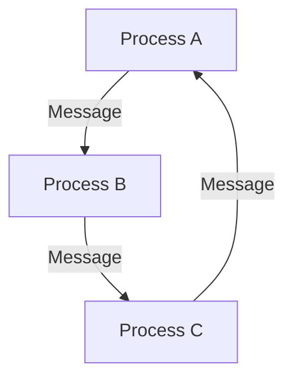

## 1.8. How to Use This Guide

Welcome to the "Elixir Design Patterns: Advanced Guide for Expert Software Engineers and Architects." This guide is crafted to elevate your understanding and application of design patterns within the Elixir programming language. Whether you're an experienced software engineer or an architect, this guide aims to deepen your expertise in Elixir's functional programming paradigm, concurrency model, and OTP (Open Telecom Platform) capabilities. Let's explore how you can best utilize this comprehensive resource.

### Intended Audience

This guide is tailored for:

- **Expert Software Engineers**: Those who have a solid foundation in Elixir and wish to explore advanced design patterns.
- **Software Architects**: Professionals responsible for designing complex systems and seeking to leverage Elixir's capabilities for scalable and fault-tolerant architectures.
- **Functional Programming Enthusiasts**: Individuals interested in applying functional programming principles to real-world applications using Elixir.

### Structure of the Guide

The guide is meticulously organized into sections that cover various aspects of Elixir design patterns:

- **Introduction to Design Patterns in Elixir**: Start with a foundational understanding of design patterns and their significance in Elixir.
- **Principles of Functional Programming in Elixir**: Delve into the core principles that underpin Elixir's functional programming model.
- **Elixir Language Features and Best Practices**: Familiarize yourself with Elixir's language features and best practices for writing robust code.
- **Idiomatic Elixir Patterns**: Explore idiomatic patterns that leverage Elixir's unique features.
- **Creational, Structural, and Behavioral Design Patterns**: Gain insights into traditional design pattern categories and how they translate into Elixir's functional paradigm.
- **Functional and Reactive Programming Patterns**: Discover patterns specific to functional and reactive programming in Elixir.
- **OTP Design Principles and Patterns**: Understand OTP's role in building resilient and concurrent applications.
- **Concurrency and Microservices Patterns**: Learn how to design scalable and distributed systems using Elixir.
- **Advanced Topics and Emerging Technologies**: Stay ahead with insights into cutting-edge technologies and trends in Elixir development.

Each section is designed to build upon the previous one, gradually introducing more complex concepts and patterns.

### Applying the Knowledge

To maximize the benefits of this guide, consider the following strategies:

- **Integrate Patterns into Real-World Projects**: As you progress through the guide, identify opportunities to apply the patterns in your current projects. This practical application will reinforce your understanding and showcase the patterns' effectiveness.
  
- **Experiment with Code Examples**: Each section includes code examples that demonstrate the patterns in action. Modify these examples to suit your specific needs or to explore alternative implementations. This hands-on approach will deepen your comprehension and adaptability.

- **Engage in Knowledge Checks**: At the end of each section, you'll find quizzes and exercises designed to test your understanding. Use these as a self-assessment tool to ensure you've grasped the key concepts before moving on.

### Additional Resources

To further enrich your learning experience, we provide references to external resources and community support:

- **Further Reading**: Links to reputable articles, documentation, and books that offer deeper dives into specific topics.
- **Community Support**: Engage with the Elixir community through forums, online groups, and conferences. Sharing knowledge and experiences with peers can provide valuable insights and inspiration.

### Code Examples and Experimentation

Throughout this guide, you'll encounter numerous code examples. These examples are crafted to illustrate the concepts discussed in each section. Here's how you can make the most of them:

- **Functional and Error-Free**: All code examples are tested and functional. Feel free to copy and run them in your Elixir environment to see the patterns in action.
  
- **Well-Commented**: Each code block includes comments explaining the purpose and functionality of key lines. This commentary is designed to guide you through the logic and help you understand the implementation details.

- **Try It Yourself**: We encourage you to experiment with the code. Modify variables, change function implementations, or introduce new features. This experimentation will solidify your understanding and inspire creativity.

#### Example Code Block

```elixir
defmodule Example do
  # Define a simple function that greets a user
  def greet_user(name) do
    # Use string interpolation to create a greeting message
    "Hello, #{name}!"
  end
end

# Try it yourself: Modify the greet_user function to include the time of day in the greeting.
```

### Visualizing Concepts

To aid in understanding complex concepts, this guide incorporates visual elements such as diagrams, tables, and charts. These visuals are designed to complement the text and provide a clearer picture of the patterns and principles discussed.

#### Example Diagram: Elixir's Concurrency Model


```mermaid
graph TD;
    A[Process A] -->|Message| B[Process B];
    B -->|Message| C[Process C];
    C -->|Message| A;
```

**Description:** This diagram illustrates the message-passing model in Elixir's concurrency framework, where processes communicate asynchronously through messages.

### References and Links

Throughout the guide, you'll find hyperlinks to external resources that offer additional insights and information. These links are carefully selected to supplement the content and provide opportunities for further exploration.

- [Elixir Official Documentation](https://elixir-lang.org/docs.html)
- [OTP Design Principles](https://erlang.org/doc/design_principles/des_princ.html)
- [Functional Programming in Elixir](https://pragprog.com/titles/elixir16/programming-elixir-1-6/)

### Knowledge Check

To reinforce your learning, engage with the knowledge checks and exercises provided at the end of each section. These activities are designed to challenge your understanding and encourage critical thinking.

### Embrace the Journey

Remember, mastering Elixir design patterns is a journey. As you navigate through this guide, keep the following in mind:

- **Stay Curious**: Continuously seek new knowledge and stay open to learning from various sources.
- **Experiment Freely**: Don't hesitate to try new approaches and explore different implementations.
- **Engage with the Community**: Connect with fellow developers and share your experiences. Collaborative learning can lead to valuable insights and growth.

### Formatting and Structure

This guide is organized with clear headings and subheadings to facilitate easy navigation. Important terms and concepts are highlighted to draw attention to key points.

### Writing Style

The content is written in a collaborative tone, using first-person plural (we, let's) to foster a sense of partnership in learning. We avoid gender-specific pronouns to ensure inclusivity and use active voice to maintain engagement.

### Conclusion

By following this guide, you'll gain a comprehensive understanding of advanced Elixir design patterns. You'll be equipped to apply these patterns in real-world scenarios, enhancing your ability to build robust and scalable systems. Embrace the journey, and enjoy the process of mastering Elixir design patterns.

## Quiz Time!



### Who is the intended audience for this guide?

- [x] Expert software engineers and architects
- [ ] Beginners in programming
- [ ] Intermediate JavaScript developers
- [ ] Students learning computer science

> **Explanation:** The guide is tailored for expert software engineers and architects familiar with Elixir.

### What is the primary focus of the guide?

- [x] Advanced Elixir design patterns
- [ ] Basic programming concepts
- [ ] JavaScript frameworks
- [ ] Database management

> **Explanation:** The guide focuses on advanced Elixir design patterns for expert developers.

### How is the guide structured?

- [x] By pattern categories and practical applications
- [ ] Alphabetically by topic
- [ ] Chronologically by release date
- [ ] Randomly assorted topics

> **Explanation:** The guide is organized by pattern categories and practical applications.

### What should readers do with the code examples?

- [x] Experiment and modify them
- [ ] Ignore them
- [ ] Memorize them without understanding
- [ ] Use them only as-is

> **Explanation:** Readers are encouraged to experiment with and modify the code examples to deepen their understanding.

### What additional resources are provided in the guide?

- [x] References to further reading and community support
- [ ] Only internal links
- [ ] No additional resources
- [ ] Links to unrelated topics

> **Explanation:** The guide includes references to further reading and community support.

### What is the purpose of the visual elements in the guide?

- [x] To aid in understanding complex concepts
- [ ] To distract from the text
- [ ] To fill space
- [ ] To replace the text

> **Explanation:** Visual elements are included to aid in understanding complex concepts.

### How should readers approach the knowledge checks?

- [x] As a self-assessment tool
- [ ] As a mandatory exam
- [ ] As an optional activity
- [ ] As a group project

> **Explanation:** Knowledge checks are meant to be used as a self-assessment tool.

### What tone does the guide use?

- [x] Collaborative and inclusive
- [ ] Formal and distant
- [ ] Casual and informal
- [ ] Sarcastic and humorous

> **Explanation:** The guide uses a collaborative and inclusive tone to engage readers.

### How does the guide encourage ongoing learning?

- [x] By providing links to external resources
- [ ] By limiting information
- [ ] By discouraging further exploration
- [ ] By focusing only on basics

> **Explanation:** The guide encourages ongoing learning by providing links to external resources.

### True or False: The guide is suitable for beginners.

- [ ] True
- [x] False

> **Explanation:** The guide is designed for expert software engineers and architects familiar with Elixir.


