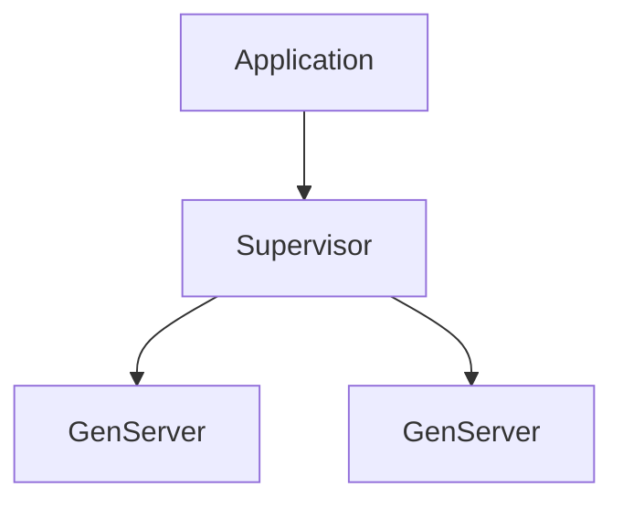

## 10.1. Introduction to OTP

### What is OTP?

The Open Telecom Platform (OTP) is a collection of middleware, libraries, and tools designed for building robust, concurrent, and distributed systems. Originally developed by Ericsson for telecom applications, OTP has become a cornerstone of the Elixir ecosystem, providing the foundation for building scalable and fault-tolerant applications.

OTP is not just a library; it embodies a set of design principles that guide the development of concurrent applications. These principles are crucial for creating systems that can handle failures gracefully and continue to operate under load.

### Components of OTP

OTP consists of several key components that facilitate the development of robust applications. These components include:

- **Behaviours**: Predefined modules that encapsulate common patterns, such as GenServer, Supervisor, and Application.
- **Libraries**: A set of tools and utilities for building concurrent and distributed systems.
- **Design Principles**: Guidelines for structuring applications to be resilient and maintainable.

#### Behaviours

Behaviours are a central concept in OTP, providing a way to define reusable patterns for common tasks. The most commonly used behaviours in Elixir are:

- **GenServer**: A generic server implementation that abstracts the complexities of process management.
- **Supervisor**: A process that monitors other processes, known as child processes, and restarts them if they fail.
- **Application**: A component that defines the starting point of an OTP application and manages its lifecycle.

### Importance in Elixir

OTP is integral to Elixir's ability to build scalable and fault-tolerant systems. By leveraging OTP, developers can focus on the business logic of their applications while relying on proven patterns for concurrency and fault tolerance.

#### Scalability

OTP provides the tools necessary to build applications that can scale horizontally across multiple nodes. This is achieved through the use of distributed Erlang, which allows processes to communicate seamlessly across nodes.

#### Fault Tolerance

One of the key features of OTP is its ability to handle failures gracefully. Through the use of supervisors and the "let it crash" philosophy, OTP applications can recover from errors without affecting the overall system stability.

### Key Concepts and Terminology

Before diving deeper into OTP, it's important to understand some key concepts and terminology:

- **Process**: The fundamental unit of concurrency in Elixir. Each process runs independently and communicates with other processes via message passing.
- **Node**: An instance of the Erlang virtual machine (BEAM) running on a machine. Nodes can communicate with each other to form a distributed system.
- **Message Passing**: The mechanism by which processes communicate in Elixir. Messages are sent asynchronously and can be received in any order.
- **Supervision Tree**: A hierarchical structure of processes, where supervisors manage the lifecycle of their child processes.

### GenServer: The Generic Server

The GenServer behaviour is one of the most commonly used components of OTP. It provides a framework for implementing server processes that handle requests, maintain state, and perform tasks asynchronously.

#### Key Features of GenServer

- **State Management**: GenServer allows you to maintain state across multiple requests, making it ideal for building stateful services.
- **Synchronous and Asynchronous Calls**: GenServer supports both synchronous (`call`) and asynchronous (`cast`) message handling.
- **Lifecycle Callbacks**: GenServer provides a set of callbacks for managing the lifecycle of a server process, such as `init`, `handle_call`, `handle_cast`, and `terminate`.

#### Example: Implementing a Simple GenServer

Let's implement a simple GenServer that maintains a counter:

```elixir
defmodule Counter do
  use GenServer

  # Client API

  def start_link(initial_value) do
    GenServer.start_link(__MODULE__, initial_value, name: __MODULE__)
  end

  def increment do
    GenServer.cast(__MODULE__, :increment)
  end

  def get_value do
    GenServer.call(__MODULE__, :get_value)
  end

  # Server Callbacks

  def init(initial_value) do
    {:ok, initial_value}
  end

  def handle_cast(:increment, state) do
    {:noreply, state + 1}
  end

  def handle_call(:get_value, _from, state) do
    {:reply, state, state}
  end
end
```

In this example, we define a GenServer module named `Counter` that maintains a simple integer state. The `increment` function sends an asynchronous message to the server to increase the counter, while the `get_value` function retrieves the current value synchronously.

### Supervisor: Ensuring Fault Tolerance

Supervisors are responsible for monitoring and managing the lifecycle of other processes. They implement strategies for restarting child processes when they fail, ensuring that the system remains stable and resilient.

#### Supervision Strategies

Supervisors support several strategies for managing child processes:

- **One for One**: If a child process terminates, only that process is restarted.
- **One for All**: If a child process terminates, all other child processes are terminated and restarted.
- **Rest for One**: If a child process terminates, the rest of the child processes started after it are terminated and restarted.

#### Example: Setting Up a Supervisor

Let's set up a supervisor for our `Counter` GenServer:

```elixir
defmodule CounterSupervisor do
  use Supervisor

  def start_link do
    Supervisor.start_link(__MODULE__, :ok, name: __MODULE__)
  end

  def init(:ok) do
    children = [
      {Counter, 0}
    ]

    Supervisor.init(children, strategy: :one_for_one)
  end
end
```

In this example, we define a supervisor module named `CounterSupervisor` that supervises the `Counter` GenServer. We use the `one_for_one` strategy, which means that if the `Counter` process crashes, only it will be restarted.

### Application: Managing the Lifecycle

The Application behaviour is used to define the starting point of an OTP application and manage its lifecycle. It provides a way to specify which processes should be started when the application is launched.

#### Example: Defining an OTP Application

Let's define an OTP application that starts our `CounterSupervisor`:

```elixir
defmodule MyApp.Application do
  use Application

  def start(_type, _args) do
    children = [
      CounterSupervisor
    ]

    opts = [strategy: :one_for_one, name: MyApp.Supervisor]
    Supervisor.start_link(children, opts)
  end
end
```

In this example, we define an application module named `MyApp.Application` that starts the `CounterSupervisor` when the application is launched.

### Visualizing OTP Components

To better understand the relationships between the various OTP components, let's visualize them using a diagram:



This diagram illustrates a simple OTP application structure, where an `Application` starts a `Supervisor`, which in turn manages multiple `GenServer` processes.

### Try It Yourself

Now that we've covered the basics of OTP, try experimenting with the code examples provided. Here are some suggestions for modifications:

- Add a new function to the `Counter` GenServer that decrements the counter.
- Implement a new GenServer that maintains a list of items and supports adding and removing items.
- Experiment with different supervision strategies in the `CounterSupervisor`.

### References and Further Reading

For more information on OTP and its components, consider exploring the following resources:

- [Elixir's Official Documentation on OTP](https://elixir-lang.org/getting-started/mix-otp/introduction-to-mix.html)
- [Erlang's Official Documentation on OTP](https://erlang.org/doc/design_principles/des_princ.html)
- [Learn You Some Erlang for Great Good!](http://learnyousomeerlang.com/)

### Knowledge Check

Before moving on, take a moment to review the key concepts covered in this section:

- What is OTP and why is it important in Elixir?
- What are the main components of OTP?
- How do GenServer, Supervisor, and Application work together in an OTP application?

### Embrace the Journey

Remember, mastering OTP is a journey. As you continue to explore and experiment with OTP, you'll gain a deeper understanding of how to build robust, concurrent applications in Elixir. Keep experimenting, stay curious, and enjoy the journey!

## Quiz: Introduction to OTP



### What is OTP in the context of Elixir?

- [x] A set of design principles and libraries for building robust concurrent applications
- [ ] A programming language
- [ ] A database management system
- [ ] A web development framework

> **Explanation:** OTP stands for Open Telecom Platform and is a set of design principles and libraries for building robust concurrent applications in Elixir.

### Which of the following is a key component of OTP?

- [x] GenServer
- [ ] HTTP Server
- [ ] SQL Database
- [ ] CSS Framework

> **Explanation:** GenServer is a key component of OTP, providing a framework for implementing server processes.

### What is the primary purpose of a Supervisor in OTP?

- [x] To monitor and manage the lifecycle of other processes
- [ ] To handle HTTP requests
- [ ] To store data in a database
- [ ] To render web pages

> **Explanation:** A Supervisor in OTP is responsible for monitoring and managing the lifecycle of other processes, ensuring fault tolerance.

### What is the "let it crash" philosophy in OTP?

- [x] Allowing processes to fail and relying on supervisors to restart them
- [ ] Preventing any process from crashing
- [ ] Writing code that never fails
- [ ] Ignoring errors in the code

> **Explanation:** The "let it crash" philosophy in OTP involves allowing processes to fail and relying on supervisors to restart them, promoting fault tolerance.

### Which OTP behaviour is used to define the starting point of an application?

- [x] Application
- [ ] GenServer
- [ ] Supervisor
- [ ] Task

> **Explanation:** The Application behaviour is used to define the starting point of an OTP application and manage its lifecycle.

### What is the primary communication mechanism between processes in Elixir?

- [x] Message Passing
- [ ] Shared Memory
- [ ] Global Variables
- [ ] Direct Function Calls

> **Explanation:** Message passing is the primary communication mechanism between processes in Elixir, allowing them to communicate asynchronously.

### Which supervision strategy restarts all child processes if one fails?

- [x] One for All
- [ ] One for One
- [ ] Rest for One
- [ ] Simple One for One

> **Explanation:** The "One for All" strategy restarts all child processes if one fails, ensuring consistency among them.

### What is a node in the context of OTP?

- [x] An instance of the Erlang virtual machine running on a machine
- [ ] A single process in Elixir
- [ ] A database table
- [ ] A web server

> **Explanation:** A node is an instance of the Erlang virtual machine running on a machine, capable of communicating with other nodes in a distributed system.

### True or False: OTP is only useful for telecom applications.

- [ ] True
- [x] False

> **Explanation:** False. While OTP was originally developed for telecom applications, it is widely used in various domains for building robust concurrent systems.

### Which OTP component is responsible for maintaining state across multiple requests?

- [x] GenServer
- [ ] Supervisor
- [ ] Application
- [ ] Task

> **Explanation:** GenServer is responsible for maintaining state across multiple requests, making it ideal for building stateful services.




