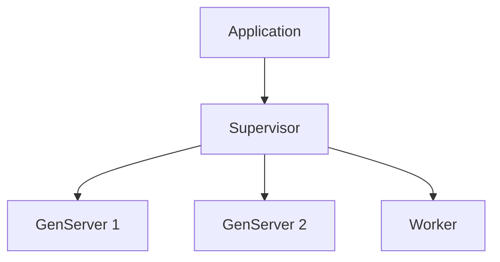

## 10.1. Introduction to OTP

In the realm of functional programming and concurrent systems, the Open Telecom Platform (OTP) stands as a cornerstone for developing robust, scalable, and fault-tolerant applications. OTP is a set of design principles and libraries that are integral to the Elixir programming language, enabling developers to harness the power of concurrency and build systems that can handle failure gracefully. In this section, we will delve into the essence of OTP, its components, and its critical role in Elixir.

### What is OTP?

OTP, or the Open Telecom Platform, is a collection of middleware, libraries, and tools designed for building concurrent and distributed systems. Originating from the Erlang ecosystem, OTP provides a framework for developing applications that are not only efficient but also resilient to failures. It encapsulates best practices and patterns for building systems that can scale horizontally and recover from errors without human intervention.

#### Key Features of OTP

- **Concurrency**: OTP leverages the Actor Model, allowing developers to create lightweight processes that run concurrently.
- **Fault Tolerance**: With built-in supervision trees, OTP applications can automatically recover from failures.
- **Scalability**: OTP supports distributed computing, making it easier to scale applications across multiple nodes.
- **Maintainability**: By following OTP design principles, applications become easier to maintain and extend.

### Components of OTP

OTP is composed of several core components, each serving a unique purpose in the architecture of an Elixir application. These components include Behaviours like GenServer, Supervisor, and Application, which provide the foundational building blocks for OTP-based systems.

#### GenServer

GenServer is a generic server implementation that abstracts the complexities of process communication and state management. It provides a standardized way to implement server processes in Elixir.

```elixir
defmodule MyServer do
  use GenServer

  # Client API
  def start_link(initial_state) do
    GenServer.start_link(__MODULE__, initial_state, name: __MODULE__)
  end

  def get_state do
    GenServer.call(__MODULE__, :get_state)
  end

  # Server Callbacks
  def init(initial_state) do
    {:ok, initial_state}
  end

  def handle_call(:get_state, _from, state) do
    {:reply, state, state}
  end
end
```

In this example, `MyServer` is a GenServer that maintains a state and provides a synchronous API to retrieve it. The `start_link/1` function initializes the server, while `handle_call/3` manages incoming requests.

#### Supervisor

Supervisors are responsible for monitoring and managing the lifecycle of worker processes. They implement strategies to handle process failures, ensuring system reliability.

```elixir
defmodule MySupervisor do
  use Supervisor

  def start_link(_) do
    Supervisor.start_link(__MODULE__, :ok, name: __MODULE__)
  end

  def init(:ok) do
    children = [
      {MyServer, []}
    ]

    Supervisor.init(children, strategy: :one_for_one)
  end
end
```

In this snippet, `MySupervisor` supervises `MyServer`, using a `:one_for_one` strategy to restart any child process that terminates unexpectedly.

#### Application

The Application module defines the entry point for an OTP application, managing its lifecycle and configuration.

```elixir
defmodule MyApp.Application do
  use Application

  def start(_type, _args) do
    children = [
      MySupervisor
    ]

    opts = [strategy: :one_for_one, name: MyApp.Supervisor]
    Supervisor.start_link(children, opts)
  end
end
```

Here, `MyApp.Application` starts the supervision tree, ensuring all components are initialized and monitored correctly.

### Importance of OTP in Elixir

OTP is not just an optional library in Elixir; it is the backbone of how applications are structured and executed. Its importance can be understood through several key aspects:

#### Scalability

OTP allows applications to scale effortlessly by distributing processes across multiple nodes. This capability is crucial for handling increased loads and ensuring high availability.

#### Fault Tolerance

By leveraging OTP's supervision trees, applications can recover from failures automatically. This design principle, often summarized as "let it crash," ensures that systems remain stable even in the face of unexpected errors.

#### Concurrency

Elixir, built on the Erlang VM, inherits OTP's ability to manage thousands of lightweight processes concurrently. This feature is vital for building responsive and efficient applications.

#### Maintainability

OTP enforces a structured approach to application design, making codebases easier to understand and maintain. By adhering to OTP principles, developers can create modular and reusable components.

### Visualizing OTP Architecture

To better understand how OTP components interact, let's visualize a typical OTP application architecture:


```mermaid
graph TD;
    A[Application] --> B[Supervisor]
    B --> C[GenServer 1]
    B --> D[GenServer 2]
    B --> E[Worker]
```

In this diagram, the `Application` module starts the `Supervisor`, which in turn manages multiple `GenServer` processes and workers. This hierarchical structure is central to OTP's design, facilitating process supervision and fault recovery.

### Try It Yourself

To deepen your understanding of OTP, try modifying the `MyServer` example to include additional functionality. For instance, add a function that updates the server's state and observe how the GenServer handles state changes. Experiment with different supervision strategies in `MySupervisor` to see how they affect process recovery.

### References and Links

- [Elixir Lang - Getting Started with OTP](https://elixir-lang.org/getting-started/mix-otp/introduction-to-mix.html)
- [Erlang Documentation - OTP Design Principles](https://erlang.org/doc/design_principles/des_princ.html)
- [Learn You Some Erlang for Great Good! - The Hitchhiker's Guide to the OTP](http://learnyousomeerlang.com/)

### Knowledge Check

To reinforce your understanding of OTP, consider these questions:

- What are the primary components of OTP, and what roles do they play in an application?
- How does the "let it crash" philosophy contribute to fault tolerance in OTP-based systems?
- What are the benefits of using a supervision tree in an OTP application?

### Embrace the Journey

Remember, mastering OTP is a journey that involves understanding its principles and applying them in real-world scenarios. As you explore OTP further, you'll discover its power in building complex, reliable systems. Keep experimenting, stay curious, and enjoy the journey!

## Quiz Time!



### What does OTP stand for in the context of Elixir?

- [x] Open Telecom Platform
- [ ] Optimal Telephony Protocol
- [ ] Open Technology Process
- [ ] Online Transaction Processing

> **Explanation:** OTP stands for Open Telecom Platform, a set of design principles and libraries for building concurrent applications.

### Which OTP component is responsible for managing process lifecycles?

- [ ] GenServer
- [x] Supervisor
- [ ] Application
- [ ] Registry

> **Explanation:** The Supervisor component manages the lifecycle of processes, ensuring they are restarted if they fail.

### What is the primary role of a GenServer in OTP?

- [x] To manage state and handle synchronous and asynchronous requests
- [ ] To supervise other processes
- [ ] To define the application entry point
- [ ] To handle distributed messaging

> **Explanation:** A GenServer manages state and handles requests, providing a standardized way to implement server processes.

### How does OTP achieve fault tolerance?

- [ ] By using global locks
- [x] Through supervision trees and the "let it crash" philosophy
- [ ] By preventing all errors
- [ ] By using a single-threaded model

> **Explanation:** OTP achieves fault tolerance through supervision trees, which automatically restart failed processes.

### Which strategy does a Supervisor use to restart a single failed child process?

- [x] :one_for_one
- [ ] :one_for_all
- [ ] :rest_for_one
- [ ] :simple_one_for_one

> **Explanation:** The :one_for_one strategy restarts only the failed child process.

### What is the purpose of the Application module in OTP?

- [x] To define the entry point and manage the application's lifecycle
- [ ] To handle HTTP requests
- [ ] To perform data serialization
- [ ] To manage database connections

> **Explanation:** The Application module defines the entry point and manages the lifecycle of an OTP application.

### What does the "let it crash" philosophy imply?

- [x] Allowing processes to fail and be restarted by supervisors
- [ ] Preventing all errors at all costs
- [ ] Using extensive error logging
- [ ] Writing defensive code to handle every possible error

> **Explanation:** The "let it crash" philosophy implies allowing processes to fail and be restarted by supervisors, ensuring system stability.

### Which component is used to implement a generic server in OTP?

- [x] GenServer
- [ ] Supervisor
- [ ] Application
- [ ] Registry

> **Explanation:** GenServer is used to implement a generic server, managing state and handling requests.

### What is a supervision tree?

- [x] A hierarchical structure of processes managed by supervisors
- [ ] A data structure for storing state
- [ ] A network topology for distributed systems
- [ ] A method for optimizing database queries

> **Explanation:** A supervision tree is a hierarchical structure of processes managed by supervisors, ensuring fault tolerance.

### True or False: OTP is exclusive to Elixir and cannot be used with other languages.

- [ ] True
- [x] False

> **Explanation:** False. OTP originates from the Erlang ecosystem and can be used with any language running on the BEAM VM, including Elixir.


