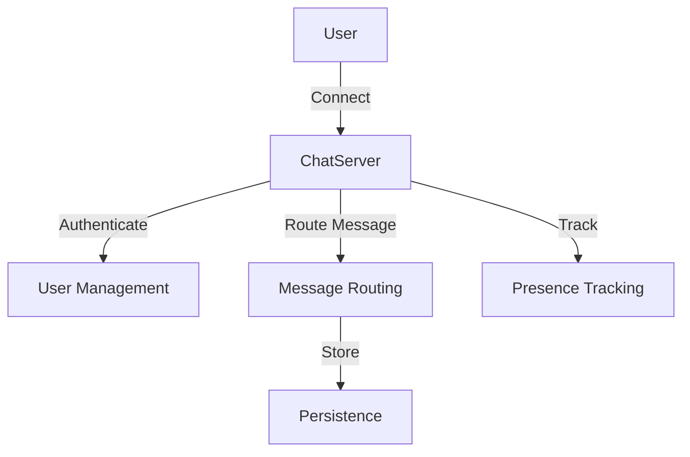
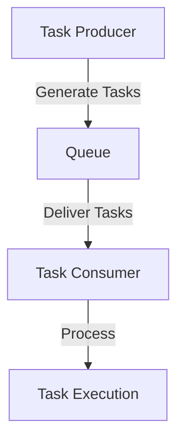
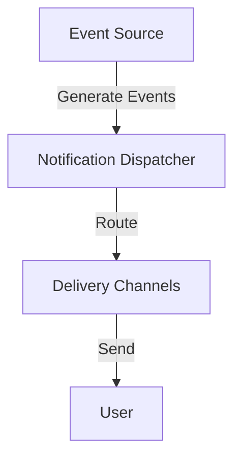

## 10.10. Case Studies in OTP Applications

In this section, we delve into real-world case studies of OTP (Open Telecom Platform) applications, showcasing how Elixir's powerful concurrency and fault-tolerance capabilities are leveraged in practical scenarios. We will explore the implementation of chat servers, queues, and notification systems, discuss lessons learned in designing for scalability and handling failures gracefully, and outline best practices for monitoring, logging, and maintaining OTP applications.

### Real-World Examples

#### Implementing Chat Servers

Chat applications are a quintessential example of systems that require real-time communication, scalability, and fault tolerance. Let's explore how OTP can be utilized to build a robust chat server.

**Design Overview**

A chat server typically consists of several components:

- **User Management**: Handles user authentication and session management.
- **Message Routing**: Routes messages between users or groups.
- **Presence Tracking**: Monitors online/offline status of users.
- **Persistence**: Stores chat history and user data.

**OTP Components**

- **GenServer**: Used for managing user sessions and message routing.
- **Supervisor**: Ensures that critical processes are restarted in case of failure.
- **Registry**: Tracks active users and their associated processes.

**Code Example: Basic Chat Server**

```elixir
defmodule ChatServer do
  use GenServer

  # Client API
  def start_link(_) do
    GenServer.start_link(__MODULE__, %{}, name: __MODULE__)
  end

  def send_message(to, message) do
    GenServer.cast(__MODULE__, {:send_message, to, message})
  end

  # Server Callbacks
  def init(state) do
    {:ok, state}
  end

  def handle_cast({:send_message, to, message}, state) do
    # Logic to send message to the recipient
    IO.puts("Sending message to #{to}: #{message}")
    {:noreply, state}
  end
end
```

**Try It Yourself**

- Modify the `send_message/2` function to broadcast messages to multiple users.
- Implement user authentication and session management.

**Visualizing Chat Server Architecture**



### Implementing Queues

Queues are essential for managing tasks and workloads in distributed systems. OTP provides a robust foundation for building scalable and reliable queue systems.

**Design Overview**

A queue system typically involves:

- **Task Producers**: Generate tasks to be processed.
- **Task Consumers**: Process tasks from the queue.
- **Queue Management**: Manages task ordering and delivery.

**OTP Components**

- **GenStage**: Ideal for implementing producer-consumer patterns.
- **Supervisor**: Manages the lifecycle of producers and consumers.
- **ETS (Erlang Term Storage)**: Stores tasks temporarily for fast access.

**Code Example: Simple Queue System**

```elixir
defmodule TaskProducer do
  use GenStage

  def start_link(_) do
    GenStage.start_link(__MODULE__, 0, name: __MODULE__)
  end

  def init(counter) do
    {:producer, counter}
  end

  def handle_demand(demand, state) do
    events = Enum.to_list(state..(state + demand - 1))
    {:noreply, events, state + demand}
  end
end

defmodule TaskConsumer do
  use GenStage

  def start_link(_) do
    GenStage.start_link(__MODULE__, :ok, name: __MODULE__)
  end

  def init(:ok) do
    {:consumer, :ok}
  end

  def handle_events(events, _from, state) do
    Enum.each(events, fn event ->
      IO.puts("Processing task #{event}")
    end)
    {:noreply, [], state}
  end
end
```

**Try It Yourself**

- Enhance the `TaskProducer` to fetch tasks from an external source.
- Implement error handling and retry mechanisms in `TaskConsumer`.

**Visualizing Queue System Architecture**



### Implementing Notification Systems

Notification systems are crucial for alerting users about important events. OTP's concurrency model makes it well-suited for building efficient notification systems.

**Design Overview**

A notification system typically includes:

- **Event Sources**: Generate events that trigger notifications.
- **Notification Dispatcher**: Routes notifications to appropriate channels.
- **Delivery Channels**: Email, SMS, push notifications, etc.

**OTP Components**

- **GenServer**: Manages event processing and notification dispatching.
- **Supervisor**: Ensures reliability by restarting failed processes.
- **PubSub**: Facilitates message broadcasting to multiple subscribers.

**Code Example: Notification System**

```elixir
defmodule NotificationServer do
  use GenServer

  def start_link(_) do
    GenServer.start_link(__MODULE__, %{}, name: __MODULE__)
  end

  def notify(event) do
    GenServer.cast(__MODULE__, {:notify, event})
  end

  def init(state) do
    {:ok, state}
  end

  def handle_cast({:notify, event}, state) do
    # Logic to dispatch notification
    IO.puts("Dispatching notification for event: #{event}")
    {:noreply, state}
  end
end
```

**Try It Yourself**

- Implement multiple delivery channels (e.g., email, SMS).
- Add support for user preferences and notification filtering.

**Visualizing Notification System Architecture**



### Lessons Learned

#### Designing for Scalability

Scalability is a critical consideration in OTP applications. Here are some key lessons:

- **Decouple Components**: Use OTP's supervision trees to separate concerns and manage dependencies.
- **Leverage Concurrency**: Utilize Elixir's lightweight processes to handle concurrent tasks efficiently.
- **Optimize Resource Usage**: Use ETS for fast data access and minimize memory footprint.

#### Handling Failure Gracefully

Fault tolerance is a hallmark of OTP applications. Consider these strategies:

- **Supervision Trees**: Design robust supervision hierarchies to restart failed processes automatically.
- **Error Logging**: Implement comprehensive logging to capture and analyze errors.
- **Graceful Degradation**: Ensure the system continues to function, albeit with reduced capabilities, during failures.

### Best Practices

#### Monitoring and Logging

Effective monitoring and logging are essential for maintaining OTP applications:

- **Use Telemetry**: Integrate telemetry for real-time monitoring and metrics collection.
- **Centralized Logging**: Aggregate logs from distributed components for easier analysis.
- **Alerting**: Set up alerts for critical events and anomalies.

#### Maintaining OTP Applications

To ensure the longevity and reliability of OTP applications, follow these best practices:

- **Regular Updates**: Keep dependencies and libraries up to date to benefit from security patches and improvements.
- **Automated Testing**: Implement comprehensive test suites to catch regressions and ensure code quality.
- **Documentation**: Maintain clear and up-to-date documentation for easier onboarding and maintenance.

### Conclusion

In this section, we've explored real-world case studies of OTP applications, highlighting the implementation of chat servers, queues, and notification systems. We've discussed lessons learned in designing for scalability and handling failures gracefully, and outlined best practices for monitoring, logging, and maintaining OTP applications. By leveraging OTP's powerful concurrency and fault-tolerance capabilities, you can build robust and scalable systems that meet the demands of modern applications.

## Quiz: Case Studies in OTP Applications



### What is a key component of a chat server implemented with OTP?

- [x] GenServer
- [ ] Task
- [ ] Agent
- [ ] Port

> **Explanation:** GenServer is used for managing user sessions and message routing in a chat server.

### Which OTP component is ideal for implementing producer-consumer patterns in a queue system?

- [x] GenStage
- [ ] GenServer
- [ ] Supervisor
- [ ] Registry

> **Explanation:** GenStage is specifically designed for implementing producer-consumer patterns.

### What is a critical consideration when designing OTP applications for scalability?

- [x] Decouple Components
- [ ] Use Monolithic Architecture
- [ ] Avoid Concurrency
- [ ] Minimize Processes

> **Explanation:** Decoupling components allows for better scalability and manageability.

### How can you handle failures gracefully in OTP applications?

- [x] Use Supervision Trees
- [ ] Ignore Errors
- [ ] Use Global State
- [ ] Avoid Logging

> **Explanation:** Supervision trees help in automatically restarting failed processes, ensuring fault tolerance.

### What is a best practice for monitoring OTP applications?

- [x] Use Telemetry
- [ ] Disable Logging
- [ ] Use Global Variables
- [ ] Avoid Metrics

> **Explanation:** Telemetry provides real-time monitoring and metrics collection, which is crucial for maintaining OTP applications.

### Which component is used to track active users in a chat server?

- [x] Registry
- [ ] Task
- [ ] Agent
- [ ] Port

> **Explanation:** Registry is used to track active users and their associated processes.

### What is a benefit of using ETS in OTP applications?

- [x] Fast Data Access
- [ ] Increased Memory Usage
- [ ] Slower Performance
- [ ] Complex API

> **Explanation:** ETS provides fast data access, which is beneficial for performance-sensitive applications.

### What is a recommended practice for maintaining OTP applications?

- [x] Regular Updates
- [ ] Avoid Testing
- [ ] Use Outdated Libraries
- [ ] Ignore Documentation

> **Explanation:** Regular updates ensure that the application benefits from security patches and improvements.

### What is an advantage of using GenServer in a notification system?

- [x] Manages Event Processing
- [ ] Increases Complexity
- [ ] Reduces Scalability
- [ ] Slows Down Performance

> **Explanation:** GenServer is used to manage event processing and notification dispatching efficiently.

### True or False: Supervision trees are not necessary for fault tolerance in OTP applications.

- [ ] True
- [x] False

> **Explanation:** Supervision trees are essential for fault tolerance as they help in automatically restarting failed processes.



Remember, this is just the beginning. As you progress, you'll build more complex and interactive OTP applications. Keep experimenting, stay curious, and enjoy the journey!
