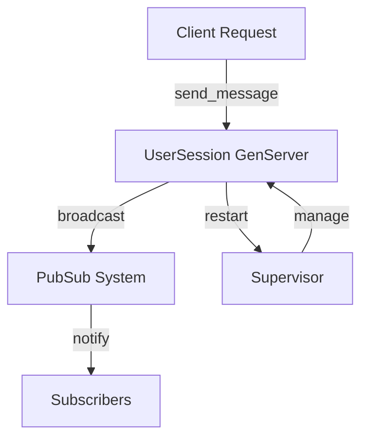

## 10.10. Case Studies in OTP Applications

The Open Telecom Platform (OTP) is a set of Erlang libraries and design principles that provide a robust framework for building concurrent, fault-tolerant, and distributed applications. In Elixir, OTP is the backbone that supports the development of scalable and resilient systems. This section will delve into real-world case studies of OTP applications, focusing on implementing chat servers, queues, and notification systems. We will explore lessons learned in designing for scalability and handling failures gracefully, and we will highlight best practices for monitoring, logging, and maintaining OTP applications.

### Real-World Examples

#### Implementing a Chat Server

A chat server is a classic example of an application that requires high concurrency and fault tolerance. With OTP, we can leverage GenServers and Supervisors to create a robust chat server.

**Design Overview:**

1. **GenServer for User Sessions:** Each user session can be represented by a GenServer process, handling messages and maintaining state.
2. **Supervisor for Fault Tolerance:** Use a Supervisor to manage user session processes, ensuring that if a process crashes, it is restarted automatically.
3. **Registry for Process Lookup:** Utilize a Registry to map user IDs to their respective GenServer processes for efficient message routing.

**Code Example:**

```elixir
defmodule ChatServer.UserSession do
  use GenServer

  # Client API
  def start_link(user_id) do
    GenServer.start_link(__MODULE__, user_id, name: via_tuple(user_id))
  end

  def send_message(user_id, message) do
    GenServer.cast(via_tuple(user_id), {:send_message, message})
  end

  # Server Callbacks
  def init(user_id) do
    {:ok, %{user_id: user_id, messages: []}}
  end

  def handle_cast({:send_message, message}, state) do
    IO.puts("Sending message to #{state.user_id}: #{message}")
    {:noreply, %{state | messages: [message | state.messages]}}
  end

  # Helper function for process registration
  defp via_tuple(user_id) do
    {:via, Registry, {ChatServer.Registry, user_id}}
  end
end

defmodule ChatServer.Supervisor do
  use Supervisor

  def start_link do
    Supervisor.start_link(__MODULE__, :ok, name: __MODULE__)
  end

  def init(:ok) do
    children = [
      {Registry, keys: :unique, name: ChatServer.Registry},
      {ChatServer.UserSession, []}
    ]

    Supervisor.init(children, strategy: :one_for_one)
  end
end
```

**Explanation:**

- **GenServer:** Each user session is a GenServer, managing state and handling messages.
- **Supervisor:** The Supervisor ensures that user sessions are restarted if they fail.
- **Registry:** The Registry allows us to efficiently route messages to the correct user session process.

**Lessons Learned:**

- **Scalability:** By leveraging OTP's process model, we can scale the chat server horizontally, distributing user sessions across multiple nodes.
- **Fault Tolerance:** The Supervisor ensures that individual user session failures do not impact the overall system.

**Try It Yourself:**

- Experiment by adding features such as message broadcasting to all users or implementing private messaging between users.

#### Implementing a Queue System

Queues are essential in many systems for decoupling components and handling asynchronous tasks. OTP provides the tools to implement a robust queue system.

**Design Overview:**

1. **GenServer for Queue Management:** Use a GenServer to manage the queue, storing tasks and processing them sequentially.
2. **Supervisor for Resilience:** A Supervisor can restart the queue manager if it crashes, ensuring tasks are not lost.
3. **Task Module for Concurrent Processing:** Use the Task module to process tasks concurrently, improving throughput.

**Code Example:**

```elixir
defmodule QueueSystem.QueueManager do
  use GenServer

  # Client API
  def start_link(initial_tasks \\ []) do
    GenServer.start_link(__MODULE__, initial_tasks, name: __MODULE__)
  end

  def enqueue(task) do
    GenServer.cast(__MODULE__, {:enqueue, task})
  end

  # Server Callbacks
  def init(initial_tasks) do
    {:ok, initial_tasks}
  end

  def handle_cast({:enqueue, task}, state) do
    Task.start(fn -> process_task(task) end)
    {:noreply, [task | state]}
  end

  defp process_task(task) do
    IO.puts("Processing task: #{inspect(task)}")
    :timer.sleep(1000) # Simulate task processing time
  end
end

defmodule QueueSystem.Supervisor do
  use Supervisor

  def start_link do
    Supervisor.start_link(__MODULE__, :ok, name: __MODULE__)
  end

  def init(:ok) do
    children = [
      {QueueSystem.QueueManager, []}
    ]

    Supervisor.init(children, strategy: :one_for_one)
  end
end
```

**Explanation:**

- **GenServer:** The GenServer manages the queue, receiving tasks and processing them.
- **Task Module:** Tasks are processed concurrently using the Task module, improving throughput.
- **Supervisor:** The Supervisor ensures that the queue manager is restarted if it crashes.

**Lessons Learned:**

- **Concurrency:** By using the Task module, we can process multiple tasks concurrently, improving system performance.
- **Resilience:** The Supervisor ensures that the queue system continues to operate even if individual components fail.

**Try It Yourself:**

- Modify the code to implement priority queues, where tasks with higher priority are processed first.

#### Implementing a Notification System

Notification systems require efficient message delivery and fault tolerance. OTP provides the necessary tools to build such systems.

**Design Overview:**

1. **GenServer for Notification Delivery:** Use a GenServer to handle the delivery of notifications, ensuring messages are sent reliably.
2. **Supervisor for Process Management:** A Supervisor manages notification delivery processes, restarting them if necessary.
3. **PubSub for Message Broadcasting:** Utilize Phoenix.PubSub for broadcasting notifications to multiple subscribers.

**Code Example:**

```elixir
defmodule NotificationSystem.Delivery do
  use GenServer

  # Client API
  def start_link do
    GenServer.start_link(__MODULE__, :ok, name: __MODULE__)
  end

  def send_notification(notification) do
    GenServer.cast(__MODULE__, {:send_notification, notification})
  end

  # Server Callbacks
  def init(:ok) do
    {:ok, []}
  end

  def handle_cast({:send_notification, notification}, state) do
    IO.puts("Sending notification: #{inspect(notification)}")
    Phoenix.PubSub.broadcast(NotificationSystem.PubSub, "notifications", notification)
    {:noreply, state}
  end
end

defmodule NotificationSystem.Supervisor do
  use Supervisor

  def start_link do
    Supervisor.start_link(__MODULE__, :ok, name: __MODULE__)
  end

  def init(:ok) do
    children = [
      {Phoenix.PubSub, name: NotificationSystem.PubSub},
      {NotificationSystem.Delivery, []}
    ]

    Supervisor.init(children, strategy: :one_for_one)
  end
end
```

**Explanation:**

- **GenServer:** The GenServer handles notification delivery, ensuring messages are sent reliably.
- **PubSub:** Phoenix.PubSub is used for broadcasting notifications to multiple subscribers.
- **Supervisor:** The Supervisor manages the notification delivery process, ensuring it is restarted if it fails.

**Lessons Learned:**

- **Scalability:** By using Phoenix.PubSub, we can scale the notification system to handle a large number of subscribers.
- **Reliability:** The Supervisor ensures that the notification delivery process is restarted if it crashes, maintaining system reliability.

**Try It Yourself:**

- Extend the system to support different types of notifications (e.g., email, SMS) and implement a strategy for selecting the appropriate delivery method.

### Lessons Learned

#### Designing for Scalability

Scalability is a critical consideration in any system design. With OTP, we can leverage processes and distribution to build scalable systems. The key is to design systems that can distribute load across multiple nodes and handle increased demand gracefully.

- **Horizontal Scaling:** Distribute processes across multiple nodes to handle increased load.
- **Load Balancing:** Implement load balancing strategies to distribute work evenly across processes.
- **Process Distribution:** Use distributed Erlang to run processes on different nodes, improving scalability.

#### Handling Failure Gracefully

Failure is inevitable in any system, but with OTP, we can design systems that handle failures gracefully.

- **Supervision Trees:** Use supervision trees to manage process lifecycles and restart processes if they fail.
- **Error Logging:** Implement logging to capture errors and provide insights into system failures.
- **Graceful Degradation:** Design systems to degrade gracefully under failure conditions, maintaining partial functionality.

### Best Practices

#### Monitoring and Logging

Monitoring and logging are essential for maintaining OTP applications. They provide insights into system performance and help identify issues before they become critical.

- **Telemetry:** Use Telemetry to collect metrics and monitor system performance.
- **Logging:** Implement structured logging to capture important events and errors.
- **Alerting:** Set up alerting to notify operators of critical issues.

#### Maintaining OTP Applications

Maintaining OTP applications requires careful attention to process management and system health.

- **Process Management:** Use Supervisors to manage process lifecycles and ensure system reliability.
- **Health Checks:** Implement health checks to monitor system components and detect issues early.
- **Continuous Deployment:** Use continuous deployment practices to deploy updates and fixes without downtime.

### Visualizing OTP Applications

To better understand the architecture and flow of OTP applications, let's visualize a typical OTP application using a Mermaid.js diagram:


```mermaid
graph TD;
    A[Client Request] -->|send_message| B[UserSession GenServer]
    B -->|broadcast| C[PubSub System]
    C -->|notify| D[Subscribers]
    B -->|restart| E[Supervisor]
    E -->|manage| B
```

**Diagram Description:**

- **Client Request:** Initiates a message sending request.
- **UserSession GenServer:** Handles the request and broadcasts the message.
- **PubSub System:** Distributes the message to subscribers.
- **Subscribers:** Receive the notification.
- **Supervisor:** Manages the GenServer process, restarting it if necessary.

### References and Links

- [Elixir Getting Started Guide](https://elixir-lang.org/getting-started/introduction.html)
- [Phoenix Framework Documentation](https://hexdocs.pm/phoenix/overview.html)
- [Erlang and Elixir in Action](https://www.manning.com/books/erlang-and-elixir-in-action)

### Knowledge Check

- How would you implement a priority queue in the queue system example?
- What are the benefits of using Phoenix.PubSub in a notification system?
- How can you improve the scalability of a chat server built with OTP?

### Embrace the Journey

Remember, this is just the beginning. As you progress, you'll build more complex and interactive systems using OTP. Keep experimenting, stay curious, and enjoy the journey!

### Quiz Time!



### What is a key benefit of using OTP for building a chat server?

- [x] Fault tolerance through supervision
- [ ] Faster message delivery
- [ ] Reduced memory usage
- [ ] Easier user interface design

> **Explanation:** OTP provides fault tolerance through supervision trees, ensuring that processes are restarted if they fail.

### In the queue system example, what role does the Task module play?

- [x] It allows concurrent processing of tasks
- [ ] It manages the queue state
- [ ] It handles user authentication
- [ ] It provides logging capabilities

> **Explanation:** The Task module is used to process tasks concurrently, improving system performance.

### How does Phoenix.PubSub enhance a notification system?

- [x] By enabling message broadcasting to multiple subscribers
- [ ] By reducing the number of processes needed
- [ ] By simplifying the codebase
- [ ] By providing a user interface

> **Explanation:** Phoenix.PubSub allows for efficient message broadcasting to multiple subscribers, enhancing scalability.

### What is a common strategy for handling failures in OTP applications?

- [x] Using supervision trees
- [ ] Ignoring errors
- [ ] Restarting the entire system
- [ ] Disabling faulty features

> **Explanation:** Supervision trees manage process lifecycles and restart processes if they fail, ensuring system reliability.

### What is the purpose of using a Registry in the chat server example?

- [x] To map user IDs to GenServer processes
- [ ] To store chat messages
- [ ] To handle user authentication
- [ ] To manage database connections

> **Explanation:** The Registry maps user IDs to their respective GenServer processes for efficient message routing.

### How can you scale an OTP application horizontally?

- [x] By distributing processes across multiple nodes
- [ ] By increasing CPU power
- [ ] By reducing the number of processes
- [ ] By simplifying the codebase

> **Explanation:** Horizontal scaling involves distributing processes across multiple nodes to handle increased load.

### What is a benefit of using structured logging in OTP applications?

- [x] It captures important events and errors
- [ ] It reduces disk usage
- [ ] It simplifies the codebase
- [ ] It provides a user interface

> **Explanation:** Structured logging captures important events and errors, providing insights into system performance.

### What is a key consideration when designing for scalability in OTP applications?

- [x] Load balancing strategies
- [ ] Reducing the number of processes
- [ ] Simplifying the codebase
- [ ] Ignoring error handling

> **Explanation:** Load balancing strategies distribute work evenly across processes, enhancing scalability.

### What is the role of a Supervisor in an OTP application?

- [x] To manage process lifecycles and restart processes if they fail
- [ ] To handle user authentication
- [ ] To provide logging capabilities
- [ ] To manage database connections

> **Explanation:** A Supervisor manages process lifecycles, ensuring that processes are restarted if they fail.

### True or False: Continuous deployment is not recommended for OTP applications.

- [ ] True
- [x] False

> **Explanation:** Continuous deployment is recommended for OTP applications to deploy updates and fixes without downtime.



By exploring these case studies and best practices, you can build robust and scalable OTP applications. Keep experimenting and applying these concepts to your projects, and you'll continue to grow as an Elixir developer.
