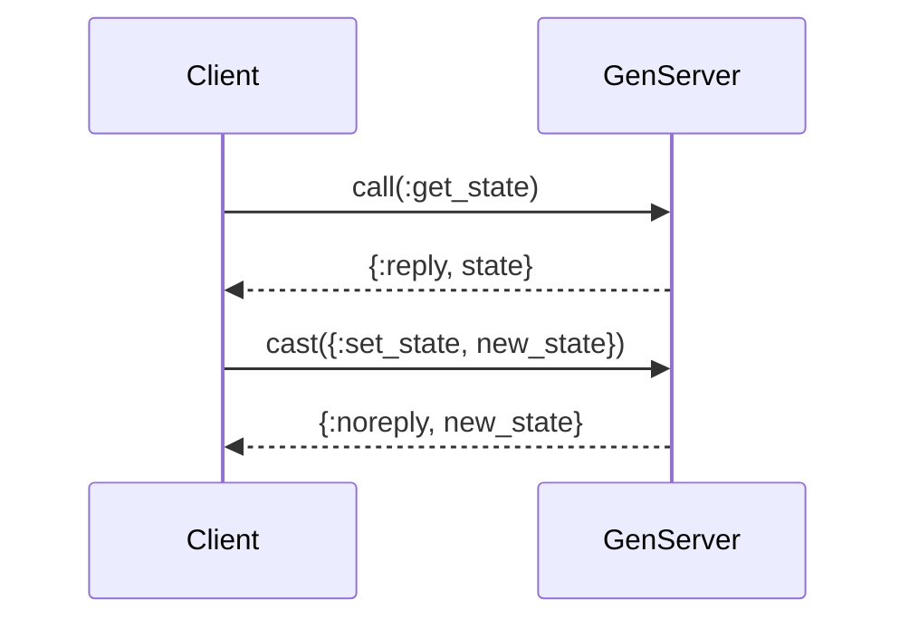
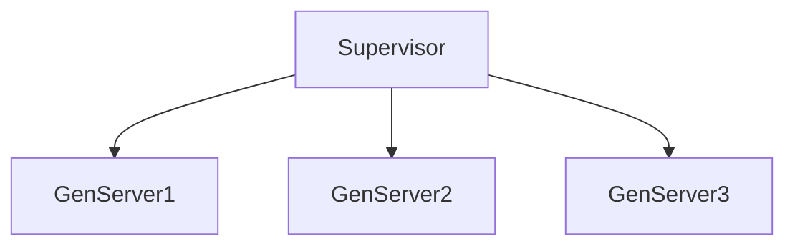
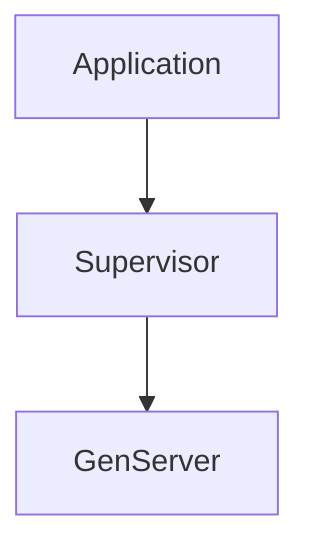

## 10.2. OTP Behaviours: GenServer, Supervisor, Application

In the world of Elixir, the Open Telecom Platform (OTP) provides a set of libraries and design principles for building robust, fault-tolerant applications. At the heart of OTP are its core behaviours: GenServer, Supervisor, and Application. These behaviours form the backbone of concurrent and distributed systems in Elixir, enabling developers to manage processes, handle failures, and structure applications efficiently.

### Understanding OTP Behaviours

OTP behaviours are predefined modules that encapsulate common patterns for process management. They provide a framework for defining how processes should behave, allowing developers to focus on the specific logic of their applications. Let's delve into each of these behaviours and understand their roles and implementations.

### GenServer: The Generic Server

**GenServer** is a generic server module that abstracts the complexities of implementing server processes. It provides a standard interface for managing state, handling synchronous and asynchronous messages, and performing background tasks.

#### Key Features of GenServer

- **State Management**: GenServer maintains state across function calls, making it ideal for stateful processes.
- **Message Handling**: It handles both synchronous (`call`) and asynchronous (`cast`) messages.
- **Process Lifecycle**: GenServer defines callbacks for process initialization, termination, and code upgrades.

#### Implementing a GenServer

To implement a GenServer, you need to define a module that uses the `GenServer` behaviour and implements the required callbacks.

```elixir
defmodule MyGenServer do
  use GenServer

  # Client API

  def start_link(initial_state) do
    GenServer.start_link(__MODULE__, initial_state, name: __MODULE__)
  end

  def get_state do
    GenServer.call(__MODULE__, :get_state)
  end

  def set_state(new_state) do
    GenServer.cast(__MODULE__, {:set_state, new_state})
  end

  # Server Callbacks

  def init(initial_state) do
    {:ok, initial_state}
  end

  def handle_call(:get_state, _from, state) do
    {:reply, state, state}
  end

  def handle_cast({:set_state, new_state}, _state) do
    {:noreply, new_state}
  end
end
```

In this example, `MyGenServer` starts with an initial state and provides functions to get and set the state. The `handle_call` and `handle_cast` callbacks manage synchronous and asynchronous messages, respectively.

#### Visualizing GenServer Interaction



*Figure 1: Interaction between a client and a GenServer.*

#### Try It Yourself

Experiment with the `MyGenServer` module by starting it in an IEx session and calling the `get_state` and `set_state` functions. Modify the state and observe how the GenServer maintains it across calls.

### Supervisor: The Process Overseer

**Supervisor** is responsible for overseeing child processes and ensuring they are restarted upon failure. It is a critical component for building fault-tolerant systems, as it manages the lifecycle of processes and defines strategies for handling failures.

#### Key Features of Supervisor

- **Child Process Management**: Supervisors start, stop, and monitor child processes.
- **Restart Strategies**: They define strategies for restarting child processes, such as `:one_for_one`, `:one_for_all`, and `:rest_for_one`.
- **Fault Tolerance**: Supervisors ensure that the system remains operational despite process failures.

#### Implementing a Supervisor

To implement a Supervisor, you define a module that uses the `Supervisor` behaviour and specifies a supervision strategy and child processes.

```elixir
defmodule MySupervisor do
  use Supervisor

  def start_link do
    Supervisor.start_link(__MODULE__, :ok, name: __MODULE__)
  end

  def init(:ok) do
    children = [
      {MyGenServer, [:initial_state]}
    ]

    Supervisor.init(children, strategy: :one_for_one)
  end
end
```

In this example, `MySupervisor` supervises a single `MyGenServer` process with a `:one_for_one` strategy, meaning if the GenServer crashes, only it will be restarted.

#### Visualizing Supervisor Hierarchy



*Figure 2: A supervisor overseeing multiple GenServer processes.*

#### Try It Yourself

Create a new IEx session, start the `MySupervisor`, and observe how it manages the lifecycle of `MyGenServer`. Simulate a crash in `MyGenServer` and watch the Supervisor restart it.

### Application: Structuring Your Elixir Project

**Application** is a behaviour that provides a way to structure your Elixir project as a single unit that can be started and stopped. It defines the entry point for your application and manages its lifecycle.

#### Key Features of Application

- **Lifecycle Management**: Applications define start and stop callbacks for initializing and cleaning up resources.
- **Configuration**: They provide a mechanism for configuring runtime settings.
- **Dependency Management**: Applications can specify dependencies on other applications.

#### Implementing an Application

To implement an Application, you define a module that uses the `Application` behaviour and implements the `start/2` callback.

```elixir
defmodule MyApp do
  use Application

  def start(_type, _args) do
    children = [
      MySupervisor
    ]

    opts = [strategy: :one_for_one, name: MyApp.Supervisor]
    Supervisor.start_link(children, opts)
  end
end
```

In this example, `MyApp` starts the `MySupervisor` as part of its initialization process, ensuring that all supervised processes are started when the application starts.

#### Visualizing Application Structure



*Figure 3: An application structuring its components using a supervisor.*

#### Try It Yourself

Define the `MyApp` module in your project, configure it in your `mix.exs` file, and start the application using `mix run --no-halt`. Observe how the application manages the lifecycle of its components.

### Design Considerations

When working with OTP behaviours, consider the following:

- **Fault Tolerance**: Use Supervisors to handle process failures gracefully.
- **Scalability**: Design your application to scale by adding more supervised processes.
- **Maintainability**: Structure your application using Applications and Supervisors to separate concerns and improve maintainability.

### Elixir Unique Features

Elixir's integration with OTP provides unique features such as hot code upgrades, distributed computing, and seamless integration with Erlang libraries. These features make Elixir an excellent choice for building scalable, fault-tolerant systems.

### Differences and Similarities

While GenServer, Supervisor, and Application serve different purposes, they work together to provide a cohesive framework for building robust applications. Understanding their roles and interactions is crucial for leveraging the full power of OTP.

### Knowledge Check

- What is the primary role of a GenServer in an Elixir application?
- How does a Supervisor handle child process failures?
- What is the purpose of the Application behaviour in Elixir?

### Summary

In this section, we explored the core OTP behaviours: GenServer, Supervisor, and Application. These behaviours are essential for building robust, fault-tolerant systems in Elixir. By understanding their roles and interactions, you can design applications that are resilient, scalable, and maintainable.

### Embrace the Journey

As you continue your journey with Elixir and OTP, remember that these behaviours are just the beginning. Experiment with different supervision strategies, explore advanced features like hot code upgrades, and build complex systems that leverage the full power of OTP. Stay curious, keep learning, and enjoy the process of mastering Elixir.

## Quiz: OTP Behaviours: GenServer, Supervisor, Application



### What is the primary role of a GenServer in an Elixir application?

- [x] Managing state and handling messages
- [ ] Overseeing child processes
- [ ] Structuring applications
- [ ] Performing database operations

> **Explanation:** GenServer is responsible for managing state and handling synchronous and asynchronous messages in an Elixir application.

### How does a Supervisor handle child process failures?

- [x] By restarting the failed process
- [ ] By logging the error and continuing
- [ ] By terminating the application
- [ ] By sending an alert to the administrator

> **Explanation:** Supervisors restart failed child processes according to the defined restart strategy, ensuring fault tolerance.

### What is the purpose of the Application behaviour in Elixir?

- [x] Structuring applications for starting and stopping as a unit
- [ ] Managing state and handling messages
- [ ] Overseeing child processes
- [ ] Performing database operations

> **Explanation:** The Application behaviour provides a way to structure Elixir projects as a single unit that can be started and stopped.

### Which OTP behaviour is responsible for defining restart strategies?

- [ ] GenServer
- [x] Supervisor
- [ ] Application
- [ ] Task

> **Explanation:** Supervisors define restart strategies for managing child processes and ensuring fault tolerance.

### What is the `:one_for_one` strategy in a Supervisor?

- [x] Restart only the failed child process
- [ ] Restart all child processes
- [ ] Restart the supervisor itself
- [ ] Restart the application

> **Explanation:** The `:one_for_one` strategy restarts only the failed child process, leaving others unaffected.

### Which function is used to start a GenServer?

- [x] `GenServer.start_link/3`
- [ ] `Supervisor.start_link/2`
- [ ] `Application.start/2`
- [ ] `Task.start/1`

> **Explanation:** `GenServer.start_link/3` is used to start a GenServer process.

### What does the `init/1` callback in a GenServer do?

- [x] Initializes the process state
- [ ] Handles synchronous messages
- [ ] Handles asynchronous messages
- [ ] Terminates the process

> **Explanation:** The `init/1` callback initializes the process state when a GenServer starts.

### Which OTP behaviour is used for managing the lifecycle of an Elixir project?

- [ ] GenServer
- [ ] Supervisor
- [x] Application
- [ ] Task

> **Explanation:** The Application behaviour manages the lifecycle of an Elixir project, including starting and stopping.

### What is the role of the `handle_call/3` callback in a GenServer?

- [x] Handling synchronous messages
- [ ] Handling asynchronous messages
- [ ] Initializing the process state
- [ ] Terminating the process

> **Explanation:** The `handle_call/3` callback handles synchronous messages in a GenServer.

### True or False: Supervisors can only manage GenServer processes.

- [ ] True
- [x] False

> **Explanation:** Supervisors can manage any type of process, not just GenServers, as long as they implement the child specification.


