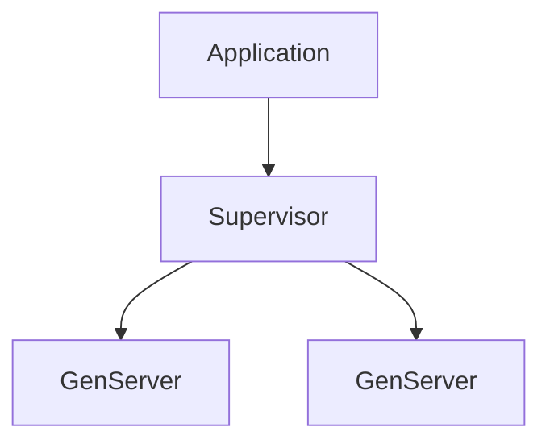

## 10.2. OTP Behaviours: GenServer, Supervisor, Application

Elixir's Open Telecom Platform (OTP) is a set of libraries and design principles for building concurrent and fault-tolerant applications. At the heart of OTP are three core behaviours: GenServer, Supervisor, and Application. These behaviours provide the foundational building blocks for creating robust and scalable systems in Elixir. In this section, we will delve into each of these behaviours, exploring their roles, functionalities, and how they interconnect to form resilient applications.

### GenServer

#### Overview

GenServer is a generic server module that simplifies the process of implementing server processes. It abstracts the complexities of handling synchronous and asynchronous messages, managing state, and ensuring fault tolerance. GenServer is a fundamental component in the Elixir ecosystem, enabling developers to focus on business logic rather than low-level process management.

#### Key Features

- **State Management**: GenServer provides a structured way to maintain and modify state across function calls.
- **Message Handling**: It supports both synchronous (`call`) and asynchronous (`cast`) message handling.
- **Fault Tolerance**: GenServer processes can be supervised and restarted automatically in case of failures.

#### Implementing a GenServer

To illustrate the use of GenServer, let's create a simple counter server that can increment, decrement, and retrieve the current count.

```elixir
defmodule Counter do
  use GenServer

  # Client API

  def start_link(initial_value \\ 0) do
    GenServer.start_link(__MODULE__, initial_value, name: __MODULE__)
  end

  def increment do
    GenServer.cast(__MODULE__, :increment)
  end

  def decrement do
    GenServer.cast(__MODULE__, :decrement)
  end

  def get_count do
    GenServer.call(__MODULE__, :get_count)
  end

  # Server Callbacks

  def init(initial_value) do
    {:ok, initial_value}
  end

  def handle_cast(:increment, state) do
    {:noreply, state + 1}
  end

  def handle_cast(:decrement, state) do
    {:noreply, state - 1}
  end

  def handle_call(:get_count, _from, state) do
    {:reply, state, state}
  end
end
```

##### Explanation

- **start_link/1**: Initializes the GenServer with an initial count value.
- **increment/0 and decrement/0**: Asynchronously update the count.
- **get_count/0**: Synchronously retrieves the current count.
- **init/1**: Sets the initial state.
- **handle_cast/2**: Handles asynchronous messages.
- **handle_call/3**: Handles synchronous messages.

### Supervisor

#### Overview

A Supervisor is a process responsible for overseeing other processes, known as child processes. The primary role of a Supervisor is to monitor these processes and restart them if they fail. This behaviour is crucial for building fault-tolerant systems where uptime and reliability are paramount.

#### Key Features

- **Child Process Management**: Supervisors manage child processes, ensuring they are running and restarting them as needed.
- **Supervision Strategies**: They offer various strategies for restarting child processes, such as `:one_for_one`, `:one_for_all`, and `:rest_for_one`.
- **Fault Isolation**: Supervisors help isolate faults, preventing them from cascading through the system.

#### Implementing a Supervisor

Let's create a Supervisor for our `Counter` GenServer.

```elixir
defmodule CounterSupervisor do
  use Supervisor

  def start_link do
    Supervisor.start_link(__MODULE__, :ok, name: __MODULE__)
  end

  def init(:ok) do
    children = [
      {Counter, [0]}
    ]

    Supervisor.init(children, strategy: :one_for_one)
  end
end
```

##### Explanation

- **start_link/0**: Starts the Supervisor.
- **init/1**: Defines the child processes to be supervised and the supervision strategy.
- **Children Specification**: Specifies the `Counter` GenServer as a child with an initial state of `0`.

#### Supervision Strategies

- **`:one_for_one`**: Restarts the failed child process.
- **`:one_for_all`**: Restarts all child processes if one fails.
- **`:rest_for_one`**: Restarts the failed process and any subsequent children.

### Application

#### Overview

The Application behaviour provides a framework for defining and managing the lifecycle of an Elixir application. It is responsible for starting and stopping the application as a unit, ensuring that all necessary processes are started in the correct order and stopped gracefully.

#### Key Features

- **Lifecycle Management**: Applications define start and stop callbacks for managing resources.
- **Configuration**: Centralizes configuration management for the application and its dependencies.
- **Integration**: Facilitates integration with other applications and libraries.

#### Implementing an Application

Let's define an application that uses our `CounterSupervisor`.

```elixir
defmodule CounterApp do
  use Application

  def start(_type, _args) do
    children = [
      CounterSupervisor
    ]

    opts = [strategy: :one_for_one, name: CounterApp.Supervisor]
    Supervisor.start_link(children, opts)
  end
end
```

##### Explanation

- **start/2**: Defines the application's start callback, which initializes the `CounterSupervisor`.
- **Children Specification**: Lists the Supervisor as a child process to be started.

### Visualizing OTP Behaviours

To better understand how these components interact, let's visualize the relationships between GenServer, Supervisor, and Application.


```mermaid
graph TD;
    A[Application] --> B[Supervisor]
    B --> C[GenServer]
    B --> D[GenServer]
```

**Diagram Explanation**: This diagram illustrates how an Application starts a Supervisor, which in turn manages multiple GenServer processes. This hierarchy ensures that the system is structured, with each layer responsible for specific tasks.

### Try It Yourself

Experiment with the code examples by:

- Modifying the `Counter` GenServer to include additional operations, such as reset.
- Changing the supervision strategy in `CounterSupervisor` to see how it affects process management.
- Adding another GenServer to the application and observing how the Supervisor handles multiple children.

### Elixir Unique Features

Elixir's unique features, such as lightweight processes and the BEAM VM's ability to handle massive concurrency, make OTP behaviours particularly powerful. The immutability and pattern matching inherent in Elixir further enhance the reliability and expressiveness of GenServer and Supervisor implementations.

### Key Takeaways

- **GenServer**: Simplifies state management and message handling in concurrent applications.
- **Supervisor**: Ensures fault tolerance by monitoring and restarting child processes.
- **Application**: Manages the lifecycle of an Elixir application, providing a structured way to start and stop processes.

### Further Reading

- [Elixir GenServer Documentation](https://hexdocs.pm/elixir/GenServer.html)
- [Elixir Supervisor Documentation](https://hexdocs.pm/elixir/Supervisor.html)
- [Elixir Application Documentation](https://hexdocs.pm/elixir/Application.html)

### Knowledge Check

- How does a Supervisor's `:one_for_all` strategy differ from `:one_for_one`?
- What are the benefits of using GenServer for state management?
- How can an Application manage dependencies and configurations?

### Embrace the Journey

Remember, mastering OTP behaviours is a journey. As you continue to explore and experiment, you'll gain a deeper understanding of how to build resilient and scalable systems. Keep pushing the boundaries of what's possible with Elixir and OTP!

## Quiz Time!



### What is the primary purpose of a GenServer in Elixir?

- [x] To manage state and handle messages in a structured way
- [ ] To supervise other processes
- [ ] To define application lifecycle
- [ ] To handle HTTP requests

> **Explanation:** GenServer is used to manage state and handle messages, both synchronously and asynchronously.

### Which supervision strategy restarts all child processes if one fails?

- [ ] `:one_for_one`
- [x] `:one_for_all`
- [ ] `:rest_for_one`
- [ ] `:simple_one_for_one`

> **Explanation:** The `:one_for_all` strategy restarts all child processes if one fails, ensuring consistency among them.

### What is the role of the Application behaviour in Elixir?

- [ ] To handle HTTP requests
- [ ] To manage state
- [x] To define the lifecycle of an application
- [ ] To perform database operations

> **Explanation:** The Application behaviour is responsible for managing the start and stop lifecycle of an Elixir application.

### Which function is used to start a GenServer process?

- [ ] `GenServer.run/1`
- [x] `GenServer.start_link/3`
- [ ] `GenServer.begin/2`
- [ ] `GenServer.init/1`

> **Explanation:** `GenServer.start_link/3` is used to start a GenServer process and link it to the current process.

### How does a Supervisor manage child processes?

- [x] By monitoring them and restarting if they fail
- [ ] By handling their HTTP requests
- [ ] By managing their database connections
- [ ] By logging their activities

> **Explanation:** A Supervisor manages child processes by monitoring them and restarting them upon failure.

### What does the `init/1` function in a GenServer do?

- [ ] It handles HTTP requests
- [x] It initializes the state of the GenServer
- [ ] It supervises other processes
- [ ] It logs messages

> **Explanation:** The `init/1` function initializes the state of the GenServer when it starts.

### Which OTP behaviour is responsible for overseeing child processes?

- [ ] GenServer
- [x] Supervisor
- [ ] Application
- [ ] Task

> **Explanation:** The Supervisor behaviour oversees child processes, ensuring they are running and restarting them if needed.

### What is the benefit of using the `:rest_for_one` strategy?

- [ ] It restarts all processes
- [ ] It does not restart any processes
- [x] It restarts the failed process and subsequent ones
- [ ] It restarts only the first process

> **Explanation:** The `:rest_for_one` strategy restarts the failed process and any subsequent processes in the child list.

### True or False: An Application can manage its own configuration and dependencies.

- [x] True
- [ ] False

> **Explanation:** An Application can manage its configuration and dependencies, centralizing these aspects for easier management.

### Which function in an Application module is responsible for starting the application?

- [ ] `Application.run/2`
- [x] `Application.start/2`
- [ ] `Application.init/1`
- [ ] `Application.begin/3`

> **Explanation:** The `Application.start/2` function is responsible for starting the application and its processes.


