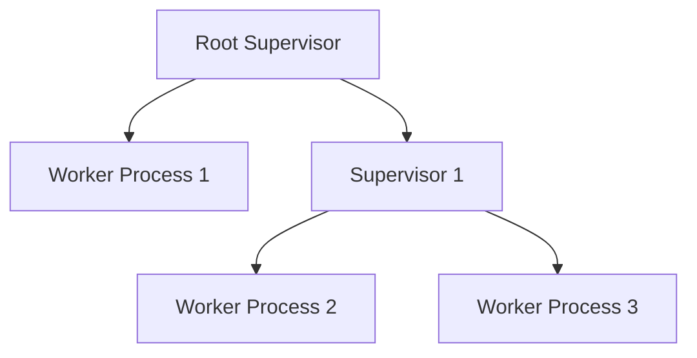
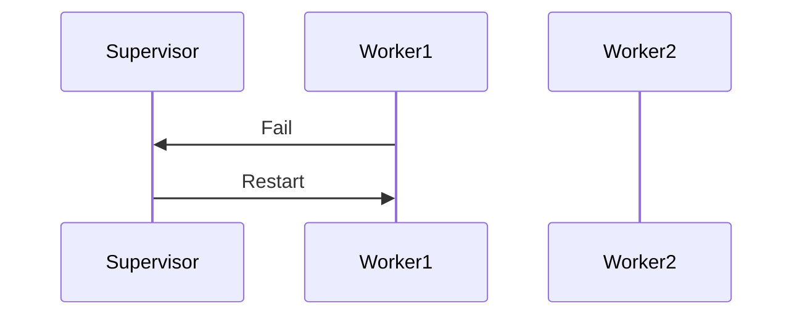
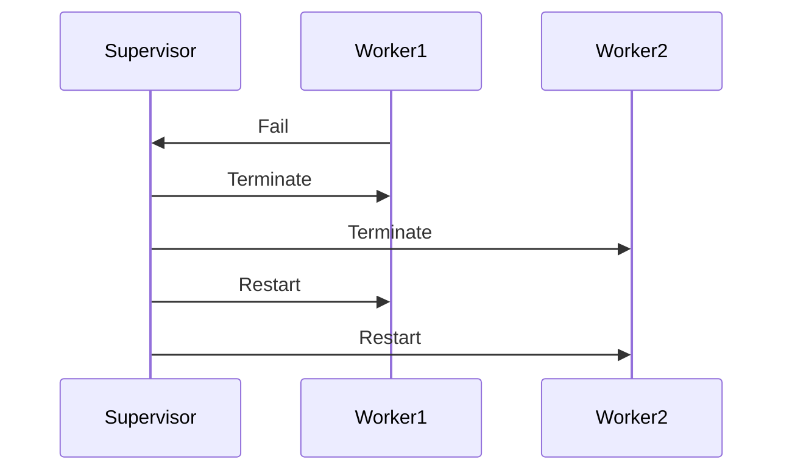

## 10.3. Designing Fault-Tolerant Systems with Supervisors

In the world of distributed systems, failures are inevitable. Designing systems that can gracefully handle these failures is crucial for building robust applications. Elixir, with its roots in the Erlang ecosystem, provides powerful tools for building fault-tolerant systems. At the heart of this capability is the concept of **Supervisors**. In this section, we will explore how to design fault-tolerant systems using Supervisors in Elixir, focusing on supervision trees, restart strategies, and the benefits of isolating failures.

### Understanding Supervisors

Supervisors are a fundamental part of the Open Telecom Platform (OTP) framework in Elixir. They are specialized processes designed to monitor other processes, known as worker processes. The primary role of a Supervisor is to ensure that its child processes are running correctly and to restart them if they fail. This mechanism is crucial for building systems that can recover from unexpected errors without human intervention.

#### Key Concepts

- **Supervision Trees**: A hierarchical organization of processes where Supervisors manage worker processes and other Supervisors.
- **Restart Strategies**: Define how Supervisors handle failures of their child processes. Common strategies include one-for-one, one-for-all, and rest-for-one.
- **Isolation of Failures**: By isolating failures to specific processes, Supervisors enhance the overall reliability of the system.

### Supervision Trees

A supervision tree is a structured way to organize processes in a hierarchical manner. At the top of the tree is a root Supervisor, which can have multiple child processes. These child processes can be either worker processes or other Supervisors, forming a tree-like structure.

#### Visualizing Supervision Trees

To better understand supervision trees, let's visualize a simple tree structure:



In this diagram, the root Supervisor manages Worker Process 1 and Supervisor 1. Supervisor 1, in turn, manages Worker Process 2 and Worker Process 3. This hierarchical structure allows for modular and scalable system design.

#### Benefits of Supervision Trees

- **Modularity**: Supervision trees allow you to break down complex systems into smaller, manageable components.
- **Scalability**: By organizing processes hierarchically, you can easily scale your system by adding more Supervisors and worker processes.
- **Fault Isolation**: Failures in one part of the tree do not affect other parts, allowing the system to continue functioning.

### Restart Strategies

Restart strategies define how a Supervisor responds to failures of its child processes. Elixir provides several built-in strategies:

#### One-for-One Strategy

In the one-for-one strategy, if a child process fails, only that process is restarted. This strategy is suitable for independent processes where the failure of one process does not affect others.

```elixir
defmodule MyApp.Supervisor do
  use Supervisor

  def start_link(opts) do
    Supervisor.start_link(__MODULE__, :ok, opts)
  end

  def init(:ok) do
    children = [
      {MyApp.Worker, arg1},
      {MyApp.AnotherWorker, arg2}
    ]

    Supervisor.init(children, strategy: :one_for_one)
  end
end
```

#### One-for-All Strategy

In the one-for-all strategy, if a child process fails, all other child processes are terminated and restarted. This strategy is useful when processes are interdependent and need to be in a consistent state.

```elixir
defmodule MyApp.Supervisor do
  use Supervisor

  def start_link(opts) do
    Supervisor.start_link(__MODULE__, :ok, opts)
  end

  def init(:ok) do
    children = [
      {MyApp.Worker, arg1},
      {MyApp.AnotherWorker, arg2}
    ]

    Supervisor.init(children, strategy: :one_for_all)
  end
end
```

#### Rest-for-One Strategy

In the rest-for-one strategy, if a child process fails, the failed process and any subsequent processes are terminated and restarted. This strategy is useful when processes are dependent on each other in a sequential manner.

```elixir
defmodule MyApp.Supervisor do
  use Supervisor

  def start_link(opts) do
    Supervisor.start_link(__MODULE__, :ok, opts)
  end

  def init(:ok) do
    children = [
      {MyApp.Worker, arg1},
      {MyApp.AnotherWorker, arg2}
    ]

    Supervisor.init(children, strategy: :rest_for_one)
  end
end
```

### Benefits of Using Supervisors

Supervisors offer several benefits that contribute to building fault-tolerant systems:

- **Automatic Recovery**: Supervisors automatically restart failed processes, reducing downtime and the need for manual intervention.
- **Fault Isolation**: By isolating failures to specific processes, Supervisors prevent cascading failures that could bring down the entire system.
- **System Reliability**: With Supervisors, systems can recover from unexpected errors, enhancing overall reliability and user experience.

### Designing a Fault-Tolerant System

Let's walk through the process of designing a fault-tolerant system using Supervisors in Elixir. We'll build a simple application that simulates a real-world scenario.

#### Step 1: Define the Application Structure

First, define the structure of your application. Identify the processes that need to be supervised and their relationships. For this example, we'll create a simple chat application with the following components:

- **ChatServer**: Manages chat rooms and messages.
- **UserSession**: Handles user sessions and authentication.
- **Logger**: Logs chat messages and user activities.

#### Step 2: Implement Worker Processes

Implement the worker processes that will be supervised. Each worker process should focus on a specific task.

```elixir
defmodule ChatServer do
  use GenServer

  # GenServer callbacks and implementation
end

defmodule UserSession do
  use GenServer

  # GenServer callbacks and implementation
end

defmodule Logger do
  use GenServer

  # GenServer callbacks and implementation
end
```

#### Step 3: Create the Supervisor

Create a Supervisor to manage the worker processes. Choose an appropriate restart strategy based on the relationships between the processes.

```elixir
defmodule ChatApp.Supervisor do
  use Supervisor

  def start_link(opts) do
    Supervisor.start_link(__MODULE__, :ok, opts)
  end

  def init(:ok) do
    children = [
      {ChatServer, []},
      {UserSession, []},
      {Logger, []}
    ]

    Supervisor.init(children, strategy: :one_for_one)
  end
end
```

#### Step 4: Start the Application

Start the application and ensure that the Supervisor is running. The Supervisor will automatically manage the lifecycle of the worker processes.

```elixir
defmodule ChatApp.Application do
  use Application

  def start(_type, _args) do
    children = [
      ChatApp.Supervisor
    ]

    opts = [strategy: :one_for_one, name: ChatApp.Supervisor]
    Supervisor.start_link(children, opts)
  end
end
```

### Try It Yourself

Experiment with the code examples provided. Try modifying the restart strategies and observe how the system behaves when a process fails. This hands-on experience will deepen your understanding of Supervisors and fault-tolerant design.

### Visualizing Restart Strategies

To further illustrate the restart strategies, let's visualize them using Mermaid.js diagrams.

#### One-for-One Strategy



#### One-for-All Strategy



#### Rest-for-One Strategy


### Key Takeaways

- **Supervisors** are essential for building fault-tolerant systems in Elixir.
- **Supervision Trees** provide a hierarchical structure for organizing processes.
- **Restart Strategies** determine how Supervisors handle process failures.
- **Fault Isolation** enhances system reliability by preventing cascading failures.

### Further Reading

For more information on Supervisors and fault-tolerant design in Elixir, consider exploring the following resources:

- [Elixir Documentation on Supervisors](https://hexdocs.pm/elixir/Supervisor.html)
- [Learn You Some Erlang for Great Good!](http://learnyousomeerlang.com/supervisors)
- [Designing for Scalability with Erlang/OTP](https://pragprog.com/titles/jaerlang/designing-for-scalability-with-erlang-otp/)

## Quiz: Designing Fault-Tolerant Systems with Supervisors



### What is the primary role of a Supervisor in Elixir?

- [x] To monitor and restart child processes if they fail
- [ ] To execute business logic
- [ ] To handle user authentication
- [ ] To manage database connections

> **Explanation:** Supervisors are responsible for monitoring and restarting child processes to ensure system reliability.

### Which restart strategy restarts only the failed child process?

- [x] One-for-one
- [ ] One-for-all
- [ ] Rest-for-one
- [ ] All-for-one

> **Explanation:** The one-for-one strategy restarts only the failed child process, leaving others unaffected.

### In a supervision tree, what can a Supervisor manage?

- [x] Both worker processes and other Supervisors
- [ ] Only worker processes
- [ ] Only other Supervisors
- [ ] Only GenServers

> **Explanation:** Supervisors can manage both worker processes and other Supervisors, forming a hierarchical structure.

### Which restart strategy is suitable for interdependent processes?

- [ ] One-for-one
- [x] One-for-all
- [ ] Rest-for-one
- [ ] All-for-one

> **Explanation:** The one-for-all strategy is suitable for interdependent processes as it restarts all child processes when one fails.

### What is a benefit of using supervision trees?

- [x] Fault isolation
- [ ] Increased complexity
- [ ] Manual intervention
- [ ] Reduced reliability

> **Explanation:** Supervision trees provide fault isolation, preventing cascading failures and enhancing system reliability.

### Which strategy restarts the failed process and any subsequent processes?

- [ ] One-for-one
- [ ] One-for-all
- [x] Rest-for-one
- [ ] All-for-one

> **Explanation:** The rest-for-one strategy restarts the failed process and any subsequent processes in the supervision tree.

### What is the main advantage of automatic recovery in Supervisors?

- [x] Reduced downtime
- [ ] Increased manual intervention
- [ ] Decreased system reliability
- [ ] Increased complexity

> **Explanation:** Automatic recovery reduces downtime by restarting failed processes without manual intervention.

### What is the purpose of the `Supervisor.init/2` function?

- [x] To define child processes and restart strategy
- [ ] To start the application
- [ ] To handle user input
- [ ] To manage database connections

> **Explanation:** `Supervisor.init/2` is used to define child processes and the restart strategy for a Supervisor.

### Which strategy is best for independent processes?

- [x] One-for-one
- [ ] One-for-all
- [ ] Rest-for-one
- [ ] All-for-one

> **Explanation:** The one-for-one strategy is best for independent processes as it restarts only the failed process.

### True or False: Supervisors can prevent all system failures.

- [ ] True
- [x] False

> **Explanation:** While Supervisors enhance fault tolerance, they cannot prevent all system failures. They help manage and recover from failures.



Remember, mastering Supervisors is just the beginning of building robust, fault-tolerant systems in Elixir. Keep experimenting, stay curious, and enjoy the journey!
