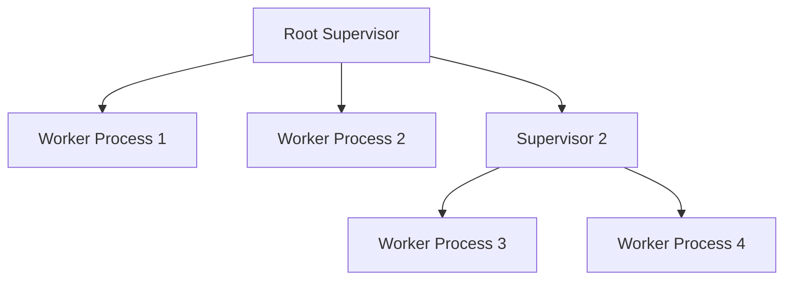
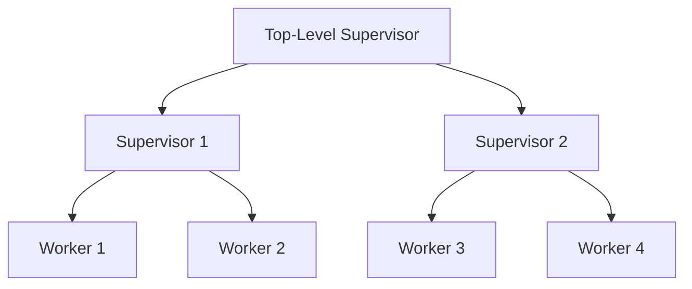

## 10.3. Designing Fault-Tolerant Systems with Supervisors

Designing fault-tolerant systems is a cornerstone of building robust and reliable software. In Elixir, supervisors play a crucial role in achieving fault tolerance by managing processes and ensuring system resilience. This section delves into the mechanics of supervisors, their role in the Open Telecom Platform (OTP), and how they contribute to building fault-tolerant systems.

### Understanding Supervisors

Supervisors are specialized processes in Elixir that monitor other processes, known as worker processes. They are part of the OTP framework, which provides a set of design principles and patterns for building concurrent and distributed systems. Supervisors are responsible for starting, stopping, and monitoring their child processes, allowing developers to define strategies for handling process failures.

#### Key Concepts

- **Supervision Trees**: A hierarchical organization of processes where supervisors manage worker processes and potentially other supervisors.
- **Restart Strategies**: Define how supervisors should respond to failures, with options like one-for-one, one-for-all, and rest-for-one.
- **Fault Isolation**: By isolating failures to specific processes, supervisors prevent cascading failures and enhance system reliability.

### Supervision Trees

Supervision trees are a fundamental concept in designing fault-tolerant systems. They organize processes hierarchically, with supervisors at each level managing their child processes. This structure allows for modular and scalable system design.

#### Diagram: Supervision Tree Structure


```mermaid
graph TD;
    A[Root Supervisor] --> B[Worker Process 1];
    A --> C[Worker Process 2];
    A --> D[Supervisor 2];
    D --> E[Worker Process 3];
    D --> F[Worker Process 4];
```

**Caption**: A simple supervision tree with a root supervisor managing two worker processes and another supervisor, which in turn manages additional worker processes.

### Restart Strategies

Supervisors use restart strategies to determine how to handle child process failures. These strategies are crucial for maintaining system stability and reliability.

#### One-for-One Strategy

In the one-for-one strategy, if a child process fails, only that process is restarted. This strategy is useful when child processes operate independently.

#### One-for-All Strategy

With the one-for-all strategy, if a child process fails, all other child processes are terminated and restarted. This strategy is appropriate when child processes are interdependent.

#### Rest-for-One Strategy

In the rest-for-one strategy, if a child process fails, that process and any subsequent child processes in the start order are restarted. This strategy is beneficial when processes have dependencies on subsequent processes.

### Benefits of Using Supervisors

Supervisors provide several benefits that contribute to fault-tolerant system design:

- **Isolation of Failures**: Supervisors isolate failures to specific processes, preventing them from affecting the entire system.
- **Automatic Recovery**: They automatically restart failed processes, reducing downtime and manual intervention.
- **Scalability**: Supervision trees can be extended to accommodate new processes, supporting system growth.
- **Modularity**: By organizing processes hierarchically, supervisors promote modular system design.

### Implementing Supervisors in Elixir

Let's explore how to implement supervisors in Elixir, leveraging OTP principles to build fault-tolerant systems.

#### Creating a Supervisor

To create a supervisor, define a module that uses the `Supervisor` behavior and implement the `init/1` callback to specify the child processes and restart strategy.

```elixir
defmodule MyApp.Supervisor do
  use Supervisor

  def start_link(init_arg) do
    Supervisor.start_link(__MODULE__, init_arg, name: __MODULE__)
  end

  def init(_init_arg) do
    children = [
      {MyApp.Worker, arg1},
      {MyApp.AnotherWorker, arg2}
    ]

    Supervisor.init(children, strategy: :one_for_one)
  end
end
```

**Explanation**: In this example, `MyApp.Supervisor` is a supervisor module that starts two worker processes, `MyApp.Worker` and `MyApp.AnotherWorker`, using the one-for-one restart strategy.

#### Starting and Stopping Supervisors

Supervisors are typically started as part of an application's supervision tree. Use the `start_link/2` function to start a supervisor and link it to the calling process.

```elixir
{:ok, _pid} = MyApp.Supervisor.start_link([])
```

To stop a supervisor, use the `Supervisor.stop/1` function.

```elixir
Supervisor.stop(MyApp.Supervisor)
```

### Advanced Supervisor Features

Supervisors offer advanced features that enhance their flexibility and power.

#### Dynamic Supervision

Dynamic supervision allows supervisors to manage a dynamic set of child processes, adding or removing them at runtime.

```elixir
defmodule MyApp.DynamicSupervisor do
  use DynamicSupervisor

  def start_link(init_arg) do
    DynamicSupervisor.start_link(__MODULE__, init_arg, name: __MODULE__)
  end

  def init(_init_arg) do
    DynamicSupervisor.init(strategy: :one_for_one)
  end

  def start_child(child_spec) do
    DynamicSupervisor.start_child(__MODULE__, child_spec)
  end
end
```

**Explanation**: `MyApp.DynamicSupervisor` is a dynamic supervisor that can start child processes dynamically using `start_child/1`.

#### Supervisor Trees with Multiple Levels

Supervision trees can have multiple levels, with supervisors managing other supervisors. This structure allows for complex and scalable system designs.

```elixir
defmodule MyApp.TopLevelSupervisor do
  use Supervisor

  def start_link(init_arg) do
    Supervisor.start_link(__MODULE__, init_arg, name: __MODULE__)
  end

  def init(_init_arg) do
    children = [
      {MyApp.Supervisor, []},
      {MyApp.AnotherSupervisor, []}
    ]

    Supervisor.init(children, strategy: :one_for_all)
  end
end
```

**Explanation**: `MyApp.TopLevelSupervisor` manages two other supervisors, `MyApp.Supervisor` and `MyApp.AnotherSupervisor`, using the one-for-all strategy.

### Design Considerations

When designing fault-tolerant systems with supervisors, consider the following:

- **Restart Intensity**: Define the maximum number of restarts allowed within a given time frame to prevent endless restart loops.
- **Child Specifications**: Carefully define child specifications, including restart strategies and shutdown times.
- **Dependencies**: Consider dependencies between processes and choose appropriate restart strategies.
- **Scalability**: Design supervision trees that can accommodate future growth and changes.

### Elixir Unique Features

Elixir provides unique features that enhance the power of supervisors:

- **Hot Code Upgrades**: Elixir supports hot code upgrades, allowing you to update code without stopping the system. Supervisors can manage these upgrades seamlessly.
- **Concurrency and Distribution**: Elixir's concurrency model and distribution capabilities enable supervisors to manage processes across nodes, enhancing fault tolerance in distributed systems.

### Differences and Similarities

Supervisors are often compared to other fault-tolerance mechanisms, such as:

- **Erlang Supervisors**: Elixir supervisors are built on top of Erlang's supervisor module, inheriting its robustness and reliability.
- **Actor Model**: While both supervisors and the actor model manage processes, supervisors focus on fault tolerance and process recovery.

### Try It Yourself

Experiment with supervisors by modifying the provided code examples:

- Change the restart strategy in `MyApp.Supervisor` and observe how it affects process recovery.
- Implement a dynamic supervisor that manages a varying number of worker processes.
- Create a multi-level supervision tree and explore how failures propagate through the hierarchy.

### Visualizing Supervisor Relationships

To better understand supervisor relationships, consider the following diagram:


```mermaid
graph TD;
    A[Top-Level Supervisor] --> B[Supervisor 1];
    A --> C[Supervisor 2];
    B --> D[Worker 1];
    B --> E[Worker 2];
    C --> F[Worker 3];
    C --> G[Worker 4];
```

**Caption**: A multi-level supervision tree with a top-level supervisor managing two other supervisors, each responsible for their worker processes.

### Knowledge Check

- What is the primary role of a supervisor in Elixir?
- Describe the one-for-one restart strategy and when it is most appropriate.
- How does dynamic supervision differ from static supervision?
- What are the benefits of using supervision trees in system design?

### Summary

In this section, we explored the role of supervisors in designing fault-tolerant systems in Elixir. We covered supervision trees, restart strategies, and the benefits of using supervisors. By leveraging Elixir's unique features and OTP principles, you can build robust and reliable systems that withstand failures and recover gracefully.

Remember, designing fault-tolerant systems is an ongoing journey. As you continue to explore Elixir and OTP, you'll discover new ways to enhance system reliability and resilience. Keep experimenting, stay curious, and enjoy the journey!

## Quiz Time!



### What is the primary role of a supervisor in Elixir?

- [x] To monitor and manage worker processes
- [ ] To execute business logic
- [ ] To handle user input
- [ ] To provide network connectivity

> **Explanation:** Supervisors are responsible for monitoring and managing worker processes, ensuring system reliability and fault tolerance.

### Which restart strategy restarts only the failed process?

- [x] One-for-one
- [ ] One-for-all
- [ ] Rest-for-one
- [ ] All-for-one

> **Explanation:** The one-for-one strategy restarts only the failed process, making it ideal for independent processes.

### How does dynamic supervision differ from static supervision?

- [x] Dynamic supervision allows adding/removing child processes at runtime
- [ ] Static supervision uses fixed child processes
- [ ] Dynamic supervision requires manual intervention
- [ ] Static supervision is more flexible

> **Explanation:** Dynamic supervision allows for managing a dynamic set of child processes, adding or removing them at runtime.

### What is a benefit of using supervision trees?

- [x] Isolation of failures
- [ ] Increased code complexity
- [ ] Reduced system reliability
- [ ] Less modular design

> **Explanation:** Supervision trees isolate failures, preventing them from affecting the entire system and enhancing reliability.

### Which feature allows Elixir to update code without stopping the system?

- [x] Hot code upgrades
- [ ] Cold code upgrades
- [ ] Restart strategies
- [ ] Fault isolation

> **Explanation:** Hot code upgrades allow Elixir to update code without stopping the system, maintaining continuous operation.

### What is the role of a supervisor in a multi-level supervision tree?

- [x] To manage other supervisors and their processes
- [ ] To execute user commands
- [ ] To handle external API requests
- [ ] To store application data

> **Explanation:** In a multi-level supervision tree, a supervisor manages other supervisors and their processes, creating a hierarchical structure.

### Which restart strategy is suitable for interdependent processes?

- [x] One-for-all
- [ ] One-for-one
- [ ] Rest-for-one
- [ ] None-for-all

> **Explanation:** The one-for-all strategy is suitable for interdependent processes, as it restarts all child processes if one fails.

### What is a key consideration when designing fault-tolerant systems?

- [x] Restart intensity
- [ ] Code readability
- [ ] User interface design
- [ ] Network latency

> **Explanation:** Restart intensity defines the maximum number of restarts allowed within a given time frame, preventing endless restart loops.

### True or False: Supervisors can manage processes across distributed nodes.

- [x] True
- [ ] False

> **Explanation:** Elixir's concurrency model and distribution capabilities enable supervisors to manage processes across nodes, enhancing fault tolerance.

### What is a common pitfall when using supervisors?

- [x] Ignoring dependencies between processes
- [ ] Overusing restart strategies
- [ ] Using too many supervisors
- [ ] Implementing hot code upgrades

> **Explanation:** Ignoring dependencies between processes can lead to inappropriate restart strategies and reduced system reliability.




