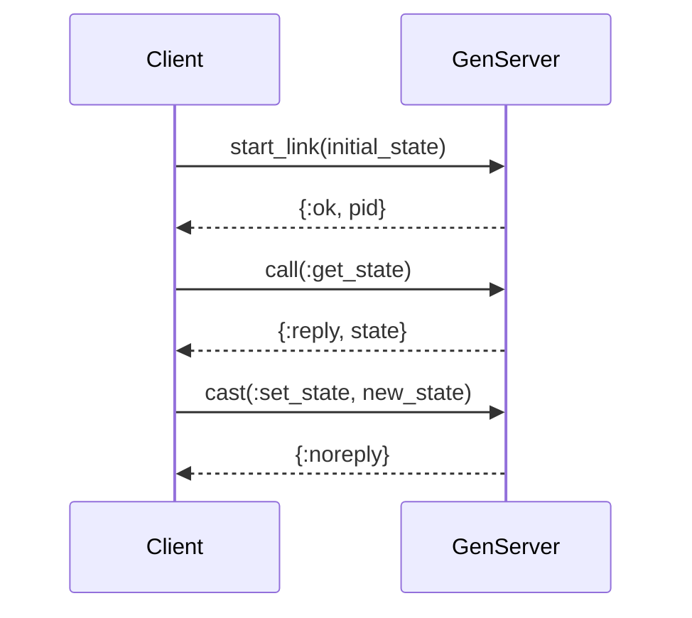

## 10.4. Implementing Servers with GenServer

In the world of Elixir, the GenServer module is a cornerstone for building robust, concurrent applications. It provides a generic server implementation that simplifies the process of creating servers that handle requests, maintain state, and perform asynchronous tasks. In this section, we will delve into the intricacies of implementing servers with GenServer, focusing on defining callbacks, managing state, and exploring practical use cases.

### Understanding GenServer

GenServer is part of the Open Telecom Platform (OTP) framework, which provides a set of design principles and patterns for building fault-tolerant systems. GenServer abstracts the complexities of process management, allowing developers to focus on the business logic of their applications.

#### Key Concepts

- **Processes**: In Elixir, processes are lightweight and isolated, making them ideal for concurrent tasks. GenServer leverages processes to handle state and communication.
- **Callbacks**: GenServer defines a set of callbacks that developers implement to handle various events and interactions.
- **State Management**: GenServer maintains internal state, which can be updated and queried through its API.

### Defining GenServer Callbacks

The core of a GenServer implementation lies in its callbacks. These functions define how the server initializes, handles requests, and manages state.

#### Implementing `init/1`

The `init/1` callback is invoked when the GenServer starts. It initializes the server's state and returns a tuple indicating the initial state.

```elixir
defmodule MyServer do
  use GenServer

  # Client API
  def start_link(initial_state) do
    GenServer.start_link(__MODULE__, initial_state, name: __MODULE__)
  end

  # Server Callbacks
  def init(initial_state) do
    {:ok, initial_state}
  end
end
```

In this example, `start_link/1` is a client function that starts the GenServer process, passing the initial state to `init/1`.

#### Implementing `handle_call/3`

The `handle_call/3` callback handles synchronous requests. It receives a request, the caller's information, and the current state, and returns a response along with the new state.

```elixir
def handle_call(:get_state, _from, state) do
  {:reply, state, state}
end
```

Here, the server responds to a `:get_state` request by returning the current state.

#### Implementing `handle_cast/2`

The `handle_cast/2` callback handles asynchronous requests. It receives a message and the current state, and returns the new state.

```elixir
def handle_cast({:set_state, new_state}, _state) do
  {:noreply, new_state}
end
```

In this example, the server updates its state in response to a `:set_state` message.

#### Implementing `handle_info/2`

The `handle_info/2` callback handles all other messages, such as those sent by `Process.send_after/3`.

```elixir
def handle_info(:timeout, state) do
  IO.puts("Timeout occurred")
  {:noreply, state}
end
```

This callback is useful for handling timeouts or other non-standard messages.

### State Management

Managing state within a GenServer is crucial for maintaining the integrity and consistency of your application. The state is passed to each callback and can be updated as needed.

#### Maintaining Internal State

The state in a GenServer is typically a data structure, such as a map or list, that holds the necessary information for the server's operations.

```elixir
defmodule Counter do
  use GenServer

  # Client API
  def start_link(initial_count) do
    GenServer.start_link(__MODULE__, initial_count, name: __MODULE__)
  end

  def increment do
    GenServer.cast(__MODULE__, :increment)
  end

  def get_count do
    GenServer.call(__MODULE__, :get_count)
  end

  # Server Callbacks
  def init(initial_count) do
    {:ok, initial_count}
  end

  def handle_call(:get_count, _from, count) do
    {:reply, count, count}
  end

  def handle_cast(:increment, count) do
    {:noreply, count + 1}
  end
end
```

In this example, the `Counter` GenServer maintains a simple integer state, which can be incremented and queried.

### Use Cases for GenServer

GenServer is versatile and can be used in various scenarios, such as:

#### Caches

GenServer can be used to implement in-memory caches, storing frequently accessed data to improve performance.

```elixir
defmodule Cache do
  use GenServer

  # Client API
  def start_link(_) do
    GenServer.start_link(__MODULE__, %{}, name: __MODULE__)
  end

  def put(key, value) do
    GenServer.cast(__MODULE__, {:put, key, value})
  end

  def get(key) do
    GenServer.call(__MODULE__, {:get, key})
  end

  # Server Callbacks
  def handle_call({:get, key}, _from, state) do
    {:reply, Map.get(state, key), state}
  end

  def handle_cast({:put, key, value}, state) do
    {:noreply, Map.put(state, key, value)}
  end
end
```

#### Session Stores

GenServer can manage user sessions, storing session data and handling expiration.

```elixir
defmodule SessionStore do
  use GenServer

  # Client API
  def start_link(_) do
    GenServer.start_link(__MODULE__, %{}, name: __MODULE__)
  end

  def create_session(user_id) do
    GenServer.call(__MODULE__, {:create_session, user_id})
  end

  def get_session(user_id) do
    GenServer.call(__MODULE__, {:get_session, user_id})
  end

  # Server Callbacks
  def handle_call({:create_session, user_id}, _from, state) do
    session_id = :crypto.strong_rand_bytes(16) |> Base.encode64()
    new_state = Map.put(state, user_id, session_id)
    {:reply, session_id, new_state}
  end

  def handle_call({:get_session, user_id}, _from, state) do
    {:reply, Map.get(state, user_id), state}
  end
end
```

#### Background Workers

GenServer can perform background tasks, such as processing jobs or sending notifications.

```elixir
defmodule Worker do
  use GenServer

  # Client API
  def start_link(_) do
    GenServer.start_link(__MODULE__, :ok, name: __MODULE__)
  end

  def perform_task(task) do
    GenServer.cast(__MODULE__, {:perform_task, task})
  end

  # Server Callbacks
  def handle_cast({:perform_task, task}, state) do
    IO.puts("Performing task: #{task}")
    {:noreply, state}
  end
end
```

### Visualizing GenServer Interactions

To better understand how GenServer interacts with clients and manages state, let's visualize the process using a sequence diagram.



**Diagram Description**: This sequence diagram illustrates the interaction between a client and a GenServer. The client starts the GenServer, makes synchronous and asynchronous requests, and receives responses.

### Design Considerations

When implementing servers with GenServer, consider the following:

- **Concurrency**: GenServer processes are isolated, allowing for safe concurrent operations.
- **Fault Tolerance**: Use supervisors to monitor GenServers and restart them in case of failures.
- **Performance**: Be mindful of blocking operations within GenServer callbacks, as they can impact performance.

### Elixir Unique Features

Elixir's unique features, such as lightweight processes and pattern matching, make GenServer an ideal choice for building concurrent applications. The language's emphasis on immutability and functional programming principles further enhances the reliability of GenServer-based systems.

### Differences and Similarities

GenServer is often compared to other concurrency models, such as the actor model in Akka or the threading model in Java. While they share similarities in managing state and handling requests, GenServer's integration with OTP provides additional benefits, such as fault tolerance and supervision.

### Try It Yourself

To deepen your understanding of GenServer, try modifying the code examples provided:

- **Experiment with State**: Add new state variables or change the data structure used for state management.
- **Implement New Callbacks**: Create additional callbacks to handle different types of messages.
- **Integrate with Other OTP Components**: Combine GenServer with supervisors or other OTP behaviors to build more complex systems.

### Knowledge Check

- **What is the purpose of the `init/1` callback in a GenServer?**
- **How does `handle_call/3` differ from `handle_cast/2`?**
- **What are some practical use cases for GenServer?**

### Embrace the Journey

Remember, mastering GenServer is just one step in your Elixir journey. As you continue to explore the language and its ecosystem, you'll discover new patterns and techniques that will enhance your ability to build scalable, fault-tolerant systems. Keep experimenting, stay curious, and enjoy the journey!

## Quiz: Implementing Servers with GenServer



### What is the primary role of the `init/1` callback in a GenServer?

- [x] To initialize the server's state
- [ ] To handle synchronous requests
- [ ] To manage asynchronous messages
- [ ] To terminate the server

> **Explanation:** The `init/1` callback is responsible for setting up the initial state of the GenServer when it starts.

### How does `handle_call/3` differ from `handle_cast/2`?

- [x] `handle_call/3` handles synchronous requests, while `handle_cast/2` handles asynchronous requests.
- [ ] `handle_call/3` is used for initialization, while `handle_cast/2` is used for termination.
- [ ] `handle_call/3` manages state, while `handle_cast/2` manages messages.
- [ ] `handle_call/3` is for error handling, while `handle_cast/2` is for logging.

> **Explanation:** `handle_call/3` is used for synchronous requests that require a response, whereas `handle_cast/2` is used for asynchronous requests that do not expect a response.

### Which of the following is a common use case for GenServer?

- [x] Caches
- [ ] User interfaces
- [ ] Database management
- [ ] Network routing

> **Explanation:** GenServer is often used to implement caches, session stores, and background workers due to its ability to manage state and handle requests.

### What is the purpose of the `handle_info/2` callback?

- [x] To handle non-standard messages and timeouts
- [ ] To initialize the server's state
- [ ] To manage synchronous requests
- [ ] To terminate the server

> **Explanation:** The `handle_info/2` callback is used to handle messages that are not standard GenServer calls or casts, such as those sent by `Process.send_after/3`.

### What is a key advantage of using GenServer in Elixir?

- [x] Fault tolerance through supervision
- [ ] Direct access to hardware resources
- [ ] Simplified user interface design
- [ ] Enhanced graphics rendering

> **Explanation:** GenServer, as part of OTP, provides fault tolerance by allowing processes to be supervised and restarted in case of failures.

### Which Elixir feature enhances GenServer's ability to manage state?

- [x] Pattern matching
- [ ] Object-oriented programming
- [ ] Dynamic typing
- [ ] Inheritance

> **Explanation:** Pattern matching in Elixir allows for concise and expressive handling of state and messages within GenServer callbacks.

### What is the role of a supervisor in relation to GenServer?

- [x] To monitor and restart GenServer processes if they fail
- [ ] To handle synchronous requests
- [ ] To manage user interfaces
- [ ] To optimize performance

> **Explanation:** Supervisors are responsible for monitoring GenServer processes and restarting them if they crash, ensuring system reliability.

### How can you modify a GenServer's state?

- [x] By returning a new state from a callback
- [ ] By directly modifying the state variable
- [ ] By using global variables
- [ ] By accessing hardware resources

> **Explanation:** In GenServer, state is immutable and can only be modified by returning a new state from a callback function.

### What is the significance of the `{:reply, response, new_state}` tuple in `handle_call/3`?

- [x] It sends a response to the caller and updates the server's state.
- [ ] It initializes the server's state.
- [ ] It terminates the server.
- [ ] It logs an error message.

> **Explanation:** The `{:reply, response, new_state}` tuple is used in `handle_call/3` to send a response back to the caller and update the server's state.

### True or False: GenServer processes in Elixir are lightweight and isolated.

- [x] True
- [ ] False

> **Explanation:** GenServer processes, like all processes in Elixir, are lightweight and isolated, making them ideal for concurrent operations.


