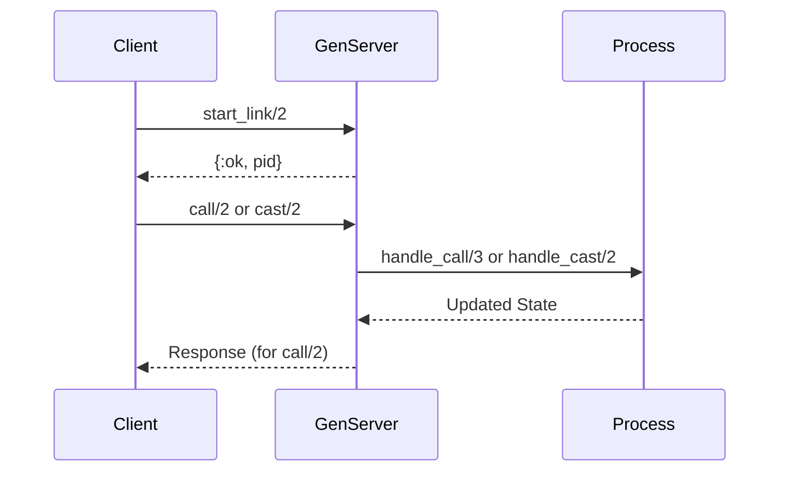

## 10.4. Implementing Servers with GenServer

In the world of Elixir, the GenServer module stands as a cornerstone for building robust, concurrent applications. It is part of the Open Telecom Platform (OTP) framework, which provides a set of tools and libraries that enable developers to create scalable and fault-tolerant systems. In this section, we will delve into the intricacies of implementing servers with GenServer, exploring its callbacks, state management, and practical use cases.

### Understanding GenServer

GenServer is a generic server implementation that abstracts the complexities of process management in Elixir. It allows you to focus on the business logic while handling concurrent requests in a fault-tolerant manner. By utilizing GenServer, you can create processes that maintain state, handle synchronous and asynchronous messages, and integrate seamlessly into supervision trees.

### Defining GenServer Callbacks

To effectively implement a GenServer, you need to define several key callbacks: `init`, `handle_call`, `handle_cast`, and `handle_info`. Each of these functions plays a crucial role in managing the lifecycle and behavior of your server.

#### Implementing `init/1`

The `init/1` callback is the entry point for a GenServer process. It is responsible for initializing the server's state. This function is called when the GenServer is started and should return a tuple indicating the initial state.

```elixir
defmodule MyServer do
  use GenServer

  # Client API
  def start_link(initial_state) do
    GenServer.start_link(__MODULE__, initial_state, name: __MODULE__)
  end

  # Server Callbacks
  def init(initial_state) do
    {:ok, initial_state}
  end
end
```

In this example, the `init/1` function initializes the server with the given `initial_state` and returns `{:ok, initial_state}` to indicate successful initialization.

#### Implementing `handle_call/3`

The `handle_call/3` callback is used for synchronous requests. It receives a request message, the caller's PID, and the current state. The function should return a tuple with the reply, the new state, and optionally a timeout or hibernate instruction.

```elixir
def handle_call(:get_state, _from, state) do
  {:reply, state, state}
end

def handle_call({:set_state, new_state}, _from, _state) do
  {:reply, :ok, new_state}
end
```

Here, `handle_call/3` handles two types of requests: retrieving the current state and setting a new state.

#### Implementing `handle_cast/2`

The `handle_cast/2` callback is used for asynchronous requests. It receives a message and the current state, and it should return a tuple with the new state and optionally a timeout or hibernate instruction.

```elixir
def handle_cast({:update_state, new_state}, _state) do
  {:noreply, new_state}
end
```

In this example, `handle_cast/2` updates the server's state without sending a reply to the caller.

#### Implementing `handle_info/2`

The `handle_info/2` callback is invoked for all other messages that are not calls or casts. This function can be used to handle system messages or custom messages sent directly to the process.

```elixir
def handle_info(:timeout, state) do
  IO.puts("Timeout occurred")
  {:noreply, state}
end
```

In this case, `handle_info/2` handles a timeout message and logs a message to the console.

### State Management in GenServer

Managing state within a GenServer is a fundamental aspect of its operation. The state is maintained as part of the process and can be updated through the callbacks we discussed. Let's explore how to effectively manage state in a GenServer.

#### Maintaining Internal State

The state of a GenServer is passed as an argument to each callback and can be modified based on the logic within those callbacks. It's crucial to ensure that the state is immutable and updated correctly to prevent inconsistencies.

```elixir
defmodule CounterServer do
  use GenServer

  # Client API
  def start_link(initial_count) do
    GenServer.start_link(__MODULE__, initial_count, name: __MODULE__)
  end

  def increment() do
    GenServer.cast(__MODULE__, :increment)
  end

  def get_count() do
    GenServer.call(__MODULE__, :get_count)
  end

  # Server Callbacks
  def init(initial_count) do
    {:ok, initial_count}
  end

  def handle_cast(:increment, count) do
    {:noreply, count + 1}
  end

  def handle_call(:get_count, _from, count) do
    {:reply, count, count}
  end
end
```

In this example, `CounterServer` maintains a simple counter as its state. The `increment/0` function sends an asynchronous message to increment the counter, while `get_count/0` retrieves the current count synchronously.

### Use Cases for GenServer

GenServer's versatility makes it suitable for a wide range of use cases. Let's explore some common scenarios where GenServer shines.

#### Caches

GenServer can be used to implement in-memory caches, providing fast access to frequently used data. By maintaining a cache state within the server, you can efficiently store and retrieve data without hitting a database or external service.

```elixir
defmodule CacheServer do
  use GenServer

  # Client API
  def start_link(_opts) do
    GenServer.start_link(__MODULE__, %{}, name: __MODULE__)
  end

  def put(key, value) do
    GenServer.cast(__MODULE__, {:put, key, value})
  end

  def get(key) do
    GenServer.call(__MODULE__, {:get, key})
  end

  # Server Callbacks
  def init(_) do
    {:ok, %{}}
  end

  def handle_cast({:put, key, value}, state) do
    {:noreply, Map.put(state, key, value)}
  end

  def handle_call({:get, key}, _from, state) do
    {:reply, Map.get(state, key), state}
  end
end
```

In this cache implementation, `CacheServer` stores key-value pairs in its state. The `put/2` function updates the cache asynchronously, while `get/1` retrieves values synchronously.

#### Session Stores

GenServer can also be used to manage user sessions in web applications. By maintaining session data within a GenServer, you can handle user authentication and session expiration effectively.

```elixir
defmodule SessionServer do
  use GenServer

  # Client API
  def start_link(_opts) do
    GenServer.start_link(__MODULE__, %{}, name: __MODULE__)
  end

  def create_session(user_id) do
    GenServer.call(__MODULE__, {:create_session, user_id})
  end

  def get_session(user_id) do
    GenServer.call(__MODULE__, {:get_session, user_id})
  end

  # Server Callbacks
  def init(_) do
    {:ok, %{}}
  end

  def handle_call({:create_session, user_id}, _from, state) do
    session_id = :crypto.strong_rand_bytes(16) |> Base.encode64()
    new_state = Map.put(state, user_id, session_id)
    {:reply, session_id, new_state}
  end

  def handle_call({:get_session, user_id}, _from, state) do
    {:reply, Map.get(state, user_id), state}
  end
end
```

In this session store example, `SessionServer` generates a unique session ID for each user and stores it in its state. The `create_session/1` function creates a new session, while `get_session/1` retrieves the session ID for a given user.

#### Background Workers

GenServer is an excellent choice for implementing background workers that perform tasks asynchronously. By using GenServer, you can offload processing-intensive tasks to separate processes, improving the responsiveness of your application.

```elixir
defmodule WorkerServer do
  use GenServer

  # Client API
  def start_link(_opts) do
    GenServer.start_link(__MODULE__, :ok, name: __MODULE__)
  end

  def perform_task(task) do
    GenServer.cast(__MODULE__, {:perform_task, task})
  end

  # Server Callbacks
  def init(_) do
    {:ok, :ok}
  end

  def handle_cast({:perform_task, task}, state) do
    Task.async(fn -> execute_task(task) end)
    {:noreply, state}
  end

  defp execute_task(task) do
    # Perform the task
    IO.puts("Executing task: #{task}")
  end
end
```

In this background worker example, `WorkerServer` receives tasks asynchronously and executes them in separate processes using `Task.async/1`.

### Visualizing GenServer Architecture

To better understand how GenServer fits into the larger architecture of an Elixir application, let's visualize its interaction with clients and other processes.


```mermaid
sequenceDiagram
    participant Client
    participant GenServer
    participant Process

    Client->>GenServer: start_link/2
    GenServer-->>Client: {:ok, pid}

    Client->>GenServer: call/2 or cast/2
    GenServer->>Process: handle_call/3 or handle_cast/2
    Process-->>GenServer: Updated State

    GenServer-->>Client: Response (for call/2)
```

**Diagram Description:** This sequence diagram illustrates the interaction between a client, a GenServer, and other processes. The client starts the GenServer using `start_link/2`, sends messages using `call/2` or `cast/2`, and receives responses for synchronous calls. The GenServer processes these messages using the appropriate callbacks and updates its state accordingly.

### Design Considerations

When implementing servers with GenServer, it's important to consider the following:

- **Concurrency:** Ensure that your GenServer can handle concurrent requests efficiently. Use asynchronous messages (`cast/2`) for non-blocking operations.
- **State Management:** Keep the state immutable and update it consistently within the callbacks to avoid race conditions.
- **Fault Tolerance:** Integrate your GenServer into a supervision tree to automatically restart it in case of failures.
- **Performance:** Profile your GenServer to identify bottlenecks and optimize performance-critical sections.

### Elixir Unique Features

Elixir's unique features, such as pattern matching, immutability, and the BEAM VM's lightweight process model, make GenServer an ideal choice for building concurrent applications. The ability to leverage these features allows developers to create highly efficient and fault-tolerant systems.

### Differences and Similarities

GenServer is often compared to other concurrency models, such as the actor model or thread-based models. Unlike thread-based models, GenServer processes are lightweight and do not share memory, reducing the risk of race conditions. Compared to the actor model, GenServer provides a more structured approach with built-in fault tolerance and supervision capabilities.

### Try It Yourself

To get hands-on experience with GenServer, try modifying the code examples provided. Experiment with different state management strategies, implement additional use cases, or integrate your GenServer into a supervision tree. Remember, the best way to learn is by doing!

## Quiz Time!



### What is the primary purpose of GenServer in Elixir?

- [x] To provide a generic server implementation for managing state and handling messages
- [ ] To create a web server for handling HTTP requests
- [ ] To manage database connections
- [ ] To compile Elixir code into bytecode

> **Explanation:** GenServer is designed to provide a generic server implementation that manages state and handles synchronous and asynchronous messages in Elixir applications.

### Which callback is used for initializing the state of a GenServer?

- [x] `init/1`
- [ ] `handle_call/3`
- [ ] `handle_cast/2`
- [ ] `handle_info/2`

> **Explanation:** The `init/1` callback is responsible for initializing the state of a GenServer when it is started.

### What is the difference between `handle_call/3` and `handle_cast/2`?

- [x] `handle_call/3` is used for synchronous requests, while `handle_cast/2` is used for asynchronous requests
- [ ] `handle_call/3` is used for asynchronous requests, while `handle_cast/2` is used for synchronous requests
- [ ] Both are used for synchronous requests
- [ ] Both are used for asynchronous requests

> **Explanation:** `handle_call/3` handles synchronous requests and provides a reply to the caller, while `handle_cast/2` handles asynchronous requests without replying.

### Which function is used to start a GenServer process?

- [x] `start_link/2`
- [ ] `start/1`
- [ ] `init/1`
- [ ] `handle_call/3`

> **Explanation:** The `start_link/2` function is used to start a GenServer process and link it to the calling process.

### How can you ensure fault tolerance in a GenServer?

- [x] By integrating it into a supervision tree
- [ ] By using `handle_info/2` for all messages
- [ ] By avoiding state management
- [ ] By using synchronous requests only

> **Explanation:** Integrating a GenServer into a supervision tree ensures fault tolerance by automatically restarting the process in case of failures.

### What is the purpose of the `handle_info/2` callback?

- [x] To handle messages that are not calls or casts
- [ ] To initialize the GenServer state
- [ ] To manage synchronous requests
- [ ] To manage asynchronous requests

> **Explanation:** The `handle_info/2` callback is used to handle messages that are not calls or casts, such as system messages or custom messages.

### What is a common use case for GenServer?

- [x] Implementing a cache
- [ ] Compiling Elixir code
- [ ] Handling HTTP requests
- [ ] Managing database connections

> **Explanation:** GenServer is commonly used to implement caches, session stores, and background workers due to its ability to manage state and handle messages.

### Which Elixir feature makes GenServer processes lightweight?

- [x] The BEAM VM's lightweight process model
- [ ] Pattern matching
- [ ] Immutability
- [ ] The pipe operator

> **Explanation:** The BEAM VM's lightweight process model allows GenServer processes to be highly efficient and scalable.

### What should you consider when managing state in a GenServer?

- [x] Keep the state immutable and update it consistently
- [ ] Share the state across multiple processes
- [ ] Avoid using the state
- [ ] Use global variables for state management

> **Explanation:** It's important to keep the state immutable and update it consistently within the callbacks to prevent race conditions.

### True or False: GenServer is part of the Open Telecom Platform (OTP) framework.

- [x] True
- [ ] False

> **Explanation:** GenServer is indeed part of the Open Telecom Platform (OTP) framework, which provides tools and libraries for building concurrent and fault-tolerant systems.



Remember, mastering GenServer is just the beginning of your journey in building scalable and fault-tolerant applications with Elixir. Keep exploring, experimenting, and expanding your knowledge to unlock the full potential of this powerful language!
