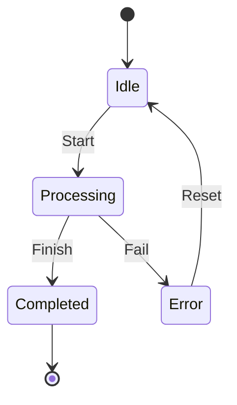

## 10.5. State Machines with `GenStateMachine`

State machines are a powerful tool for modeling systems that have a finite number of states and well-defined transitions between those states. In Elixir, the `GenStateMachine` module provides a robust framework for implementing state machines, leveraging the concurrency and fault-tolerance features of the Erlang/OTP platform. This section will guide you through the concepts, implementation, and applications of state machines using `GenStateMachine`.

### Modeling Finite State Machines

Finite State Machines (FSMs) are mathematical models used to represent systems with a limited number of states. They are particularly useful for modeling protocols, workflows, and any system where the behavior is determined by the current state and incoming events.

#### Key Concepts

- **States**: Distinct modes in which a system can exist. Each state represents a specific condition or situation.
- **Events**: Triggers that cause transitions between states. Events can be external inputs or internal signals.
- **Transitions**: Rules that define how the system moves from one state to another in response to events.

FSMs are often visualized using state diagrams, which depict states as nodes and transitions as directed edges.



**Diagram Description**: This state diagram represents a simple FSM with four states: Idle, Processing, Completed, and Error. Transitions occur based on events such as Start, Finish, Fail, and Reset.

### Implementing `GenStateMachine`

`GenStateMachine` is an OTP behavior module that simplifies the implementation of FSMs in Elixir. It provides a structured way to define states, events, and transitions, while integrating seamlessly with the OTP supervision tree for fault tolerance.

#### Defining States and Events

To implement a state machine using `GenStateMachine`, you need to define the states and events that your system will handle. This involves creating a module that uses the `GenStateMachine` behavior and implementing the required callback functions.

```elixir
defmodule MyStateMachine do
  use GenStateMachine

  # Define the initial state and data
  def init(:ok) do
    {:ok, :idle, %{}}
  end

  # Handle the :start event in the :idle state
  def handle_event(:cast, :start, :idle, data) do
    {:next_state, :processing, data}
  end

  # Handle the :finish event in the :processing state
  def handle_event(:cast, :finish, :processing, data) do
    {:next_state, :completed, data}
  end

  # Handle the :fail event in the :processing state
  def handle_event(:cast, :fail, :processing, data) do
    {:next_state, :error, data}
  end

  # Handle the :reset event in the :error state
  def handle_event(:cast, :reset, :error, data) do
    {:next_state, :idle, data}
  end
end
```

**Code Explanation**: This example defines a simple state machine with four states: `:idle`, `:processing`, `:completed`, and `:error`. The `handle_event/4` function is used to define how the state machine transitions between states based on events.

#### Transition Logic

The transition logic in a state machine determines how the system responds to events. In `GenStateMachine`, this is handled by the `handle_event/4` callback, which receives the event type, event, current state, and state data as arguments.

- **Event Type**: Specifies how the event is delivered (`:cast`, `:call`, or `:info`).
- **Event**: The actual event that triggers the transition.
- **Current State**: The state in which the system currently resides.
- **State Data**: Additional data associated with the state.

The `handle_event/4` function returns a tuple indicating the next state and any updated state data.

### Applications of State Machines

State machines are widely used in various domains due to their ability to model complex systems with clear and predictable behavior. Here are some common applications:

#### Protocol Handling

State machines are ideal for implementing communication protocols, where the system must adhere to a specific sequence of states and transitions. For example, a TCP connection can be modeled as a state machine with states such as `CLOSED`, `LISTEN`, `SYN_SENT`, `ESTABLISHED`, and `CLOSE_WAIT`.

#### Workflow Engines

In workflow engines, state machines can represent the progression of tasks through different stages. Each state corresponds to a task or phase, and transitions occur based on task completion or failure.

#### User Interfaces

State machines can also be used to manage the state of user interfaces, ensuring that the UI responds correctly to user inputs and system events.

### Design Considerations

When implementing state machines with `GenStateMachine`, consider the following:

- **State Complexity**: Keep the number of states manageable to avoid complexity.
- **Event Handling**: Ensure that all possible events are handled to prevent unexpected behavior.
- **Concurrency**: Leverage the concurrency features of Elixir to handle multiple state machines simultaneously.
- **Fault Tolerance**: Use OTP supervision trees to manage state machine processes and recover from failures.

### Elixir Unique Features

Elixir's concurrency model and integration with the Erlang VM make it particularly well-suited for implementing state machines. The lightweight processes and message-passing capabilities allow for efficient and scalable state machine implementations.

### Differences and Similarities

State machines can be confused with other design patterns such as the Strategy Pattern or the Command Pattern. The key distinction is that state machines focus on managing states and transitions, while the other patterns deal with encapsulating behavior or commands.

### Try It Yourself

To deepen your understanding, try modifying the example state machine to include additional states or events. Experiment with different transition logic and observe how the system behaves.

### Knowledge Check

- What are the key components of a finite state machine?
- How does `GenStateMachine` integrate with OTP supervision trees?
- What are some common applications of state machines?

### Summary

State machines are a powerful tool for modeling systems with well-defined states and transitions. By leveraging `GenStateMachine` in Elixir, you can implement robust and scalable state machines that integrate seamlessly with the OTP framework.

## Quiz: State Machines with `GenStateMachine`



### What is a finite state machine?

- [x] A model with a finite number of states and transitions
- [ ] A model with infinite states
- [ ] A model with no transitions
- [ ] A model with only one state

> **Explanation:** A finite state machine is characterized by a finite number of states and defined transitions between those states.

### Which module in Elixir is used to implement state machines?

- [ ] GenServer
- [x] GenStateMachine
- [ ] GenEvent
- [ ] GenStage

> **Explanation:** `GenStateMachine` is the OTP behavior module used to implement state machines in Elixir.

### What is the purpose of the `handle_event/4` function in `GenStateMachine`?

- [x] To define state transitions based on events
- [ ] To initialize the state machine
- [ ] To terminate the state machine
- [ ] To log events

> **Explanation:** The `handle_event/4` function is used to define how the state machine transitions between states in response to events.

### What is a common application of state machines?

- [x] Protocol handling
- [ ] Data storage
- [ ] Arithmetic operations
- [ ] Image processing

> **Explanation:** State machines are commonly used for protocol handling, where the system must follow a specific sequence of states.

### How does `GenStateMachine` handle concurrency?

- [x] By leveraging Elixir's lightweight processes
- [ ] By using global locks
- [ ] By running on a single thread
- [ ] By using shared memory

> **Explanation:** `GenStateMachine` leverages Elixir's lightweight processes and message-passing capabilities to handle concurrency efficiently.

### What is the initial state in the provided example?

- [x] :idle
- [ ] :processing
- [ ] :completed
- [ ] :error

> **Explanation:** The initial state in the example is `:idle`, as defined in the `init/1` function.

### What event transitions the state machine from `:idle` to `:processing`?

- [x] :start
- [ ] :finish
- [ ] :fail
- [ ] :reset

> **Explanation:** The `:start` event transitions the state machine from `:idle` to `:processing`.

### What is a key consideration when designing state machines?

- [x] Managing state complexity
- [ ] Using global variables
- [ ] Avoiding all transitions
- [ ] Ignoring concurrency

> **Explanation:** Managing state complexity is crucial to avoid making the state machine overly complex and difficult to maintain.

### What is a benefit of using state machines in user interfaces?

- [x] Ensuring correct responses to user inputs
- [ ] Increasing memory usage
- [ ] Reducing code readability
- [ ] Limiting user interactions

> **Explanation:** State machines help ensure that user interfaces respond correctly to user inputs and system events.

### True or False: State machines can be used to model infinite states.

- [ ] True
- [x] False

> **Explanation:** State machines are designed to model systems with a finite number of states.



Remember, mastering state machines with `GenStateMachine` is just the beginning. As you continue to explore Elixir's capabilities, you'll find even more ways to build scalable and fault-tolerant systems. Keep experimenting, stay curious, and enjoy the journey!
