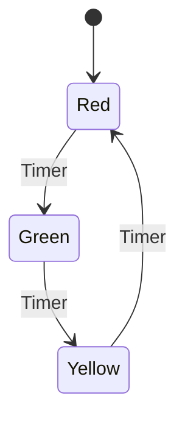

## 10.5. State Machines with `GenStateMachine`

In the realm of software engineering, state machines are a powerful tool for modeling complex systems that can be broken down into distinct states with defined transitions. Elixir, with its robust concurrency model and functional programming paradigm, provides a powerful abstraction for implementing state machines via the `GenStateMachine` module. This section will guide you through the intricacies of using `GenStateMachine` to design and implement finite state machines (FSMs) in Elixir.

### Modeling Finite State Machines

Finite State Machines (FSMs) are used to represent systems with a finite number of states, transitions between those states, and actions that occur due to those transitions. They are particularly useful for modeling protocols, workflow engines, and any system where behavior is state-dependent.

#### Key Concepts of FSMs

- **States**: Distinct modes of operation for a system.
- **Events**: Triggers that cause transitions between states.
- **Transitions**: Rules that define how events cause state changes.
- **Actions**: Operations that occur as a result of transitions.

#### Visualizing State Machines

To better understand FSMs, let's visualize a simple state machine for a traffic light system using a Mermaid.js state diagram.


```mermaid
stateDiagram-v2
    [*] --> Red
    Red --> Green: Timer
    Green --> Yellow: Timer
    Yellow --> Red: Timer
```

**Diagram Explanation**: This diagram represents a traffic light system with three states: Red, Green, and Yellow. Transitions between these states are triggered by a Timer event.

### Implementing `GenStateMachine`

Elixir provides the `GenStateMachine` module, which is part of the OTP framework, to facilitate the implementation of state machines. It allows developers to define states, events, and transition logic in a structured manner.

#### Defining States and Events

To implement a state machine using `GenStateMachine`, you need to define the possible states and events. Let's consider a simple example of a door lock system with states: `locked` and `unlocked`.

```elixir
defmodule DoorLock do
  use GenStateMachine

  # Define the initial state and data
  def start_link(initial_state \\ :locked) do
    GenStateMachine.start_link(__MODULE__, initial_state, name: __MODULE__)
  end

  # Callback for state initialization
  def init(state) do
    {:ok, state, %{}}
  end

  # Handle events and define transitions
  def handle_event(:cast, :lock, :unlocked, data) do
    {:next_state, :locked, data}
  end

  def handle_event(:cast, :unlock, :locked, data) do
    {:next_state, :unlocked, data}
  end
end
```

**Code Explanation**: In this example, we define a `DoorLock` module using `GenStateMachine`. The `start_link/1` function initializes the state machine with a default state of `:locked`. The `handle_event/4` callbacks define the transitions between `locked` and `unlocked` states based on `lock` and `unlock` events.

#### Transition Logic

The transition logic is defined within the `handle_event/4` callbacks. Each callback specifies the event type (`:cast` or `:call`), the event itself, the current state, and any associated data. The return value determines the next state and any actions to be performed.

### Applications of State Machines

State machines are widely used in various domains due to their ability to model complex systems with clear state transitions. Here are some common applications:

- **Protocol Handling**: FSMs are ideal for implementing communication protocols, where each state represents a stage in the protocol.
- **Workflow Engines**: State machines can model business processes, where each state represents a step in the workflow.
- **Game Development**: FSMs can represent different game states, such as start, play, pause, and end.

#### Example: Protocol Handling

Let's consider a simplified example of a protocol handler for a chat application.

```elixir
defmodule ChatProtocol do
  use GenStateMachine

  def start_link(initial_state \\ :disconnected) do
    GenStateMachine.start_link(__MODULE__, initial_state, name: __MODULE__)
  end

  def init(state) do
    {:ok, state, %{}}
  end

  def handle_event(:cast, :connect, :disconnected, data) do
    IO.puts("Connecting to server...")
    {:next_state, :connected, data}
  end

  def handle_event(:cast, :disconnect, :connected, data) do
    IO.puts("Disconnecting from server...")
    {:next_state, :disconnected, data}
  end

  def handle_event(:cast, :send_message, :connected, data) do
    IO.puts("Sending message...")
    {:next_state, :connected, data}
  end

  def handle_event(:cast, :send_message, :disconnected, data) do
    IO.puts("Cannot send message, not connected.")
    {:next_state, :disconnected, data}
  end
end
```

**Code Explanation**: This example models a simple chat protocol with states `disconnected` and `connected`. The state machine handles `connect`, `disconnect`, and `send_message` events, with transitions and actions defined accordingly.

### Design Considerations

When implementing state machines with `GenStateMachine`, consider the following:

- **State Complexity**: Keep the number of states manageable to avoid complexity.
- **Event Handling**: Clearly define events and their corresponding transitions.
- **Error Handling**: Implement robust error handling for unexpected events or states.
- **Concurrency**: Leverage Elixir's concurrency model to handle multiple state machines efficiently.

### Elixir Unique Features

Elixir's functional programming paradigm and concurrency model make it particularly well-suited for implementing state machines. Key features include:

- **Pattern Matching**: Simplifies state and event handling by matching on specific patterns.
- **Concurrency**: Allows multiple state machines to run concurrently, leveraging Elixir's lightweight processes.
- **Supervision Trees**: Integrate state machines into supervision trees for fault tolerance and resilience.

### Differences and Similarities

State machines in Elixir using `GenStateMachine` are similar to those in other languages but offer unique advantages due to Elixir's functional nature. Unlike object-oriented languages, Elixir's approach emphasizes immutability and pattern matching, providing a more declarative style of state machine implementation.

### Try It Yourself

To deepen your understanding, try modifying the `ChatProtocol` example to include additional states and events, such as `reconnecting` or `error`. Experiment with different transition logic and observe how the state machine behaves.

### Knowledge Check

- What are the primary components of a finite state machine?
- How does `GenStateMachine` facilitate state machine implementation in Elixir?
- What are some common applications of state machines?

### Summary

State machines are a powerful tool for modeling systems with distinct states and transitions. Elixir's `GenStateMachine` module provides a robust framework for implementing FSMs, leveraging Elixir's functional programming and concurrency features. By understanding and applying these concepts, you can design scalable, fault-tolerant systems with clear state logic.

### References and Further Reading

- [Elixir `GenStateMachine` Documentation](https://hexdocs.pm/gen_statem/GenStateMachine.html)
- [Finite State Machines on Wikipedia](https://en.wikipedia.org/wiki/Finite-state_machine)
- [Functional Programming with Elixir](https://elixir-lang.org/)

## Quiz Time!



### What are the primary components of a finite state machine?

- [x] States, Events, Transitions, Actions
- [ ] Classes, Methods, Objects
- [ ] Variables, Functions, Loops
- [ ] Inputs, Outputs, Processes

> **Explanation:** A finite state machine consists of states, events, transitions, and actions that define its behavior.

### How does `GenStateMachine` facilitate state machine implementation in Elixir?

- [x] By providing a structured framework for defining states and transitions
- [ ] By eliminating the need for pattern matching
- [ ] By using object-oriented principles
- [ ] By simplifying concurrency management

> **Explanation:** `GenStateMachine` offers a structured way to define states, events, and transitions, leveraging Elixir's functional programming features.

### What is a common application of state machines?

- [x] Protocol handling
- [ ] Data storage
- [ ] Image processing
- [ ] Machine learning

> **Explanation:** State machines are commonly used in protocol handling, where each state represents a stage in the communication process.

### What is the advantage of using pattern matching in state machines?

- [x] Simplifies state and event handling
- [ ] Increases code complexity
- [ ] Requires more memory
- [ ] Slows down execution

> **Explanation:** Pattern matching simplifies state and event handling by allowing concise and clear definitions of transitions.

### What is a key feature of Elixir that enhances state machine implementation?

- [x] Concurrency
- [ ] Object orientation
- [ ] Global variables
- [ ] Inheritance

> **Explanation:** Elixir's concurrency model allows multiple state machines to run concurrently, enhancing performance and scalability.

### In the `ChatProtocol` example, what happens when a `send_message` event occurs in the `disconnected` state?

- [x] A message is printed indicating the inability to send
- [ ] The state changes to `connected`
- [ ] The state remains unchanged
- [ ] An error is raised

> **Explanation:** In the `disconnected` state, a `send_message` event results in a message indicating the inability to send.

### What is a benefit of integrating state machines into supervision trees?

- [x] Fault tolerance and resilience
- [ ] Increased complexity
- [ ] Reduced performance
- [ ] Simplified error handling

> **Explanation:** Integrating state machines into supervision trees provides fault tolerance and resilience, ensuring system reliability.

### What is the initial state of the `DoorLock` state machine?

- [x] Locked
- [ ] Unlocked
- [ ] Connected
- [ ] Disconnected

> **Explanation:** The `DoorLock` state machine initializes with the `locked` state.

### Which Elixir feature is leveraged for handling multiple state machines efficiently?

- [x] Lightweight processes
- [ ] Global variables
- [ ] Inheritance
- [ ] Static typing

> **Explanation:** Elixir's lightweight processes enable efficient handling of multiple state machines concurrently.

### True or False: State machines in Elixir using `GenStateMachine` are similar to those in object-oriented languages.

- [x] True
- [ ] False

> **Explanation:** While state machines in Elixir share similarities with those in object-oriented languages, they leverage Elixir's functional nature, emphasizing immutability and pattern matching.



Remember, mastering state machines in Elixir with `GenStateMachine` is just the beginning. As you continue to explore and experiment, you'll discover more sophisticated ways to model and implement complex systems. Keep experimenting, stay curious, and enjoy the journey!
