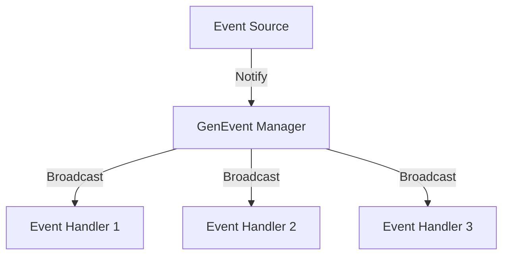
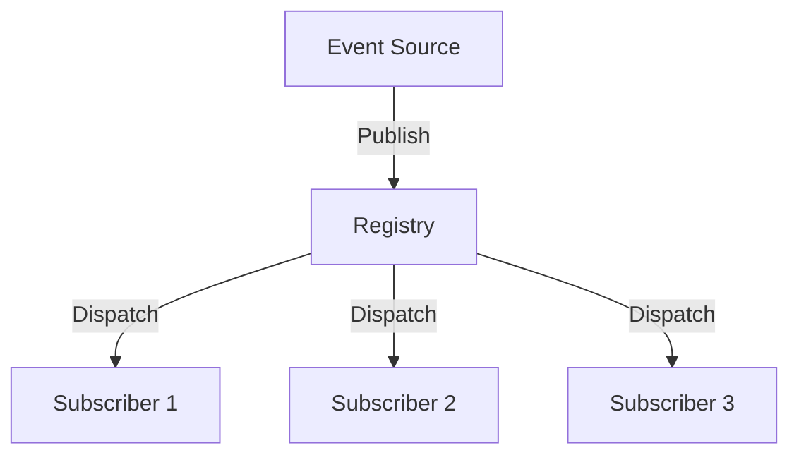
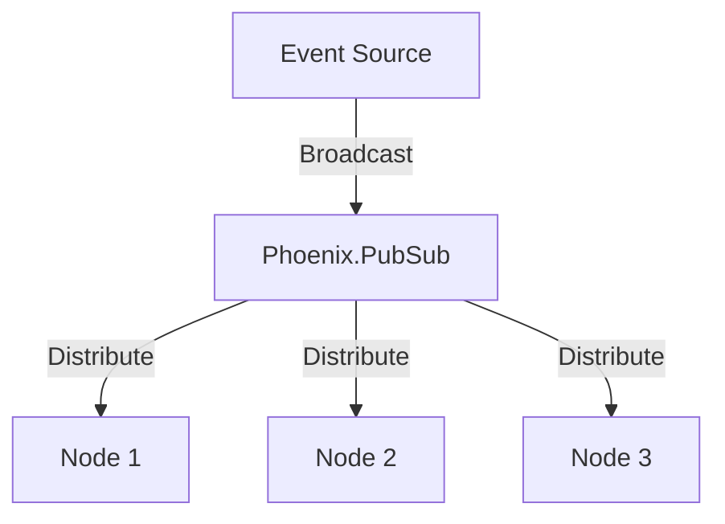

## 10.6. Event Handling with GenEvent

### Introduction

In the world of Elixir and OTP (Open Telecom Platform), event handling is a crucial aspect of building responsive and scalable applications. Historically, the `GenEvent` module was a go-to solution for managing events in Elixir applications. However, with its deprecation, developers are encouraged to explore alternative approaches that offer more flexibility and maintainability. In this section, we will delve into the reasons behind the deprecation of `GenEvent`, explore alternative solutions, and provide guidance on transitioning to these modern approaches.

### Understanding the Deprecation of GenEvent

The `GenEvent` module was designed to provide a generic event manager that could handle multiple event handlers. While it served its purpose for a time, several limitations led to its deprecation:

- **Complexity in Handling State**: `GenEvent` required developers to manage state across multiple handlers, which could become cumbersome and error-prone.
- **Lack of Flexibility**: The module's design made it difficult to implement certain patterns, such as backpressure or dynamic subscription management.
- **Performance Concerns**: In high-load scenarios, `GenEvent` could become a bottleneck due to its single event manager process.

Given these limitations, the Elixir community has moved towards more robust and flexible solutions for event handling.

### Alternatives to GenEvent

With the deprecation of `GenEvent`, developers have several alternatives to consider for event handling in Elixir applications:

#### 1. Using `:gen_event` from Erlang

Erlang's `:gen_event` module remains a viable option for those who prefer to stick with a similar pattern. It provides a way to manage event handlers dynamically, allowing for the addition and removal of handlers at runtime.

**Key Features:**

- **Dynamic Handler Management**: Add or remove handlers without stopping the event manager.
- **Event Broadcasting**: Broadcast events to all registered handlers.

**Sample Code Snippet:**

```elixir
defmodule MyEventHandler do
  use GenEvent

  def handle_event(event, state) do
    IO.puts("Received event: #{inspect(event)}")
    {:ok, state}
  end
end

# Starting the event manager
{:ok, manager} = :gen_event.start_link()

# Adding an event handler
:gen_event.add_handler(manager, MyEventHandler, [])

# Sending an event
:gen_event.notify(manager, :some_event)
```

#### 2. Using Registry

The `Registry` module in Elixir provides a more flexible and scalable approach to event handling. It allows processes to register themselves under a given key, making it easier to implement pub-sub patterns.

**Key Features:**

- **Process Registration**: Register processes under a unique key.
- **Pub-Sub Pattern**: Implement publish-subscribe mechanisms efficiently.

**Sample Code Snippet:**

```elixir
defmodule MyRegistry do
  use Registry, keys: :unique, name: MyRegistry
end

defmodule Publisher do
  def publish(event) do
    Registry.dispatch(MyRegistry, :event_key, fn entries ->
      for {pid, _} <- entries do
        send(pid, event)
      end
    end)
  end
end

defmodule Subscriber do
  def start_link do
    {:ok, pid} = Task.start_link(fn -> listen() end)
    Registry.register(MyRegistry, :event_key, pid)
  end

  defp listen do
    receive do
      event -> IO.puts("Received event: #{inspect(event)}")
    end
  end
end

# Start the registry
{:ok, _} = MyRegistry.start_link()

# Start a subscriber
{:ok, _} = Subscriber.start_link()

# Publish an event
Publisher.publish(:some_event)
```

#### 3. Third-Party Libraries

Several third-party libraries offer advanced event handling capabilities, such as `Phoenix.PubSub` and `Broadway`. These libraries provide additional features like distributed pub-sub and backpressure management.

**Phoenix.PubSub:**

- **Distributed Pub-Sub**: Allows for event broadcasting across nodes in a distributed system.
- **Scalability**: Designed to handle high volumes of messages efficiently.

**Broadway:**

- **Data Processing Pipelines**: Ideal for building data processing pipelines with backpressure support.
- **Concurrency Control**: Fine-grained control over concurrency and message processing.

**Sample Code Snippet with Phoenix.PubSub:**

```elixir
defmodule MyPubSub do
  use Phoenix.PubSub

  def start_link do
    Phoenix.PubSub.start_link(name: MyPubSub)
  end

  def subscribe(topic) do
    Phoenix.PubSub.subscribe(MyPubSub, topic)
  end

  def broadcast(topic, message) do
    Phoenix.PubSub.broadcast(MyPubSub, topic, message)
  end
end

defmodule Subscriber do
  def start_link do
    {:ok, _} = MyPubSub.subscribe("events")
    Task.start_link(fn -> listen() end)
  end

  defp listen do
    receive do
      {:events, message} -> IO.puts("Received message: #{inspect(message)}")
    end
  end
end

# Start the PubSub system
{:ok, _} = MyPubSub.start_link()

# Start a subscriber
{:ok, _} = Subscriber.start_link()

# Broadcast a message
MyPubSub.broadcast("events", "Hello, World!")
```

### Transitioning to Modern Approaches

Transitioning from `GenEvent` to modern event handling approaches involves understanding the specific needs of your application and choosing the right tool for the job. Here are some considerations to keep in mind:

- **Scalability**: If your application requires handling a large volume of events, consider using `Phoenix.PubSub` for its distributed capabilities.
- **Flexibility**: For applications that need dynamic subscription management, `Registry` offers a more flexible approach.
- **Complex Event Processing**: If your application involves complex event processing with backpressure, `Broadway` is a suitable choice.

### Design Considerations

When designing event handling systems in Elixir, consider the following:

- **Fault Tolerance**: Ensure that your event handling system can recover from failures gracefully.
- **Performance**: Optimize for performance by minimizing bottlenecks and ensuring efficient message processing.
- **Maintainability**: Choose solutions that align with your team's expertise and are easy to maintain over time.

### Elixir Unique Features

Elixir's concurrency model, built on the BEAM VM, provides unique advantages for event handling:

- **Lightweight Processes**: Elixir processes are lightweight, allowing for efficient handling of concurrent events.
- **Fault Tolerance**: The "let it crash" philosophy ensures that failures are isolated and do not affect the entire system.
- **Hot Code Swapping**: Elixir supports hot code swapping, enabling updates to event handling logic without downtime.

### Differences and Similarities

While `GenEvent` and its alternatives serve similar purposes, they differ in their approach and capabilities:

- **GenEvent vs. Registry**: `GenEvent` provided a centralized event manager, while `Registry` offers a decentralized approach with more flexibility.
- **GenEvent vs. Phoenix.PubSub**: `Phoenix.PubSub` extends the capabilities of `GenEvent` with distributed event handling and scalability.
- **GenEvent vs. Broadway**: `Broadway` focuses on data processing pipelines with backpressure, offering more advanced features than `GenEvent`.

### Visualizing Event Handling Alternatives

To better understand the transition from `GenEvent` to modern alternatives, let's visualize the architecture of these solutions using Mermaid.js diagrams.



**Diagram 1: Traditional GenEvent Architecture**

In the traditional `GenEvent` architecture, a single event manager broadcasts events to multiple handlers. This centralized approach can become a bottleneck in high-load scenarios.



**Diagram 2: Event Handling with Registry**

Using `Registry`, events are published to a central registry, which dispatches them to registered subscribers. This decentralized approach offers more flexibility and scalability.



**Diagram 3: Distributed Event Handling with Phoenix.PubSub**

`Phoenix.PubSub` enables distributed event handling across multiple nodes, providing scalability and fault tolerance for large-scale applications.

### Try It Yourself

To gain hands-on experience with these event handling approaches, try modifying the code examples provided:

- **Experiment with Registry**: Change the key used for registration and observe how it affects event dispatching.
- **Explore Phoenix.PubSub**: Set up a multi-node environment and test the distributed capabilities of `Phoenix.PubSub`.
- **Integrate Broadway**: Implement a simple data processing pipeline using `Broadway` and explore its concurrency features.

### Knowledge Check

Before moving on, let's review some key concepts:

- What are the limitations of `GenEvent` that led to its deprecation?
- How does `Registry` provide a more flexible approach to event handling?
- What are the advantages of using `Phoenix.PubSub` for distributed event handling?

### Conclusion

The deprecation of `GenEvent` marks a shift towards more flexible and scalable event handling solutions in Elixir. By understanding the alternatives and their unique features, developers can build robust and maintainable event-driven applications. Remember, this is just the beginning. As you progress, you'll discover new patterns and techniques to enhance your Elixir applications. Keep experimenting, stay curious, and enjoy the journey!

## Quiz: Event Handling with GenEvent



### What was a primary reason for the deprecation of GenEvent in Elixir?

- [x] Complexity in handling state across multiple handlers
- [ ] Lack of support for event broadcasting
- [ ] Inability to handle concurrent events
- [ ] Limited integration with OTP

> **Explanation:** GenEvent was deprecated due to the complexity in managing state across multiple handlers, which could become cumbersome and error-prone.

### Which module in Elixir provides a decentralized approach to event handling?

- [ ] GenEvent
- [x] Registry
- [ ] Phoenix.PubSub
- [ ] Broadway

> **Explanation:** The Registry module in Elixir provides a decentralized approach to event handling, allowing processes to register under a unique key.

### What is a key feature of Phoenix.PubSub?

- [ ] Centralized event management
- [x] Distributed event handling across nodes
- [ ] Static subscription management
- [ ] Single-threaded processing

> **Explanation:** Phoenix.PubSub offers distributed event handling across nodes, making it suitable for large-scale applications.

### Which library is ideal for building data processing pipelines with backpressure support?

- [ ] GenEvent
- [ ] Registry
- [ ] Phoenix.PubSub
- [x] Broadway

> **Explanation:** Broadway is designed for building data processing pipelines with backpressure support, offering advanced concurrency control.

### What advantage does Elixir's concurrency model provide for event handling?

- [x] Lightweight processes for efficient concurrent event handling
- [ ] Centralized process management
- [ ] Single-threaded execution
- [ ] Limited fault tolerance

> **Explanation:** Elixir's concurrency model, built on the BEAM VM, provides lightweight processes, allowing for efficient concurrent event handling.

### How does Registry handle event dispatching?

- [ ] Through a single event manager
- [x] By dispatching to registered subscribers
- [ ] By broadcasting to all processes
- [ ] Through static handler lists

> **Explanation:** Registry dispatches events to registered subscribers, offering a more flexible and scalable approach to event handling.

### What is a benefit of using Broadway for event handling?

- [ ] Centralized event management
- [ ] Limited concurrency control
- [x] Fine-grained control over concurrency and message processing
- [ ] Static subscription management

> **Explanation:** Broadway provides fine-grained control over concurrency and message processing, making it ideal for complex event handling scenarios.

### Which approach is recommended for distributed event handling in Elixir?

- [ ] GenEvent
- [ ] Registry
- [x] Phoenix.PubSub
- [ ] Broadway

> **Explanation:** Phoenix.PubSub is recommended for distributed event handling in Elixir, offering scalability and fault tolerance.

### What is a key consideration when designing event handling systems in Elixir?

- [ ] Minimizing process creation
- [x] Ensuring fault tolerance and performance
- [ ] Limiting event handlers
- [ ] Using a single event manager

> **Explanation:** Ensuring fault tolerance and performance is a key consideration when designing event handling systems in Elixir.

### True or False: GenEvent is still the preferred method for event handling in Elixir.

- [ ] True
- [x] False

> **Explanation:** False. GenEvent has been deprecated, and developers are encouraged to use modern alternatives like Registry and Phoenix.PubSub.




