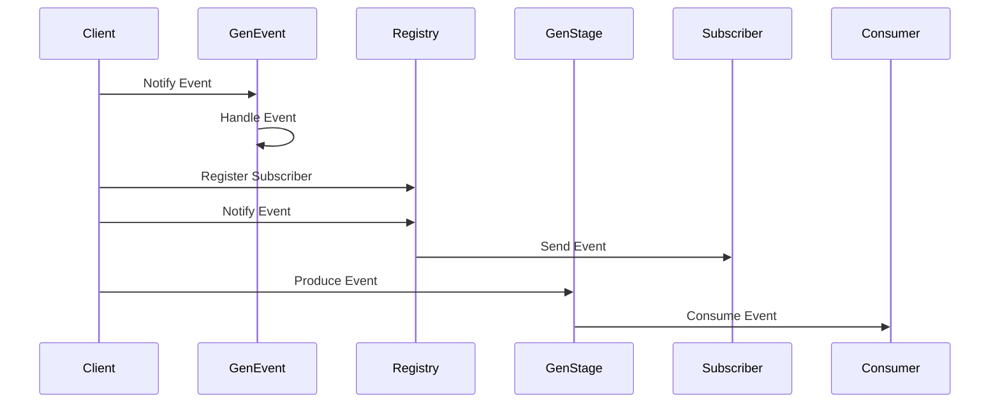

## 10.6. Event Handling with GenEvent

### Introduction

In the world of concurrent and distributed systems, event handling is a crucial component. Elixir, with its roots in Erlang, provides robust tools for building fault-tolerant applications. One such tool is `GenEvent`, an OTP behavior for handling events. However, as Elixir has evolved, `GenEvent` has been deprecated in favor of more flexible and powerful alternatives. In this section, we will delve into the reasons behind the deprecation of `GenEvent`, explore its alternatives, and guide you through transitioning to these modern approaches.

### Understanding the Deprecation of GenEvent

`GenEvent` was designed to handle event-driven programming by allowing you to define a set of event handlers that can be dynamically added or removed. However, over time, several limitations became apparent:

- **Complexity in Event Handling**: `GenEvent` introduced complexity in managing event handlers, especially when dealing with dynamic addition and removal.
- **Lack of Flexibility**: It was less flexible compared to other OTP behaviors like `GenServer` and `Supervisor`.
- **Performance Concerns**: The performance of `GenEvent` was not optimal for high-load systems, leading to bottlenecks.
- **Maintenance Challenges**: Maintaining `GenEvent` in the Elixir core became challenging as the community moved towards more efficient patterns.

Due to these reasons, the Elixir core team decided to deprecate `GenEvent` and encourage developers to use alternative patterns and tools.

### Alternatives to GenEvent

#### 1. Using `:gen_event` from Erlang

While `GenEvent` is deprecated in Elixir, the underlying Erlang module `:gen_event` is still available. It provides similar functionality but requires a deeper understanding of Erlang's concurrency model.

```elixir
defmodule MyEventHandler do
  use GenEvent

  def handle_event(event, state) do
    IO.puts("Received event: #{inspect(event)}")
    {:ok, state}
  end
end

:gen_event.start_link(name: MyEventManager)
:gen_event.add_handler(MyEventManager, MyEventHandler, [])
:gen_event.notify(MyEventManager, :some_event)
```

**Key Considerations**:
- **Compatibility**: Ensure your team is comfortable with Erlang syntax and semantics.
- **Integration**: Seamlessly integrates with existing Erlang systems.

#### 2. Using Registry for Event Handling

Elixir's `Registry` is a powerful tool for process registration and lookup, which can be leveraged for event handling. By using `Registry`, you can implement a publish-subscribe pattern where processes can register themselves to receive specific events.

```elixir
defmodule EventPublisher do
  def notify(event) do
    Registry.dispatch(:my_registry, event, fn entries ->
      for {pid, _} <- entries do
        send(pid, {:event, event})
      end
    end)
  end
end

defmodule EventSubscriber do
  def start_link do
    Task.start_link(fn ->
      Registry.register(:my_registry, :some_event, [])
      listen()
    end)
  end

  defp listen do
    receive do
      {:event, event} ->
        IO.puts("Handled event: #{inspect(event)}")
        listen()
    end
  end
end

{:ok, _} = Registry.start_link(keys: :duplicate, name: :my_registry)
{:ok, _} = EventSubscriber.start_link()
EventPublisher.notify(:some_event)
```

**Key Considerations**:
- **Scalability**: Suitable for large-scale systems with many subscribers.
- **Flexibility**: Allows dynamic registration and deregistration of subscribers.

#### 3. Third-Party Libraries

Several third-party libraries have emerged to fill the gap left by `GenEvent`. These libraries often provide enhanced features and ease of use.

- **GenStage**: A framework for building data processing pipelines.
- **Broadway**: Built on top of GenStage, it simplifies building concurrent and multi-stage data processing pipelines.

**Example with GenStage**:

```elixir
defmodule Producer do
  use GenStage

  def start_link(initial) do
    GenStage.start_link(__MODULE__, initial, name: __MODULE__)
  end

  def init(counter) do
    {:producer, counter}
  end

  def handle_demand(demand, counter) do
    events = Enum.to_list(counter..(counter + demand - 1))
    {:noreply, events, counter + demand}
  end
end

defmodule Consumer do
  use GenStage

  def start_link do
    GenStage.start_link(__MODULE__, :ok)
  end

  def init(:ok) do
    {:consumer, :the_state_does_not_matter}
  end

  def handle_events(events, _from, state) do
    for event <- events do
      IO.inspect(event, label: "Consumed")
    end
    {:noreply, [], state}
  end
end

{:ok, producer} = Producer.start_link(0)
{:ok, consumer} = Consumer.start_link()

GenStage.sync_subscribe(consumer, to: producer)
```

**Key Considerations**:
- **Data Processing**: Ideal for systems requiring complex data processing pipelines.
- **Backpressure**: Handles backpressure efficiently, ensuring consumers are not overwhelmed.

### Visualizing Event Handling Alternatives

Let's visualize how these alternatives compare to `GenEvent` in a sequence diagram:


```mermaid
sequenceDiagram
    participant Client
    participant GenEvent
    participant Registry
    participant GenStage

    Client->>GenEvent: Notify Event
    GenEvent->>GenEvent: Handle Event

    Client->>Registry: Register Subscriber
    Client->>Registry: Notify Event
    Registry->>Subscriber: Send Event

    Client->>GenStage: Produce Event
    GenStage->>Consumer: Consume Event
```

**Diagram Description**: This diagram illustrates the flow of events through different systems. The `GenEvent` handles events internally, while `Registry` and `GenStage` involve external processes for event handling.

### Design Considerations

- **Use Case Suitability**: Choose the alternative that best fits your application's requirements.
- **Performance**: Consider the performance implications of each approach, especially under high load.
- **Complexity**: Balance the complexity of implementation with the benefits provided.
- **Community Support**: Leverage libraries with active community support for better maintenance and updates.

### Elixir Unique Features

Elixir's concurrency model, built on the BEAM VM, provides unique features that enhance event handling:

- **Lightweight Processes**: Elixir processes are lightweight, allowing for efficient concurrent event handling.
- **Fault Tolerance**: The "let it crash" philosophy ensures systems can recover gracefully from failures.
- **Hot Code Swapping**: Update event handling logic without downtime.

### Differences and Similarities

- **GenEvent vs. Registry**: `GenEvent` was more centralized, while `Registry` allows for a decentralized approach with multiple subscribers.
- **GenEvent vs. GenStage**: `GenStage` provides more control over data flow and backpressure, making it suitable for complex pipelines.

### Try It Yourself

Experiment with the provided code examples by:

- Modifying the event payloads and observing how different handlers process them.
- Adding more subscribers to the `Registry` example and testing scalability.
- Implementing a custom stage in the `GenStage` pipeline to transform data.

### Knowledge Check

- What are the main reasons for the deprecation of `GenEvent`?
- How does `Registry` facilitate event handling in Elixir?
- What are the advantages of using `GenStage` for event-driven systems?

### Conclusion

Transitioning from `GenEvent` to modern alternatives in Elixir is a step towards building more efficient and scalable systems. By understanding the strengths and limitations of each approach, you can choose the best fit for your application's needs. Embrace the flexibility and power of Elixir's concurrency model as you explore these alternatives.

Remember, this is just the beginning. As you progress, you'll build more complex and interactive systems. Keep experimenting, stay curious, and enjoy the journey!

## Quiz Time!



### What is a primary reason for the deprecation of GenEvent in Elixir?

- [x] Complexity in managing event handlers
- [ ] Lack of documentation
- [ ] Incompatibility with Erlang
- [ ] Poor integration with Phoenix

> **Explanation:** GenEvent was deprecated due to complexity in managing event handlers and performance concerns.

### Which alternative to GenEvent is built on top of GenStage?

- [ ] Registry
- [x] Broadway
- [ ] :gen_event
- [ ] Phoenix Channels

> **Explanation:** Broadway is built on top of GenStage and provides a simplified API for building data processing pipelines.

### What is a key feature of Elixir's concurrency model?

- [x] Lightweight processes
- [ ] Synchronous execution
- [ ] Single-threaded performance
- [ ] Global state management

> **Explanation:** Elixir's concurrency model features lightweight processes that allow for efficient concurrent execution.

### How does Registry facilitate event handling?

- [x] By allowing processes to register and receive specific events
- [ ] By providing a centralized event manager
- [ ] By enforcing strict event ordering
- [ ] By using a global event queue

> **Explanation:** Registry allows processes to register for specific events, enabling a publish-subscribe pattern.

### What is a benefit of using GenStage for event handling?

- [x] Efficient backpressure handling
- [ ] Centralized event management
- [ ] Simplified error handling
- [ ] Built-in logging

> **Explanation:** GenStage handles backpressure efficiently, preventing consumers from being overwhelmed.

### Which of the following is a characteristic of Elixir processes?

- [x] They are lightweight
- [ ] They share memory
- [ ] They require manual thread management
- [ ] They run on a single core

> **Explanation:** Elixir processes are lightweight and do not share memory, making them efficient for concurrent execution.

### What is a key advantage of using Registry over GenEvent?

- [x] Decentralized approach with multiple subscribers
- [ ] Built-in event logging
- [ ] Automatic event ordering
- [ ] Global event queue

> **Explanation:** Registry allows for a decentralized approach with multiple subscribers, enhancing flexibility.

### What does the "let it crash" philosophy promote?

- [x] Fault tolerance through process supervision
- [ ] Manual error handling
- [ ] Global state management
- [ ] Synchronous execution

> **Explanation:** The "let it crash" philosophy promotes fault tolerance by allowing processes to fail and be restarted by supervisors.

### What is a common use case for GenStage?

- [x] Building data processing pipelines
- [ ] Centralized event management
- [ ] Global state synchronization
- [ ] Manual process management

> **Explanation:** GenStage is commonly used for building data processing pipelines with efficient backpressure handling.

### True or False: GenEvent is still actively maintained in Elixir.

- [ ] True
- [x] False

> **Explanation:** GenEvent has been deprecated in Elixir and is no longer actively maintained.




