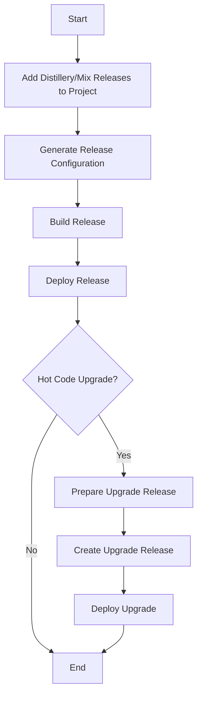

## 10.7. Release Management and Upgrades

Release management and upgrades are critical aspects of software development, especially in production environments where uptime and reliability are paramount. In this section, we will delve into the intricacies of building releases in Elixir, executing hot code upgrades, and adhering to best practices for versioning and testing.

### Building Releases

Building releases in Elixir involves packaging your application into a deployable format. This process is facilitated by tools like Distillery and Mix Releases, which help manage dependencies, configurations, and runtime environments.

#### Packaging Applications with Distillery

Distillery is a popular tool for building releases in Elixir. It provides a robust framework for creating self-contained releases that can be deployed to production environments.

**Key Features of Distillery:**

- **Self-Contained Releases:** Distillery packages your application along with its dependencies, ensuring consistency across environments.
- **Configuration Management:** It allows for environment-specific configurations, making it easier to manage different deployment scenarios.
- **Hot Code Upgrades:** Distillery supports hot code upgrades, enabling you to update your application without downtime.

**Basic Steps to Create a Release with Distillery:**

1. **Add Distillery to Your Project:**

   Add Distillery to your `mix.exs` file:

   ```elixir
   defp deps do
     [
       {:distillery, "~> 2.1"}
     ]
   end
   ```

2. **Generate a Release Configuration:**

   Run the following command to generate a release configuration:

   ```bash
   mix release.init
   ```

   This will create a `rel` directory with configuration files.

3. **Build the Release:**

   Use the following command to build the release:

   ```bash
   mix release
   ```

   This will create a release in the `_build` directory.

4. **Deploy the Release:**

   Transfer the release to your production server and start it using the `bin` script:

   ```bash
   _build/prod/rel/my_app/bin/my_app start
   ```

#### Packaging Applications with Mix Releases

Mix Releases is an alternative to Distillery, integrated into Elixir since version 1.9. It simplifies the release process by leveraging Mix, the build tool for Elixir.

**Key Features of Mix Releases:**

- **Built-in Tooling:** Mix Releases is part of the Elixir core, eliminating the need for external dependencies.
- **Simplified Configuration:** It uses the existing Mix configuration, reducing complexity.
- **Compatibility with Elixir Features:** Mix Releases is tightly integrated with Elixir's features, ensuring seamless operation.

**Basic Steps to Create a Release with Mix Releases:**

1. **Configure the Release:**

   Add a release configuration to your `mix.exs` file:

   ```elixir
   def project do
     [
       releases: [
         my_app: [
           version: "0.1.0",
           applications: [my_app: :permanent]
         ]
       ]
     ]
   end
   ```

2. **Build the Release:**

   Run the following command to build the release:

   ```bash
   MIX_ENV=prod mix release
   ```

3. **Deploy the Release:**

   Transfer the release to your production server and start it using the `bin` script:

   ```bash
   _build/prod/rel/my_app/bin/my_app start
   ```

### Hot Code Upgrades

Hot code upgrades allow you to update a running system without stopping it. This is crucial for high-availability systems where downtime is not an option.

#### Understanding Hot Code Upgrades

Hot code upgrades involve replacing parts of a running system with new code. This process is complex and requires careful planning and execution.

**Key Concepts:**

- **Code Replacement:** New code is loaded into the system, replacing the old code.
- **State Preservation:** The system's state must be preserved across the upgrade.
- **Backward Compatibility:** The new code must be compatible with the existing state and data structures.

#### Implementing Hot Code Upgrades with Distillery

Distillery provides support for hot code upgrades through its release process.

**Steps to Implement Hot Code Upgrades:**

1. **Prepare the Release:**

   Ensure your release is configured for hot code upgrades by setting the `upgrade` option in your `rel/config.exs` file:

   ```elixir
   environment :prod do
     set include_erts: true
     set include_src: false
     set cookie: :my_secret_cookie
     set upgrade: true
   end
   ```

2. **Create an Upgrade Release:**

   Build an upgrade release using the following command:

   ```bash
   mix release --upgrade
   ```

3. **Deploy the Upgrade:**

   Transfer the upgrade release to your production server and apply it using the `bin` script:

   ```bash
   _build/prod/rel/my_app/bin/my_app upgrade 0.1.1
   ```

#### Implementing Hot Code Upgrades with Mix Releases

Mix Releases also supports hot code upgrades, though the process is slightly different.

**Steps to Implement Hot Code Upgrades:**

1. **Prepare the Release:**

   Ensure your release is configured for hot code upgrades by setting the `upgrade` option in your `mix.exs` file:

   ```elixir
   def project do
     [
       releases: [
         my_app: [
           version: "0.1.1",
           applications: [my_app: :permanent],
           upgrade: true
         ]
       ]
     ]
   end
   ```

2. **Create an Upgrade Release:**

   Build an upgrade release using the following command:

   ```bash
   MIX_ENV=prod mix release --upgrade
   ```

3. **Deploy the Upgrade:**

   Transfer the upgrade release to your production server and apply it using the `bin` script:

   ```bash
   _build/prod/rel/my_app/bin/my_app upgrade 0.1.1
   ```

### Best Practices

Adhering to best practices in release management and upgrades ensures a smooth and reliable deployment process.

#### Versioning

Versioning is crucial for managing releases and upgrades. It helps track changes and ensures compatibility between different versions.

**Best Practices for Versioning:**

- **Semantic Versioning:** Use semantic versioning (MAJOR.MINOR.PATCH) to indicate the nature of changes.
- **Consistent Versioning:** Maintain consistent versioning across all components of your application.
- **Document Changes:** Keep a changelog to document changes between versions.

#### Testing Release Upgrades

Thorough testing of release upgrades is essential to prevent issues in production.

**Best Practices for Testing:**

- **Automated Testing:** Use automated tests to verify the functionality of each release.
- **Staging Environment:** Test upgrades in a staging environment that mirrors production.
- **Rollback Plan:** Have a rollback plan in place in case of issues during the upgrade.

#### Configuration Management

Managing configurations effectively is crucial for successful releases.

**Best Practices for Configuration Management:**

- **Environment-Specific Configurations:** Use environment-specific configurations to manage different deployment scenarios.
- **Secure Configurations:** Ensure sensitive configurations are stored securely.
- **Version Control:** Keep configurations under version control to track changes.

### Visualizing the Release Process

To better understand the release process, let's visualize it using a flowchart.



**Figure 1:** Flowchart of the Release Process

### Try It Yourself

To gain hands-on experience with release management and upgrades, try the following exercises:

1. **Create a Release with Distillery:**

   - Follow the steps outlined above to create a release using Distillery.
   - Deploy the release to a local environment and start the application.

2. **Implement a Hot Code Upgrade:**

   - Modify the application code and create an upgrade release.
   - Apply the upgrade to the running application and verify the changes.

3. **Experiment with Mix Releases:**

   - Create a release using Mix Releases and deploy it to a local environment.
   - Implement a hot code upgrade and observe the process.

### Knowledge Check

To reinforce your understanding of release management and upgrades, consider the following questions:

- What are the key differences between Distillery and Mix Releases?
- How do hot code upgrades preserve the system's state?
- Why is versioning important in release management?
- What are the best practices for testing release upgrades?

### Embrace the Journey

Release management and upgrades are vital components of software development, ensuring that applications remain reliable and up-to-date. As you continue to explore these concepts, remember that practice and experimentation are key to mastering them. Keep experimenting, stay curious, and enjoy the journey!

## Quiz: Release Management and Upgrades



### What is the primary purpose of Distillery in Elixir?

- [x] To package applications into deployable releases
- [ ] To manage dependencies in Elixir projects
- [ ] To provide a testing framework for Elixir
- [ ] To compile Elixir code into bytecode

> **Explanation:** Distillery is a tool used to package Elixir applications into self-contained releases for deployment.

### Which Elixir version introduced Mix Releases?

- [ ] 1.7
- [x] 1.9
- [ ] 1.8
- [ ] 1.10

> **Explanation:** Mix Releases was introduced in Elixir version 1.9 as an integrated tool for building releases.

### What is a key feature of hot code upgrades?

- [x] Updating running systems without downtime
- [ ] Improving application performance
- [ ] Enhancing security features
- [ ] Simplifying codebase management

> **Explanation:** Hot code upgrades allow updating a running system without stopping it, ensuring continuous availability.

### What is semantic versioning?

- [x] A versioning system using MAJOR.MINOR.PATCH format
- [ ] A method for optimizing code performance
- [ ] A technique for managing dependencies
- [ ] A process for testing software releases

> **Explanation:** Semantic versioning uses a MAJOR.MINOR.PATCH format to indicate the nature of changes in software versions.

### Which tool is part of the Elixir core for building releases?

- [ ] Distillery
- [x] Mix Releases
- [ ] ExUnit
- [ ] Phoenix

> **Explanation:** Mix Releases is part of the Elixir core, providing built-in support for building releases.

### What is a best practice for managing configurations?

- [x] Use environment-specific configurations
- [ ] Store configurations in plain text files
- [ ] Avoid version control for configurations
- [ ] Use the same configuration for all environments

> **Explanation:** Using environment-specific configurations helps manage different deployment scenarios effectively.

### Why is a rollback plan important during upgrades?

- [x] To revert changes in case of issues
- [ ] To improve application performance
- [ ] To enhance security features
- [ ] To simplify codebase management

> **Explanation:** A rollback plan allows reverting changes if issues arise during the upgrade process, ensuring system stability.

### What is a key advantage of Mix Releases over Distillery?

- [x] Integration with Elixir's core features
- [ ] Better support for hot code upgrades
- [ ] More comprehensive documentation
- [ ] Faster release build times

> **Explanation:** Mix Releases is integrated with Elixir's core features, providing seamless operation and reduced complexity.

### What is the purpose of a staging environment?

- [x] To test upgrades in an environment mirroring production
- [ ] To store backup configurations
- [ ] To compile Elixir code into bytecode
- [ ] To manage dependencies in Elixir projects

> **Explanation:** A staging environment is used to test upgrades in a setting that closely resembles the production environment.

### True or False: Hot code upgrades require stopping the application.

- [ ] True
- [x] False

> **Explanation:** Hot code upgrades allow updating a running system without stopping it, ensuring continuous availability.


