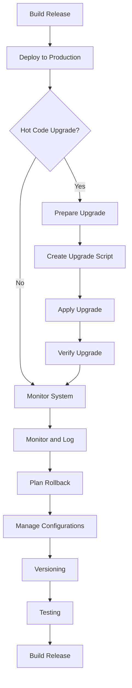

## 10.7. Release Management and Upgrades

Release management is a critical aspect of software engineering, ensuring that applications are deployed smoothly and can be upgraded without disrupting service. In the Elixir ecosystem, tools like Distillery and Mix Releases facilitate these processes, enabling developers to build, deploy, and upgrade applications efficiently. This section will guide you through the intricacies of release management in Elixir, focusing on building releases, performing hot code upgrades, and adhering to best practices.

### Building Releases

Building releases in Elixir involves packaging your application and its dependencies into a single, deployable unit. This process is crucial for deploying applications in production environments, where reliability and consistency are paramount.

#### Packaging Applications with Distillery

Distillery is a popular tool in the Elixir community for creating releases. It provides a comprehensive solution for packaging applications, managing configurations, and executing hot code upgrades.

**Key Features of Distillery:**

- **Automated Release Creation:** Distillery automates the process of creating releases, ensuring that all dependencies are included and configured correctly.
- **Configuration Management:** Distillery allows you to manage application configurations separately from your codebase, making it easier to adjust settings for different environments.
- **Hot Code Upgrades:** Distillery supports hot code upgrades, enabling you to update running systems without downtime.

**Creating a Release with Distillery:**

To create a release using Distillery, follow these steps:

1. **Add Distillery to Your Project:**

   Add Distillery as a dependency in your `mix.exs` file:

   ```elixir
   defp deps do
     [
       {:distillery, "~> 2.1"}
     ]
   end
   ```

2. **Initialize Distillery:**

   Run the following command to initialize Distillery in your project:

   ```bash
   mix release.init
   ```

   This command creates a `rel` directory with configuration files for your release.

3. **Build the Release:**

   Use the following command to build your release:

   ```bash
   mix release
   ```

   This command compiles your application and packages it into a release.

4. **Deploy the Release:**

   Once the release is built, you can deploy it to your production environment. The release includes everything needed to run your application, including the Erlang runtime.

#### Packaging Applications with Mix Releases

Mix Releases is a built-in feature of Elixir, introduced in version 1.9, that simplifies the release process. It provides a streamlined approach to building and deploying releases without the need for additional dependencies.

**Key Features of Mix Releases:**

- **Native Integration:** Mix Releases is integrated into the Elixir ecosystem, providing a seamless experience for building and deploying releases.
- **Simplified Configuration:** Mix Releases uses the existing Mix configuration, reducing the complexity of managing separate configuration files.
- **Built-In Support for Hot Code Upgrades:** Like Distillery, Mix Releases supports hot code upgrades, allowing you to update running systems without downtime.

**Creating a Release with Mix Releases:**

To create a release using Mix Releases, follow these steps:

1. **Configure Your Application:**

   Ensure that your application is configured correctly in your `mix.exs` file:

   ```elixir
   defp application do
     [
       mod: {MyApp.Application, []},
       extra_applications: [:logger]
     ]
   end
   ```

2. **Build the Release:**

   Use the following command to build your release:

   ```bash
   mix release
   ```

   This command compiles your application and packages it into a release.

3. **Deploy the Release:**

   Once the release is built, you can deploy it to your production environment. The release includes everything needed to run your application, including the Erlang runtime.

### Hot Code Upgrades

Hot code upgrades are a powerful feature of the Erlang VM, allowing you to update a running system without stopping it. This capability is essential for high-availability systems, where downtime is not an option.

**Understanding Hot Code Upgrades:**

Hot code upgrades involve replacing parts of a running application with new code. This process is facilitated by the Erlang VM, which supports dynamic code loading and module replacement.

**Steps for Performing Hot Code Upgrades:**

1. **Prepare the Upgrade:**

   Ensure that your application is designed to support hot code upgrades. This involves structuring your code to minimize dependencies and avoid global state.

2. **Create an Upgrade Script:**

   Use the `mix release` command with the `--upgrade` flag to generate an upgrade script:

   ```bash
   mix release --upgrade
   ```

   This command creates an upgrade script that can be applied to a running system.

3. **Apply the Upgrade:**

   Use the `bin/my_app upgrade` command to apply the upgrade to your running system:

   ```bash
   bin/my_app upgrade <version>
   ```

   This command replaces the old code with the new code, without stopping the system.

4. **Verify the Upgrade:**

   After applying the upgrade, verify that the system is functioning correctly. This may involve running tests or monitoring system logs for errors.

### Best Practices for Release Management

Effective release management involves more than just building and deploying releases. It requires careful planning, thorough testing, and adherence to best practices to ensure that upgrades are seamless and reliable.

#### Versioning

Versioning is a critical aspect of release management, providing a clear and consistent way to track changes and upgrades. Use semantic versioning (SemVer) to manage your application's version numbers, ensuring that each release is uniquely identified and easy to understand.

#### Testing Release Upgrades

Thorough testing is essential to ensure that release upgrades do not introduce new bugs or regressions. Use automated tests to verify the functionality of your application before and after an upgrade, and consider using canary releases to test upgrades in a production-like environment.

#### Configuration Management

Managing configurations separately from your codebase is a best practice that simplifies the release process and reduces the risk of errors. Use tools like Distillery or Mix Releases to manage configurations for different environments, ensuring that your application behaves consistently across development, staging, and production.

#### Monitoring and Logging

Monitoring and logging are essential for tracking the health of your application and diagnosing issues during and after an upgrade. Use tools like Prometheus and Grafana to monitor system metrics, and ensure that your application logs are comprehensive and easy to access.

#### Rollback Strategies

Despite thorough testing, issues may arise during an upgrade that require a rollback. Plan for rollback scenarios by maintaining backups of previous releases and ensuring that your deployment process supports rolling back to a previous version quickly and safely.

### Visualizing Release Management and Upgrades

To better understand the process of release management and upgrades, let's visualize the workflow using a Mermaid.js diagram.


```mermaid
flowchart TD
    A[Build Release] --> B[Deploy to Production]
    B --> C{Hot Code Upgrade?}
    C -->|Yes| D[Prepare Upgrade]
    C -->|No| E[Monitor System]
    D --> F[Create Upgrade Script]
    F --> G[Apply Upgrade]
    G --> H[Verify Upgrade]
    H --> E
    E --> I[Monitor and Log]
    I --> J[Plan Rollback]
    J --> K[Manage Configurations]
    K --> L[Versioning]
    L --> M[Testing]
    M --> N[Build Release]
```

**Diagram Description:**

- **Build Release:** The process begins with building the release using Distillery or Mix Releases.
- **Deploy to Production:** The release is deployed to the production environment.
- **Hot Code Upgrade:** If a hot code upgrade is needed, the system prepares for the upgrade.
- **Prepare Upgrade:** The system is prepared for the upgrade, minimizing dependencies and global state.
- **Create Upgrade Script:** An upgrade script is created using the `mix release` command.
- **Apply Upgrade:** The upgrade is applied to the running system.
- **Verify Upgrade:** The system is verified to ensure that it is functioning correctly.
- **Monitor and Log:** The system is monitored and logged for any issues.
- **Plan Rollback:** A rollback plan is in place in case of issues.
- **Manage Configurations:** Configurations are managed for different environments.
- **Versioning:** Semantic versioning is used to track changes and upgrades.
- **Testing:** Automated tests are used to verify the functionality of the application.

### Try It Yourself

To deepen your understanding of release management and upgrades in Elixir, try the following exercises:

1. **Create a Release with Distillery:**

   - Add Distillery to your project and create a release.
   - Deploy the release to a test environment and verify that it runs correctly.

2. **Perform a Hot Code Upgrade:**

   - Modify your application to support hot code upgrades.
   - Create an upgrade script and apply it to a running system.
   - Verify that the system continues to function correctly after the upgrade.

3. **Implement Versioning and Configuration Management:**

   - Use semantic versioning to manage your application's version numbers.
   - Separate your application's configurations from the codebase and manage them using Distillery or Mix Releases.

### Knowledge Check

- **What are the key features of Distillery and Mix Releases?**
- **How do hot code upgrades work in Elixir?**
- **What are the best practices for release management in Elixir?**

### Embrace the Journey

Remember, mastering release management and upgrades in Elixir is a journey. As you progress, you'll build more resilient and reliable systems. Keep experimenting, stay curious, and enjoy the process!

## Quiz Time!



### What is the primary purpose of release management in Elixir?

- [x] To ensure smooth deployment and upgrades of applications
- [ ] To write code faster
- [ ] To avoid using version control
- [ ] To create more bugs

> **Explanation:** Release management ensures that applications are deployed smoothly and can be upgraded without disrupting service.

### Which tool is popular for creating releases in Elixir?

- [x] Distillery
- [ ] Docker
- [ ] Kubernetes
- [ ] Ansible

> **Explanation:** Distillery is a popular tool in the Elixir community for creating releases.

### What is a key feature of Mix Releases?

- [x] Native integration with Elixir
- [ ] Requires additional dependencies
- [ ] Only works with Erlang
- [ ] Does not support hot code upgrades

> **Explanation:** Mix Releases is integrated into the Elixir ecosystem, providing a seamless experience for building and deploying releases.

### What is the benefit of hot code upgrades?

- [x] Updating running systems without downtime
- [ ] Increasing system downtime
- [ ] Making systems slower
- [ ] Adding more bugs

> **Explanation:** Hot code upgrades allow you to update a running system without stopping it, which is essential for high-availability systems.

### Which command is used to build a release with Mix Releases?

- [x] mix release
- [ ] mix build
- [ ] mix compile
- [ ] mix deploy

> **Explanation:** The `mix release` command is used to build a release in Elixir.

### What is a best practice for managing configurations?

- [x] Separating configurations from the codebase
- [ ] Hardcoding configurations in the codebase
- [ ] Ignoring configurations
- [ ] Using random configurations

> **Explanation:** Managing configurations separately from your codebase simplifies the release process and reduces the risk of errors.

### Why is versioning important in release management?

- [x] To track changes and upgrades clearly
- [ ] To confuse developers
- [ ] To make deployment harder
- [ ] To avoid using version control

> **Explanation:** Versioning provides a clear and consistent way to track changes and upgrades.

### What should be done after applying a hot code upgrade?

- [x] Verify that the system is functioning correctly
- [ ] Ignore the system
- [ ] Restart the system
- [ ] Shut down the system

> **Explanation:** After applying a hot code upgrade, verify that the system is functioning correctly by running tests or monitoring system logs.

### What is a rollback strategy?

- [x] A plan to revert to a previous version in case of issues
- [ ] A method to increase system downtime
- [ ] A way to add more bugs
- [ ] A technique to confuse developers

> **Explanation:** A rollback strategy involves maintaining backups of previous releases and ensuring that your deployment process supports rolling back to a previous version quickly and safely.

### True or False: Hot code upgrades require stopping the system.

- [ ] True
- [x] False

> **Explanation:** Hot code upgrades allow you to update a running system without stopping it.


