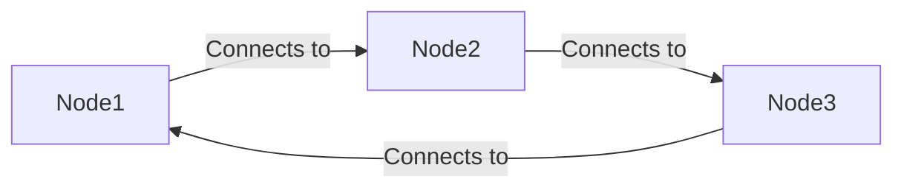
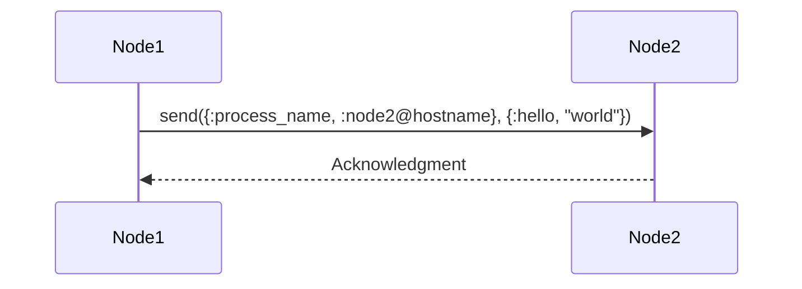

## 10.8. Distributed System Design with OTP

Designing distributed systems is a complex task that requires careful consideration of various factors such as scalability, fault tolerance, and consistency. Elixir, with its robust OTP (Open Telecom Platform) framework, provides powerful tools for building distributed systems that can run efficiently across multiple nodes. In this section, we will explore how to leverage OTP to design distributed systems in Elixir, focusing on connecting nodes, managing process communication, and addressing common challenges such as latency and network partitions.

### Running on Multiple Nodes

To build a distributed system in Elixir, the first step is to connect multiple nodes. A node in Elixir is essentially an instance of the Erlang VM, and connecting nodes allows them to communicate and share resources.

#### Connecting Elixir Nodes

To connect Elixir nodes, you need to ensure that each node is started with a unique name and is aware of the other nodes in the system. You can start a node with the `--sname` or `--name` flag to assign it a name.

```bash
# Start a node with a short name
iex --sname node1

# Start another node with a different name
iex --sname node2
```

Once the nodes are running, you can connect them using the `Node.connect/1` function. This function takes the name of the node you want to connect to as an argument.

```elixir
# Connect node1 to node2
Node.connect(:node2@hostname)
```

#### Visualizing Node Connections

To better understand how nodes connect in a distributed system, let's visualize the process using a diagram.



*Diagram: A simple representation of nodes connecting in a distributed system.*

#### Ensuring Node Connectivity

When designing distributed systems, it's crucial to ensure that nodes can reliably connect and communicate. Here are some best practices:

- **Network Configuration**: Ensure that the network allows communication between nodes. This may involve configuring firewalls and network policies.
- **Node Discovery**: Implement a mechanism for nodes to discover each other dynamically. This can be achieved using service discovery tools or by maintaining a list of known nodes.
- **Handling Node Failures**: Design the system to handle node failures gracefully. This may involve setting up monitoring and alerting mechanisms to detect and respond to node outages.

### Process Communication

Once nodes are connected, the next step is to enable communication between processes running on different nodes. In Elixir, processes communicate by sending messages, and this mechanism extends seamlessly to distributed systems.

#### Sending Messages Between Nodes

To send a message to a process on a different node, you need to know the process identifier (PID) or the registered name of the process. You can use the `send/2` function to send a message.

```elixir
# Send a message to a process on another node
send({:process_name, :node2@hostname}, {:hello, "world"})
```

#### Handling Remote Messages

When designing distributed systems, it's important to handle remote messages carefully to ensure that the system remains responsive and reliable. Consider the following:

- **Latency**: Network latency can affect the speed of message delivery. Design your system to tolerate delays and use timeouts where appropriate.
- **Message Ordering**: Messages may not arrive in the order they were sent. Implement mechanisms to handle out-of-order messages if necessary.
- **Error Handling**: Be prepared to handle errors such as network failures or unreachable nodes. Use OTP's supervision trees to restart failed processes and maintain system stability.

#### Visualizing Process Communication

Let's visualize the process of sending messages between nodes using a sequence diagram.



*Diagram: A sequence diagram illustrating message passing between nodes.*

### Considerations for Distributed Systems

Designing distributed systems involves addressing several challenges that are unique to distributed environments. Let's explore some of these considerations.

#### Latency

Latency is the time it takes for a message to travel from one node to another. In distributed systems, latency can vary due to network conditions, and it's important to design your system to handle these variations.

- **Asynchronous Communication**: Use asynchronous communication to avoid blocking processes while waiting for responses.
- **Caching**: Implement caching mechanisms to reduce the need for frequent remote calls.
- **Load Balancing**: Distribute requests evenly across nodes to prevent bottlenecks and reduce latency.

#### Network Partitions

Network partitions occur when nodes in a distributed system become isolated from each other due to network failures. Designing for network partitions involves ensuring that the system can continue to operate even when some nodes are unreachable.

- **Partition Tolerance**: Design your system to tolerate network partitions by replicating data and services across multiple nodes.
- **Consistency Models**: Choose an appropriate consistency model (e.g., eventual consistency) to balance consistency and availability during partitions.

#### Consistency

Consistency refers to the guarantee that all nodes in a distributed system have the same view of the data. Achieving consistency in distributed systems can be challenging due to network delays and partitions.

- **Consensus Algorithms**: Use consensus algorithms (e.g., Paxos, Raft) to ensure that nodes agree on the state of the system.
- **Data Replication**: Implement data replication strategies to ensure that data is consistent across nodes.

### Elixir Unique Features

Elixir offers several unique features that make it well-suited for building distributed systems:

- **Lightweight Processes**: Elixir's lightweight processes allow you to run millions of concurrent processes, making it ideal for handling large-scale distributed workloads.
- **Fault Tolerance**: OTP's supervision trees provide a robust mechanism for handling process failures and ensuring system stability.
- **Hot Code Upgrades**: Elixir supports hot code upgrades, allowing you to update your system without downtime.

### Sample Code Snippet

Let's look at a sample code snippet that demonstrates connecting nodes and sending messages between processes.

```elixir
defmodule DistributedExample do
  def start do
    # Start a process on the current node
    pid = spawn(fn -> listen() end)
    # Register the process with a name
    Process.register(pid, :listener)

    # Connect to another node
    Node.connect(:node2@hostname)

    # Send a message to a process on the remote node
    send({:listener, :node2@hostname}, {:hello, "world"})
  end

  defp listen do
    receive do
      {:hello, message} ->
        IO.puts("Received message: #{message}")
        listen()
    end
  end
end
```

*Code: A simple example of connecting nodes and sending messages between processes.*

### Design Considerations

When designing distributed systems with OTP, consider the following:

- **Scalability**: Design your system to scale horizontally by adding more nodes as needed.
- **Fault Tolerance**: Use OTP's supervision trees to handle process failures and ensure system reliability.
- **Consistency**: Choose an appropriate consistency model based on your application's requirements.

### Differences and Similarities

Distributed systems in Elixir share similarities with other distributed systems, such as those built with Akka or Kafka. However, Elixir's unique features, such as lightweight processes and OTP's fault tolerance, set it apart and make it particularly well-suited for building resilient and scalable systems.

### Try It Yourself

To deepen your understanding of distributed systems with OTP, try modifying the sample code to:

- Add more nodes and processes to the system.
- Implement a simple load balancer to distribute messages across nodes.
- Experiment with different consistency models and observe their impact on the system.

### Knowledge Check

- What are the key considerations when designing distributed systems with OTP?
- How does Elixir's lightweight process model benefit distributed system design?
- What strategies can be used to handle network partitions in distributed systems?

### Embrace the Journey

Designing distributed systems with OTP is a rewarding journey that requires a deep understanding of both the technical and architectural aspects of distributed computing. As you continue to explore and experiment with these concepts, remember that the key to success is a solid understanding of the principles and patterns that underpin distributed systems. Keep learning, stay curious, and enjoy the journey!

## Quiz: Distributed System Design with OTP



### What is the primary purpose of connecting nodes in a distributed system?

- [x] To enable communication and resource sharing between nodes
- [ ] To increase the number of processes on a single node
- [ ] To reduce the memory usage of each node
- [ ] To simplify the codebase

> **Explanation:** Connecting nodes in a distributed system allows them to communicate and share resources, which is essential for building scalable and fault-tolerant applications.

### Which function is used to send a message to a process on a different node in Elixir?

- [ ] Node.connect/1
- [x] send/2
- [ ] receive/1
- [ ] spawn/1

> **Explanation:** The `send/2` function is used to send messages to processes, including those on different nodes.

### What is a common challenge when designing distributed systems?

- [x] Network partitions
- [ ] Lack of processes
- [ ] Excessive memory usage
- [ ] Insufficient code comments

> **Explanation:** Network partitions are a common challenge in distributed systems, as they can cause nodes to become isolated from each other.

### How can latency be addressed in distributed systems?

- [x] By using asynchronous communication
- [ ] By reducing the number of nodes
- [ ] By increasing the number of processes
- [ ] By simplifying the codebase

> **Explanation:** Asynchronous communication helps to address latency by allowing processes to continue executing without waiting for responses.

### What is a benefit of using Elixir's lightweight processes in distributed systems?

- [x] They allow for running millions of concurrent processes
- [ ] They reduce the need for network connections
- [ ] They simplify the codebase
- [ ] They increase memory usage

> **Explanation:** Elixir's lightweight processes enable running millions of concurrent processes, making it ideal for distributed workloads.

### Which OTP feature helps ensure system stability in the face of process failures?

- [x] Supervision trees
- [ ] Hot code upgrades
- [ ] Node connections
- [ ] Message passing

> **Explanation:** OTP's supervision trees provide a robust mechanism for handling process failures and ensuring system stability.

### What is a strategy for handling network partitions in distributed systems?

- [x] Data replication
- [ ] Reducing the number of nodes
- [ ] Increasing process count
- [ ] Simplifying the codebase

> **Explanation:** Data replication helps ensure that data remains available and consistent across nodes, even during network partitions.

### What is the role of consensus algorithms in distributed systems?

- [x] To ensure nodes agree on the system state
- [ ] To reduce memory usage
- [ ] To increase process count
- [ ] To simplify the codebase

> **Explanation:** Consensus algorithms help ensure that nodes in a distributed system agree on the state of the system, which is crucial for consistency.

### What is a key consideration when choosing a consistency model for a distributed system?

- [x] Balancing consistency and availability
- [ ] Reducing memory usage
- [ ] Increasing process count
- [ ] Simplifying the codebase

> **Explanation:** Choosing a consistency model involves balancing consistency and availability, especially during network partitions.

### True or False: Elixir supports hot code upgrades, allowing updates without downtime.

- [x] True
- [ ] False

> **Explanation:** Elixir supports hot code upgrades, which enable updating the system without downtime, enhancing its robustness and flexibility.


