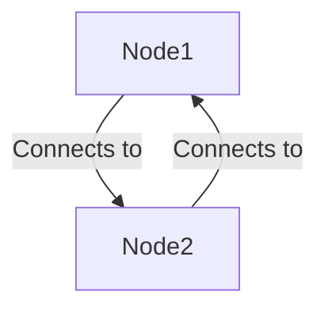
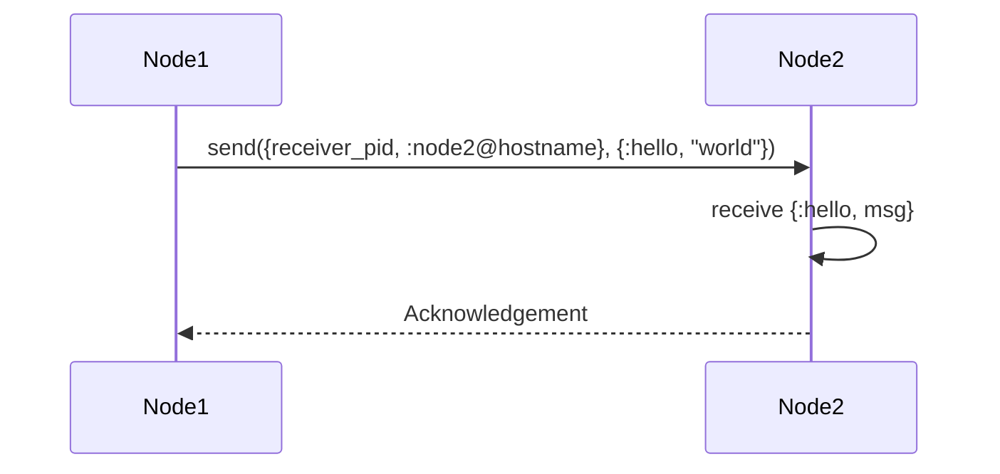

## 10.8. Distributed System Design with OTP

Distributed systems are at the heart of modern software architecture, enabling applications to scale, remain resilient, and perform efficiently under varying loads. Elixir, with its robust OTP (Open Telecom Platform) framework, provides a powerful toolkit for building distributed systems. In this section, we'll explore how to design distributed systems using OTP, focusing on connecting nodes, process communication, and addressing key considerations such as latency, network partitions, and consistency.

### Running on Multiple Nodes

#### Connecting Elixir Nodes

In a distributed Elixir system, multiple nodes work together to perform tasks. Each node is a separate instance of the Erlang Virtual Machine (BEAM) running an Elixir application. To form a distributed system, these nodes must be connected.

**Steps to Connect Nodes:**

1. **Start the Nodes:**
   Each node must be started with a unique name. You can start an Elixir node with the `--sname` (short name) or `--name` (fully qualified name) option.

   ```bash
   iex --sname node1
   iex --sname node2
   ```

2. **Establish a Connection:**
   Use the `Node.connect/1` function to connect nodes. This function takes the name of the node you want to connect to.

   ```elixir
   Node.connect(:node2@hostname)
   ```

3. **Verify the Connection:**
   Use `Node.list/0` to list all connected nodes.

   ```elixir
   Node.list()
   ```

   If the connection is successful, `:node2@hostname` should appear in the list.

#### Code Example: Connecting Nodes

Let's see a simple example where two nodes are connected, and they communicate with each other.

```elixir
# Start node1
$ iex --sname node1

# Start node2
$ iex --sname node2

# In node1's IEx session
Node.connect(:node2@hostname)
Node.list() # Should return [:node2@hostname]

# In node2's IEx session
Node.self() # Should return :node2@hostname
```

#### Visualizing Node Connections


```mermaid
graph TD;
    A[Node1] -- Connects to --> B[Node2];
    B -- Connects to --> A;
```

**Diagram Description:** The diagram illustrates a simple two-node connection where Node1 and Node2 are connected bidirectionally, allowing communication between them.

### Process Communication

In a distributed system, processes running on different nodes need to communicate. Elixir’s message-passing capabilities make it easy to send messages between processes, even when they reside on different nodes.

#### Sending Messages Between Processes

1. **Identify the Process:**
   Each process in Elixir has a unique identifier called a PID (Process Identifier). To send a message to a process on another node, you need its PID.

2. **Send a Message:**
   Use the `send/2` function to send messages. The function takes a PID and a message as arguments.

   ```elixir
   send(pid, {:hello, "world"})
   ```

3. **Receive a Message:**
   Use the `receive` block to handle incoming messages.

   ```elixir
   receive do
     {:hello, msg} -> IO.puts("Received: #{msg}")
   end
   ```

#### Code Example: Process Communication

Let's create a simple example where a process on Node1 sends a message to a process on Node2.

```elixir
# On Node2
defmodule Receiver do
  def start do
    spawn(fn -> listen() end)
  end

  defp listen do
    receive do
      {:hello, msg} -> IO.puts("Received message: #{msg}")
    end
  end
end

# Start the receiver process on Node2
receiver_pid = Receiver.start()

# On Node1
send({receiver_pid, :node2@hostname}, {:hello, "world"})
```

#### Visualizing Process Communication


```mermaid
sequenceDiagram
    participant Node1
    participant Node2
    Node1->>Node2: send({receiver_pid, :node2@hostname}, {:hello, "world"})
    Node2->>Node2: receive {:hello, msg}
    Node2-->>Node1: Acknowledgement
```

**Diagram Description:** This sequence diagram shows Node1 sending a message to Node2. Node2 receives the message and processes it, potentially sending back an acknowledgment.

### Considerations in Distributed Systems

Designing distributed systems involves addressing several challenges, including latency, network partitions, and consistency. Let's explore these considerations and how OTP helps manage them.

#### Latency

Latency refers to the delay between sending a message and receiving a response. In distributed systems, latency can be affected by network speed, distance between nodes, and processing time.

**Strategies to Manage Latency:**

- **Asynchronous Communication:** Use asynchronous message passing to avoid blocking processes while waiting for responses.
- **Caching:** Cache frequently accessed data to reduce the need for remote calls.
- **Load Balancing:** Distribute requests evenly across nodes to prevent bottlenecks.

#### Network Partitions

Network partitions occur when nodes in a distributed system become isolated from each other, often due to network failures. This can lead to inconsistencies and failures in communication.

**Handling Network Partitions:**

- **Partition Tolerance:** Design systems to continue operating even when some nodes are unreachable.
- **Heartbeat Mechanisms:** Implement heartbeat signals to detect when nodes become unreachable.
- **Fallback Strategies:** Use fallback strategies to handle requests when certain nodes are unavailable.

#### Consistency

Consistency ensures that all nodes in a distributed system have the same data at any given time. Achieving consistency can be challenging, especially in the presence of network partitions.

**Approaches to Consistency:**

- **Eventual Consistency:** Allow temporary inconsistencies with the guarantee that all nodes will eventually converge to the same state.
- **Strong Consistency:** Ensure that all nodes have the same data before any operation is considered complete.
- **Consensus Algorithms:** Use algorithms like Paxos or Raft to achieve consensus among nodes.

### Code Example: Handling Network Partitions

Let's see an example of how to implement a simple heartbeat mechanism to detect network partitions.

```elixir
defmodule Heartbeat do
  def start do
    spawn(fn -> send_heartbeat() end)
  end

  defp send_heartbeat do
    :timer.sleep(5000)
    send_heartbeat()
  end

  defp receive_heartbeat do
    receive do
      :heartbeat -> IO.puts("Heartbeat received")
    after
      6000 -> IO.puts("Node unreachable")
    end
  end
end

# Start the heartbeat process on each node
Heartbeat.start()
```

### Elixir Unique Features

Elixir, running on the BEAM VM, provides several unique features that make it well-suited for distributed systems:

- **Lightweight Processes:** Elixir processes are lightweight, allowing millions of them to run concurrently on a single node.
- **Fault Tolerance:** The "let it crash" philosophy and supervisor trees make Elixir applications resilient to failures.
- **Hot Code Swapping:** Elixir supports updating code without stopping the system, which is crucial for distributed systems that require high availability.
- **Immutable Data:** Immutability ensures that data changes do not lead to inconsistencies across nodes.

### Design Considerations

When designing distributed systems with OTP, consider the following:

- **Node Naming:** Use consistent naming conventions for nodes to simplify connections and communication.
- **Security:** Implement secure communication channels between nodes to prevent unauthorized access.
- **Scalability:** Design your system to handle increasing loads by adding more nodes.
- **Monitoring:** Use tools like Observer or Telemetry to monitor node performance and detect issues early.

### Differences and Similarities

Distributed systems in Elixir share similarities with those in other languages but also have unique aspects:

- **Similarities:** Like other languages, Elixir uses message passing for process communication and requires strategies for handling latency and consistency.
- **Differences:** Elixir's lightweight processes and fault-tolerant design make it stand out, along with its ability to handle millions of concurrent processes efficiently.

### Try It Yourself

Experiment with the examples provided by modifying the node names, message contents, and heartbeat intervals. Try connecting more than two nodes and observe how the system behaves under different conditions.

### Knowledge Check

- **What are the key components of a distributed system in Elixir?**
- **How does Elixir handle process communication across nodes?**
- **What strategies can be employed to manage latency in distributed systems?**
- **How can network partitions be detected and handled?**
- **What are the differences between strong consistency and eventual consistency?**

### Embrace the Journey

Remember, designing distributed systems is a complex task, but Elixir and OTP provide the tools to make it manageable. Keep experimenting, stay curious, and enjoy the journey of building resilient and scalable systems.

## Quiz Time!



### What is a node in a distributed Elixir system?

- [x] An instance of the BEAM VM running an Elixir application
- [ ] A single process running within an Elixir application
- [ ] A module in an Elixir application
- [ ] A function in an Elixir application

> **Explanation:** A node in a distributed Elixir system is an instance of the BEAM VM running an Elixir application.

### How do you connect two Elixir nodes?

- [x] Using the `Node.connect/1` function
- [ ] Using the `Process.spawn/1` function
- [ ] Using the `GenServer.start/1` function
- [ ] Using the `Supervisor.start_link/1` function

> **Explanation:** The `Node.connect/1` function is used to connect two Elixir nodes.

### What function is used to send messages between processes?

- [x] `send/2`
- [ ] `receive/1`
- [ ] `spawn/1`
- [ ] `start_link/1`

> **Explanation:** The `send/2` function is used to send messages between processes.

### Which of the following strategies can help manage latency in distributed systems?

- [x] Asynchronous Communication
- [x] Caching
- [x] Load Balancing
- [ ] Synchronous Communication

> **Explanation:** Asynchronous Communication, Caching, and Load Balancing are strategies to manage latency.

### What is a network partition in distributed systems?

- [x] When nodes become isolated due to network failures
- [ ] When data is split across multiple databases
- [ ] When a process crashes unexpectedly
- [ ] When a node runs out of memory

> **Explanation:** A network partition occurs when nodes become isolated due to network failures.

### How can network partitions be detected?

- [x] Using heartbeat mechanisms
- [ ] Using caching
- [ ] Using synchronous communication
- [ ] Using load balancing

> **Explanation:** Heartbeat mechanisms can be used to detect network partitions.

### What is the "let it crash" philosophy in Elixir?

- [x] Allowing processes to fail and recover automatically
- [ ] Preventing all process failures
- [ ] Ensuring processes never crash
- [ ] Manually restarting processes

> **Explanation:** The "let it crash" philosophy involves allowing processes to fail and recover automatically.

### What is eventual consistency?

- [x] Allowing temporary inconsistencies with eventual convergence
- [ ] Ensuring all nodes have the same data at all times
- [ ] Preventing any data inconsistencies
- [ ] Using synchronous communication for consistency

> **Explanation:** Eventual consistency allows temporary inconsistencies with the guarantee of eventual convergence.

### What is a key feature of Elixir processes?

- [x] They are lightweight and can run concurrently
- [ ] They are heavyweight and resource-intensive
- [ ] They can only run on a single node
- [ ] They require manual memory management

> **Explanation:** Elixir processes are lightweight and can run concurrently.

### True or False: Elixir supports hot code swapping.

- [x] True
- [ ] False

> **Explanation:** Elixir supports hot code swapping, allowing code updates without stopping the system.


