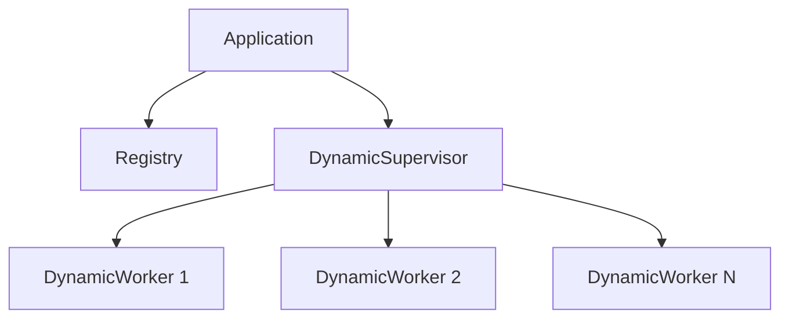
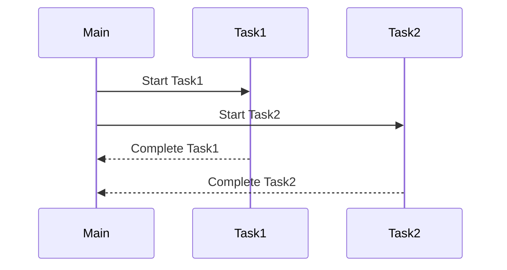
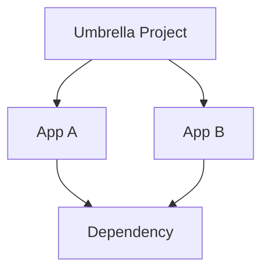

## 10.9. Advanced OTP Techniques

In this section, we delve into advanced OTP (Open Telecom Platform) techniques that are crucial for building scalable, maintainable, and fault-tolerant applications in Elixir. We will explore dynamic supervision, the task module, and umbrella projects. These concepts are essential for expert software engineers and architects aiming to harness the full potential of Elixir's concurrency and fault-tolerance capabilities.

### Dynamic Supervision

Dynamic supervision is a powerful feature in Elixir that allows you to manage processes at runtime. Unlike static supervision, where all child processes are defined at compile time, dynamic supervision enables you to start and stop child processes dynamically. This is particularly useful in scenarios where the number of processes is not known beforehand or can change over time.

#### Using `DynamicSupervisor` for Runtime Process Management

The `DynamicSupervisor` module provides a way to supervise processes that are started dynamically. It is an extension of the `Supervisor` module, designed to handle cases where the number of child processes is not fixed.

**Key Features of DynamicSupervisor:**

- **Dynamic Child Management:** Start and stop child processes at runtime.
- **Fault Tolerance:** Automatically restart child processes if they crash.
- **Scalability:** Efficiently manage a large number of processes.

**Code Example:**

Let's create a simple example to demonstrate how to use `DynamicSupervisor` in an Elixir application.

```elixir
defmodule MyApp.DynamicWorker do
  use GenServer

  def start_link(arg) do
    GenServer.start_link(__MODULE__, arg, name: via_tuple(arg))
  end

  def init(arg) do
    {:ok, arg}
  end

  defp via_tuple(arg), do: {:via, Registry, {MyApp.Registry, arg}}
end

defmodule MyApp.DynamicSupervisor do
  use DynamicSupervisor

  def start_link(_arg) do
    DynamicSupervisor.start_link(__MODULE__, :ok, name: __MODULE__)
  end

  def init(:ok) do
    DynamicSupervisor.init(strategy: :one_for_one)
  end

  def start_child(arg) do
    spec = {MyApp.DynamicWorker, arg}
    DynamicSupervisor.start_child(__MODULE__, spec)
  end
end

defmodule MyApp.Application do
  use Application

  def start(_type, _args) do
    children = [
      {Registry, keys: :unique, name: MyApp.Registry},
      {MyApp.DynamicSupervisor, :ok}
    ]

    opts = [strategy: :one_for_one, name: MyApp.Supervisor]
    Supervisor.start_link(children, opts)
  end
end
```

**Explanation:**

- **DynamicWorker:** A simple GenServer that will be managed by the `DynamicSupervisor`.
- **DynamicSupervisor:** Manages `DynamicWorker` processes. It uses a `:one_for_one` strategy, meaning if a child process crashes, only that process is restarted.
- **Application:** Starts the registry and dynamic supervisor as part of the application supervision tree.

**Try It Yourself:**

- Modify the `DynamicWorker` to perform a specific task, such as processing data or handling requests.
- Experiment with different supervision strategies, such as `:rest_for_one` or `:one_for_all`.

#### Visualizing Dynamic Supervision



**Diagram Explanation:**

- The application starts a registry and a dynamic supervisor.
- The dynamic supervisor manages multiple dynamic workers, which can be started and stopped at runtime.

### Task Module

The `Task` module in Elixir simplifies asynchronous operations and one-off computations. It provides a straightforward way to run tasks concurrently without the overhead of managing processes manually.

#### Simplifying Asynchronous Operations

The `Task` module is ideal for operations that can be performed concurrently, such as fetching data from multiple sources or performing computations in parallel.

**Key Features of Task Module:**

- **Ease of Use:** Simplifies concurrent programming with minimal boilerplate.
- **Concurrency:** Leverages Elixir's lightweight processes for efficient parallel execution.
- **Error Handling:** Provides mechanisms to handle errors in asynchronous tasks.

**Code Example:**

Here's an example of using the `Task` module to perform concurrent computations.

```elixir
defmodule MyApp.TaskExample do
  def fetch_data do
    task1 = Task.async(fn -> fetch_from_source1() end)
    task2 = Task.async(fn -> fetch_from_source2() end)

    result1 = Task.await(task1)
    result2 = Task.await(task2)

    {result1, result2}
  end

  defp fetch_from_source1 do
    # Simulate a time-consuming operation
    :timer.sleep(1000)
    "Data from source 1"
  end

  defp fetch_from_source2 do
    # Simulate a time-consuming operation
    :timer.sleep(1500)
    "Data from source 2"
  end
end
```

**Explanation:**

- **Task.async/1:** Starts a task asynchronously.
- **Task.await/1:** Waits for the task to complete and returns the result.
- **fetch_data/0:** Fetches data from two sources concurrently.

**Try It Yourself:**

- Modify the `fetch_from_source1` and `fetch_from_source2` functions to perform real-world tasks, such as making HTTP requests or querying databases.
- Experiment with error handling by introducing deliberate errors and observing how the `Task` module handles them.

#### Visualizing Task Execution



**Diagram Explanation:**

- The main process starts two tasks concurrently.
- Each task runs independently and returns its result to the main process upon completion.

### Umbrella Projects

Umbrella projects in Elixir are a way to organize large applications into multiple OTP applications. This structure promotes modularity, reusability, and maintainability.

#### Organizing Large Applications into Multiple OTP Apps

An umbrella project consists of a root project and multiple child applications. Each child application can be developed, tested, and deployed independently, yet they can also interact with each other as needed.

**Key Features of Umbrella Projects:**

- **Modularity:** Breaks down complex systems into manageable components.
- **Reusability:** Encourages code reuse across different applications.
- **Isolation:** Each application can have its own dependencies and configuration.

**Code Example:**

Let's create a simple umbrella project with two applications: `app_a` and `app_b`.

1. **Create an Umbrella Project:**

```bash
mix new my_umbrella --umbrella
cd my_umbrella
```

2. **Create Child Applications:**

```bash
cd apps
mix new app_a
mix new app_b
```

3. **Configure Dependencies:**

Edit `apps/app_a/mix.exs` to include `app_b` as a dependency:

```elixir
defp deps do
  [
    {:app_b, in_umbrella: true}
  ]
end
```

4. **Interacting Between Applications:**

In `app_a`, you can call functions from `app_b`:

```elixir
defmodule AppA do
  def call_app_b do
    AppB.some_function()
  end
end
```

**Explanation:**

- **Umbrella Project:** A root project that contains multiple child applications.
- **Child Applications:** Independent OTP applications that can interact with each other.
- **Dependencies:** Child applications can depend on each other using the `in_umbrella: true` option.

**Try It Yourself:**

- Add more applications to the umbrella project and explore how they can interact.
- Experiment with different configurations and dependencies for each application.

#### Visualizing Umbrella Project Structure



**Diagram Explanation:**

- The umbrella project contains two applications, `App A` and `App B`.
- Both applications can share dependencies and interact with each other.

### Conclusion

In this section, we've explored advanced OTP techniques in Elixir, focusing on dynamic supervision, the task module, and umbrella projects. These techniques are essential for building scalable, maintainable, and fault-tolerant applications. By mastering these concepts, you can leverage Elixir's powerful concurrency and fault-tolerance features to their fullest potential.

### Key Takeaways

- **Dynamic Supervision:** Use `DynamicSupervisor` for managing processes at runtime.
- **Task Module:** Simplify asynchronous operations with the `Task` module.
- **Umbrella Projects:** Organize large applications into multiple OTP apps for modularity and maintainability.

Remember, this is just the beginning. As you progress, you'll build more complex and interactive applications. Keep experimenting, stay curious, and enjoy the journey!

## Quiz: Advanced OTP Techniques



### What is the primary advantage of using DynamicSupervisor?

- [x] It allows for dynamic management of child processes at runtime.
- [ ] It provides a static supervision tree.
- [ ] It is used for synchronous operations.
- [ ] It replaces the need for GenServer.

> **Explanation:** DynamicSupervisor allows for starting and stopping child processes dynamically, which is useful when the number of processes is not known beforehand.

### How does the Task module simplify asynchronous operations?

- [x] By providing a simple API for running tasks concurrently.
- [ ] By replacing the need for GenServer.
- [ ] By enforcing synchronous execution.
- [ ] By managing static supervision trees.

> **Explanation:** The Task module provides an easy-to-use API for running tasks concurrently, making it simpler to perform asynchronous operations.

### What is an umbrella project in Elixir?

- [x] A project structure that organizes multiple OTP applications under a single root.
- [ ] A single OTP application with multiple modules.
- [ ] A project that does not use OTP.
- [ ] A project that only contains one application.

> **Explanation:** An umbrella project is a structure that allows multiple OTP applications to be organized under a single root, promoting modularity and reusability.

### Which of the following is a feature of DynamicSupervisor?

- [x] Fault tolerance through automatic process restarts.
- [ ] Static child process management.
- [ ] Synchronous task execution.
- [ ] Replacing GenServer functionality.

> **Explanation:** DynamicSupervisor provides fault tolerance by automatically restarting child processes if they crash.

### What is the purpose of the `Task.await/1` function?

- [x] To wait for a task to complete and return its result.
- [ ] To start a task asynchronously.
- [ ] To stop a task immediately.
- [ ] To supervise a task.

> **Explanation:** `Task.await/1` is used to wait for a task to complete and retrieve its result.

### How can you define dependencies between applications in an umbrella project?

- [x] By using the `in_umbrella: true` option in the `mix.exs` file.
- [ ] By creating a separate supervision tree.
- [ ] By using GenServer.
- [ ] By defining them in the application module.

> **Explanation:** Dependencies between applications in an umbrella project can be defined using the `in_umbrella: true` option in the `mix.exs` file.

### What is the benefit of using umbrella projects?

- [x] They promote modularity and reusability by organizing applications into separate components.
- [ ] They enforce a single application structure.
- [ ] They eliminate the need for supervision trees.
- [ ] They replace the need for the Task module.

> **Explanation:** Umbrella projects promote modularity and reusability by organizing applications into separate components, each with its own dependencies and configuration.

### Which strategy does DynamicSupervisor use to manage child processes?

- [x] One-for-one strategy.
- [ ] All-for-one strategy.
- [ ] Rest-for-one strategy.
- [ ] None of the above.

> **Explanation:** DynamicSupervisor typically uses a one-for-one strategy, meaning if a child process crashes, only that process is restarted.

### What is the role of the `Task.async/1` function?

- [x] To start a task asynchronously.
- [ ] To wait for a task to complete.
- [ ] To supervise a task.
- [ ] To stop a task immediately.

> **Explanation:** `Task.async/1` is used to start a task asynchronously, allowing it to run concurrently with other tasks.

### True or False: DynamicSupervisor can only manage a fixed number of child processes.

- [ ] True
- [x] False

> **Explanation:** False. DynamicSupervisor can manage a dynamic number of child processes, starting and stopping them as needed at runtime.


