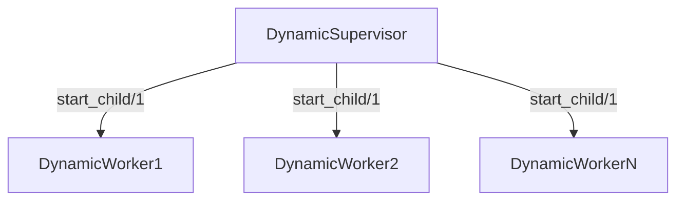
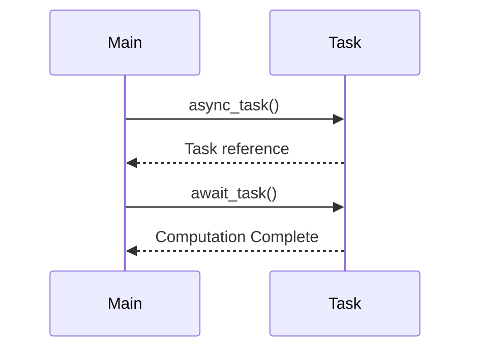
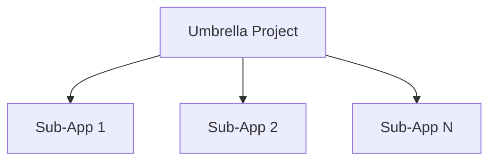

## 10.9. Advanced OTP Techniques

In this section, we delve into advanced OTP (Open Telecom Platform) techniques that are crucial for building robust, scalable, and maintainable applications in Elixir. We will explore Dynamic Supervision, the Task Module, and Umbrella Projects. These techniques leverage Elixir's strengths in concurrency and fault tolerance, enabling developers to manage complex systems efficiently.

### Dynamic Supervision

Dynamic supervision is a powerful feature in Elixir that allows you to manage processes dynamically at runtime. This is particularly useful for scenarios where the number of processes is not known beforehand or changes over time. The `DynamicSupervisor` module provides the necessary tools to achieve this.

#### Key Concepts

- **DynamicSupervisor**: Unlike a regular supervisor, a `DynamicSupervisor` can start and stop child processes dynamically. This is ideal for managing transient workloads or user sessions.
- **Child Specification**: Defines how a child process should be started, stopped, and restarted. In dynamic supervision, this is often defined at runtime.

#### Using `DynamicSupervisor`

Let's explore how to use `DynamicSupervisor` with a practical example.

```elixir
defmodule MyApp.DynamicWorker do
  use GenServer

  def start_link(arg) do
    GenServer.start_link(__MODULE__, arg, name: __MODULE__)
  end

  def init(arg) do
    {:ok, arg}
  end
end

defmodule MyApp.DynamicSupervisor do
  use DynamicSupervisor

  def start_link(init_arg) do
    DynamicSupervisor.start_link(__MODULE__, init_arg, name: __MODULE__)
  end

  def init(_init_arg) do
    DynamicSupervisor.init(strategy: :one_for_one)
  end

  def start_child(arg) do
    spec = {MyApp.DynamicWorker, arg}
    DynamicSupervisor.start_child(__MODULE__, spec)
  end
end

# Starting the DynamicSupervisor
{:ok, _pid} = MyApp.DynamicSupervisor.start_link([])

# Dynamically starting a child process
MyApp.DynamicSupervisor.start_child("Hello, World!")
```

In this example, we define a `DynamicWorker` module that uses `GenServer` and a `DynamicSupervisor` module. We can start child processes dynamically using the `start_child/1` function.

#### Design Considerations

- **Scalability**: Dynamic supervision is ideal for applications that need to scale processes up and down based on demand.
- **Fault Tolerance**: Ensure that your child specifications handle failures gracefully.
- **Resource Management**: Monitor and manage resources to avoid overloading the system with too many processes.

#### Visualizing Dynamic Supervision


```mermaid
graph TD;
    A[DynamicSupervisor] -->|start_child/1| B[DynamicWorker1];
    A -->|start_child/1| C[DynamicWorker2];
    A -->|start_child/1| D[DynamicWorkerN];
```

*Diagram: Dynamic supervision allows for the flexible management of worker processes.*

### Task Module

The Task module in Elixir simplifies asynchronous operations and one-off computations. It provides a higher-level abstraction over processes, making it easier to perform concurrent tasks.

#### Key Concepts

- **Task**: Represents a unit of work that can be executed asynchronously.
- **Task.Supervisor**: Manages tasks, providing fault tolerance and supervision.

#### Simplifying Asynchronous Operations

Let's look at how to use the Task module for asynchronous computations.

```elixir
defmodule MyApp.TaskExample do
  def async_task do
    Task.async(fn -> perform_heavy_computation() end)
  end

  defp perform_heavy_computation do
    # Simulate a heavy computation
    :timer.sleep(1000)
    "Computation Complete"
  end

  def await_task(task) do
    Task.await(task, 2000)
  end
end

# Using the Task module
task = MyApp.TaskExample.async_task()
result = MyApp.TaskExample.await_task(task)
IO.puts(result)  # Outputs: Computation Complete
```

In this example, we use `Task.async/1` to start a computation asynchronously and `Task.await/2` to wait for the result.

#### Design Considerations

- **Timeouts**: Always specify timeouts when awaiting tasks to prevent blocking indefinitely.
- **Error Handling**: Use `Task.yield/2` and `Task.shutdown/2` for graceful error handling and cleanup.
- **Concurrency**: Leverage tasks for concurrent operations that can run independently.

#### Visualizing Task Execution


```mermaid
sequenceDiagram
    participant Main
    participant Task
    Main->>Task: async_task()
    Task-->>Main: Task reference
    Main->>Task: await_task()
    Task-->>Main: Computation Complete
```

*Diagram: The sequence of operations in Task execution.*

### Umbrella Projects

Umbrella projects in Elixir are used to organize large applications into multiple OTP applications. This modular approach promotes separation of concerns, reusability, and easier maintenance.

#### Key Concepts

- **Umbrella Project**: A collection of related OTP applications that are managed as a single project.
- **Sub-Applications**: Each sub-application can have its own dependencies and configuration.

#### Organizing Large Applications

Creating an umbrella project involves setting up a structure where each component of your application is a separate OTP app.

```bash
mix new my_umbrella --umbrella
cd my_umbrella/apps
mix new my_app
mix new my_other_app
```

This creates an umbrella project with two sub-applications: `my_app` and `my_other_app`.

#### Design Considerations

- **Modularity**: Break down your application into logical components that can be developed and tested independently.
- **Dependencies**: Manage dependencies at the sub-application level to avoid conflicts.
- **Deployment**: Consider how each sub-application will be deployed and configured.

#### Visualizing Umbrella Projects


```mermaid
graph TD;
    A[Umbrella Project] --> B[Sub-App 1];
    A --> C[Sub-App 2];
    A --> D[Sub-App N];
```

*Diagram: Structure of an umbrella project with multiple sub-applications.*

### Try It Yourself

Experiment with these advanced OTP techniques by modifying the code examples:

- **Dynamic Supervision**: Try adding a new type of worker process and manage it dynamically.
- **Task Module**: Implement a task that performs a network request and processes the response.
- **Umbrella Projects**: Create an umbrella project with three sub-applications, each with distinct functionality.

### Summary

In this section, we've explored advanced OTP techniques in Elixir, focusing on dynamic supervision, the Task module, and umbrella projects. These techniques enable you to build scalable, maintainable, and fault-tolerant applications. As you continue to experiment and apply these concepts, you'll gain deeper insights into the power of Elixir and OTP.

Remember, this is just the beginning. Keep experimenting, stay curious, and enjoy the journey!

## Quiz Time!



### What is the primary advantage of using DynamicSupervisor in Elixir?

- [x] It allows for dynamic management of child processes at runtime.
- [ ] It provides a static supervision tree.
- [ ] It automatically scales the application across multiple nodes.
- [ ] It simplifies the deployment process.

> **Explanation:** DynamicSupervisor is designed for dynamic management of child processes, allowing them to be started and stopped at runtime as needed.

### Which module in Elixir is used to simplify asynchronous operations?

- [ ] GenServer
- [x] Task
- [ ] Agent
- [ ] Supervisor

> **Explanation:** The Task module provides a higher-level abstraction for performing asynchronous operations easily.

### What is a key benefit of using umbrella projects in Elixir?

- [x] They allow for organizing large applications into multiple OTP apps.
- [ ] They automatically optimize the application's performance.
- [ ] They provide built-in security features.
- [ ] They enable real-time data processing.

> **Explanation:** Umbrella projects help organize large applications by breaking them into smaller, manageable OTP apps.

### How can you start a child process dynamically using DynamicSupervisor?

- [ ] Use `GenServer.start_link/2`.
- [ ] Use `Supervisor.start_link/2`.
- [x] Use `DynamicSupervisor.start_child/2`.
- [ ] Use `Task.async/1`.

> **Explanation:** `DynamicSupervisor.start_child/2` is used to start child processes dynamically.

### What should you always specify when using Task.await/2?

- [ ] The process ID.
- [x] A timeout value.
- [ ] The supervisor strategy.
- [ ] The node name.

> **Explanation:** Specifying a timeout value prevents indefinite blocking when awaiting a task's result.

### In the context of umbrella projects, what is a sub-application?

- [x] A separate OTP application within the umbrella project.
- [ ] A module within the main application.
- [ ] A configuration file.
- [ ] A database schema.

> **Explanation:** A sub-application is an individual OTP application that is part of the larger umbrella project.

### Which function is used to handle errors gracefully in Task module?

- [ ] Task.await/2
- [x] Task.yield/2
- [ ] Task.start/1
- [ ] Task.stop/1

> **Explanation:** `Task.yield/2` can be used to handle errors gracefully by allowing a task to be checked for completion without blocking indefinitely.

### What is the primary purpose of the Task.Supervisor?

- [ ] To manage database connections.
- [x] To provide fault tolerance and supervision for tasks.
- [ ] To handle HTTP requests.
- [ ] To compile Elixir code.

> **Explanation:** Task.Supervisor provides supervision for tasks, ensuring fault tolerance and proper management.

### True or False: DynamicSupervisor can only manage a fixed number of processes.

- [ ] True
- [x] False

> **Explanation:** DynamicSupervisor is designed to manage processes dynamically, meaning the number of processes can change at runtime.

### Which diagram best represents the structure of an umbrella project?

- [x] A graph with a central node connected to multiple sub-nodes.
- [ ] A linear sequence of nodes.
- [ ] A single node with no connections.
- [ ] A circular loop of nodes.

> **Explanation:** An umbrella project is represented by a central node (the umbrella) connected to multiple sub-nodes (the sub-applications).


