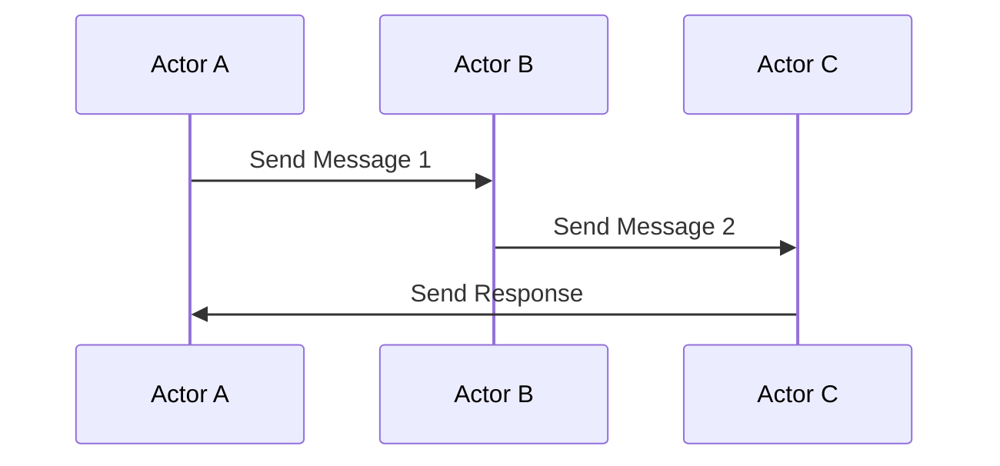

## 11.1. The Actor Model in Elixir

Concurrency is a cornerstone of modern software development, especially in systems that require high availability and scalability. Elixir, a functional programming language built on the Erlang VM (BEAM), excels in handling concurrent operations through the Actor Model. This section delves into the Actor Model, its implementation in Elixir, and how it empowers developers to build robust, fault-tolerant systems.

### Understanding the Actor Model

The Actor Model is a conceptual model for dealing with concurrent computation. It treats concurrent entities as "actors" that communicate via message passing. Each actor is an independent process with its own state, capable of performing tasks, creating new actors, and sending and receiving messages.

#### Key Concepts of the Actor Model

1. **Actors as Fundamental Units**: In the Actor Model, everything is an actor. Each actor can:
   - Receive messages.
   - Send messages to other actors.
   - Create new actors.

2. **Message Passing**: Actors communicate exclusively through asynchronous message passing. This eliminates the need for locks and reduces the complexity associated with shared state.

3. **Isolation**: Each actor maintains its own state and does not share it with others. This isolation enhances fault tolerance, as failures in one actor do not directly affect others.

4. **Concurrency**: Actors operate concurrently, allowing systems to scale efficiently across multiple processors or nodes.

### Elixir's Implementation of the Actor Model

Elixir leverages the BEAM VM to implement the Actor Model efficiently. The BEAM VM is designed for massive concurrency, supporting millions of lightweight processes. These processes are the actors in Elixir's world.

#### Lightweight Processes

- **Process Creation**: Creating a process in Elixir is lightweight and fast, making it feasible to spawn thousands or even millions of processes.
- **Process Isolation**: Each process runs independently, with its own memory and state, ensuring that a crash in one process does not affect others.
- **Preemptive Scheduling**: The BEAM VM uses preemptive scheduling to manage processes, ensuring fair CPU time distribution and responsiveness.

#### Message Passing

- **Asynchronous Communication**: Processes communicate by sending and receiving messages asynchronously. This decouples the sender and receiver, allowing them to operate independently.
- **Pattern Matching**: Elixir's powerful pattern matching is used to handle messages, making it easy to write clear and concise code for message processing.

#### Example: Basic Actor in Elixir

Let's create a simple actor that receives messages and prints them.

```elixir
defmodule Printer do
  def start do
    spawn(fn -> loop() end)
  end

  defp loop do
    receive do
      {:print, message} ->
        IO.puts("Received message: #{message}")
        loop()
    end
  end
end

# Usage
pid = Printer.start()
send(pid, {:print, "Hello, Actor Model!"})
```

- **Explanation**: 
  - We define a `Printer` module with a `start` function that spawns a new process.
  - The process enters a loop, waiting to receive messages.
  - Upon receiving a `{:print, message}` tuple, it prints the message and continues looping.

### Benefits of the Actor Model

The Actor Model offers several advantages, particularly in the context of Elixir and the BEAM VM.

#### Simplifies Concurrency

- **No Shared State**: By avoiding shared mutable state, the Actor Model simplifies concurrent programming. Developers do not need to worry about race conditions or deadlocks.
- **Clear Communication**: Message passing provides a clear and structured way for processes to communicate, reducing complexity.

#### Enhances Fault Tolerance

- **Process Isolation**: Since each actor is isolated, failures in one actor do not propagate to others. This makes it easier to build fault-tolerant systems.
- **Supervision Trees**: Elixir's OTP framework provides supervision trees, which automatically restart failed processes, enhancing system reliability.

#### Improves Scalability

- **Massive Concurrency**: The lightweight nature of processes in Elixir allows systems to scale horizontally and vertically, handling large numbers of concurrent operations.
- **Distributed Systems**: The Actor Model naturally extends to distributed systems, where actors can reside on different nodes, communicating seamlessly.

### Visualizing the Actor Model

To better understand the Actor Model, let's visualize the interaction between actors using a sequence diagram.



- **Description**: This diagram illustrates how Actor A sends a message to Actor B, which in turn sends a message to Actor C. Actor C then responds to Actor A, demonstrating the asynchronous nature of message passing.

### Practical Applications of the Actor Model in Elixir

The Actor Model is not just a theoretical concept; it has practical applications in building real-world systems.

#### Building a Chat System

In a chat system, each user can be represented as an actor. Messages sent by users are passed as messages between actors, ensuring that the system can handle multiple users concurrently without interference.

#### Implementing a Job Queue

A job queue can be implemented using actors, where each job is an actor that processes tasks independently. This allows for dynamic scaling and fault tolerance, as failed jobs can be restarted without affecting others.

#### Real-Time Data Processing

Actors can be used to process real-time data streams, where each data source is an actor that sends data to processing actors. This architecture supports high throughput and low latency.

### Try It Yourself: Experimenting with Actors

To deepen your understanding of the Actor Model, try modifying the `Printer` example:

1. **Add New Message Types**: Extend the actor to handle different types of messages, such as `{:error, message}` for logging errors.
2. **Create Multiple Actors**: Spawn multiple `Printer` actors and send messages to them concurrently.
3. **Implement Supervision**: Use Elixir's OTP to supervise the `Printer` actors, restarting them if they crash.

### Key Takeaways

- The Actor Model simplifies concurrency by treating entities as independent actors that communicate via message passing.
- Elixir's implementation of the Actor Model leverages lightweight processes and the BEAM VM for efficient concurrency.
- The Actor Model enhances fault tolerance and scalability, making it ideal for building robust systems.

### References and Further Reading

- [Elixir Documentation](https://elixir-lang.org/docs.html)
- [The BEAM Book](https://beam-wisdoms.clau.se/en/latest/)
- [Erlang and Elixir for Imperative Programmers](https://pragprog.com/titles/jgotp/erlang-and-elixir-for-imperative-programmers/)

## Quiz: The Actor Model in Elixir



### What is the primary communication method between actors in the Actor Model?

- [x] Message passing
- [ ] Shared memory
- [ ] Direct function calls
- [ ] Global variables

> **Explanation:** In the Actor Model, actors communicate exclusively through message passing, which avoids shared state and concurrency issues.

### How does Elixir handle process scheduling?

- [x] Preemptive scheduling
- [ ] Cooperative scheduling
- [ ] Round-robin scheduling
- [ ] Priority-based scheduling

> **Explanation:** Elixir uses preemptive scheduling, allowing the BEAM VM to manage processes efficiently and ensure fair CPU time distribution.

### What is a key benefit of using the Actor Model in Elixir?

- [x] Fault tolerance
- [ ] Increased memory usage
- [ ] Complex synchronization
- [ ] Shared state management

> **Explanation:** The Actor Model enhances fault tolerance by isolating processes, so failures in one do not affect others.

### Which Elixir feature is used to handle messages in actors?

- [x] Pattern matching
- [ ] Regular expressions
- [ ] Conditional statements
- [ ] Loops

> **Explanation:** Elixir uses pattern matching to handle messages, making it easy to write clear and concise code for message processing.

### What is the role of supervision trees in Elixir?

- [x] Automatically restart failed processes
- [ ] Manage memory allocation
- [ ] Optimize CPU usage
- [ ] Handle network communication

> **Explanation:** Supervision trees in Elixir automatically restart failed processes, enhancing system reliability and fault tolerance.

### How does the Actor Model improve scalability?

- [x] By supporting massive concurrency
- [ ] By increasing memory usage
- [ ] By reducing the number of processes
- [ ] By sharing state between actors

> **Explanation:** The Actor Model improves scalability by supporting massive concurrency, allowing systems to handle large numbers of concurrent operations.

### What is a practical application of the Actor Model in Elixir?

- [x] Building a chat system
- [ ] Managing global variables
- [ ] Implementing a single-threaded server
- [ ] Using shared memory for communication

> **Explanation:** A practical application of the Actor Model in Elixir is building a chat system, where each user is an actor, and messages are passed between actors.

### What is the main advantage of process isolation in the Actor Model?

- [x] Fault tolerance
- [ ] Increased complexity
- [ ] Shared state management
- [ ] Direct communication

> **Explanation:** Process isolation in the Actor Model enhances fault tolerance, as failures in one actor do not affect others.

### How can you extend the functionality of a basic actor in Elixir?

- [x] By adding new message types
- [ ] By using global variables
- [ ] By sharing state between actors
- [ ] By reducing the number of processes

> **Explanation:** You can extend the functionality of a basic actor in Elixir by adding new message types, allowing it to handle different tasks.

### True or False: In Elixir, actors can share their state with other actors.

- [ ] True
- [x] False

> **Explanation:** False. In Elixir, actors do not share their state with other actors, which enhances isolation and fault tolerance.



Remember, mastering the Actor Model in Elixir is just the beginning. As you progress, you'll build more complex and interactive systems. Keep experimenting, stay curious, and enjoy the journey!
