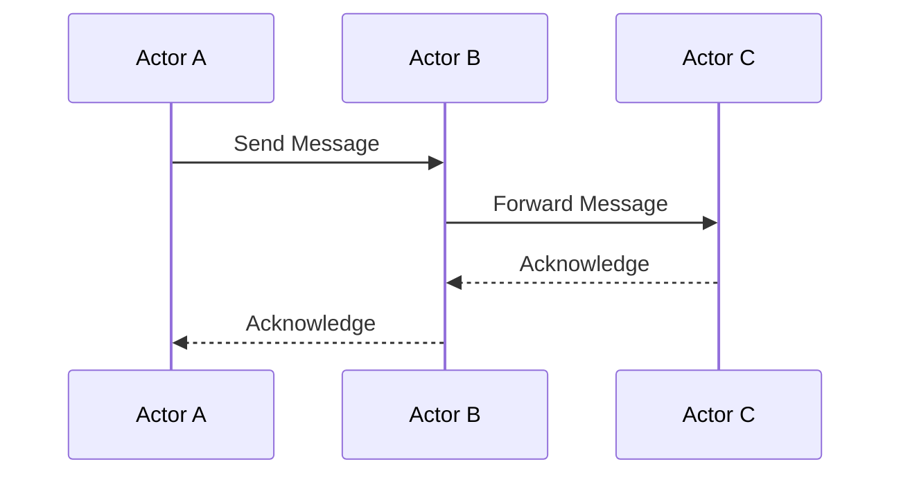

## 11.1. The Actor Model in Elixir

Concurrency is a cornerstone of modern software development, enabling applications to perform multiple tasks simultaneously. Elixir, built on the Erlang VM (BEAM), excels in this domain by leveraging the Actor Model. This section delves into the Actor Model in Elixir, exploring its concepts, implementation, and benefits.

### Understanding the Actor Model

The Actor Model is a conceptual model for handling concurrent computations. It treats concurrent entities as "actors," which are independent units that encapsulate state and behavior. Here's a breakdown of the Actor Model's core principles:

- **Actors as Concurrent Entities**: Each actor is an independent process that can perform tasks concurrently. This independence allows actors to operate without interfering with one another.
  
- **Message Passing Communication**: Actors communicate by sending and receiving messages. This communication method eliminates the need for shared memory, reducing the complexity and potential for errors in concurrent systems.

- **Encapsulation of State**: Each actor maintains its own state, which is not directly accessible by other actors. This encapsulation ensures that state changes occur only through message processing, promoting consistency and reliability.

- **Dynamic Actor Creation**: Actors can create new actors, allowing systems to dynamically scale and adapt to changing workloads.

### Elixir's Implementation

Elixir's concurrency model is built on the BEAM VM, which provides a robust environment for implementing the Actor Model. Let's explore how Elixir leverages the Actor Model:

- **Lightweight Processes**: Elixir processes are lightweight and managed by the BEAM VM. Unlike operating system threads, these processes are efficient in terms of memory and CPU usage, allowing thousands or even millions of processes to run concurrently.

- **Message Passing**: Elixir uses message passing for communication between processes. Messages are sent asynchronously, and the receiving process handles them in its own time, ensuring non-blocking interactions.

- **Fault Tolerance**: Elixir's Actor Model enhances fault tolerance by isolating failures. If a process crashes, it doesn't affect other processes, allowing the system to recover gracefully.

- **Scalability**: The Actor Model's ability to create and manage numerous processes makes Elixir highly scalable. Processes can be distributed across multiple nodes, enabling horizontal scaling.

### Benefits of the Actor Model

The Actor Model offers several advantages for building concurrent systems in Elixir:

- **Simplified Concurrency**: By avoiding shared mutable state, the Actor Model simplifies concurrency management. Developers can focus on defining actor behaviors and message protocols without worrying about synchronization issues.

- **Enhanced Fault Tolerance**: The isolation of processes means that failures are contained. Supervisors can monitor processes and restart them if necessary, ensuring high availability and resilience.

- **Scalability**: The lightweight nature of Elixir processes, combined with the Actor Model's dynamic creation capabilities, allows applications to scale efficiently. Systems can handle increased loads by spawning additional actors as needed.

- **Decoupled Architecture**: The message-passing paradigm promotes decoupled architectures, where components interact through well-defined interfaces. This decoupling enhances maintainability and flexibility.

### Key Components of the Actor Model in Elixir

To effectively utilize the Actor Model in Elixir, it's essential to understand its key components:

- **Processes**: The fundamental units of concurrency in Elixir. Processes are created using the `spawn` function or higher-level abstractions like `GenServer`.

- **Mailboxes**: Each process has a mailbox for receiving messages. Messages are queued in the mailbox and processed sequentially.

- **Supervisors**: Special processes that monitor other processes. Supervisors can restart child processes if they fail, implementing fault tolerance strategies.

- **GenServer**: A generic server abstraction that simplifies process management. It provides a structured way to define server behaviors and handle messages.

### Implementing the Actor Model in Elixir

Let's walk through an example to demonstrate how to implement the Actor Model in Elixir using `GenServer`.

#### Example: A Simple Counter

We'll create a simple counter that increments its value based on messages received.

```elixir
defmodule Counter do
  use GenServer

  # Client API

  def start_link(initial_value) do
    GenServer.start_link(__MODULE__, initial_value, name: __MODULE__)
  end

  def increment do
    GenServer.cast(__MODULE__, :increment)
  end

  def get_value do
    GenServer.call(__MODULE__, :get_value)
  end

  # Server Callbacks

  def init(initial_value) do
    {:ok, initial_value}
  end

  def handle_cast(:increment, state) do
    {:noreply, state + 1}
  end

  def handle_call(:get_value, _from, state) do
    {:reply, state, state}
  end
end
```

**Explanation:**

- **Module Definition**: We define a module `Counter` that uses `GenServer`.

- **Client API**: The `start_link/1` function initializes the server with an initial value. The `increment/0` function sends an asynchronous message to increment the counter, while `get_value/0` retrieves the current value synchronously.

- **Server Callbacks**: The `init/1` callback initializes the server state. The `handle_cast/2` function processes the `:increment` message, updating the state. The `handle_call/3` function handles synchronous requests for the current value.

### Visualizing the Actor Model

To better understand the Actor Model, let's visualize the interaction between actors using a sequence diagram.


```mermaid
sequenceDiagram
    participant A as Actor A
    participant B as Actor B
    participant C as Actor C

    A->>B: Send Message
    B->>C: Forward Message
    C-->>B: Acknowledge
    B-->>A: Acknowledge
```

**Diagram Explanation**: 

- **Actors A, B, and C**: Represent processes in the system. Actor A sends a message to Actor B, which forwards it to Actor C. Actor C acknowledges receipt, and the acknowledgment is passed back to Actor A.

### Try It Yourself

Experiment with the counter example by modifying the code to add new features or behaviors. Here are some suggestions:

- **Add a Decrement Function**: Implement a function to decrement the counter value.

- **Reset the Counter**: Add a function to reset the counter to its initial value.

- **Persist the Counter State**: Explore how to persist the counter state using Elixir's `ETS` or a database.

### Elixir's Unique Features

Elixir's implementation of the Actor Model leverages several unique features:

- **BEAM VM**: The BEAM VM's ability to efficiently manage lightweight processes is a key enabler of the Actor Model in Elixir.

- **Hot Code Swapping**: Elixir supports hot code swapping, allowing you to update code without stopping the system, enhancing uptime and flexibility.

- **Distributed Computing**: Elixir's Actor Model extends seamlessly to distributed systems, enabling processes to communicate across nodes in a cluster.

### Design Considerations

When using the Actor Model in Elixir, consider the following:

- **Message Protocols**: Define clear message protocols to ensure consistent communication between actors.

- **Supervision Strategies**: Choose appropriate supervision strategies to handle process failures effectively.

- **State Management**: Consider how state is managed within actors, especially in distributed systems where consistency is crucial.

### Differences and Similarities with Other Models

The Actor Model is often compared to other concurrency models, such as:

- **Shared Memory Concurrency**: Unlike shared memory concurrency, the Actor Model avoids shared state, reducing the risk of race conditions and deadlocks.

- **Event-Driven Architectures**: Both models emphasize decoupled components, but the Actor Model provides more structured fault tolerance through supervision.

### References and Further Reading

For more information on the Actor Model and Elixir's concurrency model, consider the following resources:

- [Elixir Official Documentation](https://elixir-lang.org/docs.html)
- [Erlang and Elixir in Action](https://www.manning.com/books/erlang-and-elixir-in-action)
- [The Little Elixir & OTP Guidebook](https://www.manning.com/books/the-little-elixir-and-otp-guidebook)

### Knowledge Check

To reinforce your understanding, consider the following questions:

- How does the Actor Model simplify concurrency in Elixir?
- What are the benefits of using message passing over shared memory?
- How do supervisors enhance fault tolerance in Elixir applications?

### Embrace the Journey

Remember, mastering the Actor Model in Elixir is a journey. As you explore and experiment, you'll gain deeper insights into building robust, scalable, and fault-tolerant applications. Keep pushing the boundaries, stay curious, and enjoy the process!

## Quiz Time!



### What is the primary communication method used by actors in the Actor Model?

- [x] Message passing
- [ ] Shared memory
- [ ] Direct function calls
- [ ] Global variables

> **Explanation:** Actors communicate via message passing, which avoids shared state and reduces complexity.

### In Elixir, what is the fundamental unit of concurrency?

- [x] Process
- [ ] Thread
- [ ] Task
- [ ] Fiber

> **Explanation:** Elixir uses lightweight processes managed by the BEAM VM as the fundamental unit of concurrency.

### What is a key advantage of the Actor Model in terms of fault tolerance?

- [x] Isolation of failures
- [ ] Shared mutable state
- [ ] Global error handling
- [ ] Synchronous communication

> **Explanation:** The Actor Model isolates failures, allowing processes to fail independently without affecting others.

### How do actors in Elixir handle incoming messages?

- [x] Through a mailbox
- [ ] By polling
- [ ] Using global state
- [ ] Via direct function calls

> **Explanation:** Each actor has a mailbox where messages are queued and processed sequentially.

### What is the role of a supervisor in Elixir's Actor Model?

- [x] Monitoring and restarting processes
- [ ] Managing global state
- [ ] Sending messages between actors
- [ ] Handling user input

> **Explanation:** Supervisors monitor processes and can restart them if they fail, enhancing fault tolerance.

### Which Elixir module provides a structured way to define server behaviors?

- [x] GenServer
- [ ] Task
- [ ] Agent
- [ ] Supervisor

> **Explanation:** `GenServer` is a generic server abstraction that simplifies process management and message handling.

### What is a common design consideration when implementing the Actor Model?

- [x] Defining clear message protocols
- [ ] Using global variables for state
- [ ] Avoiding process creation
- [ ] Relying on shared memory

> **Explanation:** Clear message protocols ensure consistent communication between actors.

### How does Elixir support distributed computing with the Actor Model?

- [x] By enabling processes to communicate across nodes
- [ ] Through shared memory
- [ ] Using global state management
- [ ] By limiting process creation

> **Explanation:** Elixir's Actor Model extends to distributed systems, allowing processes to communicate across nodes.

### What is a benefit of using lightweight processes in Elixir?

- [x] Efficient memory and CPU usage
- [ ] Global error handling
- [ ] Shared mutable state
- [ ] Synchronous communication

> **Explanation:** Lightweight processes are efficient in terms of memory and CPU usage, allowing for high concurrency.

### True or False: The Actor Model in Elixir requires shared memory for communication.

- [ ] True
- [x] False

> **Explanation:** The Actor Model avoids shared memory, using message passing for communication.




