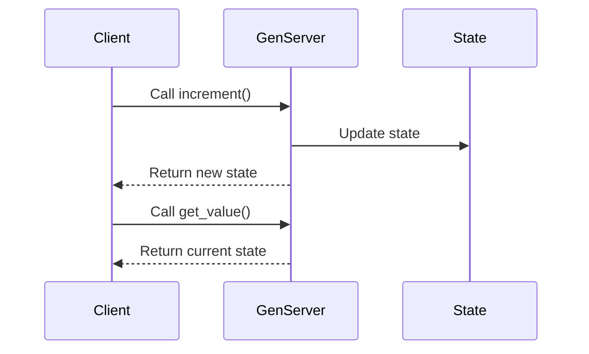

## 11.10. Handling State in Concurrent Applications

In the world of concurrent programming, managing state effectively is crucial for building robust and scalable applications. Elixir, with its functional programming paradigm and actor-based concurrency model, offers powerful tools for handling state in concurrent applications. In this section, we will explore how to manage state within Elixir applications, focusing on stateful processes, avoiding shared mutable state, and synchronizing state across processes or nodes.

### Stateful Processes

Stateful processes are a fundamental concept in Elixir's concurrency model. They allow us to encapsulate state within a process, providing a safe and isolated environment for managing state changes. The GenServer module is a key component in implementing stateful processes in Elixir.

#### Maintaining State within GenServer Processes

GenServer is a generic server implementation that abstracts the complexities of handling state and message passing. It provides a simple interface for defining server processes that maintain state.

Let's explore how to create a stateful GenServer:

```elixir
defmodule Counter do
  use GenServer

  # Client API

  def start_link(initial_value) do
    GenServer.start_link(__MODULE__, initial_value, name: __MODULE__)
  end

  def increment do
    GenServer.call(__MODULE__, :increment)
  end

  def get_value do
    GenServer.call(__MODULE__, :get_value)
  end

  # Server Callbacks

  def init(initial_value) do
    {:ok, initial_value}
  end

  def handle_call(:increment, _from, state) do
    new_state = state + 1
    {:reply, new_state, new_state}
  end

  def handle_call(:get_value, _from, state) do
    {:reply, state, state}
  end
end
```

In this example, we define a `Counter` module that uses GenServer to maintain a counter's state. The `start_link/1` function initializes the GenServer with an initial value. The `increment/0` and `get_value/0` functions provide a client API for interacting with the server. The `handle_call/3` callbacks manage state changes and respond to client requests.

**Key Points:**

- **Isolation:** Each GenServer process maintains its own state, ensuring isolation from other processes.
- **Concurrency:** GenServer handles concurrent requests, allowing multiple clients to interact with the server simultaneously.
- **Fault Tolerance:** GenServer processes can be supervised, providing fault tolerance and automatic restarts in case of failures.

### Avoiding Shared Mutable State

In concurrent applications, shared mutable state can lead to race conditions and unpredictable behavior. Elixir encourages the use of message passing to interact with process state, avoiding the pitfalls of shared mutable state.

#### Using Message Passing to Interact with Process State

Elixir's actor model relies on message passing for communication between processes. This approach ensures that state changes are serialized, preventing race conditions and ensuring consistency.

Consider the following example:

```elixir
defmodule BankAccount do
  use GenServer

  # Client API

  def start_link(initial_balance) do
    GenServer.start_link(__MODULE__, initial_balance, name: __MODULE__)
  end

  def deposit(amount) do
    GenServer.cast(__MODULE__, {:deposit, amount})
  end

  def withdraw(amount) do
    GenServer.cast(__MODULE__, {:withdraw, amount})
  end

  def get_balance do
    GenServer.call(__MODULE__, :get_balance)
  end

  # Server Callbacks

  def init(initial_balance) do
    {:ok, initial_balance}
  end

  def handle_cast({:deposit, amount}, balance) do
    {:noreply, balance + amount}
  end

  def handle_cast({:withdraw, amount}, balance) do
    {:noreply, balance - amount}
  end

  def handle_call(:get_balance, _from, balance) do
    {:reply, balance, balance}
  end
end
```

In this example, the `BankAccount` module uses GenServer to manage a bank account's balance. The `deposit/1` and `withdraw/1` functions use `GenServer.cast/2` for asynchronous state updates, while `get_balance/0` uses `GenServer.call/2` for synchronous state retrieval.

**Key Points:**

- **Message Passing:** Processes communicate by sending messages, ensuring state changes are serialized.
- **Asynchronous Updates:** Use `GenServer.cast/2` for fire-and-forget updates, reducing blocking and improving performance.
- **Synchronous Retrieval:** Use `GenServer.call/2` for synchronous state retrieval, ensuring consistency.

### State Synchronization

In distributed systems, maintaining consistent state across processes or nodes is a challenging task. Elixir provides several techniques for state synchronization, ensuring data consistency and reliability.

#### Techniques for Keeping State Consistent Across Processes or Nodes

1. **Distributed Erlang:**

   Elixir runs on the BEAM virtual machine, which supports distributed Erlang. This allows processes to communicate across nodes in a cluster, enabling state synchronization.

   ```elixir
   Node.connect(:'node@hostname')
   :rpc.call(:'node@hostname', Module, :function, [args])
   ```

   Use `Node.connect/1` to connect to remote nodes and `:rpc.call/4` to invoke functions on remote nodes, ensuring state consistency.

2. **ETS (Erlang Term Storage):**

   ETS provides in-memory storage for concurrent read and write access. It can be used to share state across processes within a node.

   ```elixir
   :ets.new(:my_table, [:set, :public, :named_table])
   :ets.insert(:my_table, {:key, value})
   :ets.lookup(:my_table, :key)
   ```

   Use `:ets.new/2` to create a new table, `:ets.insert/2` to insert data, and `:ets.lookup/2` to retrieve data.

3. **Mnesia:**

   Mnesia is a distributed database built into Erlang/Elixir, providing persistent storage and transaction support.

   ```elixir
   :mnesia.create_schema([node()])
   :mnesia.start()
   :mnesia.create_table(MyTable, [attributes: [:key, :value]])
   :mnesia.transaction(fn -> :mnesia.write({MyTable, key, value}) end)
   ```

   Use `:mnesia.create_schema/1` to create a schema, `:mnesia.start/0` to start Mnesia, and `:mnesia.create_table/2` to create tables. Transactions ensure data consistency.

4. **CRDTs (Conflict-Free Replicated Data Types):**

   CRDTs are data structures that automatically resolve conflicts in distributed systems, ensuring eventual consistency.

   Libraries like [DeltaCrdt](https://hexdocs.pm/delta_crdt_ex/DeltaCrdt.html) provide CRDT implementations for Elixir.

   ```elixir
   {:ok, pid} = DeltaCrdt.start_link(DeltaCrdt.AWLWWMap, sync_interval: 100)
   DeltaCrdt.mutate(pid, :add, ["key", "value"])
   DeltaCrdt.read(pid)
   ```

   Use `DeltaCrdt.start_link/2` to start a CRDT process, `DeltaCrdt.mutate/3` to update data, and `DeltaCrdt.read/1` to retrieve data.

### Visualizing State Management in Concurrent Applications

To better understand how state is managed in concurrent applications, let's visualize the interaction between processes and state using a sequence diagram.



**Diagram Description:**

- The client sends a message to the GenServer to increment the state.
- The GenServer updates the state and returns the new state to the client.
- The client can also request the current state, which the GenServer retrieves and returns.

### Try It Yourself

Experiment with the code examples provided in this section. Try modifying the `Counter` or `BankAccount` modules to add new functionalities, such as resetting the counter or transferring funds between accounts. Observe how state changes are managed and how message passing ensures consistency.

### Knowledge Check

- What are the benefits of using GenServer for stateful processes?
- How does message passing help avoid shared mutable state?
- What techniques can be used to synchronize state across distributed nodes?

### Summary

In this section, we explored how to handle state in concurrent applications using Elixir. We learned about stateful processes with GenServer, avoiding shared mutable state through message passing, and techniques for state synchronization across processes or nodes. By leveraging Elixir's concurrency model and distributed capabilities, we can build robust and scalable applications that effectively manage state.

Remember, mastering state management in concurrent applications is a journey. Keep experimenting, stay curious, and enjoy the process of building resilient systems with Elixir!

## Quiz: Handling State in Concurrent Applications



### What is a key benefit of using GenServer for stateful processes in Elixir?

- [x] Isolation of state within processes
- [ ] Direct access to shared memory
- [ ] Automatic state synchronization across nodes
- [ ] Built-in database storage

> **Explanation:** GenServer provides isolation of state within processes, ensuring that each process maintains its own state independently.

### How does message passing help avoid shared mutable state in Elixir?

- [x] By serializing state changes
- [ ] By allowing direct memory access
- [ ] By using global variables
- [ ] By enabling synchronous updates only

> **Explanation:** Message passing serializes state changes, preventing race conditions and ensuring consistency without shared mutable state.

### Which technique allows for state synchronization across distributed nodes in Elixir?

- [x] Distributed Erlang
- [ ] GenServer
- [ ] ETS
- [ ] Task

> **Explanation:** Distributed Erlang allows processes to communicate across nodes, enabling state synchronization in a distributed system.

### What is the purpose of using ETS in Elixir?

- [x] To provide in-memory storage for concurrent access
- [ ] To create distributed databases
- [ ] To manage process lifecycles
- [ ] To handle network communication

> **Explanation:** ETS provides in-memory storage for concurrent read and write access, allowing processes to share state within a node.

### What is a CRDT, and why is it useful?

- [x] A data structure that resolves conflicts in distributed systems
- [ ] A tool for debugging Elixir applications
- [ ] A protocol for network communication
- [ ] A type of GenServer

> **Explanation:** CRDTs (Conflict-Free Replicated Data Types) automatically resolve conflicts in distributed systems, ensuring eventual consistency.

### Which function is used to start a GenServer process?

- [x] GenServer.start_link/3
- [ ] GenServer.call/2
- [ ] GenServer.cast/2
- [ ] GenServer.init/1

> **Explanation:** `GenServer.start_link/3` is used to start a GenServer process, initializing it with a given state.

### How can you retrieve the current state from a GenServer?

- [x] Using GenServer.call/2
- [ ] Using GenServer.cast/2
- [ ] Using GenServer.start_link/3
- [ ] Using GenServer.init/1

> **Explanation:** `GenServer.call/2` is used for synchronous state retrieval, allowing clients to request the current state from a GenServer.

### What is the role of the `handle_call/3` callback in a GenServer?

- [x] To handle synchronous requests and update state
- [ ] To handle asynchronous updates only
- [ ] To initialize the GenServer
- [ ] To terminate the GenServer

> **Explanation:** The `handle_call/3` callback handles synchronous requests, allowing the GenServer to update state and respond to clients.

### Which Elixir feature provides fault tolerance and automatic restarts for processes?

- [x] Supervision trees
- [ ] ETS
- [ ] CRDTs
- [ ] Task

> **Explanation:** Supervision trees provide fault tolerance by monitoring processes and automatically restarting them in case of failures.

### True or False: GenServer processes can directly access shared memory in Elixir.

- [ ] True
- [x] False

> **Explanation:** False. GenServer processes do not directly access shared memory; they communicate through message passing to ensure state isolation.




