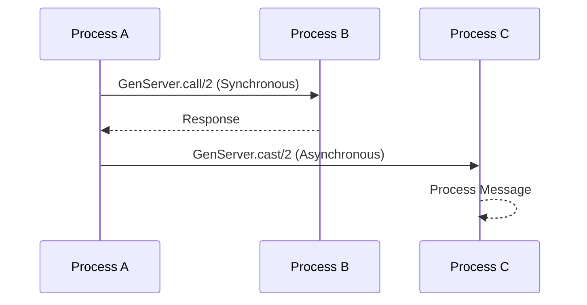

## 11.11. Patterns for Process Communication

In the world of Elixir, process communication is a cornerstone of building scalable and fault-tolerant systems. Understanding how processes interact and communicate is crucial for leveraging the full power of the BEAM (Erlang Virtual Machine) and Elixir's concurrency model. In this section, we will delve into various patterns for process communication, focusing on synchronous vs. asynchronous communication, message routing, and selective receives.

### Synchronous vs. Asynchronous Communication

When dealing with process communication in Elixir, one of the first decisions you'll face is whether to use synchronous or asynchronous communication. This choice can significantly impact the behavior and performance of your application.

#### Synchronous Communication

Synchronous communication involves a request-response pattern where the sender waits for a reply from the receiver before proceeding. In Elixir, this is typically achieved using the `GenServer.call/2` function.

**Example: Synchronous Communication with `GenServer.call/2`**

```elixir
defmodule Calculator do
  use GenServer

  # Client API
  def start_link(initial_value) do
    GenServer.start_link(__MODULE__, initial_value, name: __MODULE__)
  end

  def add(value) do
    GenServer.call(__MODULE__, {:add, value})
  end

  # Server Callbacks
  def init(initial_value) do
    {:ok, initial_value}
  end

  def handle_call({:add, value}, _from, state) do
    new_state = state + value
    {:reply, new_state, new_state}
  end
end

# Usage
{:ok, _pid} = Calculator.start_link(0)
result = Calculator.add(5)
IO.puts("Result: #{result}") # Output: Result: 5
```

In this example, the `add/1` function sends a synchronous message to the `Calculator` GenServer. The `handle_call/3` callback processes the message and returns a reply, which is then received by the caller.

**Considerations for Synchronous Communication:**

- **Blocking Nature:** The caller is blocked until a response is received, which can lead to bottlenecks if the server is slow.
- **Use Cases:** Suitable for operations where immediate feedback is required, such as querying a database or performing calculations.

#### Asynchronous Communication

Asynchronous communication allows the sender to continue executing without waiting for a response. This is achieved using the `GenServer.cast/2` function.

**Example: Asynchronous Communication with `GenServer.cast/2`**

```elixir
defmodule Logger do
  use GenServer

  # Client API
  def start_link(_) do
    GenServer.start_link(__MODULE__, [], name: __MODULE__)
  end

  def log(message) do
    GenServer.cast(__MODULE__, {:log, message})
  end

  # Server Callbacks
  def init(_) do
    {:ok, []}
  end

  def handle_cast({:log, message}, state) do
    IO.puts("Log: #{message}")
    {:noreply, [message | state]}
  end
end

# Usage
{:ok, _pid} = Logger.start_link([])
Logger.log("Hello, World!")
```

In this example, the `log/1` function sends an asynchronous message to the `Logger` GenServer. The `handle_cast/2` callback processes the message without sending a reply.

**Considerations for Asynchronous Communication:**

- **Non-blocking:** The caller is not blocked, allowing for higher throughput.
- **Use Cases:** Ideal for operations where a response is not immediately needed, such as logging or sending notifications.

### Message Routing

In Elixir, processes communicate by sending messages. Effective message routing is essential for directing messages to the correct processes.

#### Using Process Names

Naming a process allows you to send messages using a human-readable identifier instead of a process identifier (PID).

**Example: Naming a Process**

```elixir
defmodule NamedProcess do
  use GenServer

  def start_link(_) do
    GenServer.start_link(__MODULE__, [], name: :my_named_process)
  end

  def send_message(message) do
    GenServer.cast(:my_named_process, {:message, message})
  end

  def handle_cast({:message, message}, state) do
    IO.puts("Received: #{message}")
    {:noreply, state}
  end
end

# Usage
{:ok, _pid} = NamedProcess.start_link([])
NamedProcess.send_message("Hello, Named Process!")
```

**Considerations for Using Process Names:**

- **Simplicity:** Easier to remember and use than PIDs.
- **Limitations:** Names must be unique within a node.

#### Using PIDs

PIDs are unique identifiers for processes and can be used to send messages directly.

**Example: Sending Messages Using PIDs**

```elixir
defmodule PidProcess do
  use GenServer

  def start_link(_) do
    GenServer.start_link(__MODULE__, [], name: __MODULE__)
  end

  def send_message(pid, message) do
    GenServer.cast(pid, {:message, message})
  end

  def handle_cast({:message, message}, state) do
    IO.puts("Received: #{message}")
    {:noreply, state}
  end
end

# Usage
{:ok, pid} = PidProcess.start_link([])
PidProcess.send_message(pid, "Hello, PID Process!")
```

**Considerations for Using PIDs:**

- **Uniqueness:** PIDs are unique across the entire system.
- **Flexibility:** Allows for dynamic message routing.

#### Using Registries

Registries provide a way to associate names with PIDs, allowing for dynamic process discovery and message routing.

**Example: Using a Registry**

```elixir
defmodule RegistryExample do
  use GenServer

  def start_link(name) do
    GenServer.start_link(__MODULE__, name, name: {:via, Registry, {MyRegistry, name}})
  end

  def send_message(name, message) do
    GenServer.cast({:via, Registry, {MyRegistry, name}}, {:message, message})
  end

  def handle_cast({:message, message}, state) do
    IO.puts("Received: #{message}")
    {:noreply, state}
  end
end

# Usage
{:ok, _pid} = Registry.start_link(keys: :unique, name: MyRegistry)
{:ok, _pid} = RegistryExample.start_link("process1")
RegistryExample.send_message("process1", "Hello, Registry!")
```

**Considerations for Using Registries:**

- **Scalability:** Supports large numbers of processes.
- **Dynamic Discovery:** Processes can be looked up by name at runtime.

### Selective Receives

Selective receives allow a process to match specific messages in its mailbox, enabling more precise control over message handling.

**Example: Selective Receives**

```elixir
defmodule SelectiveReceiver do
  def start do
    spawn(fn -> loop() end)
  end

  defp loop do
    receive do
      {:important, message} ->
        IO.puts("Important: #{message}")
        loop()
      _ ->
        loop()
    end
  end
end

# Usage
pid = SelectiveReceiver.start()
send(pid, {:important, "Urgent Message"})
send(pid, {:normal, "Regular Message"})
```

In this example, the process only handles messages tagged as `:important`, ignoring others.

**Considerations for Selective Receives:**

- **Control:** Provides fine-grained control over message processing.
- **Complexity:** Can lead to complex code if overused.

### Visualizing Process Communication

To better understand process communication patterns, let's visualize the flow of messages between processes.



**Diagram Description:** This sequence diagram illustrates synchronous communication between Process A and Process B using `GenServer.call/2`, and asynchronous communication between Process A and Process C using `GenServer.cast/2`.

### Key Takeaways

- **Synchronous vs. Asynchronous:** Choose synchronous communication for immediate feedback and asynchronous for non-blocking operations.
- **Message Routing:** Use process names, PIDs, or registries to direct messages effectively.
- **Selective Receives:** Employ selective receives for precise message handling.

### Try It Yourself

Experiment with the provided examples by modifying the message types or adding additional processes. Observe how changes affect communication patterns and system behavior.

### References and Further Reading

- [Elixir Documentation](https://elixir-lang.org/docs.html)
- [Erlang and Elixir in Action](https://www.manning.com/books/erlang-and-elixir-in-action)
- [Programming Elixir](https://pragprog.com/titles/elixir16/programming-elixir-1-6/)

## Quiz: Patterns for Process Communication



### What is the primary difference between synchronous and asynchronous communication in Elixir?

- [x] Synchronous communication waits for a response, while asynchronous does not.
- [ ] Asynchronous communication waits for a response, while synchronous does not.
- [ ] Both synchronous and asynchronous communication wait for a response.
- [ ] Neither synchronous nor asynchronous communication waits for a response.

> **Explanation:** Synchronous communication involves waiting for a response, whereas asynchronous communication allows the sender to continue without waiting.

### Which function is used for synchronous communication in a GenServer?

- [x] GenServer.call/2
- [ ] GenServer.cast/2
- [ ] GenServer.send/2
- [ ] GenServer.reply/2

> **Explanation:** `GenServer.call/2` is used for synchronous communication, where the caller waits for a response.

### What is a key advantage of using process names for message routing?

- [x] Simplicity and ease of use
- [ ] Increased performance
- [ ] Reduced memory usage
- [ ] Enhanced security

> **Explanation:** Using process names simplifies message routing by allowing human-readable identifiers instead of PIDs.

### How does selective receive enhance message handling?

- [x] By allowing specific messages to be matched and processed
- [ ] By increasing the speed of message processing
- [ ] By reducing the number of messages in the mailbox
- [ ] By automatically discarding irrelevant messages

> **Explanation:** Selective receive allows a process to match and handle specific messages, providing fine-grained control.

### What is a potential drawback of using synchronous communication?

- [x] It can lead to bottlenecks if the server is slow.
- [ ] It is more complex to implement than asynchronous communication.
- [ ] It requires more memory than asynchronous communication.
- [ ] It is less reliable than asynchronous communication.

> **Explanation:** Synchronous communication can cause bottlenecks because the caller is blocked until a response is received.

### Which of the following is not a method for message routing in Elixir?

- [ ] Using process names
- [ ] Using PIDs
- [ ] Using registries
- [x] Using global variables

> **Explanation:** Global variables are not used for message routing in Elixir. Instead, process names, PIDs, and registries are used.

### What is the purpose of using registries in Elixir?

- [x] To associate names with PIDs for dynamic process discovery
- [ ] To increase the speed of message processing
- [ ] To reduce memory usage
- [ ] To enhance security

> **Explanation:** Registries allow names to be associated with PIDs, enabling dynamic process discovery and message routing.

### In the context of process communication, what does PID stand for?

- [x] Process Identifier
- [ ] Process Index Descriptor
- [ ] Parallel Instance Designator
- [ ] Process Integration Device

> **Explanation:** PID stands for Process Identifier, a unique identifier for processes in Elixir.

### What is a key benefit of asynchronous communication?

- [x] Non-blocking, allowing for higher throughput
- [ ] Immediate feedback to the caller
- [ ] Reduced complexity in implementation
- [ ] Enhanced security

> **Explanation:** Asynchronous communication is non-blocking, allowing the sender to continue executing without waiting for a response.

### True or False: Selective receives can lead to complex code if overused.

- [x] True
- [ ] False

> **Explanation:** While selective receives provide fine-grained control, overusing them can lead to complex and hard-to-maintain code.



Remember, mastering process communication in Elixir is a journey. As you experiment and apply these patterns, you'll gain deeper insights into building robust and efficient systems. Keep exploring, stay curious, and enjoy the process!
